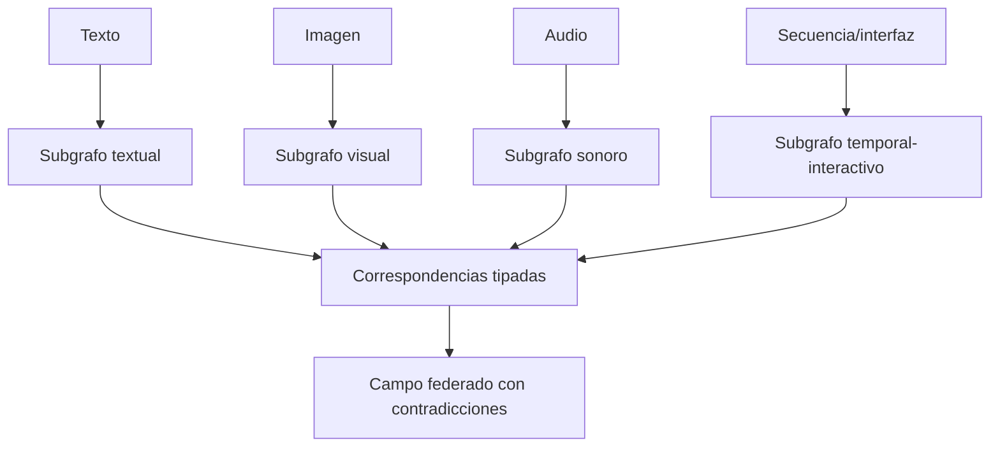

# SP-MULTIMODAL

**Modalidades:** imagen, secuencia, audio, video, SPA, conducta y compuesto.

## Principio

Cada modalidad conserva unidades, locators y evidencia propias. Triangulación crea correspondencias, no traducción automática de rasgos visuales/sonoros a proposiciones.

## Contratos

Unidades por modalidad; alineación temporal/espacial; invariantes y transformaciones; redundancia, complementariedad, contradicción y omisión; adapters; receptor/contexto; source binding por edge. El registry MCCR selecciona analyzers disponibles y reporta pérdidas.

## Corpus y fallos

Corpus pendiente: `theme_visual_video_4.pdf`, `secuencia_de_imagenes.pdf`, `EC06`, `EC07`, `EC10`, `EC12` como `PATH_PENDING_CONFIRMATION`. Casos materializados pueden ejecutarse sólo con entradas disponibles. Fallos: OCR como original, coincidencia temporal=causalidad, color=concepto sin contrato, evidencia fusionada, modalidad dominante oculta. Aceptación: retirar una modalidad muestra qué claims pierden soporte.

## Procedimiento de trabajo

1. crea `MANIFESTATION_RECORD` y locator nativo por modalidad;
2. segmenta cada portador independientemente;
3. produce subgrafo local y estatus;
4. propone correspondencias de identidad/tiempo/función como bridges;
5. clasifica redundancia, complementariedad, contradicción y exclusividad;
6. federar sin perder source binding;
7. retirar cada modalidad y medir soporte perdido.

[CASE-MRRE-MULTIMODAL](../09_casos_y_ejemplos/triangulacion_multimodal/DOSSIER_OPERATIVO.md) contiene el original sintético, campos, subgrafos, chains y pruebas. Recursos locales candidatos se citan allí, pero no se confunden con los adjuntos pendientes. El proceso normativo es [MRRE-PROC-TRIANGULATE](../03_protocolos_operacionales/03_triangulacion_multimanifestacion.md).
