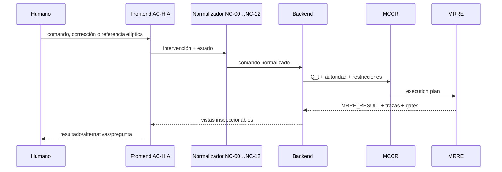

# Integración AC-HIA ↔ MRRE

## Responsabilidades

AC-HIA captura intervención, resuelve referencias conversacionales, normaliza, presenta y devuelve correcciones. MRRE recibe una solicitud operable y produce análisis; no es frontend ni estado de interacción.

## Handoffs

| Handoff | Conserva |
|---|---|
| humano→frontend | texto original, turno, adjuntos, autoridad declarada |
| frontend→normalización | referencias, alcance local/global, estado |
| normalización→backend | operación, targets, `EXPECTED_RESULT`, prohibiciones, restricciones, output esperado, incertidumbres |
| backend→MCCR/MRRE | request ID, source refs, permisos, presupuesto y consumidor |
| MRRE→frontend | artefactos, alternativas, confidence con método, trace, fallos y decisiones pendientes |

Las fases NC-00…NC-12 de `SRC-ACHIA-NORMALIZATION` se conservan por referencia. Un comando múltiple se descompone sin perder relación; una referencia elíptica conserva antecedente resuelto. Correcciones humanas ingresan como comando/feedback nuevo, no mutación directa.

## Validadores y persistencia

Se reutilizan V0–V8 de AC-HIA: comando, autoridad, alcance, componentes, runtime, estructura, estado epistémico, proyección y retorno humano. La interfaz puede mostrar grafo, texto alineado, diff y ledger; la vista no altera el análisis. Ninguna salida se persiste por aparecer en frontend.

## Procedimiento de intercambio

1. AC-HIA entrega `request_id`, comando normalizado, alcance, referencias resueltas, restricciones y preguntas pendientes;
2. MRRE valida [MRRE-SCHEMA-MANIFESTATION](../02_contratos_y_schemas/manifestation_input.schema.yaml) y devuelve aceptación o error tipado;
3. durante el run, las aclaraciones entran como nuevos eventos, no como edición oculta;
4. MRRE entrega `MRRE_RESULT`, artefactos, alternatives, fallos y gates;
5. AC-HIA presenta sin elevar confidence ni ocultar incertidumbre.

Este adapter adopta [SRC-ACHIA-DEF](../../ARQUITECTURA_DE_COMUNICACION_HUMANO_IA/01_nucleo/01_definicion_y_limites.md), [SRC-ACHIA-NORMALIZATION](../../ARQUITECTURA_DE_COMUNICACION_HUMANO_IA/02_modelo_operativo/06_normalizacion_de_comandos.md), [SRC-ACHIA-CONTRACTS](../../ARQUITECTURA_DE_COMUNICACION_HUMANO_IA/03_contratos/01_contratos_de_intercambio.md) y [SRC-ACHIA-VALIDATORS](../../ARQUITECTURA_DE_COMUNICACION_HUMANO_IA/03_contratos/02_validadores.md). Ejemplo de gate de fuente: [CASE-MRRE-BRIDGE](../09_casos_y_ejemplos/puente_del_valle/DOSSIER_OPERATIVO.md).
