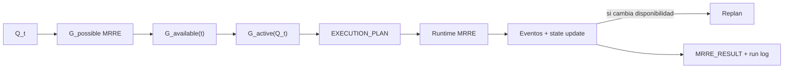

# Integración MCCR ↔ MRRE

## Frontera

MCCR configura módulos, profundidad, mecanismos, umbrales, consumidor, presupuesto y routing. MRRE ejecuta navegación, reconstrucción, abstracción, equivalencia, binding y V&V. MCCR no inventa slots o relaciones; MRRE no decide presupuesto global.



## Contrato discoverable

MCCR consume `MRRE_MANIFEST.yaml` y `04_runtime/03_registro_de_componentes.yaml`. Cada componente declara schemas, precondiciones, dependencias, modalidad, costo, riesgo, gates, fallos, observabilidad y validadores. `available` significa ejecutable ahora; `active` significa seleccionado para `Q_t`.

## Ejemplo completo

```yaml
request:
  operation: RETROCONSTRUIR
  modality: text
  expected_result: "identificar arquitectura y alternativas"
  constraints: [no_infer_author_intent, budget_medium]
configuration:
  depth: multiscale_to_sentence
  observers: [rhetorical, argumentative, coherence]
  thresholds: {trace_coverage: 1.0, candidate_coverage: 0.90}
  consumer: human_review
plan:
  chain: [FIELD_BUILD, MULTISCALE_SEGMENT, SUBGRAPH_RECONSTRUCT, SKELETON_INFER, VALIDATE]
  transverse: [TRACE, EPISTEMIC_LEDGER]
monitoring:
  states: [RECEIVED, NORMALIZED, FIELD_NAVIGATED, RECONSTRUCTING, VALIDATING]
result:
  state: ALTERNATIVES_PENDING
  artifacts: [architecture_A, architecture_B]
  promotion_status: NOT_REQUESTED
```

Si un observador queda indisponible, MCCR evalúa una ruta mínima y MRRE declara pérdida de cobertura. `NO_FEASIBLE_PLAN` no se convierte en análisis inventado. Eventos, decisiones, exclusiones y replan se conservan conforme a `SRC-MCCR-RUNLOG/AUTH/FAILURES`.

## Procedimiento de ejecución configurada

1. mapear `REQUEST → required_capabilities` del [MRRE_MANIFEST](../MRRE_MANIFEST.yaml);
2. MCCR resuelve `G_possible → G_available(t) → G_active(Q_t)`;
3. recibir `execution_plan` con módulos, orden, presupuesto, gates y degradación;
4. MRRE ejecuta semántica y emite eventos por componente;
5. MCCR replanifica sólo topología/capacidad; no inventa claims MRRE;
6. cerrar plan con estado y referencias a artefactos.

Contratos: [SRC-MCCR-REQUEST](../../MOTOR_DE_CONFIGURACION_COGNITIVA_EN_RUNTIME/01_nucleo/04_modelo_de_solicitud_estructurada.md), [SRC-MCCR-PLAN](../../MOTOR_DE_CONFIGURACION_COGNITIVA_EN_RUNTIME/01_nucleo/05_execution_plan_definicion_y_contrato.md), [SRC-MCCR-GRAPHS](../../MOTOR_DE_CONFIGURACION_COGNITIVA_EN_RUNTIME/01_nucleo/06_grafos_possible_available_active.md), [SRC-MCCR-RUNLOG](../../MOTOR_DE_CONFIGURACION_COGNITIVA_EN_RUNTIME/03_contratos/06_trazabilidad_observabilidad_y_run_log.md), [SRC-MCCR-AUTH](../../MOTOR_DE_CONFIGURACION_COGNITIVA_EN_RUNTIME/03_contratos/07_autoridad_permisos_validadores_y_gates.md) y [SRC-MCCR-FAILURES](../../MOTOR_DE_CONFIGURACION_COGNITIVA_EN_RUNTIME/03_contratos/05_no_feasible_plan_fallos_y_degradacion.md).
