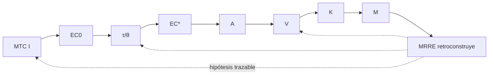

# Integración MTC ↔ MRRE

## Propósito y frontera

MTC modela `intervención → transformación de estado → acción → capacidad → contexto → manifestación`. MRRE puede reconstruir o abstraer una arquitectura manifestada usando esa ontología mediante adapter; no afirma estados mentales ni causalidad como hechos sin evidencia.

| Entidad MTC | Representación MRRE | Tipo de relación |
|---|---|---|
| `I` intervención | nodo/subgrafo con source binding | consumo tipado |
| `EC` estado cognitivo | input/output state candidate | adaptación; no equivalencia automática |
| `τ/θ` transformación/transducción | typed edge/trajectory | analogía o mapping causal con evidencia |
| `A` acción | manifestation/event node | consumo; acción ≠ estado |
| `V` capacidad | función emergente de subgrafo | correspondencia estructural |
| `K` contexto | typed context | consumo |
| `M` manifestación | `MANIFESTATION` | adaptación compatible |
| `F` feedback | evidence candidate | consumo; feedback ≠ verdad |

## Adapter y causalidad

Cada mapping declara `equivalence`, `adaptation`, `consumption` o `structural_analogy`. Las aristas causales requieren mecanismo, temporalidad, alternativas y observación indirecta conforme a `SRC-MTC-STATE/PIPELINE/FEEDBACK`. El procedimiento P0–P15 de `SRC-MTC-INSTANTIATE` aporta disciplina de contraste; reinstanciación MRRE sigue siendo otra operación.

El caso del collar y los cuatro fixtures MTC prueban actor, belief, trust, capacity, manifestation y trace. El adapter debe poder retirarse sin invalidar el kernel MRRE.

## Procedimiento de adaptación

1. recibe instancia MTC con versión y membership result;
2. conserva IDs/tipos fuente y declara mapping por elemento;
3. separa `equivalence/adaptation/analogy`;
4. importa claims con su estatus, no como observaciones MRRE;
5. reconstruye subgrafos/chains usando source bindings;
6. ejecuta no-colapsos `EC≠A`, `V≠M`, transformación≠transducción;
7. valida que retirar el adapter no rompa el kernel.

Fuentes: [SRC-MTC-CORE](../../MTC_MAQUINA_DE_TRANSDUCCION_COGNITIVA/00_core/00_especificacion_nuclear.md), [SRC-MTC-ONTOLOGY](../../MTC_MAQUINA_DE_TRANSDUCCION_COGNITIVA/00_core/01_ontologia_y_tipos.md), [SRC-MTC-STATE](../../MTC_MAQUINA_DE_TRANSDUCCION_COGNITIVA/10_mecanismo/12_estado_cognitivo_grafo_ponderado.md), [SRC-MTC-MANIFESTATION](../../MTC_MAQUINA_DE_TRANSDUCCION_COGNITIVA/10_mecanismo/14_capacidad_contexto_manifestacion.md) y [SRC-MTC-INSTANTIATE](../../MTC_MAQUINA_DE_TRANSDUCCION_COGNITIVA/20_metodo/21_instanciacion_y_validacion.md). Ejecución trazada: [CASE-MRRE-COLLAR](../09_casos_y_ejemplos/caso_del_collar/DOSSIER_OPERATIVO.md).
