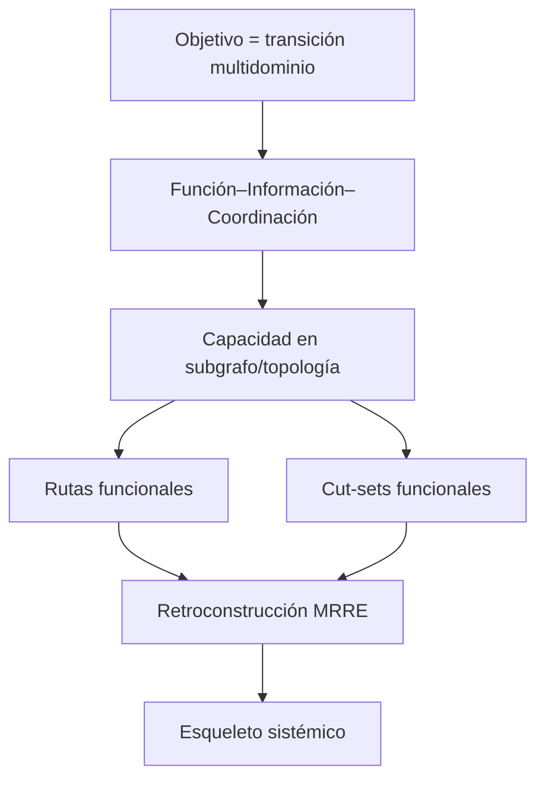

# Integración ASIOO ↔ MRRE

## Propósito

ASIOO aporta lentes para sistemas orientados a objetivos; MRRE aporta dirección inversa, abstracción y reinstanciación. Se transfieren principios funcionales, no metáforas militares ni inventarios de plataformas.

## Contratos transferidos

- `PAT-COG-116`: cada capacidad declara función, información y coordinación.
- `117`: integración tiene alcance, misión, tiempo, autoridad y degradación.
- `118`: possible→available→active→plan.
- `119/120`: estado compartido, vistas y compresión con pérdidas explícitas.
- `121/122`: capas, capacidades transversales y tejido coordinativo.
- `126`: arquitectura→aplicación→chain→ejecución.
- `127`: objetivo como transición de estado multidominio.
- `128/129`: capacidad dependiente de topología; rutas y cut-sets.
- `130`: procedimiento reusable como precoordinación.

## Prueba de portabilidad

El mismo contrato abstracto se aplica a una organización y a un sistema cognitivo: cambian materiales y ontologías, permanecen roles/relaciones verificables. Si el mapping sólo conserva nombres o metáforas, se clasifica `STRUCTURAL_ANALOGY_REJECTED`. ASIOO no ejecuta MRRE y MRRE no redefine ASIOO.

## Procedimiento de portabilidad

1. reconstruye cada sistema en su ontología antes de compararlos;
2. declara función, roles, topology, rutas y cut-sets;
3. crea mappings por contrato, no por metáfora;
4. registra relaciones preservadas y rupturas;
5. prueba remoción/sustitución en ambos dominios;
6. clasifica equivalencia parcial, analogía o incompatibilidad.

Los patrones fuente se citan en [SRC-CAT-ASIOO-04](<../../ARQUITECTURA DE SISTEMAS INTEGRADOS ORIENTADOS A OBJETIVOS/CATALOGO_DE_PATRONES_DE_DISENO_COGNITIVO_REUTILIZABLES_EXTENSION_v0_4_0.md>). La matriz aplicable es [MRRE-PROC-COMPARE](../03_protocolos_operacionales/05_comparacion_y_transferencia.md); [CASE-MRRE-BRIDGE](../09_casos_y_ejemplos/puente_del_valle/DOSSIER_OPERATIVO.md) conserva el contrato sin fabricar el dominio material.
