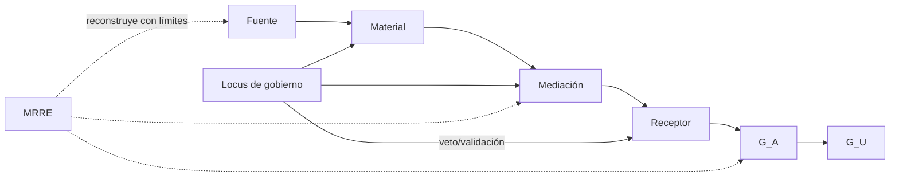

# Integración Consciencia y Soberanía ↔ MRRE

## Propósito

Aplicar fuente/material/mediación/recepción, redes, gobierno reflexivo y soberanía humana sin declarar estados de consciencia ni redefinir el paquete origen.

## Aplicación de patrones

`PAT-COG-001…009` gobierna procedencia; `015…026` manifestación, cortes y redes; `030…043` locus, autoridad, veto y feedback; `052…063` efectos, aprovisionamiento y sistemas; `123…125` transformación semántica distribuida e intensidad/plano de gobierno.

La complejidad de procesamiento no prueba soberanía (`PAT-COG-124`). Cada responsabilidad de percepción, integración, validación, teleología, autorización o aprendizaje declara propietario, escalamiento y evidencia (`125`). MRRE propone alternativas; el humano fija fines, acepta, rechaza o promueve.

## Cierre y recepción

`G_P/G_R/G_A/G_U` permanecen separados. Permeabilidad epistémica regula ingreso de evidencia; cierre cognitivo no se infiere desde una sola manifestación. Triangulación conserva manifestaciones y contextos. Si no hay evidencia del receptor, MRRE sólo produce riesgo de activación proyectada.

## Procedimiento de gobierno

1. tipar locus de percepción, integración, validación, teleología, autorización y aprendizaje;
2. asignar propietario y evidencia a cada responsabilidad;
3. marcar veto/gate en acciones irreversibles;
4. impedir que complejidad o confidence se conviertan en soberanía;
5. separar efecto proyectado de activación observada;
6. registrar decisión humana sin atribuirla al motor.

La lógica se adopta de [SRC-CS-OPS](../../CONSCIENCIA_Y_SOBERANIA/ARQUITECTURA_DE_OPERACIONES_Y_EFECTOS_COGNITIVOS_v0_1_0.md) y los patrones se resuelven desde [SRC-CAT-CS-01](../../CONSCIENCIA_Y_SOBERANIA/CATALOGO_PATRONES_DE_DISENO_COGNITIVO_REUTILIZABLES_v0_1_0.md). Los gates concretos están en [MRRE-AUTHORITY](../00_gobierno/02_autoridad_soberania_y_limites.md).
