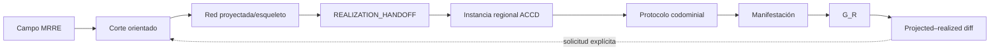

# Integración ACCD ↔ MRRE

## Handoff opcional

MRRE cierra un `REALIZATION_HANDOFF` semántico-discursivo; ACCD configura instancia regional, protocolo y codominio. `ORIENTED_CUT ≠ CONTEXTUAL_INSTANCE`; ACCD no modifica el campo fuente silenciosamente.

## Contrato `REALIZATION_HANDOFF`

Incluye construcción conceptual de entrada, invariantes, variación, partes/orden, requisitos regionales, clase de realización, receiver profile, prohibiciones, pruebas, trace refs y criterios de feedback. ACCD añade valores contextuales sin redecidir el núcleo semántico.

## Grafo regional consumido

`SRC-ACCD-REGIONS` contiene 11 dimensiones, 2 476 JSON válidos y relaciones dimensión→campo→valor→restricción. MRRE puede referenciar, entre otras, acoplamiento receptoral, comparecencia performativa, composición segmental/espacial, construcción del caso, dinámica atencional, escala temporal, identidad operativa, marco de materialización, orientación pragmática y recursos complementarios. Se usa por adapter y `source_binding`, no se copia al kernel.

## Pruebas de desacoplamiento

1. Una ejecución MRRE completa termina en arquitectura/esqueleto sin ACCD.
2. Una ejecución con ACCD valida schema y diff sin dar a ACCD autoridad sobre el field.
3. Incompatibilidad regional vuelve como `REVISION_REQUEST`; no muta el corte.
4. `G_R` se reingesta como nueva manifestación con versión propia.

## Procedimiento de handoff

1. MRRE entrega esqueleto/bindings/diff con schema y trace;
2. adapter transforma sólo lo necesario al contrato regional ACCD;
3. ACCD realiza/compone en sus regiones sin mutar `STRUCTURAL_FIELD`;
4. incompatibilidades retornan como `REVISION_REQUEST` localizado;
5. la salida realizada se registra como nueva manifestación, no como actualización retroactiva;
6. MRRE puede reingestarla y comparar preservación.

La realización se relaciona con [SRC-ACCD-EQUATION](../../../../03_aplicaciones/creacion_de_contenido/accd/base_teorica_ecuacion_de_protocolo_ACCD.md) y [SRC-ACCD-REGIONS](../../../../03_aplicaciones/sistema-de-transferencia-accd/grafo_de_regiones/) sin adoptarlos como kernel. El output y su lugar de persistencia se describen en [MRRE-ARTIFACTS](../10_artefactos_generados/README.md).
