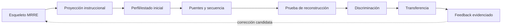

# Integración Aprendizaje Estructural ↔ MRRE

## Frontera

MRRE reconstruye e instancia estructuras. Aprendizaje Estructural determina si un receptor puede reconstruirlas, discriminar casos, romper analogías y transferirlas. Exposición, activación, evaluación, integración y aprendizaje son estados distintos (`PAT-COG-094`).

## Evidencia fuerte

| Afirmación | Evidencia mínima |
|---|---|
| exposición | portador presentado |
| activación | respuesta/medida compatible, método declarado |
| evaluación | tarea de valoración o juicio |
| integración | cambio relacional modelado PIEA con trayectoria |
| aprendizaje | reconstrucción + discriminación + transferencia a caso nuevo |

El perfil declara estado inicial, repertorio, puentes, restricciones y contexto. PIEA modela `S_{t+1}=𝓘(S_t,a_t,K_t)` sin identificar estado con manifestación. La fuente adjunta `APRENDIZAJE_ESTRUCTURAL_COGNICION_CENTRAL_v0_1.pdf` permanece `PATH_PENDING_CONFIRMATION`; no soporta claims fuertes hasta localizarse.

## Procedimiento de evaluación receptoral

1. MRRE entrega arquitectura/esqueleto como hipótesis de intervención;
2. se registra estado/repertorio inicial con método;
3. se expone o aplica la intervención bajo autoridad;
4. se recogen activación, discriminación y transferencia por separado;
5. PIEA modela transición sin confundirla con el output;
6. la evidencia retorna al ledger como `RECEIVER_EVIDENCE`;
7. feedback puede reabrir candidata, nunca probar intención del productor.

El modelo se adopta de [SRC-PIEA-CORE](../../PATRON_DE_INTEGRACION_ESTRUCTURAL_ACUMULATIVA/00_core/00_especificacion_nuclear.md) y [SRC-PIEA-TRANSITION](../../PATRON_DE_INTEGRACION_ESTRUCTURAL_ACUMULATIVA/10_mecanismo/10_transicion_de_estado.md). La aplicación local está en [SRC-AE-README](../../../../03_aplicaciones/aprendizaje_estructural/README.md). La fuente PDF pendiente sigue sin cita resoluble y no sostiene claims.
