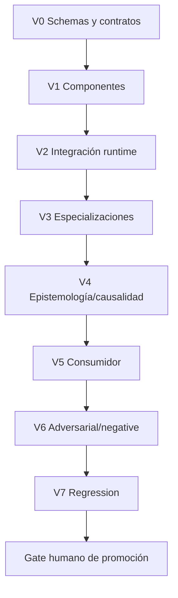

# Plan de verificación y validación

Verificar conformidad interna no valida adecuación al propósito. La promoción humana es un tercer gate independiente.

## Anillos

| Anillo | Comprueba | Fallos detectados | Evidencia |
|---|---|---|---|
| V0 | YAML/JSON Schema, required, version y refs | contrato inválido, tipo colapsado | parse/schema report |
| V1 | pre/postcondiciones y validators de componente | output opaco, huecos omitidos | unit fixtures |
| V2 | rutas, states, fallos, replan y trace | chain rígida, evento perdido | integration run log |
| V3 | restricciones y corpus por modalidad | especialización redefine kernel | case suite |
| V4 | clases epistémicas, alternativas, causalidad | intención/causalidad inventada | negative cases |
| V5 | handoff y utilidad | consumidor reinterpreta o muta field | contract test |
| V6 | 46 tests de catálogos y 20 no-colapsos | falsos positivos peligrosos | adversarial suite |
| V7 | cambios entre versiones y dependientes | regresión silenciosa | baseline/diff |

## Reglas de ejecución

Cada requisito/invariante tiene prueba positiva y negativa en la matriz. Un validator declara input, versión, regla, severidad, falso positivo, evidence refs y rerun trigger. Fallo de invariante crítico no se compensa con promedio. Resultados posibles: pass, fail, partial, blocked y not-run.

## Promoción

`tests_passed`, `evidence_sufficient` y `promotion_authorized` se calculan/se deciden por separado. Cambios de schema, invariante o patrón disparan revalidación transitiva (`PAT-COG-114/115`). Ejemplos prueban, pero no definen, el kernel.

## Ejecución

Construye el set de validadores desde [MRRE-INVARIANTS](../01_kernel_estable/01_definicion_fronteras_e_invariantes.md), [MRRE-NON-COLLAPSE](../01_kernel_estable/05_reglas_de_no_colapso.md), schemas y `CASE_SPEC`. Ejecuta en orden: forma → procedencia → relaciones → propósito → adversarial → reingreso → autoridad. Los casos trazados están en [MRRE-CASE-INDEX](../09_casos_y_ejemplos/README.md); la revisión documental, en [MRRE-VAL-DOC](04_validacion_de_referencias_y_operabilidad.md).

La separación V&V se adapta de [SRC-KI-11](../../../../04_conocimiento_y_contexto/memoria_conceptual/incubacion-conceptual/ingenieria/kernel-de-ingenieria-1-1.txt).
