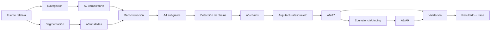

# Casos y ejemplos operativos MRRE

**ID:** `MRRE-CASE-INDEX`  
**Versión:** `0.2.0`

Esta carpeta no contiene adornos pedagógicos. Cada caso es una ejecución de referencia que enseña cómo producir y revisar artefactos MRRE. Debe leerse junto con [MRRE-AGENT-MANUAL](../01_kernel_estable/09_manual_de_operacion_para_agentes.md) y [MRRE-WORKBOOK](../03_protocolos_operacionales/07_libro_de_trabajo_y_algoritmos.md).

## Contrato de un caso

Un caso completo contiene o declara explícitamente por qué no puede contener:

| Capa | Artefacto | Pregunta que responde |
|---|---|---|
| A0 | `CASE_SPEC` | ¿qué se intenta hacer y con qué autoridad? |
| A1 | `MANIFESTATION_RECORD` | ¿dónde está el original y cómo se localiza cada evidencia? |
| A2 | `STRUCTURAL_FIELD_AND_CUT` | ¿cuál es el campo, frontera, orientación, omisiones y prominencias? |
| A3 | `SEGMENTATION_GRAPH` | ¿qué unidades reversibles se detectaron en cada escala? |
| A4 | `RECONSTRUCTED_SUBGRAPH_SET` | ¿qué nodos, edges, funciones y efectos se reconstruyeron? |
| A5 | `CHAIN_SET` | ¿qué rutas tipadas conectan estados y efectos? |
| A6 | `CANDIDATE_ARCHITECTURE_SET` | ¿qué topologías explican la manifestación y qué alternativas existen? |
| A7 | `STRUCTURAL_SKELETON` | ¿qué roles/invariantes sobreviven al retirar materiales concretos? |
| A8 | `BINDING/REINSTANTIATION` | ¿cómo se poblaron roles y con qué equivalencia/autoridad? |
| A9 | `STRUCTURE_PRESERVATION_DIFF` | ¿qué se preservó, cambió, perdió o inventó? |
| A10 | `VALIDATION_AND_TRACE` | ¿qué se probó, qué falló y cómo volver a la fuente? |

Si una fuente está ausente, los artefactos A2–A9 no se fabrican: se emite un fallo tipado y un contrato de reanudación. [CASE-MRRE-BRIDGE](puente_del_valle/DOSSIER_OPERATIVO.md) muestra ese comportamiento.

## Casos disponibles

| Caso | Operaciones | Estado | Valor de diseño |
|---|---|---|---|
| [Reuters](reuters/DOSSIER_OPERATIVO.md) | `RETROCONSTRUIR`, `COMPARAR`, `REINSTANCIAR`, `VALIDAR` | ejecución de referencia sobre fuentes locales | campo común hipotético, cortes distintos, perfil/cambio, binding textual |
| [Collar](caso_del_collar/DOSSIER_OPERATIVO.md) | `RETROCONSTRUIR`, `COMPARAR`, `REINSTANCIAR`, `VALIDAR` | ejecución de referencia sobre MTC y fixtures | cascada cognitivo-social, no-colapso `V ≠ M`, interfaces |
| [Aspiradora](aspiradora/DOSSIER_OPERATIVO.md) | `RETROCONSTRUIR`, `VALIDAR` | ejecución sintética reproducible | mecanismo, parts/functions, contrafactual y riesgo léxico |
| [Triangulación multimodal](triangulacion_multimodal/DOSSIER_OPERATIVO.md) | `TRIANGULAR`, `COMPARAR`, `VALIDAR` | ejecución sintética con procedencia por modalidad | contradicción localizada por feature y prueba de remoción |
| [Puente del Valle](puente_del_valle/DOSSIER_OPERATIVO.md) | `RETROCONSTRUIR` | `WAITING_SOURCE` deliberado | gate de fuente, no invención y reanudación |

## Cómo estudiar un caso

1. abre el original o fixture desde su cita científica `CASE-SRC-*` con enlace relativo;
2. compara los locators del dossier con el portador;
3. reconstruye el grafo sin mirar la arquitectura propuesta;
4. contrasta tus subgrafos y chains con el dossier;
5. ejecuta al menos una prueba de remoción;
6. revisa la alternativa rival;
7. si hay reinstanciación, verifica cada binding por función, relación, topología y contexto;
8. recorre la traza hacia atrás hasta la fuente y hacia adelante hasta el dictamen.

## Mapa proceso–artefacto

Los procesos son [MRRE-PROC-NAVIGATE](../03_protocolos_operacionales/01_navegacion_estructural.md), [MRRE-PROC-RETRO](../03_protocolos_operacionales/02_retroconstruccion.md), [MRRE-PROC-TRIANGULATE](../03_protocolos_operacionales/03_triangulacion_multimanifestacion.md), [MRRE-PROC-REINSTATE](../03_protocolos_operacionales/04_reinstanciacion.md), [MRRE-PROC-COMPARE](../03_protocolos_operacionales/05_comparacion_y_transferencia.md) y [MRRE-VAL-PLAN](../08_validacion_y_pruebas/01_plan_de_verificacion_y_validacion.md).

## Regla de modificación

Al cambiar un caso se actualizan simultáneamente su fixture, dossier, expected result, run, lessons y referencias. Una narración que no actualiza artefactos no constituye una nueva ejecución. Los casos permanecen no canónicos y no prueban por sí mismos generalización fuera de su alcance.
