# PATRÓN ESTRUCTURAL — MIGRACIÓN DE COSTO (`COST_MIGRATION`)

**ID propuesto:** `PAT-COG-131`  
**Nombre canónico propuesto:** `MIGRACIÓN DE COSTO A TRAVÉS DE NODOS Y CAPAS DEL SISTEMA`  
**Alias operativo:** `COST_MIGRATION`  
**Versión:** `0.1.0`  
**Fecha:** `2026-08-18`  
**Proyecto:** `COGNICIÓN_CENTRAL`  
**Familia propuesta:** `FAMILIA R — PROPAGACIÓN, AMORTIGUACIÓN Y REDISTRIBUCIÓN DE PRESIÓN SISTÉMICA`  
**Estado:** `HUMAN_PROMOTED_PATTERN / CROSS_CUTTING / NON_CANONICAL / READY_FOR_CATALOG_INTEGRATION`  
**Autoridad de promoción conceptual:** `HUMANO`  
**Comando de materialización:** `INT-MRRE-COST-MIGRATION-PROMOCION-PATRON-001`  
**Persistencia:** este archivo materializa la promoción humana del concepto a **patrón estructural**; no modifica por sí mismo el artefacto central ni el canon vivo.  
**Caso de descubrimiento:** investigación sistémica del petróleo, 2026.  
**Regla de identidad:** `CASO_DE_DESCUBRIMIENTO ≠ IDENTIDAD_DEL_PATRÓN`.

---

# 0. DECISIÓN DE PROMOCIÓN

Durante la investigación del sistema petrolero apareció recurrentemente una estructura candidata:

> Cuando una restricción, shock o pérdida de capacidad no se expresa completamente en el indicador central observado, su costo puede desplazarse, transformarse o concentrarse en otros nodos, capas, actores, productos, territorios o momentos del sistema.

El humano ordena ahora **elevar `COST_MIGRATION` a patrón estructural general**, usando el caso petrolero sólo como ejemplar de descubrimiento y conservando la posibilidad de reinstanciarlo en otros dominios.

La promoción cambia el tratamiento de:

`CANDIDATE_ARCHITECTURE`

a:

`STRUCTURAL_PATTERN`.

No implica todavía:

- incorporación automática al canon;
- verdad universal sin condiciones;
- conservación matemática del costo;
- equivalencia ontológica entre dominios;
- validez automática de una instancia concreta.

---

# 1. UBICACIÓN RECOMENDADA

Ubicación inmediata recomendada como unidad independiente:

```text
01_nucleo_cognitivo/
└── teoria_tmc/
    └── MOTOR_DE_RETROCONSTRUCCIÓN_Y_REINSTANCIACIÓN_ESTRUCTURAL/
        └── 05_acervo_estructural/
            └── PATRON_ESTRUCTURAL_MIGRACION_DE_COSTO_PAT_COG_131_v0_1_0.md
```

Integración posterior sugerida:

```text
CATALOGO_DE_PATRONES_DE_DISENO_COGNITIVO_REUTILIZABLES_EXTENSION_v0_5_0.md
```

La extensión `v0.4.0` recuperada en el artefacto cubre `PAT-COG-126` a `PAT-COG-130`; por ello `PAT-COG-131` es el siguiente identificador lógico **propuesto**, sujeto a comprobación de colisión antes de integración persistente.

---

# 2. DEFINICIÓN NUCLEAR

## 2.1. Definición

**MIGRACIÓN DE COSTO** es el patrón por el cual una perturbación sistémica cuyo efecto es absorbido, amortiguado, regulado, desviado o parcialmente ocultado en un nodo o indicador **reaparece como presión en otros componentes del sistema**, pudiendo cambiar de forma durante la transferencia.

El costo puede manifestarse como:

- aumento de precio;
- compresión o expansión de margen;
- agotamiento de inventario;
- consumo de reservas;
- mayor tiempo de tránsito;
- congestión;
- mayor prima de riesgo;
- mayor costo de seguro o financiación;
- menor calidad;
- menor confiabilidad;
- pérdida de capacidad;
- necesidad de capital adicional;
- subsidio o costo fiscal;
- reducción de producción;
- destrucción de demanda;
- externalidad transferida a otro actor;
- incremento de vulnerabilidad futura.

Por tanto:

**`COSTO ≠ PRECIO`**

y:

**`PRECIO CENTRAL ESTABLE ≠ AUSENCIA DE ESTRÉS SISTÉMICO`**

---

# 3. PROBLEMA QUE RESUELVE

El patrón corrige un error analítico frecuente: observar un único indicador central y asumir que éste representa la totalidad del costo impuesto al sistema.

Ejemplos de indicadores que pueden producir un corte parcial:

- benchmark de una materia prima;
- precio promedio nacional;
- tarifa regulada;
- inventario agregado;
- margen de una sola industria;
- latencia promedio;
- disponibilidad total;
- índice bursátil;
- métrica de utilización.

El sistema puede estar absorbiendo una perturbación mediante buffers o redistribuyéndola entre nodos, de modo que el indicador focal permanezca relativamente estable mientras otras variables se deterioran.

---

# 4. FIRMA ESTRUCTURAL

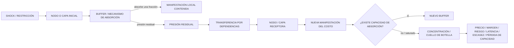

Forma compacta:

`SHOCK + BUFFER_LOCAL + RED_DE_DEPENDENCIAS + CAPACIDADES_LIMITADAS → REDISTRIBUCIÓN_DE_PRESIÓN → MANIFESTACIÓN_EN_OTROS_NODOS`.

---

# 5. EL COSTO COMO VECTOR

Para que el patrón sea transferible entre dominios, `COSTO` no debe reducirse a dinero.

Una instancia puede representar el estado de costo como un vector:

```yaml
cost_state:
  price:
  margin:
  inventory_depletion:
  reserve_depletion:
  transit_time:
  congestion:
  risk_premium:
  insurance:
  financing:
  capital_requirement:
  reliability:
  quality:
  accessibility:
  output_loss:
  demand_destruction:
  fiscal_burden:
  environmental_externality:
  strategic_vulnerability:
```

No todas las dimensiones existen en todas las instancias.

La función del patrón es preguntar:

> **¿Qué dimensiones del costo están aumentando, en qué nodos, para qué actores y en qué horizonte temporal?**

---

# 6. MECANISMO GENERAL

## 6.1. Shock

Una perturbación modifica disponibilidad, capacidad, tiempo, riesgo, calidad, acceso o coordinación.

Puede ser:

- física;
- logística;
- regulatoria;
- financiera;
- tecnológica;
- política;
- informacional;
- ambiental;
- organizacional.

## 6.2. Buffer

Un buffer evita que todo el shock se manifieste inmediatamente en el nodo focal.

Ejemplos abstractos:

- inventarios;
- reservas;
- capacidad ociosa;
- redundancia;
- rutas alternativas;
- proveedores alternativos;
- subsidios;
- regulación de precios;
- crédito;
- seguros;
- contratos;
- almacenamiento;
- capacidad de sustitución;
- reducción temporal de calidad;
- sobrecarga operativa;
- demanda flexible.

## 6.3. Presión residual

El buffer tiene:

- capacidad finita;
- velocidad de respuesta;
- costo propio;
- restricciones;
- tiempo de reposición.

La fracción que no absorbe debe:

- propagarse;
- transformarse;
- acumularse;
- ser externalizada;
- o destruir actividad/demanda.

## 6.4. Transferencia

La migración ocurre a través de aristas reales:

- dependencia de insumo;
- relación contractual;
- ruta logística;
- mecanismo de precio;
- requisito técnico;
- vínculo financiero;
- regulación;
- sustitución;
- coordinación;
- relación temporal entre inventario presente y escasez futura.

## 6.5. Concentración

La presión tiende a concentrarse donde coinciden:

- poca capacidad ociosa;
- baja sustituibilidad;
- alta centralidad;
- dependencia elevada;
- reposición lenta;
- alta concentración de proveedores;
- regulación rígida;
- infraestructura limitada;
- sincronización crítica.

---

# 7. TIPOS DE MIGRACIÓN DE COSTO

## 7.1. Migración vertical

El costo se desplaza entre etapas de una cadena.

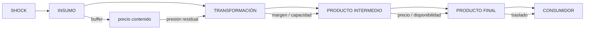

## 7.2. Migración horizontal

El costo se desplaza hacia un producto, proveedor, ruta o activo sustituto.

## 7.3. Migración geográfica

Una región amortigua el shock mientras otra paga:

- diferencial regional;
- costo de transporte;
- congestión;
- escasez localizada.

## 7.4. Migración temporal

El presente se estabiliza consumiendo capacidad futura.

Ejemplos:

- inventario;
- reservas estratégicas;
- mantenimiento diferido;
- deuda;
- agotamiento de redundancia.

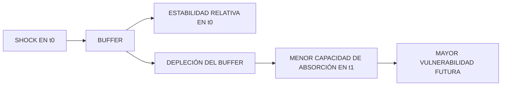

## 7.5. Migración entre actores

El costo pasa de:

- productor a consumidor;
- empresa a proveedor;
- empresa a trabajador;
- empresa a Estado;
- Estado a contribuyente;
- asegurador a asegurado;
- refinador a transportista;
- red eléctrica a generador de respaldo.

## 7.6. Migración precio → no-precio

El precio puede permanecer controlado mientras aumenta:

- tiempo de espera;
- racionamiento;
- cuota;
- reducción de calidad;
- indisponibilidad;
- riesgo;
- subsidio;
- carga fiscal.

## 7.7. Migración físico → financiero

Una restricción física puede expresarse en:

- basis;
- curva temporal;
- spreads;
- primas;
- colateral;
- crédito;
- volatilidad;
- márgenes.

## 7.8. Migración financiero → físico

Condiciones financieras pueden alterar:

- inventario;
- almacenamiento;
- inversión;
- capacidad;
- trade finance;
- disponibilidad efectiva.

## 7.9. Migración intersectorial

El shock en un recurso reaparece como costo en industrias dependientes.

Ejemplo abstracto:

`COMBUSTIBLE → TRANSPORTE → AGRICULTURA → ALIMENTOS`.

---

# 8. BUFFER ≠ ELIMINACIÓN DEL COSTO

Un buffer puede amortiguar una manifestación sin eliminar la carga sistémica.

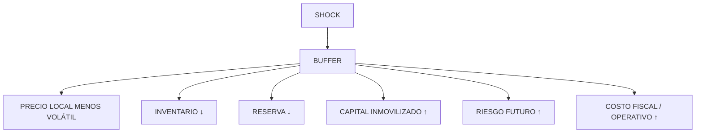

Regla:

**`ABSORCIÓN LOCAL ≠ DESAPARICIÓN SISTÉMICA`**

---

# 9. SATURACIÓN DEL BUFFER

La migración suele cambiar de régimen cuando el buffer se aproxima a su límite.

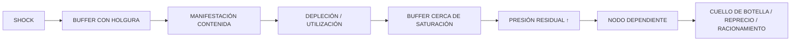

Por ello, una fotografía estática del buffer es insuficiente.

Debe observarse:

- nivel;
- tasa de consumo;
- tasa de reposición;
- capacidad máxima;
- tiempo de respuesta;
- restricciones de activación;
- costo marginal de seguir utilizándolo.

---

# 10. RELACIÓN CON CUELLOS DE BOTELLA

`COST_MIGRATION` permite usar la distribución del costo como herramienta para localizar posibles cuellos de botella.

Una heurística de investigación, **no una ley universal**, es:

```text
PRESIÓN_POTENCIAL_EN_NODO
∝
PRESIÓN_RESIDUAL_ENTRANTE
× DEPENDENCIA
× BAJA_SUSTITUIBILIDAD
× BAJA_CAPACIDAD_OCI0SA
× RETARDO_DE_REPOSICIÓN
× CENTRALIDAD_FUNCIONAL
```

Su utilidad no es producir un número exacto, sino orientar qué variables medir.

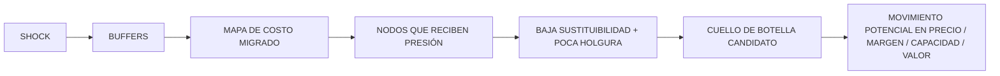

---

# 11. CONEXIÓN CON ANÁLISIS DE INVERSIONES POSIBLES

El patrón puede alimentar una arquitectura de generación de hipótesis de inversión:

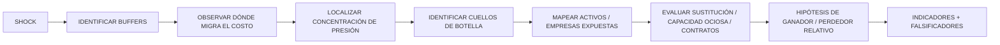

No-colapso:

**`HIPÓTESIS_DE_INVERSIÓN ≠ RECOMENDACIÓN_DE_INVERSIÓN`**

La mera identificación de un cuello de botella tampoco garantiza una subida de precio o valoración; pueden intervenir:

- regulación;
- destrucción de demanda;
- sustitución;
- nueva capacidad;
- control estatal;
- insolvencia del comprador;
- contratos de precio fijo;
- cobertura financiera;
- intervención política.

---

# 12. RELACIÓN CON ACTORES

El patrón admite una capa explícita de actores.

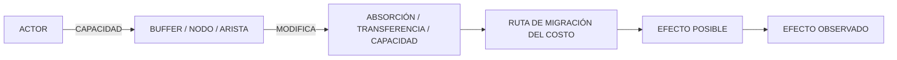

Contrato analítico:

```yaml
actor_edge:
  actor:
  capability:
  observed_action:
  target_node:
  target_edge:
  mechanism:
  effect_on_buffer:
  effect_on_transfer:
  possible_effect:
  observed_effect:
  evidence:
  epistemic_state:
```

Regla obligatoria:

**`ACTOR_HAS_CAPABILITY ≠ ACTOR_USED_CAPABILITY ≠ ACTOR_CAUSED_EFFECT`**

---

# 13. INVARIANTES DEL PATRÓN

Una instancia de `PAT-COG-131` debe conservar:

1. existe una perturbación o presión identificable;
2. existe más de un nodo, capa, actor, tiempo o indicador relevante;
3. al menos un mecanismo absorbe, contiene, desvía o transforma parte del efecto;
4. existe una dependencia o arista capaz de transferir presión;
5. el costo reaparece en una dimensión distinta, nodo distinto o momento distinto;
6. la manifestación local contenida no basta para describir el estado global;
7. la trayectoria debe ser causalmente plausible y trazable;
8. deben distinguirse observación, inferencia e hipótesis;
9. la migración puede amplificar, amortiguar o transformar el costo;
10. no se presupone conservación estricta de una magnitud escalar denominada “costo”.

---

# 14. DOMINIO DE VARIACIÓN

Puede variar:

- naturaleza del shock;
- unidad de costo;
- número de capas;
- número de buffers;
- dirección de transferencia;
- topología;
- velocidad;
- horizonte temporal;
- capacidad de sustitución;
- regulación;
- actores;
- mercados;
- grado de observabilidad;
- si la migración es reversible;
- si produce amplificación o disipación;
- si el costo final es monetario, físico, temporal, estratégico o mixto.

---

# 15. LO QUE EL PATRÓN NO AFIRMA

`PAT-COG-131` no afirma que:

- todo shock conserve exactamente la misma cantidad total de “costo”;
- toda estabilidad de precio implique manipulación;
- todo aumento downstream provenga de un shock upstream;
- todo buffer sea beneficioso;
- todo costo migrado termine en un precio;
- todo cuello de botella produzca rentas extraordinarias;
- un actor con capacidad haya usado esa capacidad;
- una correlación temporal sea una arista causal;
- un caso en petróleo sea equivalente ontológicamente a electricidad, helio o semiconductores.

---

# 16. ANTI-PATRONES ANALÍTICOS

## 16.1. Indicador único

Concluir estado sistémico a partir de un benchmark aislado.

## 16.2. Buffer gratuito

Tratar reservas, inventarios, subsidios o redundancia como si no tuvieran costo propio.

## 16.3. Agregado geográfico

Usar un inventario o capacidad global sin preguntar dónde se encuentra y si es accesible.

## 16.4. Sustitución perfecta

Asumir que cualquier proveedor, ruta, materia prima o capacidad puede sustituir otra sin fricción.

## 16.5. Coste sólo monetario

Ignorar tiempo, riesgo, capacidad, calidad, disponibilidad o carga fiscal.

## 16.6. Causalidad por co-movimiento

Inferir que el nodo A causó el costo en B sólo porque ambos cambiaron.

## 16.7. Actor omnipotente

Confundir capacidad de influencia con control total del resultado.

---

# 17. TESTS DE VALIDACIÓN

## TEST-CM-01 — desaparición local

Si el indicador focal permanece estable, ¿puede localizarse evidencia de presión en otro nodo?

## TEST-CM-02 — mecanismo

¿Existe una arista real que conecte el shock con la nueva manifestación?

## TEST-CM-03 — temporalidad

¿La causa propuesta precede al efecto y aparece un canal intermedio observable?

## TEST-CM-04 — buffer

¿Puede identificarse qué mecanismo absorbió la primera parte del shock?

## TEST-CM-05 — saturación

¿La presión migrada aumenta cuando disminuye la holgura del buffer?

## TEST-CM-06 — sustitución

¿La aparición de una alternativa reduce la presión en el nodo receptor?

## TEST-CM-07 — control

¿Regiones, productos o actores menos expuestos muestran una trayectoria diferente?

## TEST-CM-08 — alternativa explicativa

¿El mismo efecto puede explicarse mejor por demanda, regulación, estacionalidad, tecnología u otro shock?

## TEST-CM-09 — desaparición del mecanismo

Si se elimina la arista propuesta, ¿la explicación sigue funcionando?  
Si sí, la arista puede ser decorativa o incorrecta.

## TEST-CM-10 — costo total

¿La aparente “migración” es en realidad disipación por destrucción de demanda o pérdida de actividad?  
Si lo es, debe modelarse como transformación del sistema y no como simple traslado.

---

# 18. RELACIÓN CON PATRONES EXISTENTES DE COGNICIÓN_CENTRAL

## `PAT-COG-057 — SISTEMA DE EFECTOS MULTICAPA`

Aporta la posibilidad de propagación entre capas heterogéneas.

**Diferencia:** `PAT-COG-131` añade la responsabilidad específica de seguir **dónde reaparece la carga cuando una manifestación es amortiguada o desplazada**.

## `PAT-COG-059 — INTERVENCIÓN FUNCIONAL-ESTRUCTURAL`

Permite representar cambios sobre nodos, relaciones, pesos, funciones, rutas y prioridades.

**Diferencia:** `PAT-COG-131` observa cómo esos cambios redistribuyen presión/costo.

## `PAT-COG-046 — RECOMPOSICIÓN FUNCIONAL`

Representa rutas alternativas y sustitución para conservar función.

**Diferencia:** la recomposición puede convertirse en un buffer que conserva la función, pero transfiere costo hacia la ruta alternativa.

## `PAT-COG-128 — COMPOSICIÓN DE CAPACIDAD DEPENDIENTE DE TOPOLOGÍA`

Establece que cuellos de botella, redundancia y sustitución cambian la capacidad sistémica.

**Diferencia:** `PAT-COG-131` usa esa topología para explicar **concentración y desplazamiento de presión**.

## `PAT-COG-129 — DUALIDAD RUTAS FUNCIONALES / CORTES FUNCIONALES`

Permite identificar rutas suficientes y conjuntos de corte.

**Diferencia:** cuando una ruta se degrada sin destruir toda la función, `PAT-COG-131` permite preguntar **qué costo adicional aparece en las rutas que permanecen activas**.

## `PAT-COG-060 — MISMA LÓGICA / DISTINTO SISTEMA OBJETIVO`

Justifica transferir una identidad estructural entre dominios sin copiar literalmente su vocabulario.

## `PAT-COG-044 — FÁBRICA DE ADAPTACIONES CONTEXTUALES`

Permite reinstanciar el patrón conservando invariantes y variando mecanismos locales.

---

# 19. DEDUPLICACIÓN: POR QUÉ ES UN PATRÓN DIFERENCIAL

Los patrones anteriores cubren:

- propagación;
- reconfiguración;
- recomposición;
- topología;
- rutas;
- cortes;
- transferencia entre dominios.

Pero no formalizan por sí solos la siguiente responsabilidad:

> **seguir el rastro de una carga sistémica que deja de aparecer plenamente en un nodo porque un buffer la absorbe o desplaza, y reconstruir dónde, cómo y bajo qué forma reaparece.**

Esta responsabilidad introduce un objeto analítico propio:

`MAPA_DE_DISTRIBUCIÓN_DE_COSTO`.

Y una pregunta estable:

> **¿DÓNDE ESTÁ PAGANDO EL SISTEMA EL SHOCK?**

Éste es el diferencial que justifica la identidad independiente de `PAT-COG-131`.

---

# 20. CASO DE DESCUBRIMIENTO — SISTEMA PETROLERO 2026

## 20.1. Advertencia

El caso petrolero es una **instancia** y no la definición del patrón.

Las relaciones específicas deben conservar source bindings propios y revalidarse cuando cambien los datos de mercado.

## 20.2. Shock investigado

La investigación partió de restricciones físicas y logísticas relevantes en el sistema petrolero, mientras algunos benchmarks no parecían reflejar linealmente toda la tensión.

La pregunta inicial:

> ¿Por qué el benchmark no representa proporcionalmente la aparente restricción física?

fue transformada por el análisis estructural en:

> ¿En qué nodos del sistema se está expresando el costo de la restricción?

## 20.3. Buffers identificados

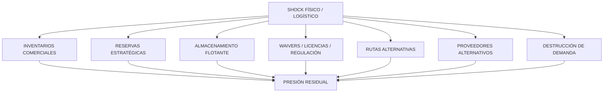

## 20.4. Nodos donde el costo puede aparecer

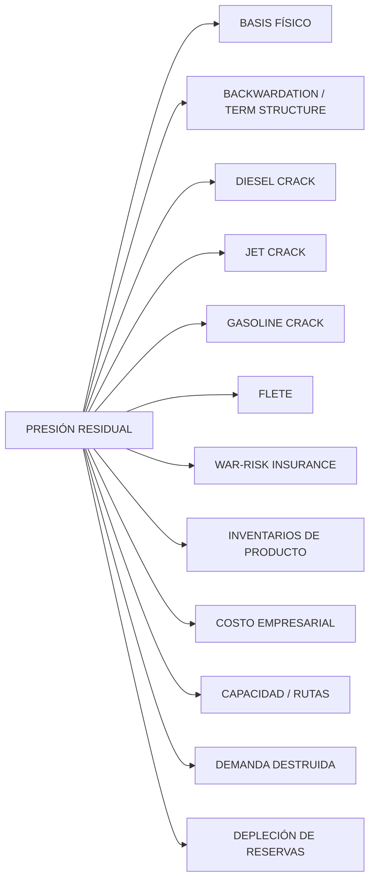

## 20.5. Ejemplo conceptual

Un benchmark de crudo relativamente contenido puede coexistir con:

- diesel más caro;
- jet fuel más caro;
- cracks de refinación elevados;
- inventarios de destilados bajos;
- flete y seguro más caros;
- reservas públicas descendiendo;
- mayor costo de aerolíneas, transporte o industria;
- rerouting y mayor tiempo de tránsito.

La lectura estructural es:

**el shock no desaparece necesariamente; puede estar distribuido entre nodos distintos.**

## 20.6. Distinción crítica surgida del caso

**`CRUDE_SUPPLY_PROBLEM ≠ PRODUCT_SUPPLY_PROBLEM`**

Puede existir crudo agregado mientras el cuello de botella se encuentre en:

- calidad de crudo;
- crude slate;
- capacidad de refinación;
- configuración de refinería;
- inventario de producto;
- exportación de refinados;
- transporte;
- ruta;
- seguros;
- capacidad regional.

## 20.7. Conexión con inversión

El caso condujo a la arquitectura:

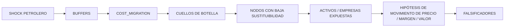

---

# 21. TRANSFERENCIAS A OTROS RUBROS

## 21.1. Electricidad

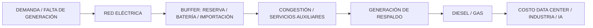

Aquí el precio mayorista puede no capturar todo el costo si existen contratos, subsidios o generación de respaldo.

## 21.2. Gas natural

Una restricción de gas puede migrar hacia:

- electricidad;
- fertilizantes;
- petroquímica;
- LNG freight;
- almacenamiento;
- basis regional;
- demanda industrial.

## 21.3. Helio

Una restricción puede expresarse en:

- asignaciones;
- spot premium;
- retrasos;
- inventarios;
- logística criogénica;
- semiconductores;
- MRI;
- investigación científica.

## 21.4. Galio y tierras raras

Una restricción de exportación puede migrar hacia:

- inventarios downstream;
- primas de proveedor alternativo;
- costo de separación/refinación;
- capex;
- lead times;
- componentes;
- subsidios estatales;
- revalorización de activos estratégicos.

## 21.5. Fertilizantes

Gas caro o restringido puede migrar a:

- amoniaco;
- urea;
- margen del productor;
- subsidios agrícolas;
- precio al agricultor;
- superficie cultivada;
- precio de alimentos.

## 21.6. Semiconductores

Un cuello en una etapa puede aparecer como:

- lead time;
- asignación;
- precio de chips;
- precio de equipos usados;
- inventarios estratégicos;
- paros automotrices;
- capex acelerado;
- sustitución tecnológica.

## 21.7. Rutas comerciales

La pérdida de un chokepoint puede migrar hacia:

- distancia;
- tiempo;
- necesidad de flota;
- flete;
- seguro;
- congestión portuaria;
- inventario en tránsito;
- capital inmovilizado;
- disponibilidad final.

---

# 22. EJEMPLO ESPECIAL: IA, ELECTRICIDAD Y DIESEL

Esta transferencia conecta con la rama tangente sobre aplicaciones del diesel.

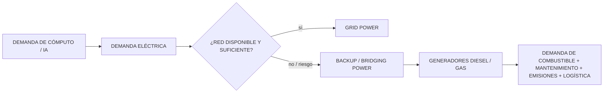

La migración relevante puede ser:

`RESTRICCIÓN ELÉCTRICA → COSTO DE RESPALDO → DEMANDA DE DIESEL → COSTO OPERATIVO DEL DATA CENTER`.

La existencia del mecanismo debe validarse en cada instalación concreta; no se presupone que toda infraestructura de IA opere de este modo.

---

# 23. INSTANCIACIÓN DEL PATRÓN

```yaml
pattern_instance:
  pattern_id: PAT-COG-131
  pattern_name: COST_MIGRATION

  system:
    domain:
    boundary:
    focal_indicator:

  shock:
    type:
    origin_node:
    start_time:
    magnitude:
    evidence:

  buffers:
    - id:
      type:
      capacity:
      current_state:
      absorption_rate:
      replenishment_rate:
      activation_constraints:
      owner:
      cost_of_use:

  transfer_graph:
    nodes: []
    edges:
      - from:
        to:
        mechanism:
        latency:
        dependency:
        evidence:

  cost_dimensions:
    price: null
    margin: null
    inventory_depletion: null
    reserve_depletion: null
    transit_time: null
    congestion: null
    risk: null
    insurance: null
    financing: null
    reliability: null
    quality: null
    output_loss: null
    fiscal_burden: null
    strategic_vulnerability: null

  receiving_nodes:
    - node:
      incoming_pressure:
      spare_capacity:
      substitutability:
      replenishment_time:
      centrality:
      bottleneck_candidate:

  actors:
    - actor:
      capability:
      observed_action:
      target:
      transmission_channel:
      possible_effect:
      observed_effect:
      epistemic_state:

  temporal_state:
    t0:
    t1:
    buffer_saturation_points: []

  hypotheses: []
  alternatives: []
  falsifiers: []

  provenance:
    sources: []
    command_ids: []
    transformations: []

  validation:
    success_conditions: []
    failure_conditions: []
```

---

# 24. OBJETOS DE SALIDA RECOMENDADOS

Una aplicación de `PAT-COG-131` debería poder producir:

1. `COST_DISTRIBUTION_MAP`
2. `BUFFER_STATE_TABLE`
3. `BUFFER_SATURATION_TIMELINE`
4. `BOTTLENECK_CANDIDATE_MAP`
5. `ACTOR_TO_SYSTEM_EDGE_MAP`
6. `COST_DIMENSION_VECTOR`
7. `ALTERNATIVE_EXPLANATIONS_LEDGER`
8. `FALSIFICATION_PLAN`
9. `INVESTMENT_HYPOTHESIS_INPUT` cuando el dominio lo justifique.

---

# 25. GRAFO GENERAL DEL PATRÓN

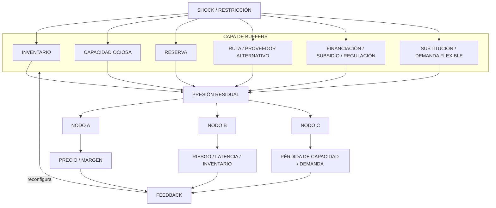

---

# 26. PREGUNTAS OPERATIVAS QUE EL PATRÓN OBLIGA A HACER

1. ¿Cuál es el shock?
2. ¿Cuál es el indicador que parece no reflejarlo?
3. ¿Qué buffers existen entre ambos?
4. ¿Quién controla esos buffers?
5. ¿Cuánta holgura les queda?
6. ¿Qué costo tiene utilizar cada buffer?
7. ¿Qué dependencias reciben la presión residual?
8. ¿Dónde hay baja sustituibilidad?
9. ¿Dónde hay poca capacidad ociosa?
10. ¿Dónde aparece el costo en forma no monetaria?
11. ¿Quién está pagando actualmente?
12. ¿Quién pagará cuando se agote el buffer?
13. ¿Qué nodo puede convertirse en cuello de botella?
14. ¿Qué actores pueden modificar esa trayectoria?
15. ¿Qué dato demostraría que la migración propuesta es incorrecta?

---

# 27. PROCEDENCIA COGNITIVA ESTRUCTURAL — RPCE

Este documento aplica `METH-RPCE-001`.

## RCE-CM-001 — Prompt central

**ORIGEN / PATH**

```text
00_gobierno/protocolos/
PROMPT_CENTRAL_INSTALACION_COGNICION_CENTRAL_EN_CHATGPT_v0_1_0.txt
```

**ESTRUCTURA EXTRAÍDA**

- separación `CC:// / PROJECT:// / OVERLAY:// / OUTPUT://`;
- autoridad humana;
- salida generada no equivale a persistencia;
- archivo interno no equivale a estructura cognitiva;
- ejemplo no equivale a definición.

**FUNCIÓN LOCAL**

Gobernar la promoción: el humano puede ordenar que `COST_MIGRATION` sea tratado como patrón, pero este `OUTPUT://` no modifica automáticamente el canon.

**ESTADO EPISTÉMICO**

`SOURCE_ASSERTION / GOVERNING_PROTOCOL`.

---

## RCE-CM-002 — Catálogo base de patrones

**ORIGEN / PATH**

```text
01_nucleo_cognitivo/teoria_tmc/
MOTOR_DE_RETROCONSTRUCCIÓN_Y_REINSTANCIACIÓN_ESTRUCTURAL/
05_acervo_estructural/
CATALOGO_PATRONES_DE_DISENO_COGNITIVO_REUTILIZABLES_v0_1_0.md
```

**ESTRUCTURA EXTRAÍDA**

- patrón identificado por intención, estructura, invariantes y dominio de variación;
- esquema genérico de instanciación;
- patrones `PAT-COG-044`, `046`, `057`, `059`, `060`.

**FUNCIÓN LOCAL**

Proporcionar la gramática de formalización del nuevo patrón y antecedentes estructurales.

**TRANSFORMACIÓN**

Se conserva la metodología de patrón; se añade una responsabilidad no formalizada: seguimiento de redistribución de carga/costo.

---

## RCE-CM-003 — Extensión v0.4.0

**ORIGEN / PATH**

```text
01_nucleo_cognitivo/teoria_tmc/
MOTOR_DE_RETROCONSTRUCCIÓN_Y_REINSTANCIACIÓN_ESTRUCTURAL/
05_acervo_estructural/
CATALOGO_DE_PATRONES_DE_DISENO_COGNITIVO_REUTILIZABLES_EXTENSION_v0_4_0.md
```

**ESTRUCTURA EXTRAÍDA**

- deduplicación por intención + invariantes + topología;
- `CASO_DE_DESCUBRIMIENTO ≠ PATRÓN`;
- `PAT-COG-128` topología y composición de capacidad;
- `PAT-COG-129` rutas funcionales y cortes;
- cobertura vigente recuperada `PAT-COG-126…130`.

**FUNCIÓN LOCAL**

Justificar la abstracción transdominio, la deduplicación y el ID propuesto `PAT-COG-131`.

**VALIDACIÓN PENDIENTE**

Comprobar ausencia de colisión con cualquier extensión posterior no presente en el snapshot recuperado antes de persistencia canónica.

---

## RCE-CM-004 — Método RPCE

**ORIGEN / PATH**

```text
02_metodos_y_herramientas/trazabilidad/
METODO_DE_REFERENCIACION_Y_PROCEDENCIA_COGNITIVA_ESTRUCTURAL_v0_1_0.md
```

**ESTRUCTURA EXTRAÍDA**

Referencia mínima fuerte:

`ORIGEN/PATH + ESTRUCTURA EXTRAÍDA + FUNCIÓN LOCAL + SEPARACIÓN FUENTE/INFERENCIA`.

**FUNCIÓN LOCAL**

Hacer reconstruible la genealogía de `PAT-COG-131`.

---

# 28. PROCEDENCIA DESDE LA DISCUSIÓN ACTUAL

## `INT-MRRE-PETROLEO-PRECIO-MULTIDIMENSIONAL-001`

**Aporte:** decisión de tratar el precio del petróleo como estado multidimensional, no función simple de oferta/demanda física.

## `INT-MRRE-PETROLEO-MULTIMERCADO-DERIVADOS-001`

**Aporte:** separar crudo, productos refinados, regiones y usuarios finales.

## `INT-MRRE-PETROLEO-SISTEMA-GLOBAL-REFINAMIENTO-001`

**Aporte:** reconstrucción del sistema petrolero como capas física, logística, refinación, inventarios, financiera, estatal, informacional, demanda y geopolítica.

## `INT-MRRE-PETROLEO-BUFFERS-DISTRIBUCION-COSTO-001`

**Aporte:** abrir los buffers como subgrafos independientes y preguntar quién absorbe el costo y dónde reaparece.

## `INT-MRRE-PETROLEO-BUFFERS-CUELLOS-DE-BOTELLA-INVERSION-001`

**Aporte:** conectar migración de costo con concentración de presión, cuellos de botella e hipótesis de movimientos importantes.

## `INT-MRRE-PETROLEO-CONEXIONES-ARQUITECTURAS-001`

**Aporte:** interfaz hacia análisis de inversiones posibles, dependencias, sustitución, activos estratégicos, escenarios y stress testing.

## `INT-MRRE-PETROLEO-GRAFO-ACTORES-ARISTAS-SISTEMA-001`

**Aporte:** requisito de conectar actores mediante capacidad → nodo → canal → efecto.

## `INT-MRRE-COST-MIGRATION-PROMOCION-PATRON-001`

**Aporte:** decisión humana actual de elevar `COST_MIGRATION` a patrón estructural general y usar el petróleo como ejemplo, no como identidad.

---

# 29. SEPARACIÓN FUENTE / INFERENCIA / DECISIÓN

| Elemento | Estado |
|---|---|
| Existencia de los catálogos `PAT-COG-001…130` recuperados | `SOURCE_ASSERTION` |
| Reglas de deduplicación de los catálogos | `SOURCE_ASSERTION` |
| `COST_MIGRATION` surgió en la investigación petrolera actual | `PROJECT_RECONSTRUCTION` |
| Promoción de `COST_MIGRATION` a patrón | `HUMAN_DECISION` |
| ID `PAT-COG-131` | `STRUCTURAL_INFERENCE / PROPOSED_ID` |
| Familia R | `DESIGN_INFERENCE` |
| Definición transdominio | `STRUCTURAL_GENERALIZATION` |
| Aplicabilidad a electricidad, gas, helio, galio, fertilizantes y semiconductores | `TRANSFER_HYPOTHESIS` |
| Cada instancia concreta | requiere `SOURCE_BINDINGS + VALIDATION` propios |

---

# 30. CRITERIO DE IDENTIDAD

Una futura aplicación sigue siendo `PAT-COG-131` si conserva:

```yaml
identity:
  perturbation_exists: true
  local_absorption_or_displacement_exists: true
  residual_pressure_exists: true
  transfer_path_exists: true
  cost_reappears_elsewhere: true
  local_indicator_is_incomplete: true
  causal_trace_required: true
```

Si sólo existe propagación sin absorción, desplazamiento o redistribución diferencial, puede tratarse mejor mediante `PAT-COG-057`.

Si sólo existe redundancia o rerouting sin seguimiento de costo, puede tratarse mejor mediante `PAT-COG-046` o `PAT-COG-129`.

Si sólo existe un cuello de botella sin migración de presión desde otro nodo, puede tratarse mediante `PAT-COG-128`.

---

# 31. CONCLUSIÓN

`PAT-COG-131 — COST_MIGRATION` formaliza una capacidad analítica simple pero profunda:

> **No preguntar únicamente cuánto aumentó el indicador central, sino dónde está pagando el sistema la perturbación.**

El patrón obliga a abrir el sistema, identificar buffers, seguir la presión residual, localizar sus aristas de transferencia, observar en qué dimensión reaparece el costo y detectar cuándo la capacidad de absorción se aproxima a saturación.

Su valor transdominio reside en que:

- un mercado puede pagar con precio;
- una empresa con margen;
- un Estado con reservas o subsidios;
- una red logística con tiempo y flota;
- una industria con capacidad;
- un consumidor con disponibilidad;
- una infraestructura con riesgo;
- el futuro con agotamiento de buffers presentes.

La estructura no depende del petróleo.

El petróleo es el caso que permitió verla con claridad.

---

# 32. ESTADO DE INTEGRACIÓN

```yaml
pattern:
  id: PAT-COG-131
  name: MIGRACION_DE_COSTO
  alias: COST_MIGRATION
  identity_status: HUMAN_PROMOTED_PATTERN
  canonical_status: NON_CANONICAL
  cross_cutting: true
  transdomain: true

integration:
  immediate:
    - MRRE_acervo_estructural
  candidate_catalog:
    - CATALOGO_DE_PATRONES_DE_DISENO_COGNITIVO_REUTILIZABLES_EXTENSION_v0_5_0
  collision_check_required: true
  human_review_required: true

discovery_case:
  domain: GLOBAL_OIL_SYSTEM_2026
  role: EXEMPLAR_NOT_IDENTITY

core_question:
  - "¿DÓNDE ESTÁ PAGANDO EL SISTEMA EL SHOCK?"
```

**FIN DEL DOCUMENTO**
