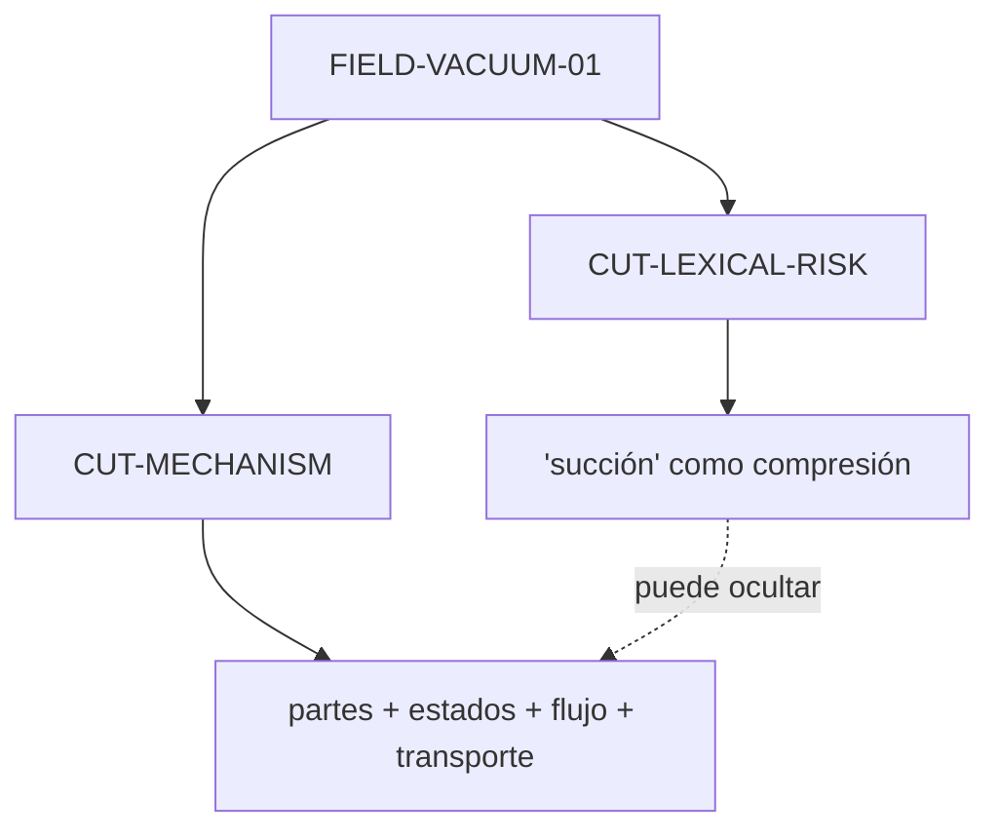
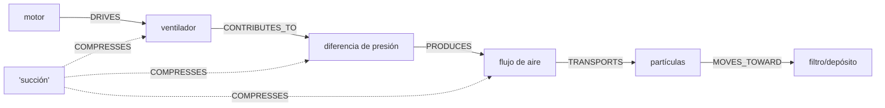

# Dossier operativo — mecanismo de una aspiradora

**ID:** `CASE-MRRE-VACUUM`  
**Run:** `RUN-MRRE-VACUUM-0.2.0`  
**Operaciones:** `RETROCONSTRUIR → VALIDAR`  
**Estatus:** `SYNTHETIC_REFERENCE_RUN / REPRODUCIBLE`

## A0–A1. Entrada original, propósito y alcance

El portador completo está embebido en [CASE-MRRE-VACUUM-INPUT](inputs/fixture.yaml):

> El motor hace girar un ventilador. El movimiento del ventilador contribuye a una diferencia de presión que produce flujo de aire. Ese flujo transporta partículas hacia el filtro y el depósito. Llamar succión a todo el proceso puede ocultar esas relaciones.

Propósito: reconstruir el mecanismo expresado, comprobar relaciones parte–función–efecto y determinar qué se pierde al comprimirlo en la palabra “succión”. No se pretende ofrecer una descripción física exhaustiva de toda aspiradora.

```yaml
scope:
  in: [motor, ventilador, diferencia_de_presion, flujo, particulas, filtro, deposito, termino_succion]
  out: [electricidad, geometria_interna, sellos, tipos_de_filtro, mediciones, eficiencia]
epistemic_ceiling: SOURCE_ASSERTION_PLUS_LOCAL_MECHANISM
expected_result: "chain funcional trazable con pruebas de remoción"
```

## A2. Campo y corte

`FIELD-VACUUM-01` contiene dos capas:

1. **mecánica/fluida:** componentes, estados y transporte;
2. **lingüística/metacognitiva:** la etiqueta “succión” comprime la chain.

El corte `CUT-VACUUM-MECHANISM` orienta a explicar cómo las partes contribuyen al transporte de partículas. El corte `CUT-VACUUM-LEXICAL-RISK` orienta a evaluar la pérdida reconstructiva de una etiqueta.



Se usa [MRRE-PROC-NAVIGATE](../../03_protocolos_operacionales/01_navegacion_estructural.md) y [MRRE-COMP-FIELD](../../04_runtime/componentes/01_field_builder.md).

## A3. Segmentación multiescala

| Unidad | Texto/locator | Nivel | Función |
|---|---|---|---|
| `U-VAC-DOC` | texto completo | manifestación | explicación compacta + advertencia |
| `U-VAC-S1` | oración 1 | oración | fuente de movimiento |
| `U-VAC-S1-C1` | “El motor” | entidad | componente impulsor |
| `U-VAC-S1-C2` | “hace girar un ventilador” | cláusula | transmisión de acción |
| `U-VAC-S2` | oración 2 | oración | mediación presión→flujo |
| `U-VAC-S2-C1` | movimiento del ventilador | estado/operación | input de mediación |
| `U-VAC-S2-C2` | contribuye a diferencia de presión | relación | causalidad débil explícita |
| `U-VAC-S2-C3` | produce flujo de aire | relación | transición de estado |
| `U-VAC-S3` | oración 3 | oración | transporte y destino |
| `U-VAC-S3-C1` | flujo transporta partículas | relación | mecanismo de movimiento |
| `U-VAC-S3-C2` | hacia filtro y depósito | destino | captura/almacenamiento |
| `U-VAC-S4` | oración 4 | metacognitiva | advertencia de compresión |

La distinción “contribuye a” frente a “produce” se conserva; normalizarlas ambas como `CAUSES` elevaría la fuerza causal sin soporte. El algoritmo es [MRRE-WORKBOOK § Algoritmo B](../../03_protocolos_operacionales/07_libro_de_trabajo_y_algoritmos.md#algoritmo-b-segmentación-multiescala).

## A4. Subgrafos de efecto

### `SG-VAC-DRIVE`

```yaml
focal: MOTOR
edges:
  - {source: MOTOR, relation: DRIVES, target: VENTILADOR, evidence: U-VAC-S1-C2, status: SOURCE_ASSERTION}
function: convertir la activación del motor en giro del ventilador
alternative: "el texto no describe la interfaz mecánica exacta"
```

### `SG-VAC-PRESSURE-FLOW`

```yaml
focal: GIRO_VENTILADOR
edges:
  - {source: GIRO_VENTILADOR, relation: CONTRIBUTES_TO, target: DIFERENCIA_PRESION, evidence: U-VAC-S2-C2}
  - {source: DIFERENCIA_PRESION, relation: PRODUCES, target: FLUJO_AIRE, evidence: U-VAC-S2-C3}
function: explicar la mediación que la palabra succión comprime
falsifier: "flujo presente sin la diferencia de presión dentro del alcance del modelo"
```

### `SG-VAC-TRANSPORT-CAPTURE`

```yaml
focal: FLUJO_AIRE
edges:
  - {source: FLUJO_AIRE, relation: TRANSPORTS, target: PARTICULAS, evidence: U-VAC-S3-C1}
  - {source: PARTICULAS, relation: MOVES_TOWARD, target: FILTRO_DEPOSITO, evidence: U-VAC-S3-C2}
function: conectar flujo con cambio de posición/captura
gap: "el texto no separa función de filtro y depósito"
```

### `SG-VAC-LEXICAL-COMPRESSION`

```yaml
focal: TERMINO_SUCCION
edges:
  - {source: TERMINO_SUCCION, relation: COMPRESSES, target: CH-VAC-MECHANISM, evidence: U-VAC-S4}
  - {source: COMPRESSION, relation: RISKS_HIDING, target: MEDIATING_RELATIONS, evidence: U-VAC-S4}
function: advertir pérdida reconstructiva
status: SOURCE_ASSERTION
```

Los objetos siguen [MRRE-SCHEMA-SUBGRAPH](../../02_contratos_y_schemas/reconstructed_subgraph.schema.yaml) y son producidos por [MRRE-COMP-SUBGRAPH](../../04_runtime/componentes/04_subgraph_reconstructor.md).

## A5. Chain principal y pruebas



`CH-VAC-MECHANISM-01` es un chain mixto `enabling + causal_local + transport`.

| Mutación | Pérdida esperada | Resultado | Dictamen |
|---|---|---|---|
| retirar `M→V` | origen del giro | chain queda sin entrada | `CRITICAL` |
| retirar `V→P` | mediación entre parte y estado | “succión” reaparece como salto | `CRITICAL` |
| invertir `P→F` | contradice dirección expresada | mecanismo incoherente | `FALSIFIED` |
| retirar `F→X` | no se explica transporte de polvo | función principal perdida | `CRITICAL` |
| retirar filtro/depósito | se conserva transporte, no captura/destino | `PARTIAL` | `SUPPORTING_CRITICAL_FOR_CAPTURE` |
| sustituir chain por `M→SUCCION→D` | desaparecen relaciones y condiciones | compresión no reconstructiva | `REJECTED` |

Las pruebas usan [MRRE-WORKBOOK § Algoritmo D](../../03_protocolos_operacionales/07_libro_de_trabajo_y_algoritmos.md#algoritmo-d-detección-y-prueba-de-chains).

## A6. Arquitectura candidata y alternativa

### `CA-VAC-01 — CONVERSIÓN_DE_ACTIVACIÓN_EN_TRANSPORTE`

```text
FUENTE_DE_MOVIMIENTO
  → ACTUADOR_DE_FLUJO
    → GRADIENTE/CONDICIÓN_DE_FLUJO
      → MEDIO_EN_MOVIMIENTO
        → OBJETO_TRANSPORTADO
          → DESTINO_DE_CAPTURA
```

Interfaz adicional: `ETIQUETA_COMPACTA` puede nombrar el efecto global, pero no reemplaza la arquitectura cuando el propósito es explicar.

### `CA-VAC-RIVAL-01 — FUERZA_DE_SUCCIÓN_DIRECTA`

Modela “succión” como una fuerza autónoma entre motor y partículas. Es léxicamente plausible, pero el portador no la soporta y pierde ventilador, diferencia de presión y flujo. Queda `FALSIFIED_BY_SOURCE_STRUCTURE`.

## A7. Esqueleto

| Rol | Función | Restricción |
|---|---|---|
| `ENERGY_TO_MOTION` | producir movimiento | no confundir con efecto final |
| `FLOW_ACTUATOR` | actuar sobre el medio | conectado a condición/gradiente |
| `GRADIENT_OR_DRIVER` | habilitar flujo | su naturaleza física puede variar |
| `TRANSPORT_MEDIUM` | portar objetos | debe conectarse con objeto |
| `TRANSPORTED_OBJECT` | entidad desplazada | distinta del medio |
| `CAPTURE_DESTINATION` | retener/recibir | puede descomponerse en filtro y depósito |
| `LEXICAL_COMPRESSION` | etiqueta global opcional | no sustituye edges en modo explicación |

Invariante principal: existe una ruta mediada entre fuente de movimiento y transporte; retirar toda mediación invalida una explicación de mecanismo.

## A8–A9. Comparación descendente/ascendente

**Descendente:** motor y ventilador se evalúan por su contribución al objetivo global de transportar/capturar partículas.  
**Ascendente:** cada transición debe componer un camino continuo hacia ese objetivo.

| Componente | Si falla/se retira | Predicción local |
|---|---|---|
| motor | no hay giro aportado por esta ruta | chain bloqueado al inicio |
| ventilador | no se sostiene la mediación a presión | fuente desconectada |
| diferencia de presión | flujo queda sin mecanismo expresado | salto causal |
| flujo | partículas no tienen medio de transporte | función perdida |
| filtro/depósito | puede haber movimiento sin captura | salida parcial |

Estas predicciones son del modelo textual, no ensayos físicos. Validarlas empíricamente requeriría una fuente técnica adicional autorizada.

## A10. Trazabilidad y dictamen


| Control | Resultado |
|---|---|
| original embebido | `PASS` |
| spans reversibles | `PASS` |
| fuerza causal preservada | `PASS` |
| chain con edges/evidencia | `PASS` |
| prueba de remoción | `PASS` |
| alternativa léxica evaluada | `PASS` |
| física exhaustiva | `NOT_CLAIMED` |
| generalización a cualquier aspiradora | `NOT_CLAIMED` |

**Dictamen:** `COMPLETED_REFERENCE_RUN / LOCAL_TEXTUAL_MECHANISM`. El run estructurado está en [RUN-MRRE-VACUUM](runs/run_v0_2_0.yaml). El caso muestra cómo [MRRE-PROC-RETRO](../../03_protocolos_operacionales/02_retroconstruccion.md) produce una explicación operable en lugar de una lista de partes o una etiqueta compacta.
