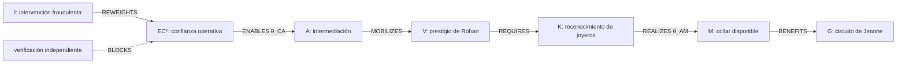
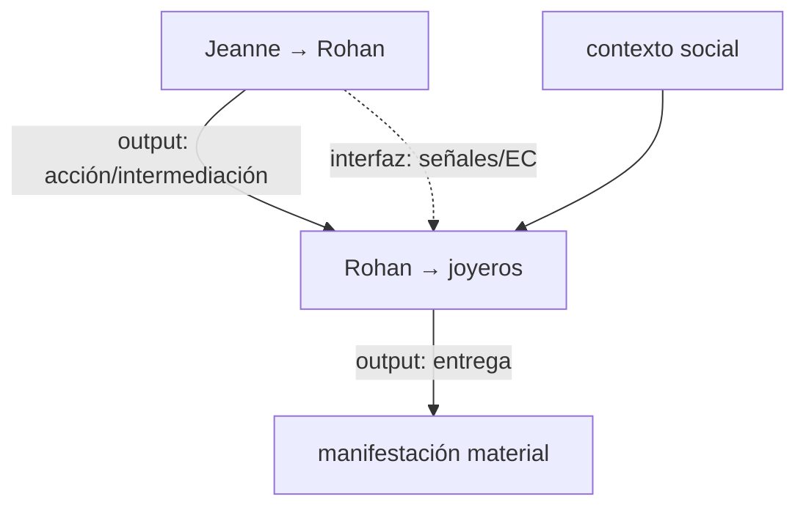

# Dossier operativo — fraude del collar

**ID:** `CASE-MRRE-COLLAR`  
**Run:** `RUN-MRRE-COLLAR-0.2.0`  
**Operaciones:** `RETROCONSTRUIR → COMPARAR → REINSTANCIAR → VALIDAR`  
**Estatus:** `REFERENCE_RUN / MODEL_DERIVED / HISTORICAL_FACTS_OUT_OF_SCOPE`

## A0. Propósito y fuentes originales

El caso reconstruye el mecanismo formalizado por MTC y su adaptador: una intervención modifica una configuración cognitiva, habilita acción, moviliza una capacidad social dentro de un contexto y produce una manifestación material. No reconstruye la historiografía completa ni afirma estados mentales reales.

Fuentes navegables:

- [SRC-MTC-COLLAR](../../../MTC_MAQUINA_DE_TRANSDUCCION_COGNITIVA/30_especializaciones/30_fraude_collar.md), `ADOPTADO`, grafo, mapeo y restricciones FRAUD.
- [CASE-SRC-COLLAR-MTC-OUTPUT](../../../MTC_MAQUINA_DE_TRANSDUCCION_COGNITIVA/adaptadores/ADAPTADOR_MTC_A_CONSTRUCCION_CONCEPTUAL_v0_1_0/05_fixture/01_fraude_collar_mtc_output.md), `EJEMPLO`, instancia y claims.
- [CASE-SRC-COLLAR-CONCEPT](../../../MTC_MAQUINA_DE_TRANSDUCCION_COGNITIVA/adaptadores/ADAPTADOR_MTC_A_CONSTRUCCION_CONCEPTUAL_v0_1_0/05_fixture/02_fraude_collar_construccion_conceptual.md), `CONTRASTADO`, ideas y relaciones.
- [CASE-SRC-COLLAR-TRACE](../../../MTC_MAQUINA_DE_TRANSDUCCION_COGNITIVA/adaptadores/ADAPTADOR_MTC_A_CONSTRUCCION_CONCEPTUAL_v0_1_0/05_fixture/03_fraude_collar_trazabilidad.md), `ADOPTADO`, derivaciones.
- [CASE-SRC-COLLAR-VALIDATION](../../../MTC_MAQUINA_DE_TRANSDUCCION_COGNITIVA/adaptadores/ADAPTADOR_MTC_A_CONSTRUCCION_CONCEPTUAL_v0_1_0/05_fixture/04_fraude_collar_validacion.md), `CONTRASTADO`, gates y límites.

MRRE conserva los tipos de [SRC-MTC-ONTOLOGY](../../../MTC_MAQUINA_DE_TRANSDUCCION_COGNITIVA/00_core/01_ontologia_y_tipos.md) y la separación `V ≠ K ≠ M` de [SRC-MTC-MANIFESTATION](../../../MTC_MAQUINA_DE_TRANSDUCCION_COGNITIVA/10_mecanismo/14_capacidad_contexto_manifestacion.md); no renombra estos elementos como invenciones MRRE.

## A1. Manifestation record

El portador primario es la formalización MTC, no una narración histórica. Locators:

| Locator | Fuente | Contenido |
|---|---|---|
| `MTC-COL-§2` | especialización, núcleo aceptado | grafo Jeanne–Rohan–joyeros–collar |
| `MTC-COL-§3` | mapeo MTC | `O,R,Q,I,EC0,EC*,A,V,K,M,G` |
| `MTC-COL-§4` | restricciones | invariantes de fraude |
| `MTC-COL-§5-6` | transformaciones/transducciones | `τ1…τ5`, `θ_IC`, `θ_CA`, `θ_AM` |
| `MTC-COL-§7` | valor/manifestación | `V = prestigio`, `M = collar disponible` |
| `MTC-COL-§8` | prueba del título | variación de manifestación |
| `FIX-OUT claims` | output MTC | ocho claims tipados |
| `FIX-TRACE derivaciones` | trace del adaptador | source paths y obligaciones |

El fixture [CASE-MRRE-COLLAR-INPUT](inputs/fixture.yaml) enumera estas fuentes. Cualquier detalle fuera de ellas se registra `UNRESOLVED_HISTORICAL_GAP`.

## A2. Campo y corte

```yaml
field_id: FIELD-COLLAR-MTC-01
identity_statement: "instancia formal MTC del mecanismo fraudulento del collar"
in_scope:
  - intervención y señales fabricadas
  - trayectoria del estado cognitivo modelado
  - acción de intermediación
  - capacidad social movilizada
  - contexto de reconocimiento
  - entrega y disponibilidad material
out_of_scope:
  - verdad histórica fina
  - diagnóstico psicológico
  - consecuencias judiciales posteriores
layers:
  - actor_objective
  - intervention
  - cognitive_configuration
  - action
  - capability
  - context_realization
  - manifestation_feedback
cut:
  orientation: "explicar mediaciones entre intervención y manifestación"
  prominence: [I, EC, A, V, K, M]
  exclusions: [ornamentación histórica no necesaria para el mecanismo]
```

La navegación usa [MRRE-PROC-NAVIGATE](../../03_protocolos_operacionales/01_navegacion_estructural.md). El corte no reemplaza el campo: sólo selecciona la chain de conversión para el propósito.

## A3. Segmentación estructural

| Unidad | Tipo | Contenido funcional | Fuente |
|---|---|---|---|
| `U-COL-01` | operador/objetivo | Jeanne busca control material | `MTC-COL-§3` |
| `U-COL-02` | receptor/estado deseado | Rohan desea favor/reconciliación | `MTC-COL-§3` |
| `U-COL-03` | intervención | cartas, intermediación y realidad fabricada | `MTC-COL-§3-4` |
| `U-COL-04` | transformación | confianza aumenta; objeción de fraude disminuye | `MTC-COL-§5` |
| `U-COL-05` | transducción cognición→acción | disposición se convierte en intermediación | `MTC-COL-§6` |
| `U-COL-06` | capacidad | prestigio/credibilidad preexistentes | `MTC-COL-§7` |
| `U-COL-07` | contexto | joyeros reconocen autoridad/credibilidad | `MTC-COL-§9` |
| `U-COL-08` | manifestación | collar entra al circuito de Jeanne | `MTC-COL-§7` |
| `U-COL-09` | control | verificación independiente amenaza la máquina | `MTC-COL-§11` |

La segmentación es conceptual porque el portador ya es una formalización. Se conserva el locator de cada unidad y la ontología fuente; [MRRE-COMP-SEGMENTER](../../04_runtime/componentes/03_multiscale_segmenter.md) no vuelve a presentar los tipos MTC como observaciones históricas.

## A4. Subgrafos

| ID | Focal | Vecindad y edges | Función |
|---|---|---|---|
| `SG-COL-I-EC` | intervención `I` | `I REWEIGHTS EC`; `W~ CONTRADICTS W*` | producir configuración operativa creíble |
| `SG-COL-EC-A` | estado `EC*` | `EC* ENABLES A`; `EC ≠ A` | interfaz cognición→acción |
| `SG-COL-A-V` | acción `A` | `A MOBILIZES V`; `V PREEXISTS A` | activar capacidad social |
| `SG-COL-V-K` | capacidad `V` | `K RECOGNIZES V`; `V REQUIRES K` | volver eficaz el prestigio |
| `SG-COL-K-M` | contexto `K` | `JOYEROS ACT`; `ACTION REALIZES M` | producir transferencia material |
| `SG-COL-VERIFY` | verificación | `VERIFY ATTACKS W~`; `VERIFY BLOCKS CHAIN` | control/falsación |

Cada subgrafo conserva `MODEL_DERIVED` o `SOURCE_SYNTHESIS`, según los claims del fixture. La forma sigue [MRRE-WORKBOOK § Algoritmo C](../../03_protocolos_operacionales/07_libro_de_trabajo_y_algoritmos.md#algoritmo-c-reconstrucción-de-subgrafo).

## A5. Chains y red

### Chain principal `CH-COL-TRANSDUCTION-01`



### Cascada de máquinas



| Prueba de remoción | Resultado | Clasificación |
|---|---|---|
| retirar `I→EC` | no se explica cambio de disposición | `CRITICAL` |
| colapsar `EC=A` | desaparece interfaz cognición/acción | `INVALID_NON_COLLAPSE` |
| retirar `A→V` | el prestigio no se moviliza | `CRITICAL` |
| retirar `K` | prestigio se trata como fuerza mágica | `CRITICAL` |
| sustituir `V` por collar | confunde capacidad con manifestación | `FALSIFIED` |
| introducir verificación antes de `EC*` | la chain puede bloquearse | `PREDICTION_SUPPORTED_BY_MODEL` |

La chain principal coincide con la obligación `I_to_EC_to_A_to_V_to_K_to_M` en [CASE-SRC-COLLAR-MTC-OUTPUT](../../../MTC_MAQUINA_DE_TRANSDUCCION_COGNITIVA/adaptadores/ADAPTADOR_MTC_A_CONSTRUCCION_CONCEPTUAL_v0_1_0/05_fixture/01_fraude_collar_mtc_output.md), pero MRRE añade pruebas explícitas de remoción (`ADAPTADO`).

## A6. Arquitecturas candidatas y rival

### `CA-COL-01 — CONVERSIÓN_MEDIADA_DE_CAPACIDAD`

Integra seis subgrafos en cascada con gate de verificación. Explica por qué una intervención informacional no produce directamente un resultado material.

### `CA-COL-RIVAL-01 — CAUSACIÓN_DIRECTA_I→M`

Predice que las señales fraudulentas bastan para entregar el collar. Falla porque omite estado, acción, capacidad y reconocimiento contextual. Se conserva como rival falsificado para mostrar qué aporta la candidata principal.

### `CA-COL-RIVAL-02 — COLLAR_COMO_VALOR_V`

Falla el no-colapso: el collar existe antes del mecanismo y no es una capacidad que Rohan moviliza. La evidencia y validación proceden de [CASE-SRC-COLLAR-VALIDATION](../../../MTC_MAQUINA_DE_TRANSDUCCION_COGNITIVA/adaptadores/ADAPTADOR_MTC_A_CONSTRUCCION_CONCEPTUAL_v0_1_0/05_fixture/04_fraude_collar_validacion.md).

## A7. Esqueleto estructural transferible

```text
OPERADOR con OBJETIVO no revelado
  → INTERVENCIÓN altera CONFIGURACIÓN de RECEPTOR
    → CONFIGURACIÓN habilita ACCIÓN
      → ACCIÓN moviliza CAPACIDAD preexistente
        → CONTEXTO/TERCEROS reconocen CAPACIDAD
          → REALIZACIÓN produce MANIFESTACIÓN
            → MANIFESTACIÓN beneficia al circuito del OPERADOR

CONTROL: VERIFICACIÓN independiente puede bloquear antes de la manifestación.
```

Invariantes:

1. `INTERVENTION ≠ MANIFESTATION`;
2. `COGNITIVE_STATE ≠ ACTION`;
3. `CAPABILITY ≠ MANIFESTATION`;
4. capacidad requiere contexto de reconocimiento;
5. al menos una interfaz realiza el paso cognición→mundo;
6. la verificación amenaza la arquitectura fraudulenta;
7. materiales concretos —cartas, collar, título— pertenecen al dominio de variación.

## A8. Reinstanciación controlada: privilegio ficticio

La prueba de variación está sugerida en [SRC-MTC-COLLAR](../../../MTC_MAQUINA_DE_TRANSDUCCION_COGNITIVA/30_especializaciones/30_fraude_collar.md), §8. Se instancia en un escenario ficticio:

| Rol | Binding ficticio | Prueba de equivalencia |
|---|---|---|
| operador | intermediaria `O` | objetivo oculto `PASS` |
| receptor | dignatario `R` | desea reconciliación `PASS` |
| intervención | correspondencia simulada | repondera creencias `PASS_MODEL` |
| acción | solicitud formal de `R` | moviliza su influencia `PASS` |
| capacidad | prestigio/influencia de `R` | preexiste y requiere contexto `PASS` |
| contexto | corte ficticia con autoridad | reconoce influencia `PASS` |
| manifestación | privilegio transferible | cambio externo distinto de capacidad `PASS` |
| verificación | confirmación independiente | bloquearía señales falsas `PASS_PREDICTION` |

No se genera una narración persuasiva ni instrucciones de fraude; sólo se prueba la equivalencia estructural abstracta. El gate ético y de autoridad mantiene la salida en `MODEL_TEST_ONLY`.

## A9. Diff y reingreso

| Elemento | Estado |
|---|---|
| chain `I→EC→A→V→K→M` | `PRESERVED` |
| capacidad social | `PRESERVED` |
| contexto de reconocimiento | `PRESERVED` |
| objeto collar | `MODIFIED_ALLOWED → privilegio` |
| señales históricas concretas | `NOT_TRANSFERRED` |
| objetivo fraudulento | `PRESERVED_AS_MODEL_CONDITION` |
| comprobación histórica | `NOT_APPLICABLE` |

El reingreso recupera la misma cascada y vuelve a separar capacidad/manifestación. Si el “privilegio” se tratara como capacidad del receptor, el diff cambiaría a `FORBIDDEN_INVENTION/ONTOLOGICAL_COLLAPSE`.

## A10. Proceso, trazabilidad y dictamen

| Artefacto | Proceso MRRE | Componente | Evidencia fuente |
|---|---|---|---|
| campo/corte | [MRRE-PROC-NAVIGATE](../../03_protocolos_operacionales/01_navegacion_estructural.md) | [FIELD-BUILDER](../../04_runtime/componentes/01_field_builder.md) | especialización MTC |
| subgrafos | [MRRE-PROC-RETRO](../../03_protocolos_operacionales/02_retroconstruccion.md) | [SUBGRAPH-RECONSTRUCTOR](../../04_runtime/componentes/04_subgraph_reconstructor.md) | claims y trace del adaptador |
| chains | [MRRE-WORKBOOK-D](../../03_protocolos_operacionales/07_libro_de_trabajo_y_algoritmos.md#algoritmo-d-detección-y-prueba-de-chains) | [SUBGRAPH-RECONSTRUCTOR](../../04_runtime/componentes/04_subgraph_reconstructor.md) | obligación causal/funcional |
| esqueleto | [MRRE-WORKBOOK-E](../../03_protocolos_operacionales/07_libro_de_trabajo_y_algoritmos.md#algoritmo-e-arquitectura-y-esqueleto) | [SKELETON-INFERER](../../04_runtime/componentes/05_skeleton_inferer.md) | invariantes FRAUD/MTC |
| binding/diff | [MRRE-PROC-REINSTATE](../../03_protocolos_operacionales/04_reinstanciacion.md) | [REINSTANTIATION-ENGINE](../../04_runtime/componentes/07_reinstantiation_engine.md) | prueba del título |
| validación | [MRRE-VAL-PLAN](../../08_validacion_y_pruebas/01_plan_de_verificacion_y_validacion.md) | [VALIDATION-ORCHESTRATOR](../../04_runtime/componentes/10_validation_orchestrator.md) | fixture de validación |

**Dictamen:** `COMPLETED_REFERENCE_RUN / MODEL_SCOPE`. La arquitectura mediada está trazada y la variante ficticia conserva invariantes. Quedan fuera la verdad histórica exhaustiva, los estados mentales reales y cualquier uso operativo fraudulento. Véase el registro [RUN-MRRE-COLLAR](runs/run_v0_2_0.yaml).
