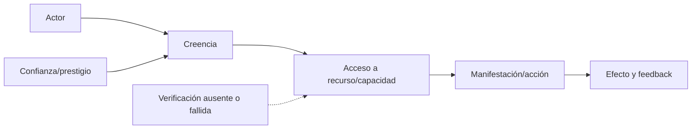

# Caso del collar

**Fixture:** `FX-COLLAR-01` · **Estado:** listo por referencias locales.

Prueba actores, creencias, confianza, recursos/capacidad, verificación, fases, manifestación y adaptación MTC. Las fuentes son `SRC-MTC-COLLAR` y los cuatro archivos de `SRC-MTC-ADAPTER-FIXTURES`; no se reescribe la historia como fuente nueva.

Subgrafos requeridos: `ACTOR`, `BELIEF`, `RESOURCE_CAPACITY`, `TRUST`, `VERIFICATION`, `TEMPORAL` y `MANIFESTATION`. La reinstanciación debe conservar el mecanismo de movilización y engaño, no términos históricos.

## Ejecución completa

[CASE-MRRE-COLLAR](DOSSIER_OPERATIVO.md) reconstruye la fuente por locators, prueba la chain `I→EC→A→V→K→M`, documenta alternativas y realiza una reinstanciación abstracta controlada.

Recorrido: [fixture](inputs/fixture.yaml) → [dossier](DOSSIER_OPERATIVO.md) → [expected result](expected_results/expected.yaml) → [run 0.2.0](runs/run_v0_2_0.yaml) → [lecciones](lessons.md). La ontología procede de [SRC-MTC-COLLAR](../../../MTC_MAQUINA_DE_TRANSDUCCION_COGNITIVA/30_especializaciones/30_fraude_collar.md) y la reconstrucción de [MRRE-PROC-RETRO](../../03_protocolos_operacionales/02_retroconstruccion.md).
