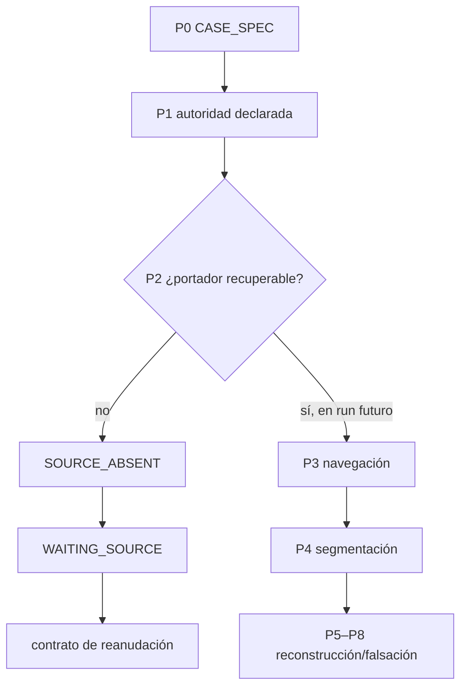

# Dossier operativo — Puente del Valle: bloqueo y reanudación

**ID:** `CASE-MRRE-BRIDGE`  
**Run:** `RUN-MRRE-BRIDGE-0.2.0`  
**Operación solicitada:** `RETROCONSTRUIR`  
**Estado correcto:** `WAITING_SOURCE / BLOCKED_SOURCE_PATH_PENDING`

## A0. Propósito

El caso futuro debe analizar `analisis-de-estructuras.pdf` para distinguir relaciones físicas observadas —cargas, restricciones, transmisión, redundancia, falla y observabilidad— de una posible transferencia funcional a una arquitectura cognitiva. El objetivo no autoriza inventar el contenido del PDF ni afirmar que toda estructura material es una arquitectura cognitiva.

El fixture [CASE-MRRE-BRIDGE-INPUT](inputs/fixture.yaml) conserva la etiqueta de la fuente y `path: null`. No existe una referencia relativa resoluble, por lo que [MRRE-REF-NORM-01](../../00_gobierno/06_norma_de_referencias_y_citacion.md) exige `PATH_PENDING_CONFIRMATION`.

## A1. Resultado de ingestión

```yaml
manifestation_record:
  artifact_id: ART-MAN-BRIDGE-PENDING-01
  label: analisis-de-estructuras.pdf
  carrier:
    mode: relative_reference
    relative_path: null
  modality: pdf
  integrity_status: MISSING
  source_authority: ATTACHED_SOURCE
  failure:
    id: FAIL-MRRE-SOURCE-ABSENT-01
    type: SOURCE_ABSENT
    severity: blocking
    recoverable: true
    resume_when:
      - relative path confirmed
      - file readable
      - hash recorded
      - analysis scope authorized
```

## Por qué no existen A2–A9



Sin el portador no pueden determinarse frontera, unidades, edges, chains, cargas ni fallos. Producirlos sería `FORBIDDEN_INVENTION`. El comportamiento implementa [MRRE-PROTOCOL-GENERAL](../../01_kernel_estable/07_protocolo_general_mrre.md), [MRRE-COMP-FIELD](../../04_runtime/componentes/01_field_builder.md) y [MRRE-FAILURES](../../04_runtime/04_manejo_de_fallas_y_recuperacion.md).

## Contrato de reanudación

Cuando el usuario confirme la ruta:

1. sustituir `PATH_PENDING_CONFIRMATION` por una cita `[CASE-SRC-BRIDGE](...)` relativa confirmada y registrar hash;
2. comprobar si el PDF contiene texto, figuras, tablas o capas escaneadas;
3. definir páginas/secciones autorizadas y pregunta de análisis;
4. crear locators por página, figura, elemento y span;
5. ejecutar navegación sin consultar analogías cognitivas;
6. reconstruir primero el sistema material en sus propios tipos;
7. detectar chains de carga, restricción, deformación, falla y observación sólo si aparecen en fuente;
8. construir esqueleto funcional material;
9. recién entonces proponer mappings con elementos cognitivos;
10. registrar rupturas de analogía y relaciones no transferibles;
11. validar con contrafactuales y revisión técnica/humana.

## Artefactos esperados después de la fuente

| Artefacto | Contenido requerido | Gate |
|---|---|---|
| `FIELD-BRIDGE-MATERIAL` | componentes, fronteras, cargas, apoyos, contexto | fuente recuperable |
| `SEG-BRIDGE-PDF` | páginas, figuras, spans y jerarquía | OCR/lectura verificados |
| `SG-BRIDGE-*` | relaciones físicas con locators | no inferir más allá del documento |
| `CH-BRIDGE-LOAD-*` | rutas de transmisión/redistribución | edges y condiciones explícitos |
| `CA-BRIDGE-MATERIAL-*` | topologías materiales candidatas | revisión de alternativas |
| `SK-BRIDGE-FUNCTIONAL-*` | roles sin vocabulario concreto | prueba de remoción |
| `MAP-BRIDGE-COGNITIVE-*` | equivalencias acotadas y rupturas | `HG-BINDING` |
| `DIFF-BRIDGE-*` | preservaciones/pérdidas | validación humana/técnica |

## Matriz de analogía que deberá completarse

Esta tabla es un contrato vacío, no un resultado:

| Función material observada | Evidencia/locator | Candidato cognitivo | Relación conservada | Ruptura de metáfora | Estatus |
|---|---|---|---|---|---|
| `PENDING` | `PENDING` | `PENDING` | `PENDING` | `PENDING` | `UNBOUND_GAP` |

No se aceptará “carga = información” o “viga = idea” sin contrato funcional, topológico y contextual, siguiendo [MRRE-PROC-COMPARE](../../03_protocolos_operacionales/05_comparacion_y_transferencia.md).

## A10. Validación del bloqueo

| Prueba | Resultado |
|---|---|
| ruta relativa resoluble | `FAIL_EXPECTED` |
| fuente inventada | `PASS: no` |
| afirmaciones físicas emitidas | `PASS: none` |
| fallo tipado | `PASS` |
| recuperabilidad | `PASS` |
| condición de reanudación | `PASS` |
| artefactos futuros especificados | `PASS` |

**Dictamen:** `WAITING_SOURCE`, no `FAILED_TERMINAL`. La ejecución demuestra que la operabilidad incluye saber detenerse y dejar una continuación precisa. El estado estructurado está en [RUN-MRRE-BRIDGE](runs/run_v0_2_0.yaml); no debe cambiar a `RUNNING` hasta que una cita relativa verificada sustituya `path: null`.
