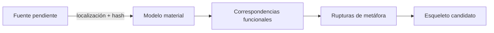

# Caso Puente del Valle

**Fixture:** `FX-BRIDGE-01` · **Estado:** `BLOCKED_SOURCE_PATH_PENDING`.

Materializa el caso y su comportamiento de bloqueo sin inventar la ruta de `analisis-de-estructuras.pdf`. Cuando la fuente se localice, probará transferencia entre ingeniería material y arquitectura cognitiva.

## Ejecución completa

[CASE-MRRE-BRIDGE](DOSSIER_OPERATIVO.md) registra el fallo, explica por qué no se construyen grafos sin fuente y deja el contrato exacto de reanudación.

Recorrido: [fixture](inputs/fixture.yaml) → [dossier](DOSSIER_OPERATIVO.md) → [expected result](expected_results/expected.yaml) → [run 0.2.0](runs/run_v0_2_0.yaml) → [lecciones](lessons.md). El bloqueo usa [MRRE-FAILURES](../../04_runtime/04_manejo_de_fallas_y_recuperacion.md).
