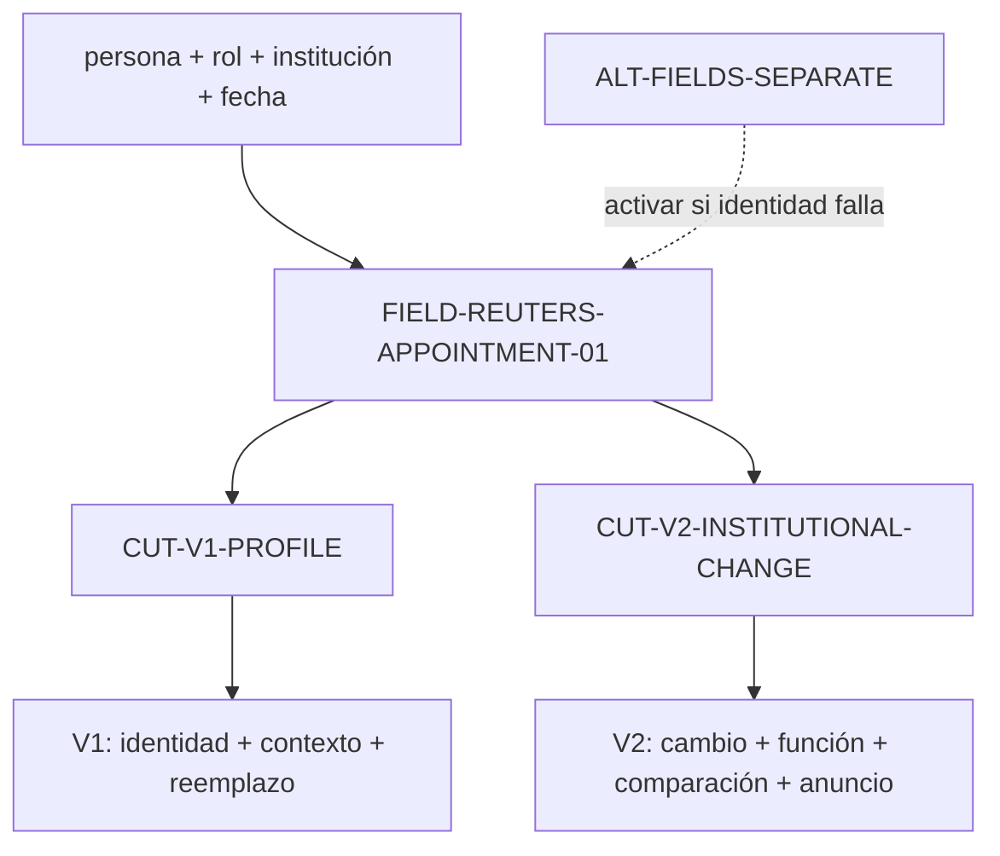
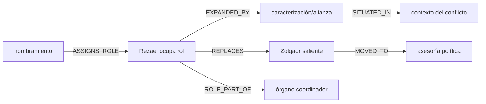
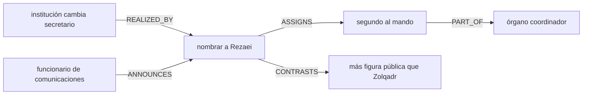
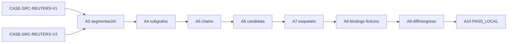

# Dossier operativo — Reuters: campo, cortes y reinstanciación

**ID:** `CASE-MRRE-REUTERS`  
**Run de referencia:** `RUN-MRRE-REUTERS-0.2.0`  
**Operaciones:** `RETROCONSTRUIR → COMPARAR → REINSTANCIAR → VALIDAR`  
**Estatus:** `REFERENCE_RUN / STRUCTURAL_INFERENCE / NON_CANONICAL`

## A0. Propósito, alcance y fuentes

El caso determina si dos notas locales sobre el nombramiento de una misma persona pueden modelarse como cortes distintos de un campo común; reconstruye las chains de sus aperturas y prueba una reinstanciación ficticia. No valida los hechos noticiosos ni infiere intención editorial.

Fuentes originales recuperables:

- [CASE-SRC-REUTERS-V1](../../../../../03_aplicaciones/creacion_de_contenido/referencias_de_estilo/interpretacion_de_eventos/ejemplos_de_noticias/noticia-cambios_en_mandos_militares/unidad_de_analisis_1/noticiero-reuters-v1.md), `EJEMPLO`, alcance `título + lead + párrafo de reemplazo`.
- [CASE-SRC-REUTERS-V2](../../../../../03_aplicaciones/creacion_de_contenido/referencias_de_estilo/interpretacion_de_eventos/ejemplos_de_noticias/noticia-cambios_en_mandos_militares/unidad_de_analisis_1/noticiero-reuters-v2.md), `EJEMPLO`, alcance `título + dos primeros párrafos`.
- [SRC-MRRE-EXAMPLE](../../90_historial/antecedentes/ejemplo.md), `ADAPTADO`, prioridad de extraer y repoblar el esqueleto.

El resto de cada nota queda fuera del corte de este run. Su existencia se registra como región disponible no analizada; no se afirma que el esqueleto describa el documento completo.

## A1. Manifestaciones y locators

El texto original no se duplica: se conserva por referencia relativa. Para reproducir el análisis se usan estos locators:

| Locator | Fuente | Contenido funcional localizado |
|---|---|---|
| `V1-TITLE` | V1, título | identificación de persona + caracterización + nuevo rol |
| `V1-P1-S1` | V1, primer enunciado | nombramiento de Rezaei + rol + caracterización + alianza + contexto bélico |
| `V1-P2-S1` | V1, segundo párrafo | reemplazo de Zolqadr + función institucional + presidencia del órgano |
| `V1-P2-S2` | V1, segundo párrafo | nuevo rol de Zolqadr |
| `V2-TITLE` | V2, título | nombramiento + rol + institución nacional |
| `V2-P1-S1` | V2, primer párrafo | cambio de secretario + nombramiento + antecedente profesional + función del órgano |
| `V2-P2-S1` | V2, segundo párrafo | comparación Rezaei/Zolqadr |
| `V2-P2-S2` | V2, segundo párrafo | procedencia del anuncio |

El fixture [CASE-MRRE-REUTERS-INPUT](inputs/fixture.yaml) conserva una simplificación para tests unitarios, pero este dossier se apoya en los portadores originales. La distinción evita que el fixture sustituya indebidamente la fuente.

## A2. Campo estructural y cortes

### Campo candidato `FIELD-REUTERS-APPOINTMENT-01`

```yaml
identity_statement: >-
  V1 y V2 refieren al mismo nombramiento si coinciden persona, rol,
  institución y fecha; la coincidencia léxica por sí sola no basta.
in_scope:
  - actor nombrado
  - rol entrante y saliente
  - institución y función
  - autoridad/anuncio
  - caracterización comparativa
  - contexto seleccionado por cada lead
out_of_scope:
  - verdad externa de las afirmaciones
  - intención psicológica de autores/editores
  - cuerpo completo no segmentado en este run
conflicts:
  - ninguno demostrado dentro del alcance
missing_regions:
  - criterio editorial real
  - evidencia receptoral
epistemic_status: STRUCTURAL_INFERENCE
```

### Dos cortes, no dos campos por defecto

| Propiedad | `CUT-V1-PROFILE` | `CUT-V2-INSTITUTIONAL-CHANGE` |
|---|---|---|
| función local | introducir al nombrado mediante perfil político/biográfico | informar el cambio institucional de forma compacta |
| prominencia | identidad, alianza, contexto bélico | cambio, rol, función del órgano, comparación |
| antecedente del nombrado | caracterización política | antecedente como comandante |
| saliente | reemplazado + nuevo rol | comparado con entrante |
| procedencia del anuncio | fuera del span focal | explícita |
| omisión relevante | anunciante en el lead focal | perfil extenso en el lead focal |



La construcción sigue [MRRE-PROC-NAVIGATE](../../03_protocolos_operacionales/01_navegacion_estructural.md) y el schema [MRRE-SCHEMA-FIELD](../../02_contratos_y_schemas/structural_field_and_cut.schema.yaml).

## A3. Segmentación multiescala

| Unidad | Span | Tipo | Rol local | Padre |
|---|---|---|---|---|
| `U-V1-01` | `V1-P1-S1` | evento de nombramiento | evento focal | `U-V1-LEAD` |
| `U-V1-02` | cláusula “promoting…” | identidad/caracterización | expansión del actor | `U-V1-01` |
| `U-V1-03` | cláusula de contexto temporal | contexto | sitúa el evento | `U-V1-01` |
| `U-V1-04` | `V1-P2-S1` | reemplazo + función | explica el cambio | `U-V1-LEAD` |
| `U-V1-05` | `V1-P2-S2` | destino del saliente | cierre de transición | `U-V1-LEAD` |
| `U-V2-01` | cláusula “has changed…” | cambio institucional | evento focal | `U-V2-LEAD` |
| `U-V2-02` | cláusula “appointing…” | nombramiento | realización del cambio | `U-V2-01` |
| `U-V2-03` | cláusula “body that…” | función institucional | contextualiza rol | `U-V2-02` |
| `U-V2-04` | `V2-P2-S1` | comparación | identidad relativa | `U-V2-LEAD` |
| `U-V2-05` | `V2-P2-S2` | atribución | procedencia | `U-V2-LEAD` |

Las unidades son reversibles a sus locators y preservan subordinación; no se segmentan sólo por oraciones. El procedimiento es [MRRE-WORKBOOK § Algoritmo B](../../03_protocolos_operacionales/07_libro_de_trabajo_y_algoritmos.md#algoritmo-b-segmentación-multiescala), ejecutado por [MRRE-COMP-SEGMENTER](../../04_runtime/componentes/03_multiscale_segmenter.md).

## A4. Subgrafos reconstruidos

| ID | Focal | Edges principales | Función/efecto | Estatus |
|---|---|---|---|---|
| `SG-RTR-01` | nombramiento | `AUTHORITY APPOINTS PERSON TO ROLE` | establece nuevo ocupante | `RECONSTRUCTION_CLOSE` |
| `SG-RTR-02` | reemplazo | `PERSON_NEW REPLACES PERSON_OLD` | construye transición de rol | `RECONSTRUCTION_CLOSE` |
| `SG-RTR-03` | órgano | `ROLE PART_OF BODY`; `BODY COORDINATES POLICY` | explica relevancia funcional | `RECONSTRUCTION_CLOSE` |
| `SG-RTR-04` | perfil V1 | `PERSON HAS_CHARACTERIZATION`; `PERSON ALLIED_WITH ACTOR` | orienta identidad del entrante | `SOURCE_ASSERTION` |
| `SG-RTR-05` | comparación V2 | `PERSON_NEW MORE_OUTSPOKEN_THAN PERSON_OLD` | diferencia ocupantes | `SOURCE_ASSERTION` |
| `SG-RTR-06` | anuncio V2 | `OFFICIAL ANNOUNCES APPOINTMENT` | añade procedencia | `RECONSTRUCTION_CLOSE` |

Ningún edge de caracterización se eleva a hecho externo: sólo se registra que la fuente lo afirma. La forma se valida con [MRRE-SCHEMA-SUBGRAPH](../../02_contratos_y_schemas/reconstructed_subgraph.schema.yaml).

## A5. Chains detectados y probados

### `CH-V1-PROFILE-APPOINTMENT`



**Tipo:** `identity + institutional_transition + profile`.  
**Prueba de remoción:** retirar `I` conserva el nombramiento pero destruye la orientación de perfil; por tanto `I` es `SUPPORTING`, no requisito del cambio institucional. Retirar `R REPLACES Z` elimina la transición entre ocupantes: edge `CRITICAL` para esa subfunción.

### `CH-V2-INSTITUTIONAL-CHANGE`



**Tipo:** `institutional_change + realization + provenance`.  
**Prueba de remoción:** retirar el edge `REALIZED_BY` deja dos eventos sin conexión; la explicación de cómo se realiza el cambio falla. Retirar `CONTRASTS` conserva el evento pero pierde diferenciación de ocupantes. Retirar `ANNOUNCES` conserva el evento según el texto, pero pierde procedencia local.

La detección usa [MRRE-WORKBOOK § Algoritmo D](../../03_protocolos_operacionales/07_libro_de_trabajo_y_algoritmos.md#algoritmo-d-detección-y-prueba-de-chains). Los chains no se infieren desde el orden de párrafos sin edges y contrafactuales.

## A6. Arquitecturas candidatas

### `CA-RTR-01 — CAMBIO_DE_ROL_CON_IDENTIDAD_VARIABLE`

```text
AUTORIDAD/PROCEDENCIA
  → EVENTO_DE_CAMBIO
    → PERSONA_ENTRANTE ocupa ROL en INSTITUCIÓN
      ↔ PERSONA_SALIENTE deja/reubica ROL
    → FUNCIÓN_DEL_ROL_O_INSTITUCIÓN
    → MÓDULO_DE_IDENTIDAD opcional
    → CONTEXTO_DE_RELEVANCIA opcional
```

**Predicción:** una nota puede omitir perfil o anunciante y seguir realizando la función de cambio si conserva evento, entrante, rol y anclaje institucional.  
**Falsador:** si V1 y V2 no refieren al mismo evento, deben permanecer arquitecturas de campos separados aunque compartan tipo.

### Alternativa `CA-RTR-02 — DOS_EVENTOS_HOMÓNIMOS`

Mantiene dos campos con estructuras semejantes. Permanece disponible hasta probar identidad con metadatos y entidades. En estas fuentes locales la coincidencia soporta `CA-RTR-01`, pero la regla general no se deriva de vocabulario repetido.

## A7. Esqueleto estructural

| Rol | Contrato | Cardinalidad | Invariante |
|---|---|---:|---|
| `ROLE-EVENT` | cambio/nombramiento que altera ocupación | 1 | debe producir transición de rol |
| `ROLE-INCOMING` | entidad que adquiere el rol | 1 | distinta del saliente si hay reemplazo |
| `ROLE-OUTGOING` | entidad que deja o cambia de rol | 0..1 | no inventar si la fuente no la aporta |
| `ROLE-POSITION` | rol institucional | 1 | conectado a una institución/función |
| `ROLE-INSTITUTION` | sistema donde existe el rol | 1 | frontera identificable |
| `ROLE-AUTHORITY` | actor que decide/anuncia | 0..n | decisión y anuncio pueden ser distintos |
| `ROLE-IDENTITY-MODULE` | caracterización del entrante | 0..n | estatus `SOURCE_ASSERTION` |
| `ROLE-COMPARISON` | contraste entrante/saliente | 0..1 | requiere dimensión explícita |
| `ROLE-CONTEXT` | condición que vuelve relevante el cambio | 0..n | no confundir con causa |

Relaciones invariantes: `INCOMING ASSIGNED_TO POSITION`, `POSITION PART_OF INSTITUTION`; si el corte afirma reemplazo, `INCOMING REPLACES OUTGOING`. Orden superficial y adjetivos concretos pertenecen al dominio de variación.

## A8. Reinstanciación ficticia y bindings

Propósito de prueba: informar un cambio de dirección en la organización ficticia `Instituto Delta`, sin reutilizar nombres ni hechos Reuters.

| Rol | Candidato ficticio | Equivalencia | Binding |
|---|---|---|---|
| `ROLE-EVENT` | nombramiento interno | función de cambio `PASS` | `ACCEPTED_TEST` |
| `ROLE-INCOMING` | `Elena Mora` | adquiere rol `PASS` | `ACCEPTED_TEST` |
| `ROLE-OUTGOING` | `Tomás Vidal` | deja rol `PASS` | `ACCEPTED_TEST` |
| `ROLE-POSITION` | dirección de investigación | posición `PASS` | `ACCEPTED_TEST` |
| `ROLE-INSTITUTION` | Instituto Delta | contiene rol `PASS` | `ACCEPTED_TEST` |
| `ROLE-AUTHORITY` | consejo directivo | decide y anuncia `PASS` | `ACCEPTED_TEST` |
| `ROLE-COMPARISON` | experiencia de campo | dimensión sustentada por fixture ficticio | `ACCEPTED_TEST` |
| `ROLE-CONTEXT` | inicio de programa regional | relevancia, no causalidad | `ACCEPTED_TEST` |

Instancia de prueba:

> El Instituto Delta nombró a Elena Mora directora de investigación al iniciar su programa regional. Mora, con mayor experiencia de campo que su antecesor Tomás Vidal, asumirá el área que coordina los laboratorios del instituto. El consejo directivo anunció el cambio y señaló que Vidal continuará como asesor técnico.

Esta instancia no es una noticia ni afirmación real. Se genera sólo para probar el esqueleto. El binding sigue [MRRE-PROC-REINSTATE](../../03_protocolos_operacionales/04_reinstanciacion.md), [MRRE-COMP-SELECTOR](../../04_runtime/componentes/06_structure_selector.md) y [MRRE-COMP-REINSTANTIATION](../../04_runtime/componentes/07_reinstantiation_engine.md).

## A9. Structure-preservation diff

| Elemento | Estado | Evidencia |
|---|---|---|
| cambio de ocupante | `PRESERVED` | nombramiento + antecesor |
| rol e institución | `PRESERVED` | dirección + Instituto Delta |
| función institucional | `PRESERVED` | coordinación de laboratorios |
| comparación | `PRESERVED` | misma relación, dimensión nueva |
| procedencia | `PRESERVED` | consejo anuncia |
| contexto bélico/político | `MODIFIED_ALLOWED` | sustituido por programa regional; no es invariante |
| perfil extenso | `LOST_ALLOWED` | módulo opcional fuera del corte |
| hechos Reuters | `NOT_TRANSFERRED` | materiales concretos prohibidos |

Reingreso: la instancia vuelve a producir la chain `cambio → nombramiento → rol/institución`, la comparación y la procedencia. No reproduce la topología completa de V1, sólo la variante V2 declarada.

## A10. Validación, trazabilidad y dictamen

| Prueba | Resultado | Interpretación |
|---|---|---|
| fuentes relativas resolubles | `PASS` | ambos originales accesibles |
| locators reversibles | `PASS` | cada unidad vuelve a párrafo/cláusula |
| campo común | `SUPPORTED_LOCAL` | identidad coincide dentro de las fuentes |
| cortes diferenciados | `PASS` | prominencia/omisión y chains difieren |
| causalidad histórica | `NOT_CLAIMED` | no forma parte del run |
| alternativa de campos separados | `PRESERVED` | regla de seguridad general |
| esqueleto transferible | `PASS_LOCAL` | instancia ficticia conserva invariantes |
| reingreso | `PASS_LOCAL` | esqueleto recuperado compatible |
| autoridad para publicar/promover | `ABSENT` | resultado de prueba no canónico |



**Dictamen:** `COMPLETED_REFERENCE_RUN` dentro del alcance de los leads seleccionados. No prueba intención editorial, hechos externos ni generalización universal. El run estructurado se registra en [RUN-MRRE-REUTERS](runs/run_v0_2_0.yaml), y sus criterios derivan de [MRRE-PROC-RETRO](../../03_protocolos_operacionales/02_retroconstruccion.md), [MRRE-PROC-COMPARE](../../03_protocolos_operacionales/05_comparacion_y_transferencia.md) y [MRRE-VAL-PLAN](../../08_validacion_y_pruebas/01_plan_de_verificacion_y_validacion.md).
