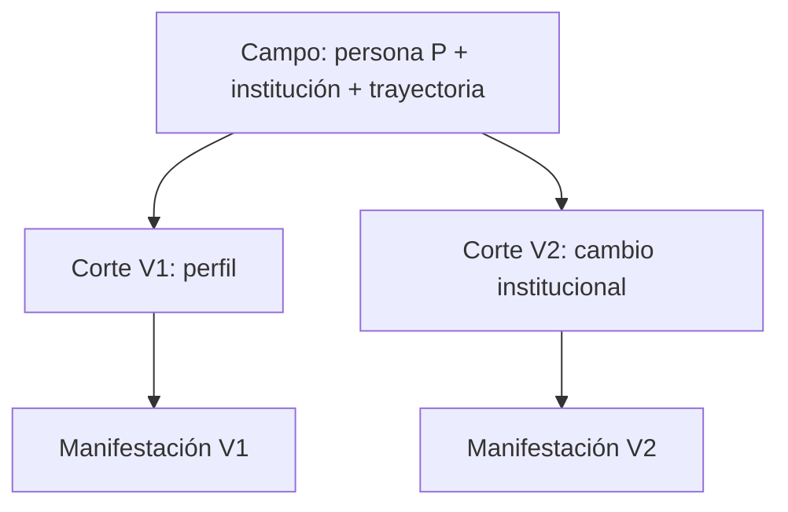

# Caso Reuters: un campo, varios cortes

**Fixture:** `FX-REUTERS-01` · **Estado:** fixture estructural sintético, no reproducción noticiosa.

Prueba que dos manifestaciones pueden ser cortes distintos de un campo común. El fixture usa contenido sintético para ser reproducible y no afirma hechos sobre Reuters.

Se comparan identidad local, selección, omisión, prominencia, orden y `EXPECTED_RESULT`.

## Ejecución completa

El análisis principal ya no es este resumen. [CASE-MRRE-REUTERS](DOSSIER_OPERATIVO.md) enlaza los textos originales y materializa segmentación, campo, cortes, subgrafos, chains, arquitectura, esqueleto, reinstanciación, diff y validación.

Recorrido: [fixture](inputs/fixture.yaml) → [dossier](DOSSIER_OPERATIVO.md) → [expected result](expected_results/expected.yaml) → [run 0.2.0](runs/run_v0_2_0.yaml) → [lecciones](lessons.md). Los procesos son [MRRE-PROC-RETRO](../../03_protocolos_operacionales/02_retroconstruccion.md), [MRRE-PROC-COMPARE](../../03_protocolos_operacionales/05_comparacion_y_transferencia.md) y [MRRE-PROC-REINSTATE](../../03_protocolos_operacionales/04_reinstanciacion.md).
