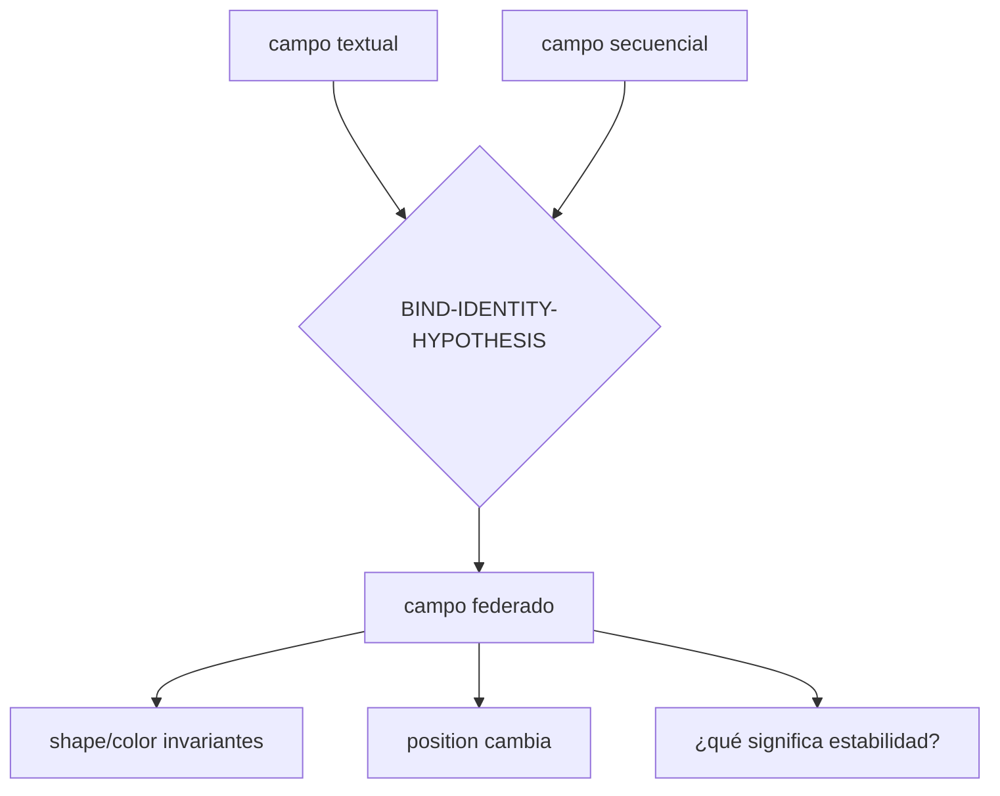
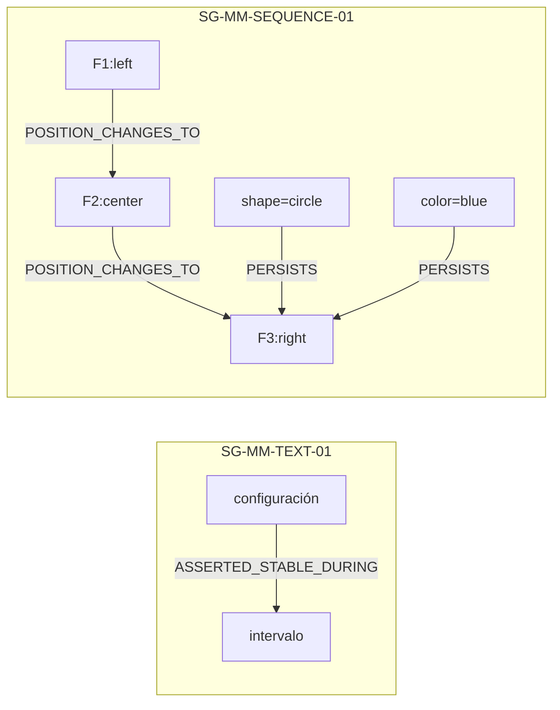
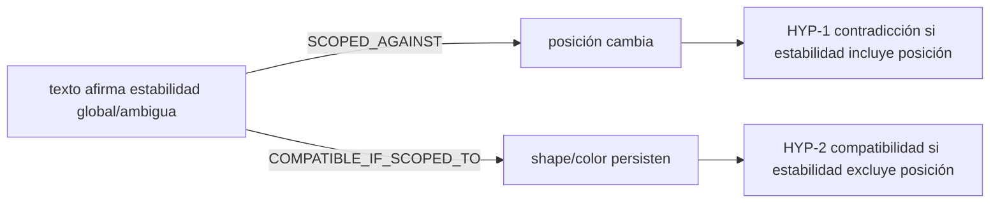

# Dossier operativo — triangulación multimodal

**ID:** `CASE-MRRE-MULTIMODAL`  
**Run:** `RUN-MRRE-MULTIMODAL-0.2.0`  
**Operaciones:** `TRIANGULAR → COMPARAR → VALIDAR`  
**Estatus:** `SYNTHETIC_REFERENCE_RUN / PENDING_SOURCE_IDENTITIES_PRESERVED`

## A0–A1. Manifestaciones originales

El fixture [CASE-MRRE-MULTIMODAL-INPUT](inputs/fixture.yaml) contiene dos manifestaciones sintéticas completas:

```text
MAN-TEXT-01:
  “La configuración permanece estable durante el intervalo.”

MAN-SEQUENCE-01:
  frame 1 = círculo azul, izquierda
  frame 2 = círculo azul, centro
  frame 3 = círculo azul, derecha
```

Propósito: federar evidencia sin convertir la secuencia automáticamente en proposiciones textuales; distinguir features invariantes (`shape`, `color`) de feature cambiante (`position`); evaluar si la afirmación “estable” contradice la secuencia o describe sólo una subregión.

Las etiquetas históricas `theme_visual_video_4.pdf`, `secuencia_de_imagenes.pdf`, `EC06`, `EC07`, `EC10`, `EC12` siguen `PATH_PENDING_CONFIRMATION`. Se localizaron recursos candidatos, pero su identidad con los adjuntos no está demostrada:

- [CASE-SRC-EC06-CANDIDATE](../../../../../03_aplicaciones/campos_atencionales/videos_youtube/hydilae/guiones/video-4/imagenes/prompts_de_generacion/EC06_PROMPTS_IMAGENES.md), `RELATED_CANDIDATE_NOT_INGESTED`.
- [CASE-SRC-EC07-CANDIDATE](../../../../../03_aplicaciones/campos_atencionales/videos_youtube/hydilae/guiones/video-4/imagenes/prompts_de_generacion/EC07_PROMPTS_RECURSOS_VISUALES.md), `RELATED_CANDIDATE_NOT_INGESTED`.
- [CASE-SRC-EC10-CANDIDATE](../../../../../03_aplicaciones/campos_atencionales/videos_youtube/hydilae/guiones/video-4/imagenes/prompts_de_generacion/EC10_PROMPTS.md), `RELATED_CANDIDATE_NOT_INGESTED`.

Esta distinción aplica [MRRE-REF-NORM-01](../../00_gobierno/06_norma_de_referencias_y_citacion.md): descubrir una ruta semejante no autoriza identidad ni uso como evidencia.

## A2. Campos locales y federación

Primero se construye un campo por modalidad:

| Campo | Nodos observables | Edges observables | Huecos |
|---|---|---|---|
| `FIELD-TEXT-STABILITY-01` | configuración, intervalo, estabilidad afirmada | `STABILITY_ASSERTED_DURING` | feature al que aplica “configuración” |
| `FIELD-SEQUENCE-MOTION-01` | objeto persistente, 3 frames, shape, color, position | `SAME_OBJECT_CANDIDATE`, `POSITION_TRANSITION` | tiempo/escala física |

La federación `FIELD-MM-FEDERATED-01` requiere un bridge de identidad entre “configuración” textual y el objeto visual. El fixture lo activa como hipótesis de prueba, no como observación.



El proceso sigue [MRRE-PROC-TRIANGULATE](../../03_protocolos_operacionales/03_triangulacion_multimanifestacion.md), que obliga a registrar cada manifestación antes de cruzarlas.

## A3. Segmentación por modalidad

### Texto

| Unidad | Span | Tipo |
|---|---|---|
| `U-TX-01` | “La configuración” | entidad abstracta |
| `U-TX-02` | “permanece estable” | predicación de estado |
| `U-TX-03` | “durante el intervalo” | alcance temporal |

### Secuencia

| Unidad | Locator | Observación |
|---|---|---|
| `U-SQ-F1` | frame 1 | círculo, azul, izquierda |
| `U-SQ-F2` | frame 2 | círculo, azul, centro |
| `U-SQ-F3` | frame 3 | círculo, azul, derecha |
| `U-SQ-SHAPE` | F1–F3 | shape constante |
| `U-SQ-COLOR` | F1–F3 | color constante |
| `U-SQ-POS` | F1→F2→F3 | posición cambia |

No se crea un texto oculto para la secuencia. Sus unidades conservan metadata de frame conforme a [MRRE-SPEC-MULTIMODAL](../../06_especializaciones/07_manifestaciones_multimodales.md).

## A4. Subgrafos separados



`SG-MM-TEXT-01` tiene estatus `SOURCE_ASSERTION`; `SG-MM-SEQUENCE-01` tiene `OBSERVATION_SYNTHETIC_FIXTURE`; el bridge tiene `HYPOTHESIS`. El reconstructor [MRRE-COMP-SUBGRAPH](../../04_runtime/componentes/04_subgraph_reconstructor.md) no fusiona sus estatus.

## A5. Chains

### `CH-MM-POSITION-01`

```text
POSITION(left, t1) → POSITION(center, t2) → POSITION(right, t3)
```

Edges: `POSITION_CHANGES_TO`; condición: identidad del mismo objeto entre frames. Si falla la identidad, el chain se degrada a tres observaciones sin trayectoria.

### `CH-MM-INVARIANCE-01`

```text
SHAPE(circle,t1)=SHAPE(circle,t2)=SHAPE(circle,t3)
COLOR(blue,t1)=COLOR(blue,t2)=COLOR(blue,t3)
```

Tipo: persistencia de features, no inmovilidad global.

### `CH-MM-CLAIM-EVALUATION-01`



No se elige entre `HYP-1` y `HYP-2` sin resolver el alcance de “configuración”. Ésta es la información estructural que una fusión prematura destruiría.

## A6. Arquitecturas candidatas

| Candidata | Interpretación | Soporte | Falsador |
|---|---|---|---|
| `CA-MM-01 PARTIAL_STABILITY` | algunas features persisten y otra cambia | shape/color/position | texto define estabilidad como posición constante |
| `CA-MM-02 CONTRADICTORY_MODALITIES` | texto y secuencia contradicen estado global | si “configuración” incluye position | evidencia de alcance restringido |
| `CA-MM-03 IDENTITY_MISMATCH` | texto y secuencia hablan de objetos/campos distintos | posible por falta de bridge externo | binding de identidad autorizado |

`CA-MM-01` es la candidata más informativa dentro del fixture, pero no elimina las demás.

## A7. Esqueleto de triangulación

```text
MANIFESTACIÓN_A afirma ESTADO sobre OBJETO/CAMPO y ALCANCE
MANIFESTACIÓN_B observa FEATURES por TIEMPO
BRIDGE_DE_IDENTIDAD enlaza objetos con estatus explícito
COMPARADOR separa:
  FEATURES_INVARIANTES
  FEATURES_VARIABLES
  CONTRADICCIONES_DEPENDIENTES_DE_ALCANCE
  REGIONES_EXCLUSIVAS_POR_MODALIDAD
```

Invariantes: procedencia por modalidad, identidad no asumida, feature y objeto no colapsados, contradicción localizada, posibilidad de retirar una manifestación.

## A8–A9. Pruebas de remoción y diff

| Operación | Resultado | Lectura |
|---|---|---|
| retirar texto | queda movimiento + invariantes visuales; desaparece contradicción | soporte textual crítico sólo para claim-evaluation |
| retirar secuencia | queda afirmación de estabilidad sin contraste | no puede inferirse movimiento ni invariantes observados |
| retirar frame 2 | queda cambio izquierda→derecha, pierde progresión intermedia | chain parcial |
| retirar feature position | texto compatible con shape/color | contradicción desaparece |
| retirar bridge de identidad | campos separados | federación bloqueada |
| fusionar modalidades sin source binding | trace irrecuperable | `FAIL_PROVENANCE` |

## A10. Proceso y dictamen

| Artefacto | Proceso/componente |
|---|---|
| registros separados | [MRRE-PROC-TRIANGULATE](../../03_protocolos_operacionales/03_triangulacion_multimanifestacion.md) + [FIELD-BUILDER](../../04_runtime/componentes/01_field_builder.md) |
| segmentación | [MRRE-WORKBOOK-B](../../03_protocolos_operacionales/07_libro_de_trabajo_y_algoritmos.md#algoritmo-b-segmentación-multiescala) + [SEGMENTER](../../04_runtime/componentes/03_multiscale_segmenter.md) |
| subgrafos/chains | [MRRE-WORKBOOK-C-D](../../03_protocolos_operacionales/07_libro_de_trabajo_y_algoritmos.md#algoritmo-c-reconstrucción-de-subgrafo) + [SUBGRAPH-RECONSTRUCTOR](../../04_runtime/componentes/04_subgraph_reconstructor.md) |
| candidatas | [MRRE-PROC-COMPARE](../../03_protocolos_operacionales/05_comparacion_y_transferencia.md) |
| remoción | [MRRE-VAL-PLAN](../../08_validacion_y_pruebas/01_plan_de_verificacion_y_validacion.md) |

**Dictamen:** `COMPLETED_SYNTHETIC_REFERENCE_RUN / ALTERNATIVES_PENDING`. Se demuestra triangulación con contradicción condicionada por feature/alcance. Las fuentes históricas pendientes no se usaron ni se inventaron. El registro está en [RUN-MRRE-MULTIMODAL](runs/run_v0_2_0.yaml).
