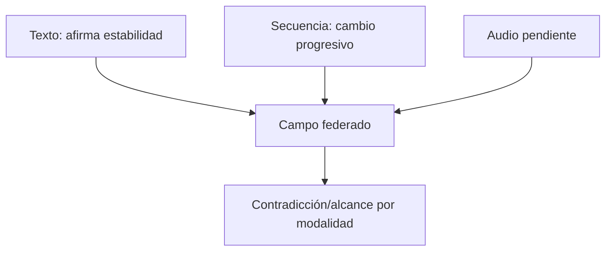

# Caso de triangulación multimodal

**Fixture:** `FX-MULTIMODAL-01` · **Estado:** metadata sintética + prueba de fuentes pendientes.

Prueba correspondencia, contradicción, continuidad y procedencia por modalidad sin convertir imagen o secuencia automáticamente en texto.

## Ejecución completa

[CASE-MRRE-MULTIMODAL](DOSSIER_OPERATIVO.md) mantiene campos separados, propone bridge de identidad, localiza la contradicción por feature y conserva tres arquitecturas alternativas.

Recorrido: [fixture](inputs/fixture.yaml) → [dossier](DOSSIER_OPERATIVO.md) → [expected result](expected_results/expected.yaml) → [run 0.2.0](runs/run_v0_2_0.yaml) → [lecciones](lessons.md). El proceso normativo es [MRRE-PROC-TRIANGULATE](../../03_protocolos_operacionales/03_triangulacion_multimanifestacion.md).
