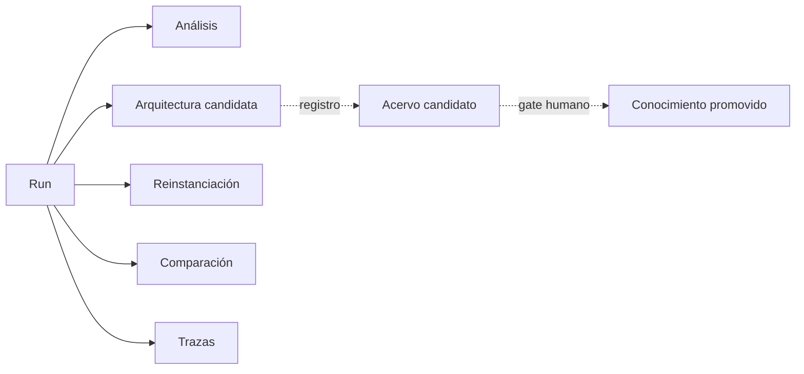

# Artefactos generados

Zona de resultados de ejecución, no definiciones ni canon. Todo artefacto incluye `artifact_id`, versión, run ID, input/plan/schema refs, estado epistemológico, validator results y trace refs. Existir aquí no implica promoción.

## Procedimiento de persistencia

1. confirma permiso de persistencia;
2. crea directorio `RUN-ID/` en la clase adecuada;
3. guarda artefacto, sidecar trace, validator results y manifest;
4. usa referencias relativas entre ellos;
5. registra versión y hash del portador, no una copia silenciosamente normalizada;
6. marca `promotion_status: NOT_REQUESTED` por defecto;
7. una propuesta al acervo usa gate independiente.

El formato final sigue [MRRE-SCHEMA-RESULT](../02_contratos_y_schemas/mrre_result.schema.yaml), la autoridad [MRRE-AUTHORITY](../00_gobierno/02_autoridad_soberania_y_limites.md) y la procedencia [MRRE-COMP-TRACE](../04_runtime/componentes/08_trace_graph.md). Los runs de ejemplo permanecen en [MRRE-CASE-INDEX](../09_casos_y_ejemplos/README.md), no se copian aquí como canon.
