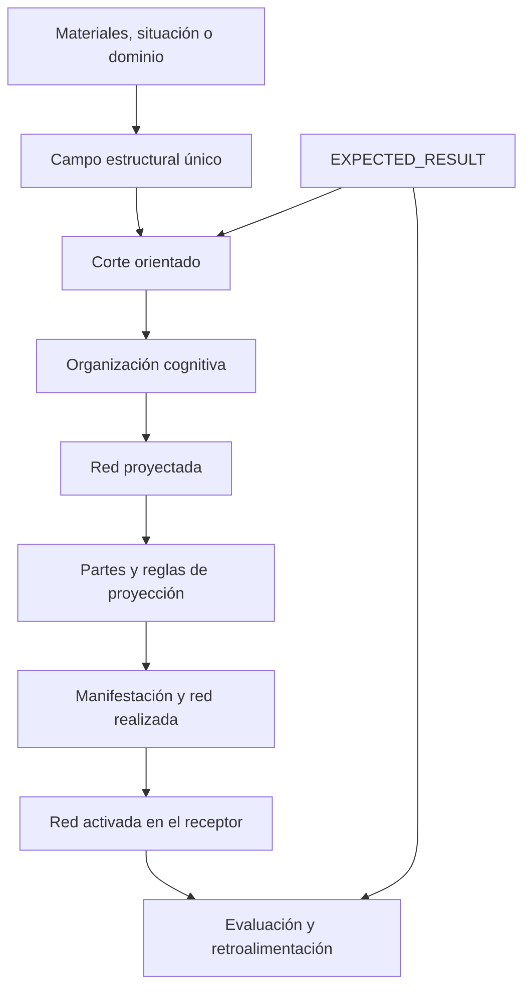
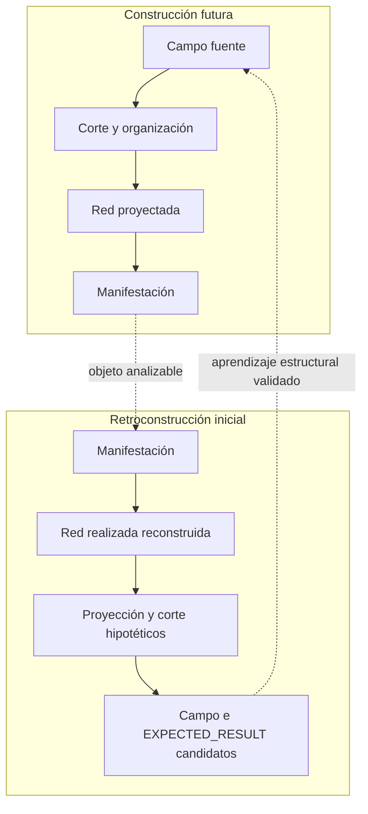
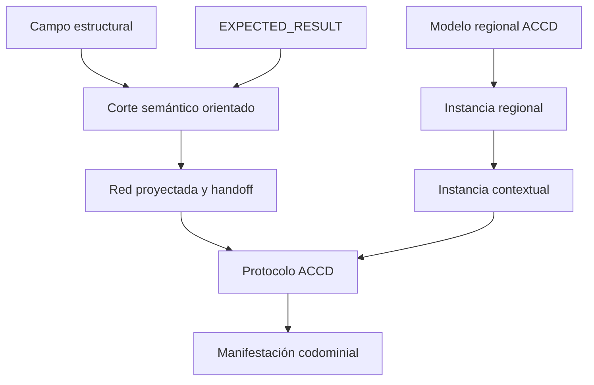

# Diseño integral de [NUEVO PAQUETE]

```yaml
documento:
  tipo: DISEÑO_DE_PAQUETE_COGNITIVO
  version: 0.1.0
  fecha: 2026-08-13
  estado: PROPUESTA_PROVISIONAL_NO_CANONICA
  autoridad_de_aprobacion: HUMANO

paquete:
  nombre_temporal_obligatorio: "[NUEVO PAQUETE]"
  nombre_definitivo: PENDIENTE
  implementacion: NO_INICIADA
  primer_producto_exigido: ANALIZADOR_ESTRUCTURAL_DE_TEXTOS

politica:
  esta_propuesta_no_modifica_el_canon: true
  fuentes_inferencias_hipotesis_y_decisiones_se_mantienen_separadas: true
  persistencia_del_diseno_no_equivale_a_aprobacion_del_paquete: true
```

## 0. Resultado del diseño

`[NUEVO PAQUETE]` queda diseñado como una **cApp de infraestructura estructural** capaz de operar en dos direcciones complementarias:

1. **Retroconstrucción analítica**, que parte de una manifestación —primero, un texto— y reconstruye de forma trazable las estructuras que podrían explicar cómo fue construida.
2. **Construcción proyectiva**, que parte de materiales, una situación o un dominio, construye un campo estructural, realiza un corte orientado por `EXPECTED_RESULT`, organiza el corte mediante estructuras cognitivas y prepara una especificación de proyección que otra arquitectura puede realizar.

La implementación debe comenzar por la primera dirección. El analizador permitirá aprender de textos ya construidos antes de fijar prematuramente las reglas del generador.

La cadena nuclear aceptada queda formalizada así:



Este flujo no afirma que todas las capas sean observables con el mismo grado de certeza. En análisis retrospectivo, la manifestación es el portador directamente disponible; la red realizada es una reconstrucción cercana a la evidencia; la red proyectada, el corte y `EXPECTED_RESULT` son hipótesis progresivamente más abductivas.

---

## 1. Estado epistemológico del documento

### 1.1 Leyenda de autoridad

| Marca | Significado |
|---|---|
| `DECISIÓN_HUMANA` | Instrucción o aceptación explícita del humano en la conversación. |
| `FUENTE` | Definición o distinción recuperada de un documento o paquete del acervo. |
| `INFERENCIA_DE_CHAT` | Relación elaborada en la conversación y conservada como estructura de trabajo. |
| `DECISIÓN_DE_DISEÑO_PROPUESTA` | Elección realizada aquí para volver operable el conjunto; requiere aprobación humana para adquirir autoridad mayor. |
| `HIPÓTESIS` | Explicación plausible que debe probarse y puede ser sustituida. |
| `PREGUNTA_ABIERTA` | Punto que el diseño no debe cerrar todavía. |

### 1.2 Decisiones humanas que gobiernan este diseño

- El paquete se denomina exclusivamente `[NUEVO PAQUETE]` hasta encontrar un nombre.
- El primer paso de implementación es una herramienta de análisis de textos.
- El diseño debe incorporar las estructuras desarrolladas en la conversación, los paquetes cognitivos señalados y los documentos del acervo.
- Se acepta como dirección de trabajo la secuencia campo → corte → organización → proyección → manifestación → recepción → evaluación.
- Las versiones Reuters deben entenderse como cortes distintos de un mismo campo o núcleo, no como entidades independientes que casualmente comparten un núcleo.
- El ejemplo de la aspiradora y la doble validación descendente/ascendente debe conservarse como caso de referencia.
- Este primer diseño debe explorar todas las preguntas pendientes, aunque algunas permanezcan provisionales.

### 1.3 Regla de no promoción silenciosa

Este archivo es un diseño persistido, no una incorporación automática al canon de `COGNICIÓN_CENTRAL`, MTC, PIEA, ACCD ni de ningún otro paquete. Una aprobación futura deberá indicar qué elementos se aceptan, cuáles se modifican y qué destino canónico reciben.

---

## 2. Identidad funcional de [NUEVO PAQUETE]

### 2.1 Definición nuclear propuesta

> **[NUEVO PAQUETE] es una cApp de infraestructura estructural que construye o reconstruye campos de conocimiento a partir de materiales y manifestaciones; produce cortes orientados por resultados esperados; organiza los elementos seleccionados mediante estructuras cognitivas y operadores locales; especifica redes proyectadas y arquitecturas funcionales de manifestación; y evalúa, con incertidumbre explícita, la relación entre la estructura fuente, la realización perceptible y las estructuras que distintos receptores podrían activar e integrar.**

### 2.2 Clasificación cognitiva

| Nivel | Clasificación propuesta | Justificación |
|---|---|---|
| Paquete completo | `cApp_de_infraestructura_estructural` | Coordina módulos, registros, contratos, validadores e interfaces reutilizables. |
| Diseño del paquete | `FAM-Diseño` | Define componentes, relaciones, fronteras, contratos y criterios de construcción. |
| Primera herramienta | `FAM-Método` | Ejecuta un procedimiento reproducible para retroconstruir textos. |
| Razonamiento dominante inicial | `RETROCONSTRUCCIÓN_ABDUCTIVA_CONTROLADA` | Va del efecto observable hacia configuraciones antecedentes candidatas sin confundir plausibilidad con prueba de intención. |
| Construcción futura | `FAM-Método + FAM-Diseño` | Selecciona, organiza y proyecta estructuras con un objetivo explícito. |

La herramienta inicial no es sólo un “analizador de estilo”. Su objeto es la arquitectura estructural completa de la manifestación.

### 2.3 Problema que resuelve

Las manifestaciones terminadas ocultan varias decisiones que las hicieron posibles:

- qué campo de entidades y relaciones estaba disponible;
- qué región fue seleccionada y cuál quedó excluida;
- qué identidad parcial recibió cada entidad;
- qué estructuras cognitivas organizaron los nodos;
- qué recorrido fue elegido entre varios posibles;
- qué función cumple cada parte;
- cómo contribuyen palabras, oraciones y partes al efecto total;
- qué asociaciones puede activar la realización;
- qué divergencias pueden surgir entre diseño, texto y recepción.

`[NUEVO PAQUETE]` vuelve esas decisiones inspeccionables, comparables y, más adelante, reutilizables para construcción.

### 2.4 Lo que no es

```text
[NUEVO PAQUETE] ≠ COGNICIÓN_CENTRAL
[NUEVO PAQUETE] ≠ arquitectura de comunicación humano–IA
[NUEVO PAQUETE] ≠ PIEA
[NUEVO PAQUETE] ≠ MTC
[NUEVO PAQUETE] ≠ ACCD
[NUEVO PAQUETE] ≠ FAC
[NUEVO PAQUETE] ≠ un renderer
[NUEVO PAQUETE] ≠ un detector de intención psicológica
[NUEVO PAQUETE] ≠ un buscador de palabras renombrado
[NUEVO PAQUETE] ≠ una teoría universal de la recepción
```

Tampoco presupone que toda manifestación haya sido construida deliberadamente mediante los conceptos del paquete. El analizador reconstruye una arquitectura **como si** ciertas operaciones hubieran organizado la pieza, y declara el grado de apoyo de cada hipótesis.

---

## 3. Invariantes del modelo base

La pertenencia a `[NUEVO PAQUETE]` exige conservar, al menos, los siguientes invariantes candidatos.

### INV-NP-01 — Separación entre campo y manifestación

El conocimiento disponible no vive exclusivamente dentro de la pieza final. Debe distinguirse un campo estructural, real o reconstruido, de la manifestación que realiza una de sus rutas posibles.

### INV-NP-02 — Orientación explícita

Todo corte de construcción debe estar orientado por un `EXPECTED_RESULT` tipado. En retroconstrucción, debe formularse uno o más `EXPECTED_RESULT` candidatos y distinguirlos de la intención psicológica real del autor.

### INV-NP-03 — Corte, no copia exhaustiva

Una manifestación selecciona, excluye, repondera, ordena y vuelve explícita sólo una región del campo. La omisión puede ser funcional y debe quedar trazada.

### INV-NP-04 — Organización mediante estructuras cognitivas

Una lista de nodos seleccionados no constituye todavía una proyección. Deben existir estructuras que organicen relaciones, recorridos y funciones: causalidad, secuencia, comparación, parte–todo, problema–solución, medios–fines, condición–consecuencia, evidencia–afirmación u otras estructuras calificadas.

### INV-NP-05 — Identidad proyectada

La identidad completa de una entidad no equivale a la identidad con que aparece en una parte. `IDENTITY_SELECTION` debe poder justificar qué atributos, relaciones e historia se incluyen o excluyen localmente.

### INV-NP-06 — Partes funcionales

La manifestación debe poder analizarse o diseñarse como una composición de partes con funciones locales, reglas de entrada/salida y contribuciones al efecto mayor. Una parte no se define sólo por el tema que contiene.

### INV-NP-07 — Alineación multiescala

Las contribuciones locales deben poder integrarse ascendentemente y los requisitos globales deben poder descomponerse descendentemente. Contribuir no significa repetir el efecto total a menor escala.

### INV-NP-08 — Triple red no colapsable

La red proyectada, la red realizada y la red activada son objetos distintos. Una no debe usarse como evidencia automática de las otras.

### INV-NP-09 — Trazabilidad bidireccional

Debe ser posible recorrer, con el grado de resolución materializado:

```text
campo → corte → estructura → parte → párrafo → oración → palabra
```

y también:

```text
palabra → oración → parte → estructura → corte → campo
```

### INV-NP-10 — Estado epistemológico visible

Fuente, observación, reconstrucción, inferencia, hipótesis, decisión y pregunta deben permanecer distinguibles. La elegancia de una reconstrucción no demuestra que el productor o el receptor hayan usado exactamente esa arquitectura.

### INV-NP-11 — Contextos no intercambiables

El contexto del campo, el contexto de proyección, la instancia contextual ACCD y el contexto de integración `κ_t` de PIEA cumplen funciones diferentes y no deben fusionarse bajo la palabra genérica “contexto”.

### INV-NP-12 — Soberanía humana

El humano gobierna objetivos, restricciones, aprobación, persistencia y promoción canónica. El sistema puede proponer estructuras y alternativas, pero no convertirlas silenciosamente en decisiones.

### INV-NP-13 — Especialización por restricciones añadidas

Una especialización conserva el núcleo y añade vocabulario, tipos, restricciones, operadores y pruebas. No redefine el paquete desde cero.

### INV-NP-14 — Análisis antes de generación

La primera implementación debe demostrar capacidad de retroconstrucción, comparación y falsación antes de habilitar generación productiva general.

### 3.1 Principios de diseño acumulados

Esta sección incorpora expresamente las inferencias que se ordenó añadir a **Principios de diseño**.

#### PD-NP-01 — Selección orientada antes de realización

`EXPECTED_RESULT` interviene antes de la manifestación. Orienta qué región del campo debe comparecer, qué nodos se excluyen, qué relaciones reciben prominencia, qué recorrido se elige y qué función debe cumplir cada parte.

#### PD-NP-02 — Identidad completa e identidad proyectada no son idénticas

`IDENTITY_SELECTION` dota a la manifestación de una estructura identitaria situada. Depende, al menos, de `EXPECTED_RESULT`, función discursiva, parte de proyección, receptor, región asociativa objetivo, restricciones y selección de atributos/relaciones/historia.

#### PD-NP-03 — Todo nivel produce una contribución local

Una manifestación no espera a completarse para producir efecto. Palabras, oraciones, párrafos, partes, módulos y totalidad realizan contribuciones locales que deben poder integrarse ascendentemente.

#### PD-NP-04 — El efecto se diseña en dos direcciones

```text
DESCENDENTE:
EXPECTED_RESULT → subefectos requeridos por cada parte y unidad

ASCENDENTE:
efectos locales → compatibilidad e integración con el efecto total
```

#### PD-NP-05 — Acoplamiento pendiente entre identidad y efecto

Algún factor del contexto de `IDENTITY_SELECTION` debe representar la contribución local que la unidad realiza al efecto de su nivel superior. Este diseño propone `EFFECT_CONTRIBUTION_REQUIREMENT`, pero conserva su estatus de hipótesis hasta comparar alternativas.

#### PD-NP-06 — Composición no es yuxtaposición

Los nodos seleccionados y las contribuciones locales deben conectarse mediante relaciones e interfaces. Una lista de información correcta puede fallar si no forma una arquitectura reconstruible.

#### PD-NP-07 — La proyección es parcial y la recepción es constructiva

El productor proyecta selectivamente; el receptor encuentra unidades y reconstruye desde un estado y contexto propios. Fidelidad posible no implica transporte intacto.

#### PD-NP-08 — Un mismo campo admite recorridos funcionalmente distintos

El campo conserva identidad mientras los cortes cambian inclusión, foco, orden, explicitud e identidad proyectada. Reuters v1/v2 es el caso rector.

#### PD-NP-09 — El análisis debe preceder a la gramática generativa

Las reglas de construcción deben aprenderse mediante retroconstrucción comparada, pruebas negativas y revisión humana, no declararse únicamente desde intuiciones de diseño.

#### PD-NP-10 — Las capas se comunican por contratos

Campo, corte, organización, red proyectada, ACCD, manifestación y recepción intercambian objetos tipados. Ninguna capa absorbe silenciosamente la responsabilidad de otra.

---

## 4. Dominio de variación

Pueden variar sin destruir la identidad propuesta:

- modalidad de la manifestación: texto primero; imagen, audio, video e interfaz después;
- tipo de campo: eventos, mecanismos, argumentos, sistemas, procedimientos, narrativas;
- granularidad del campo y del corte;
- repertorio de estructuras cognitivas;
- número y tipo de partes funcionales;
- codominio final;
- perfiles de receptor;
- métodos de estimación de activación;
- profundidad de análisis léxico;
- representación visual del frontend;
- runtime y herramientas;
- grado de automatización;
- especialización aplicada;
- existencia de materiales fuente además de la manifestación;
- métricas, siempre que no oculten incertidumbre ni sustituyan validación.

---

## 5. Arquitectura general

### 5.1 Dos direcciones sobre un mismo modelo



Las dos direcciones comparten ontología, registros, trazas y validadores. No son dos paquetes independientes.

### 5.2 Tres planos

| Plano | Objetos principales | Pregunta dominante |
|---|---|---|
| Fuente y conocimiento | portadores, evidencias, campo, nodos, relaciones, contradicciones | ¿Qué estructura está disponible o puede reconstruirse? |
| Diseño y proyección | `EXPECTED_RESULT`, corte, estructuras cognitivas, identidad seleccionada, partes, red proyectada | ¿Qué región y recorrido deben comparecer para producir el efecto buscado? |
| Realización y recepción | manifestación, red realizada, unidades perceptibles, estados PIEA, red activada, feedback | ¿Qué se realizó y qué pudo integrar un receptor? |

### 5.3 Una instancia, un campo coherente

Cada ejecución trabaja sobre **un campo estructural focal**. El campo puede ser multicapas, contener contradicciones, fuentes heterogéneas y subgrafos rivales, pero mantiene una frontera y una identidad de caso explícitas.

Cuando dos conjuntos no pueden integrarse sin forzar identidad, deben modelarse como campos distintos o como una federación con fronteras explícitas. “Un solo núcleo” no autoriza a borrar incompatibilidades.

---

## 6. Ontología nuclear

### 6.1 Objetos

| Objeto | Definición operativa |
|---|---|
| `KNOWLEDGE_CARRIER` | Archivo, conversación, imagen, tabla, grafo u otro portador observable. |
| `SOURCE_BINDING` | Enlace entre una afirmación o unidad y su procedencia. |
| `STRUCTURAL_FIELD` | Grafo multicapas que organiza entidades, eventos, relaciones, evidencias, restricciones, incertidumbres y posibilidades de recorrido. |
| `FIELD_NODE` | Unidad tipada del campo con identidad estable. |
| `FIELD_EDGE` | Relación tipada, direccional cuando corresponda, con procedencia y estado epistemológico. |
| `EXPECTED_RESULT` | Contrato tipado que define qué resultado semántico, cognitivo, pragmático, codominial y verificable se busca. |
| `ORIENTED_CUT` | Vista operativa del campo que selecciona, excluye, repondera y asigna roles con respecto a un resultado. |
| `IDENTITY_VIEW` | Identidad parcial de una entidad para un corte, una parte y una función. |
| `COGNITIVE_STRUCTURE_SPEC` | Proyección portable de una estructura cognitiva: rol, invariantes, variación, entradas, relaciones, restricciones y pruebas. |
| `STRUCTURE_BINDING` | Aplicación de una estructura a nodos concretos del corte. |
| `PROJECTION_PART` | Parte funcional con contenido admisible, función discursiva, contribución local, relaciones y reglas. |
| `PROJECTED_NETWORK` | Red de diseño que especifica qué debe comparecer, cómo se organiza y qué recorrido se propone. |
| `REALIZATION_HANDOFF` | Contrato cerrado para que ACCD configure y realice un codominio sin reabrir arbitrariamente la semántica. |
| `MANIFESTATION` | Objeto perceptible concreto. |
| `REALIZED_NETWORK` | Estructura efectivamente codificada por la manifestación, reconstruida a partir de sus unidades y relaciones. |
| `RECEIVER_PROFILE` | Modelo explícito y limitado de conocimientos, expectativas, contexto, capacidades y restricciones de un receptor. |
| `ACTIVATED_NETWORK` | Hipótesis o medición parcial de relaciones disponibles, evaluadas e integradas por un receptor. |
| `TRACE_EDGE` | Enlace reversible entre capas y unidades. |
| `FEEDBACK_EVIDENCE` | Señal observada que puede apoyar una corrección, pero no la constituye por sí sola. |

### 6.2 Campo multicapas

El campo no se reduce a una taxonomía ni a una cronología. Se propone un grafo multiplexado con identificadores compartidos:

```yaml
structural_field:
  field_id:
  boundary:
  source_bindings: []
  nodes: []
  edges: []
  layers:
    - ENTITY_IDENTITY
    - EVENT_TEMPORAL
    - CAUSAL_MECHANISM
    - ARGUMENT_EVIDENCE
    - GOAL_CONSTRAINT
    - CONTEXT
    - ASSOCIATIVE
  unresolved_conflicts: []
  missing_regions: []
  epistemic_ledger: []
```

Distintos analizadores pueden construir capas legítimas del mismo campo sin fingir que existe un único análisis plano. Los identificadores estables permiten que una entidad se reconozca a través de vistas temporales, causales, argumentativas e identitarias.

### 6.3 Roles relativos

Roles como `FOCUS`, `SATELLITE`, `BACKGROUND`, `EVIDENCE`, `BRIDGE` o `REPAIR` pertenecen al corte o a la parte, no necesariamente al nodo en sí. Una “proposición satélite” es un nodo proposicional relacionado que ocupa una función periférica respecto del foco actual; puede ser central en otro corte.

---

## 7. Modelo formal mínimo

### 7.1 Construcción del campo

Sea `M` un conjunto delimitado de materiales y `K_F` el contexto de lectura de las fuentes:

```text
G_F = BUILD_FIELD(M, K_F, analyzers, provenance_policy)
```

`G_F` es un campo estructural, no una manifestación final.

### 7.2 Contrato `EXPECTED_RESULT`

Para evitar usar “resultado esperado” como una etiqueta indiferenciada:

```yaml
expected_result:
  semantic_result:
    target_relations: []
    distinctions_to_preserve: []
  cognitive_result:
    reconstructable_model:
    misconceptions_to_avoid: []
  pragmatic_result:
    decision_or_action:
    evidence_required:
  delivery_result:
    requested_artifact:
    codomain_constraints: []
  validation_result:
    observable_tests: []
    acceptable_uncertainty:
  prohibited_effects: []
```

Esta descomposición distingue:

- el resultado operativo del comando humano;
- el efecto cognitivo buscado en la manifestación;
- una eventual acción o efecto externo;
- el formato de entrega;
- la evidencia que permitiría evaluar éxito.

Si se solicita una acción externa, `[NUEVO PAQUETE]` no debe tratarla como estado cognitivo ni prometer causalidad; debe acoplarse con MTC y con evidencia del mundo.

### 7.3 Corte orientado

```text
C_ER = CUT(G_F | EXPECTED_RESULT, K_P, constraints)
```

El corte contiene, al menos:

```yaml
oriented_cut:
  field_ref:
  expected_result_ref:
  included_nodes: []
  excluded_nodes: []
  included_edges: []
  local_weights: {}
  focus_roles: {}
  identity_views: []
  explicitness_policy: {}
  traversal_constraints: []
  omissions_with_rationale: []
```

El corte no destruye el campo ni duplica sus nodos. Es una vista versionada con pesos, estados y roles locales.

### 7.4 Organización y proyección

```text
O = ORGANIZE(C_ER, selected_structures, local_operators)
G_P = BUILD_PROJECTED_NETWORK(O, projection_parts, effect_contracts)
```

La organización puede añadir relaciones de diseño o discurso, pero debe etiquetarlas como tales y no presentarlas como relaciones de fuente.

### 7.5 Entrega y realización

```text
H = CLOSE_HANDOFF(G_P, trace, constraints)
μ = ACCD_REALIZE(H, regional_instance, contextual_instance, protocol)
```

La notación `μ` remite a la manifestación producida por ACCD. `[NUEVO PAQUETE]` no redefine su ecuación ni incorpora el operador de proyección ACCD dentro del corte.

### 7.6 Integración receptoral

Para una unidad perceptible `u_t`, un estado receptor `S_t` y un contexto recortado `κ_t`, se conserva la ecuación nuclear PIEA:

```math
S_{t+1}=\mathcal I_{\kappa_t}(S_t,u_t)
```

La red activada se estima a partir de una trayectoria de estados, pruebas o señales parciales. No se deriva automáticamente del texto.

### 7.7 Cuatro evaluaciones distintas

```text
E1: EXPECTED_RESULT ↔ red proyectada
E2: red proyectada ↔ red realizada
E3: red realizada ↔ red activada estimada/observada
E4: red activada o manifestación externa ↔ EXPECTED_RESULT
```

| Evaluación | Pregunta |
|---|---|
| Alineación de diseño | ¿La red proyectada contiene las relaciones necesarias para el resultado? |
| Fidelidad de realización | ¿La manifestación conservó la red proyectada y sus jerarquías? |
| Eficacia de activación | ¿Los receptores activaron/evaluaron/integraron relaciones compatibles? |
| Alineación extremo a extremo | ¿La evidencia final satisface el resultado sin saltar capas causales? |

---

## 8. Relación exacta entre `EXPECTED_RESULT`, corte e instancia contextual

Esta pregunta queda resuelta provisionalmente mediante una **relación de orientación y entrega, no de identidad**.

| Objeto | Función | No debe confundirse con |
|---|---|---|
| `EXPECTED_RESULT` | Define el estado o efecto objetivo y sus pruebas. | El contenido ya seleccionado o la salida final. |
| `ORIENTED_CUT` | Selecciona y configura una región semántica del campo con respecto al resultado. | Una instancia contextual ACCD. |
| `PROJECTED_NETWORK` | Organiza el corte como recorrido y arquitectura funcional. | La pieza perceptible. |
| `ACCD_REGIONAL_INSTANCE` | Habilita regiones y campos válidos para una clase de realización. | El corte semántico del campo fuente. |
| `ACCD_CONTEXTUAL_INSTANCE` | Fija valores concretos para un caso dentro de la instancia regional. | `EXPECTED_RESULT` o el corte. |
| `MANIFESTATION` | Realiza la configuración en un codominio. | La arquitectura conceptual o el estado del receptor. |

La cadena completa propuesta es:



El handoff puede convertirse en una entrada de construcción conceptual para ACCD. La instancia contextual añade valores de realización —medio, audiencia, longitud, recursos, estilo, restricciones de plataforma— sin volver a decidir silenciosamente qué hechos o relaciones constituyen el núcleo semántico.

---

## 9. Construcción y reconstrucción del campo

### 9.1 Construcción desde materiales

```text
portadores autorizados
→ inventario y procedencia
→ segmentación de manifestaciones
→ extracción de unidades semánticas
→ resolución de entidades
→ tipado de relaciones
→ separación fuente/inferencia/contradicción
→ fusión por identificadores estables
→ campo estructural multicapas
```

Reglas:

1. Una coincidencia de nombre no basta para fusionar entidades.
2. Una contradicción se conserva con fuentes y vigencia; no se promedia.
3. Una ausencia se registra; no se rellena por fluidez.
4. La misma proposición repetida en copias no cuenta como evidencia independiente.
5. El campo debe poder admitir más de un corte sin reconstruirse desde cero.

### 9.2 Reconstrucción desde una manifestación

Existen dos condiciones analíticas distintas:

| Modo | Entradas | Alcance legítimo |
|---|---|---|
| `ANALYSIS_WITH_SOURCE` | manifestación + materiales fuente | Puede comparar campo conocido, corte hipotético y realización. |
| `MANIFESTATION_ONLY` | sólo manifestación | Reconstruye un campo mínimo compatible, marcado como hipótesis; no afirma conocer lo omitido. |

En `MANIFESTATION_ONLY`, el resultado superior es un **campo mínimo como-si**: la estructura suficiente para explicar la pieza, no el universo mental del autor.

### 9.3 Una fuente, varios cortes

Las dos piezas Reuters constituyen el caso de regresión principal:

- `noticiero-reuters-v1` proyecta un perfil de Mohsen Rezaei: eleva trayectoria, antecedentes, posiciones y controversias.
- `noticiero-reuters-v2` proyecta el cambio de cargo y su contexto institucional: eleva nombramiento, predecesor, consejo y coyuntura.

No se crean dos núcleos “Rezaei”. Se conserva un campo compartido con identificadores estables y se comparan:

- inclusión/exclusión;
- centralidad;
- `IDENTITY_SELECTION`;
- explicitud;
- función discursiva;
- orden;
- relaciones elevadas.

---

## 10. Modo inicial: retroconstrucción estructural de textos

### 10.1 Definición

> **La retroconstrucción estructural textual es un método abductivo controlado que parte de una manifestación lingüística, reconstruye su red realizada y su organización multiescala, e infiere configuraciones proyectadas, cortes, estructuras cognitivas y resultados esperados candidatos, conservando alternativas, procedencia y grados de incertidumbre.**

### 10.2 Dirección de reconstrucción

```text
manifestación textual
→ jerarquía de unidades observables
→ red realizada reconstruida
→ funciones y efectos locales
→ estructuras cognitivas inferidas
→ selecciones identitarias candidatas
→ arquitectura de partes hipotética
→ red proyectada hipotética
→ corte hipotético
→ campo mínimo o campo fuente comparado
→ EXPECTED_RESULT como-si
```

### 10.3 Capas de certeza

| Capa | Estado por defecto |
|---|---|
| Texto, orden, palabras y marcas visibles | `OBSERVACIÓN_DIRECTA` |
| Segmentación sintáctica y semántica | `RECONSTRUCCIÓN_CERCANA` |
| Red realizada | `RECONSTRUCCIÓN_TRAZABLE` |
| Funciones de partes y estructuras cognitivas | `INFERENCIA_ESTRUCTURAL` |
| Red proyectada y corte | `HIPÓTESIS_DE_DISEÑO` |
| Intención psicológica del autor | `NO_INFERIBLE_POR_DEFECTO` |
| `EXPECTED_RESULT` mínimo que racionaliza la pieza | `HIPÓTESIS_COMO_SI` |

### 10.4 Algoritmo inicial

```text
R0 registrar portador, alcance, idioma, versión y contexto disponible
R1 construir jerarquía palabra→oración→párrafo→parte→módulo→manifestación
R2 extraer piezas semánticas, negaciones, modalidad y estatus epistemológico
R3 reconstruir nodos, relaciones y trazas de la red realizada
R4 asignar funciones locales y contribuciones ascendentes
R5 inferir estructuras cognitivas candidatas y buscar alternativas
R6 reconstruir IDENTITY_VIEW por entidad, parte y función
R7 proponer arquitectura de partes y red proyectada como-si
R8 proponer corte y campo mínimo compatibles
R9 generar uno o más EXPECTED_RESULT candidatos
R10 simular riesgos de activación para perfiles receptores declarados
R11 probar explicaciones alternativas y falsos positivos
R12 entregar informe navegable con confianza, omisiones y preguntas
```

### 10.5 Salida mínima

```yaml
text_analysis_result:
  carrier:
  observable_hierarchy:
  realized_network:
  functional_parts: []
  local_effect_map: []
  cognitive_structure_candidates: []
  identity_views: []
  projected_network_hypotheses: []
  oriented_cut_hypotheses: []
  expected_result_hypotheses: []
  receiver_activation_risks: []
  alternative_explanations: []
  uncertainty_ledger: []
  trace_coverage:
```

### 10.6 Prohibiciones del analizador

- No presentar una reconstrucción elegante como acceso a la mente del productor.
- No asumir que la división gramatical coincide siempre con la unidad efectiva de integración.
- No confundir frecuencia léxica con centralidad estructural.
- No tratar un resumen generado por el analista como evidencia de la red de un receptor real.
- No usar reportes verbales del receptor como acceso causal directo a sus procesos.
- No atribuir al texto asociaciones que proceden de otra fuente sin declarar el acoplamiento.
- No reducir el análisis a una sola lectura cuando sobreviven alternativas materiales.

---

## 11. Modo futuro: construcción proyectiva

### 11.1 Dirección

```text
materiales/situación/dominio
→ campo estructural
→ EXPECTED_RESULT tipado
→ corte orientado
→ estructuras cognitivas y operadores locales
→ red proyectada
→ partes funcionales y contratos de efecto
→ handoff de realización
→ ACCD
→ manifestación
→ recorrido PIEA de receptores
→ evaluación y corrección
```

### 11.2 Algoritmo propuesto

```text
C0 normalizar comando y restricciones mediante la arquitectura humano–IA
C1 construir o recuperar campo con trazabilidad
C2 descomponer EXPECTED_RESULT en resultados y prohibiciones
C3 producir corte inicial y omisiones justificadas
C4 definir partes funcionales y subresultados
C5 buscar y seleccionar estructuras cognitivas
C6 ejecutar IDENTITY_SELECTION y otros operadores locales
C7 componer red proyectada y recorridos alternativos
C8 verificar alineación descendente y ascendente
C9 cerrar REALIZATION_HANDOFF
C10 entregar a ACCD para instancia regional/contextual y realización
C11 analizar red realizada
C12 estimar o medir redes activadas
C13 clasificar feedback y proponer correcciones versionadas
```

La construcción general no debe habilitarse como capacidad confiable hasta que el analizador haya permitido comparar suficientes casos y el humano haya aprobado invariantes, contratos y pruebas.

---

## 12. Mecanismo para seleccionar y combinar estructuras cognitivas

### 12.1 Principio

Los nodos de un corte no se organizan por intuición estilística. Cada parte formula una **necesidad estructural** y consulta el registro de estructuras cognitivas —directamente o mediante `BÚSQUEDA_COGNITIVA`— para localizar candidatos por rol, relaciones, invariantes y compatibilidad.

```text
requisito funcional de parte
→ firma estructural objetivo
→ búsqueda de candidatos
→ calificación
→ binding con nodos del corte
→ composición
→ validación
```

### 12.2 Firma de necesidad

```yaml
structural_need:
  part_id:
  objective:
  discourse_role:
  required_relations: []
  prohibited_relations: []
  source_nodes: []
  expected_local_effect:
  parent_effect_ref:
  receiver_requirements: []
  scale:
  ordering_constraints: []
  epistemic_constraints: []
```

### 12.3 Firma de una estructura candidata

```yaml
cognitive_structure_spec:
  id:
  family:
  dominant_role:
  invariants: []
  variation_domain: []
  input_roles: []
  relation_schema: []
  output_roles: []
  scale_compatibility: []
  preconditions: []
  composition_interfaces: []
  conflicts: []
  validation_tests: []
  provenance:
  lifecycle:
```

El paquete opera sobre proyecciones estructurales tipo `cNode`; no afirma acceso directo a los `mNode` internos de una persona.

### 12.4 Operaciones de búsqueda

Se reutilizan las relaciones propuestas por `BÚSQUEDA_COGNITIVA`:

- `FIND_SIMILAR_ROLE` para localizar una estructura que cumpla la misma función;
- `FIND_COMPLEMENTARY` para cubrir una función ausente;
- `FIND_DEPENDENCIES` para recuperar estructuras requeridas;
- `FIND_TRANSFORMATIONS` para hallar un método entrada→salida;
- `FIND_BRIDGES` para conectar una estructura conocida con otra;
- `FIND_CONTRADICTIONS` para evitar composiciones incompatibles;
- `FIND_ANALOGOUS` cuando el dominio cambia pero se preservan relaciones.

Los niveles léxico y semántico generan candidatos; no deciden por sí solos una equivalencia estructural.

### 12.5 Calificación

Hasta contar con datos calibrados, la compatibilidad se clasifica como `ALTA`, `MEDIA`, `BAJA` o `INCOMPATIBLE`, con justificación en estas dimensiones:

| Dimensión | Prueba |
|---|---|
| Cobertura funcional | ¿Cumple el efecto y rol requeridos? |
| Correspondencia relacional | ¿Los nodos del corte pueden ocupar los roles de la estructura sin forzarlos? |
| Fidelidad de fuente | ¿La estructura evita inventar relaciones no sustentadas? |
| Compatibilidad de escala | ¿Opera en palabra, oración, parte o módulo de forma adecuada? |
| Compatibilidad receptoral | ¿Sus presupuestos son plausibles para el perfil declarado? |
| Composabilidad | ¿Sus interfaces pueden conectarse con estructuras vecinas? |
| Conflictos | ¿Introduce una relación prohibida, una contradicción o una sobreextensión? |
| Validabilidad | ¿Produce una contribución que puede inspeccionarse o probarse? |

### 12.6 Binding

Una estructura abstracta sólo se vuelve operativa cuando sus roles se enlazan a nodos concretos:

```yaml
structure_binding:
  structure_ref: CAUSE_EFFECT
  part_id: P_EXPLICACION_MECANISMO
  role_bindings:
    cause: PRESSURE_DIFFERENCE
    enables: AIRFLOW
    transports: DUST_PARTICLES
  source_supported_edges: []
  inferred_edges: []
  discourse_edges: []
  unmapped_roles: []
```

### 12.7 Gramática de composición

Las estructuras pueden combinarse mediante relaciones tipadas:

| Operador | Función |
|---|---|
| `SEQUENCE` | Una estructura prepara o antecede a otra. |
| `NEST` | Una estructura opera dentro de un rol de otra. |
| `PARALLEL` | Dos estructuras aportan rutas complementarias sin dependencia temporal. |
| `CONTRAST` | Hace comparables dos configuraciones y eleva diferencias. |
| `SUPPORT` | Una estructura aporta evidencia, ejemplo o explicación a otra. |
| `GATE` | Una condición debe satisfacerse antes de continuar. |
| `REPAIR` | Corrige una asociación, ambigüedad o inferencia activada antes. |
| `REWEIGHT` | Repite o recontextualiza para modificar prominencia. |
| `BRIDGE` | Introduce una correspondencia limitada entre dominios. |

La salida es un `COGNITIVE_STRUCTURE_COMPOSITION_GRAPH`, no una lista de nombres.

### 12.8 Validador de composición

Una composición pasa cuando:

1. todos los roles obligatorios tienen binding o una ausencia declarada;
2. las estructuras no compiten por el mismo rol de manera incompatible;
3. las interfaces de entrada y salida coinciden;
4. las relaciones de fuente, inferencia y discurso están separadas;
5. cada estructura aporta un efecto local trazable;
6. la composición satisface mejor la necesidad que una alternativa más simple;
7. las rupturas de analogía están declaradas;
8. ningún candidato se integra sólo por parecido verbal.

---

## 13. `IDENTITY_SELECTION` y operadores locales

### 13.1 Función

`IDENTITY_SELECTION` selecciona la identidad con que una entidad comparece en una parte determinada. No crea una entidad nueva ni altera su identidad completa en el campo.

```text
FIELD_ENTITY
→ IDENTITY_SELECTION(corte, parte, función, receptor, restricciones)
→ IDENTITY_VIEW
```

### 13.2 Factores obligatorios

```yaml
identity_selection_request:
  entity_ref:
  expected_result_ref:
  oriented_cut_ref:
  projection_part_ref:
  discourse_function:
  receiver_profile_ref:
  target_associative_region:
  epistemic_constraints: []
  explicitness_budget:
  prohibited_attributes: []
  effect_contribution_requirement: # HIPÓTESIS, véase 13.4
```

### 13.3 Resultado

```yaml
identity_view:
  entity_ref:
  selected_attributes: []
  selected_relations: []
  selected_history: []
  omitted_attributes: []
  local_role:
  prominence:
  lexical_realizations_allowed: []
  ambiguity_risks: []
  rationale_by_selection: []
  trace:
```

### 13.4 Acoplamiento con el efecto multiescala

La inferencia `PD-ACOPLAMIENTO-IDENTITY-SELECTION-EFECTO-MULTIESCALA-001` plantea que uno de los factores de `IDENTITY_SELECTION` debe corresponder exactamente con la contribución local de cada unidad al efecto mayor.

Este diseño propone como **hipótesis comprobable**, no como decisión canónica, un contrato distribuido:

```yaml
effect_contribution_requirement:
  scale:
  intended_local_effect:
  contribution_to_parent:
  associative_risk:
  required_repair:
  validation_evidence:
```

`IDENTITY_SELECTION` lo consulta para decidir qué rasgos de la entidad deben comparecer. Sin embargo, el contrato pertenece también a la parte y a la unidad lingüística. La hipótesis es, por tanto:

> El nexo buscado no es un factor aislado propiedad exclusiva de `IDENTITY_SELECTION`, sino un `EFFECT_CONTRIBUTION_REQUIREMENT` compartido por la selección identitaria, la arquitectura de partes y la validación multiescala.

Pruebas futuras deberán decidir si esta formulación distribuida explica mejor los casos que:

1. tratar el efecto como una dimensión interna de `EXPECTED_RESULT` únicamente;
2. tratarlo como una propiedad exclusiva de cada parte;
3. añadir un factor separado a `IDENTITY_SELECTION`.

### 13.5 Otros operadores locales

| Operador | Función |
|---|---|
| `RELATION_SELECTION` | Selecciona qué relaciones del corte deben comparecer. |
| `FOCUS_ASSIGNMENT` | Asigna foco, satélite, fondo o puente con respecto a la parte. |
| `ORDERING` | Define secuencia de presentación o revelación. |
| `EXPLICITATION` | Decide qué relación será explícita, implícita o presupuesta. |
| `COMPRESSION` | Sustituye detalle por una representación más compacta preservando invariantes. |
| `REPETITION_REWEIGHTING` | Reintroduce una unidad para modificar accesibilidad o prominencia. |
| `CONTRAST` | Eleva diferencias estructurales relevantes. |
| `ASSOCIATIVE_RISK_CONTROL` | Detecta activaciones previsibles no deseadas. |
| `REPAIR` | Corrige, restringe o reinterpreta una activación previa. |

Cada operador produce una traza y no puede alterar nodos de fuente sin reclasificar el cambio.

---

## 14. Arquitectura de partes y alineación fractal del efecto

### 14.1 Jerarquía funcional mínima

```text
PALABRA
→ ORACIÓN
→ PÁRRAFO
→ PARTE FUNCIONAL
→ MÓDULO
→ MANIFESTACIÓN
```

La jerarquía puede especializarse por medio —por ejemplo, plano → escena → secuencia en audiovisual—, pero debe declarar sus interfaces.

### 14.2 Efectos por nivel

```text
EFECTO LÉXICO
→ EFECTO ORACIONAL
→ EFECTO DE PÁRRAFO
→ EFECTO DE PARTE
→ EFECTO DE MÓDULO
→ EFECTO TOTAL
```

El efecto local puede ser semántico, gramatical, inferencial, atencional, rítmico, afectivo, epistemológico, de cohesión o de reparación. Esto permite reconocer la contribución de palabras funcionales sin fingir que cada palabra contiene una miniatura del argumento completo.

### 14.3 Contrato de parte funcional

```yaml
projection_part:
  id:
  parent_part:
  discourse_role:
  expected_subeffect:
  required_nodes: []
  admissible_nodes: []
  excluded_nodes: []
  identity_views: []
  cognitive_structures: []
  relations_in: []
  relations_out: []
  order_constraints: []
  prominence_rules: []
  local_subcut:
  effect_contribution_contract:
  realization_constraints: []
  repair_strategy:
  validation_tests: []
```

Una parte puede realizar un subcorte del corte general. Dos manifestaciones pueden compartir un `shared_discourse_slot` —por ejemplo, “establecer el hecho principal”— sin compartir el mismo contenido ni la misma identidad seleccionada.

### 14.4 Validación descendente

```text
EXPECTED_RESULT
→ efectos requeridos por módulos
→ efectos requeridos por partes
→ contribuciones requeridas por párrafos y oraciones
→ decisiones léxicas y riesgos asociativos
```

Preguntas:

- ¿Qué debe quedar reconstruible al final?
- ¿Qué subefecto debe producir cada parte para hacerlo posible?
- ¿Qué relación necesita cada oración?
- ¿Qué términos activan o bloquean modelos relevantes?

### 14.5 Validación ascendente

```text
efectos léxicos y oracionales
→ efectos de párrafo
→ efectos de parte
→ efecto de módulo
→ compatibilidad con el efecto total
```

Preguntas:

- ¿Cada unidad contribuye, conecta, regula o repara?
- ¿Las contribuciones locales son compatibles entre sí?
- ¿Una asociación local distorsiona una relación global?
- ¿El total emerge de las partes o sólo se afirma en el cierre?

### 14.6 Caso de referencia obligatorio: la aspiradora

```yaml
expected_result:
  cognitive_result: explicar correctamente cómo funciona una aspiradora
  distinctions_to_preserve:
    - diferencia_de_presion_no_es_fuerza_magica_de_succion
    - flujo_de_aire_transporta_particulas
```

- Una parte explica la diferencia de presión.
- Una oración establece la relación causal entre ventilador, presión y flujo de aire.
- La palabra «succión» facilita la comprensión inicial, pero también puede activar un modelo cotidiano impreciso.
- Una aclaración posterior corrige esa asociación y reemplaza “fuerza que jala” por un modelo de presión y movimiento de aire.

Cada unidad cumple una función distinta, pero todas deben contribuir a la explicación global.

El caso exige dos trazas:

```text
DESCENDENTE:
EXPECTED_RESULT
→ subefectos requeridos por cada parte

ASCENDENTE:
efectos locales
→ compatibilidad con el efecto de la totalidad
```

Este ejemplo prueba simultáneamente `IDENTITY_SELECTION`, estructura causal, riesgo asociativo léxico, reparación posterior y alineación multiescala.

---

## 15. Red proyectada, realizada y activada

### 15.1 Distinciones

| Red | Propietario funcional | Contenido |
|---|---|---|
| `PROJECTED_NETWORK` | diseño de `[NUEVO PAQUETE]` | nodos seleccionados, estructuras, partes, orden, prominencia, explicitud y efectos requeridos. |
| `REALIZED_NETWORK` | manifestación reconstruida | relaciones efectivamente codificadas por palabras, orden, jerarquía y recursos perceptibles. |
| `ACTIVATED_NETWORK` | modelo/medición receptoral | relaciones disponibles, evaluadas e integradas por un receptor bajo un contexto. |


### 15.2 No identidad

```text
PROJECTED_NETWORK ≠ REALIZED_NETWORK ≠ ACTIVATED_NETWORK
```

Una relación puede:

- existir en el diseño y perderse en la realización;
- quedar implícita en la realización y ser reconstruida correctamente;
- activar asociaciones no previstas;
- ser activada pero rechazada;
- ser evaluada pero no integrada;
- integrarse sólo para determinados receptores;
- ser atribuida erróneamente al texto cuando procede de conocimiento previo.

### 15.3 Tipos de red activada

| Tipo | Evidencia |
|---|---|
| `PREDICTED_ACTIVATED_NETWORK` | simulación basada en perfil y PIEA; siempre hipotética. |
| `EVIDENCED_ACTIVATED_NETWORK` | pruebas de reconstrucción, transferencia, navegación, recuerdo, tareas o conducta; siempre parcial. |
| `SELF_REPORTED_NETWORK` | verbalización del receptor; útil como señal, no acceso directo al proceso causal. |

---

## 16. Representación eficiente de redes asociativas hasta palabra

### 16.1 Principio de multirresolución

No se duplicará un grafo completo para cada escala ni se materializará un nodo cognitivo independiente para cada token por defecto. Se usará:

1. un campo base con identificadores estables;
2. overlays de corte y proyección;
3. una jerarquía de unidades perceptibles;
4. enlaces dispersos entre spans y nodos;
5. expansión léxica bajo demanda;
6. deltas receptorales por trayectoria.

### 16.2 Capas de almacenamiento

```yaml
multiscale_trace_store:
  base_field_graph:
  cut_overlays: []
  projected_networks: []
  manifestation_units: []
  span_to_concept_links: []
  association_candidates: []
  receiver_trajectory_deltas: []
  provenance_index:
```

### 16.3 Unidad perceptible

```yaml
manifestation_unit:
  unit_id:
  level: MANIFESTATION | MODULE | PART | PARAGRAPH | SENTENCE | CLAUSE | WORD | SPAN
  parent_id:
  child_ids: []
  carrier_offsets:
  surface:
  discourse_role:
  realized_nodes: []
  realized_edges: []
  contribution_to_parent:
  associative_candidates: []
  trace_edges: []
```

### 16.4 Enlaces tipados

```text
SELECTS
EXCLUDES
ORGANIZES
BINDS_ROLE
PROJECTS_AS
REALIZES_AS
CONTRIBUTES_TO
ACTIVATES_CANDIDATE
EVALUATED_AS
INTEGRATED_AS
REPAIRS
CONTRADICTS
SUPPORTED_BY
```

### 16.5 Expansión léxica perezosa

La jerarquía conserva todas las palabras como spans direccionables, pero sólo crea análisis asociativo detallado cuando:

- una palabra soporta una distinción nuclear;
- presenta polisemia relevante;
- activa un esquema cotidiano riesgoso;
- cumple una función de foco, transición o reparación;
- el humano selecciona la palabra;
- una divergencia receptoral exige inspección.

Así se preserva la posibilidad de análisis palabra→campo sin inflar el estado con asociaciones irrelevantes.

### 16.6 Grafo de diferencias

Cada nueva versión almacena un delta:

```yaml
network_delta:
  base_version:
  added_nodes: []
  removed_from_view: []
  reweighted_nodes: {}
  changed_identity_views: []
  changed_span_bindings: []
  changed_effect_contracts: []
```

Eliminar de una vista no borra el nodo fuente. Esta regla permite comparar Reuters v1/v2, versiones de un texto y correcciones locales.

---

## 17. Modelo de receptores y estimación de la red activada

### 17.1 Perfil receptor

```yaml
receiver_profile:
  id:
  evidence_status:
  language_and_vocabulary:
  prior_structures: []
  domain_knowledge: []
  active_goals: []
  expectations: []
  likely_contexts: []
  attention_constraints: []
  trust_and_source_models: []
  known_misconceptions: []
  sensitivities_and_access_needs: []
  uncertainty: []
```

El perfil no representa “la audiencia” como una esencia uniforme. Deben existir perfiles alternativos o distribuciones cuando una diferencia material cambie el resultado.

### 17.2 Estado PIEA

Para cada transición se distingue:

```yaml
receiver_transition:
  state_before:
  contribution_unit:
  operational_context:
  activation_candidates: []
  evaluated_relations: []
  integration_operation:
  state_after:
  persistence_hypothesis:
  observation_evidence: []
```

Formas de integración permitidas incluyen incorporación, resolución, reponderación, inhibición, sustitución parcial, reorganización, compresión, activación diferida y rechazo con o sin efecto.

### 17.3 Tres niveles asociativos

```text
ACTIVACIÓN
una relación se vuelve disponible

EVALUACIÓN
se compara con texto, estado y contexto

INTEGRACIÓN
modifica funcionalmente S_{t+1}
```

La red activada final debe distinguir estas tres capas. “La palabra activó X” no equivale a “el receptor creyó X”.

### 17.4 Métodos de estimación

| Método | Qué aporta | Límite |
|---|---|---|
| Simulación por perfiles | riesgos y rutas plausibles | no demuestra recepción real |
| Paráfrasis estructural | relaciones reconstruidas | puede omitir conocimiento no verbalizado |
| Tarea de ordenamiento o mapeo | jerarquía y dependencias | mide sólo la tarea definida |
| Preguntas de transferencia | capacidad de operar la estructura | requiere diseño de prueba adecuado |
| Recuerdo diferido | persistencia selectiva | olvidar superficie no implica perder estructura |
| Navegación/selección | recorrido efectivo | atención visible no demuestra integración |
| Entrevista | hipótesis, dificultades y feedback | el reporte verbal no prueba acceso causal directo |
| Conducta o resultado externo | manifestación observable | necesita MTC para reconstruir estados, acciones, capacidad y contexto |

### 17.5 Criterio fuerte de comprensión

Se adopta de `APRENDIZAJE_ESTRUCTURAL` el criterio de que familiaridad o repetición no equivalen a dominio. Una red receptoral tiene apoyo más fuerte cuando el receptor puede:

1. reconocer la estructura;
2. reconstruir sus relaciones;
3. discriminarla de alternativas;
4. explicar dónde falla un puente o analogía;
5. transferirla a un caso nuevo;
6. operarla para resolver, diseñar o inferir.

### 17.6 Uso de fuentes psicológicas

Los artículos sobre curiosidad, contacto/propiedad y reportes verbales se incorporan con una función limitada:

- Loewenstein puede sustentar, en una especialización pertinente, hipótesis sobre brechas de información y curiosidad.
- Peck y Shu pueden sustentar hipótesis acotadas sobre contacto, propiedad percibida y valoración, conservando la valencia del contacto como condición relevante.
- Nisbett y Wilson funcionan como límite metodológico contra identificar verbalización retrospectiva con acceso directo a procesos causales.

Estos trabajos no definen la arquitectura nuclear de `[NUEVO PAQUETE]`, no se extrapolan fuera de sus diseños y no convierten una simulación receptoral en evidencia empírica.

---

## 18. Fronteras con paquetes y arquitecturas existentes

### 18.1 Matriz de responsabilidades

| Sistema | Responsabilidad propia | Relación con `[NUEVO PAQUETE]` | Frontera que no debe cruzarse |
|---|---|---|---|
| `COGNICIÓN_CENTRAL` | gobierno, memoria, estructuras, autoridad, trazabilidad y composición de capacidades | gobierna y aloja el paquete | `[NUEVO PAQUETE]` no sustituye el orquestador ni el canon |
| Arquitectura humano–IA | normaliza comandos, mantiene estado de interacción, coordina frontend/backend y runtime | entrega comandos, alcance, restricciones y `EXPECTED_RESULT` operativos | el analizador de fuentes no debe llamarse frontend cognitivo; es un componente de trabajo |
| `BÚSQUEDA_COGNITIVA` | localiza y compara estructuras por firmas, roles y relaciones | provee candidatos para selección/composición | coincidencia de búsqueda no autoriza integración automática |
| `PIEA` | modela integración acumulativa de aportes en un estado receptor | modela trayectorias de recepción y retroconstrucción limitada | `𝓘` no es operador de proyección; `S_{t+1}` no es manifestación |
| `MTC` | modela intervención → cambio cognitivo → acción → capacidad → contexto → manifestación | aporta modelos de efecto cuando el resultado incluye acción o cambio externo | `[NUEVO PAQUETE]` no convierte acción en estado ni afirma causalidad por una pieza |
| `ACCD` | configura regiones, instancias, protocolos y manifestaciones codominiales | realiza el `REALIZATION_HANDOFF` | corte semántico e instancia contextual no son lo mismo; el paquete no reemplaza el codominio |
| `FAC` | preserva un núcleo a través de variaciones contextuales legítimas y feedback | adapta un núcleo validado cuando existe un problema de adaptación | construir un campo todavía abierto no equivale a preservar un núcleo ya identificado |
| Compilador cognitivo / IR | separa comprensión, representación intermedia y materialización | patrón arquitectónico adoptado por el paquete | IR no es “redacción maestra”; renderer no reinterpreta fuentes |
| `APRENDIZAJE_ESTRUCTURAL` | construye puentes y valida reconstrucción/transferencia | aporta criterios de receptor y pruebas de comprensión | buscar o explicar no equivale a aprender |

### 18.2 Frontera exacta con MTC

```text
MTC
explica el fenómeno de transducción y su cadena causal

[NUEVO PAQUETE]
construye/selecciona el campo comunicable y la arquitectura de su proyección

ACCD
realiza esa arquitectura en un codominio
```

Si MTC ha producido una interpretación de un fenómeno, un adaptador selecciona qué nodos y relaciones se vuelven materia conceptual para `[NUEVO PAQUETE]`. El paquete no reabre la ontología MTC ni sustituye su explicación de estado, acción, capacidad y manifestación.

### 18.3 Frontera exacta con ACCD

`[NUEVO PAQUETE]` termina normativamente en un handoff semántico-discursivo cerrado. ACCD comienza al configurar la clase de realización, sus valores contextuales y el protocolo codominial.

Puede existir retroalimentación si el codominio revela una incompatibilidad, pero debe regresar como solicitud explícita de revisión; ACCD no modifica silenciosamente el campo fuente.

### 18.4 Frontera con FAC

Un `STRUCTURAL_FIELD` puede contener material todavía no estabilizado. Un `FAC_NUCLEUS` ya declara invariantes y variación legítima. `[NUEVO PAQUETE]` puede ayudar a reconstruir ese núcleo o producir cortes desde él; FAC gobierna la adaptación del núcleo entre contextos.

### 18.5 Frontera con la arquitectura humano–IA

El frontend humano–IA permite inspeccionar y corregir el estado. El `ANALIZADOR_ESTRUCTURAL` de `[NUEVO PAQUETE]` produce análisis como contenido del estado. La interfaz visual del analizador puede mostrarse en el frontend, pero ambos componentes conservan identidad distinta.

---

## 19. Contratos entre capas

### 19.1 Materiales → campo

```yaml
contract: SOURCE_TO_FIELD
requires:
  - authorized_carriers
  - scope_and_boundary
  - version_and_provenance
  - analyzer_set
produces:
  - structural_field
  - source_bindings
  - conflict_ledger
  - missing_region_report
preserves:
  - negation
  - modality
  - epistemic_status
  - source_identity
must_not:
  - INVENT_MISSING_RELATION
  - MERGE_ENTITIES_BY_NAME_ONLY
```

### 19.2 Campo → corte

```yaml
contract: FIELD_TO_ORIENTED_CUT
requires:
  - field_ref
  - expected_result_ref
  - projection_context
  - constraints
produces:
  - oriented_cut
  - omissions_with_rationale
  - identity_selection_requests
must_not:
  - DELETE_SOURCE_NODES
  - HIDE_CONTRADICTIONS_RELEVANT_TO_RESULT
```

### 19.3 Corte → organización

```yaml
contract: CUT_TO_COGNITIVE_ORGANIZATION
requires:
  - oriented_cut
  - functional_part_requirements
  - structural_needs
produces:
  - selected_structure_bindings
  - composition_graph
  - local_operator_results
  - unresolved_needs
must_not:
  - TREAT_NODE_LIST_AS_ORGANIZED_PROJECTION
```

### 19.4 Organización → red proyectada

```yaml
contract: ORGANIZATION_TO_PROJECTED_NETWORK
requires:
  - composition_graph
  - identity_views
  - projection_parts
  - effect_contracts
produces:
  - projected_network
  - traversal_spec
  - trace_plan
  - validation_plan
```

### 19.5 Red proyectada → ACCD

```yaml
contract: REALIZATION_HANDOFF
requires:
  - projected_network
  - functional_parts
  - semantic_invariants
  - allowed_variation
  - requested_realization_class
  - receiver_assumptions
  - prohibited_distortions
  - bidirectional_trace_requirements
produces:
  - accd_conceptual_construction_input
  - regional_requirements
  - contextual_fields_to_resolve
  - realization_validation_tests
must_not:
  - REDEFINE_ACCD_PROJECTION_OPERATOR
  - CONFUSE_CUT_WITH_CONTEXTUAL_INSTANCE
```

### 19.6 ACCD → manifestación y red realizada

```yaml
contract: MANIFESTATION_INGESTION
requires:
  - manifestation
  - handoff_ref
  - realization_metadata
produces:
  - realized_network
  - projected_realized_diff
  - span_trace
  - codomain_validation_report
```

### 19.7 Manifestación → análisis receptor

```yaml
contract: RECEIVER_ANALYSIS_REQUEST
requires:
  - manifestation_units
  - receiver_profile_or_population
  - reading_or_exposure_context
  - evidence_mode
produces:
  - predicted_or_evidenced_trajectory
  - activated_evaluated_integrated_layers
  - uncertainty
must_not:
  - CLAIM_UNOBSERVED_MENTAL_STATE_AS_FACT
```

### 19.8 Feedback → corrección

```yaml
contract: FEEDBACK_TO_CORRECTION_PROPOSAL
requires:
  - feedback_unit
  - source_and_method
  - affected_layer_candidate
  - current_versions
produces:
  - classified_evidence
  - correction_hypothesis
  - affected_dependencies
  - rerun_tests
  - human_decision_request
must_not:
  - TREAT_FEEDBACK_AS_TRUTH
  - MODIFY_CANON_AUTOMATICALLY
```

---

## 20. Componentes del paquete

### 20.1 Núcleo estable candidato

| Componente | Responsabilidad |
|---|---|
| `FIELD_BUILDER` | Construir campos multicapas con identidad y procedencia. |
| `EXPECTED_RESULT_COMPILER` | Descomponer resultados, prohibiciones y pruebas. |
| `CUT_ENGINE` | Crear vistas orientadas sin destruir el campo. |
| `STRUCTURE_SELECTOR` | Formular necesidades, buscar, calificar y enlazar estructuras. |
| `IDENTITY_SELECTION_ENGINE` | Producir identidades locales trazables. |
| `PART_ARCHITECT` | Diseñar o reconstruir partes funcionales. |
| `MULTISCALE_EFFECT_ENGINE` | Mantener contratos descendentes y trazas ascendentes. |
| `PROJECTED_NETWORK_BUILDER` | Componer nodos, estructuras, recorridos y efectos. |
| `TRACE_GRAPH` | Mantener enlaces reversibles entre todas las capas. |
| `EPISTEMIC_LEDGER` | Distinguir observación, fuente, inferencia, hipótesis y decisión. |
| `VALIDATION_ORCHESTRATOR` | Ejecutar gates y pruebas por capa. |

### 20.2 Primera aplicación

| Componente | Responsabilidad |
|---|---|
| `TEXT_INGESTOR` | Registrar y normalizar el portador sin sustituirlo. |
| `MULTISCALE_SEGMENTER` | Construir la jerarquía lingüística. |
| `SEMANTIC_PIECE_EXTRACTOR` | Extraer entidades, relaciones, negaciones, modalidad y procedencia. |
| `REALIZED_NETWORK_RECONSTRUCTOR` | Reconstruir la red efectivamente manifestada. |
| `FUNCTION_AND_EFFECT_INFERER` | Inferir roles y contribuciones locales con alternativas. |
| `STRUCTURE_HYPOTHESIS_ENGINE` | Proponer estructuras cognitivas explicativas. |
| `DESIGN_RETROCONSTRUCTOR` | Reconstruir red proyectada, corte y resultado como-si. |
| `RECEIVER_SIMULATOR` | Probar rutas y riesgos sobre perfiles explícitos. |
| `ALTERNATIVE_MODEL_TESTER` | Buscar explicaciones más simples o incompatibilidades. |

### 20.3 Componentes futuros

- `CONSTRUCTION_PLANNER`
- `ACCD_HANDOFF_BUILDER`
- `CORPUS_COMPARATOR`
- `LEARNED_INVARIANT_REGISTRY`
- analizadores multimodales;
- importadores de evidencia receptoral;
- corrector acumulativo versionado.

---

## 21. Especializaciones iniciales

### 21.1 `SP-TEXT-RETROCONSTRUCTION`

Primera especialización obligatoria. Reconstruye textos en modo fuente disponible o sólo manifestación.

Añade:

- jerarquía lingüística;
- analizadores argumentativo, causal, temporal, ontológico, sistémico y de trazabilidad;
- detección de función discursiva;
- análisis léxico y asociativo bajo demanda;
- pruebas de alternativas e intención no observable.

### 21.2 `SP-EVENT-FIELD`

Construye campos de acontecimientos y compara cortes noticiosos, crónicos, causales, de actor o retrospectivos.

Prueba principal: Reuters v1/v2.

No convierte el “campo de acontecimientos” en identidad general del paquete; es sólo una especialización.

### 21.3 `SP-MECHANISM-EXPLANATION`

Organiza mecanismos físicos o funcionales con estructuras causales, parte–todo y secuencia. Incluye control de modelos cotidianos imprecisos.

Prueba principal: aspiradora.

### 21.4 `SP-ARGUMENT-MAP`

Reconstruye afirmaciones, evidencia, garantías, objeciones, condiciones y estatus epistemológico. Distingue orden retórico de soporte lógico.

### 21.5 `SP-INSTRUCTIONAL-PROJECTION`

Construye recorridos para que el receptor pueda reconstruir, discriminar, transferir y operar una estructura. Se acopla con `APRENDIZAJE_ESTRUCTURAL` para perfiles, puentes y pruebas.

### 21.6 `SP-NARRATIVE-EXPOSITORY-PATH`

Modela una configuración narrativa o expositiva como recorrido por un grafo, con punto de entrada, revelación, foco, omisión, repetición y cierre.

### 21.7 Extensiones posteriores

- `SP-VISUAL-SEQUENCE`: secuencias de imágenes con invariantes y transformación controlada.
- `SP-AUDIOVISUAL-SCRIPT`: guion, bloque, escena, imagen, texto y sonido.
- `SP-INTERACTIVE-MANIFESTATION`: interfaces navegables como manifestaciones.

Los documentos `theme_visual_video_4`, `secuencia_de_imagenes`, `EC06`, `EC07`, `EC10` y `EC12` sirven como corpus de prueba de estas extensiones. Aportan continuidad, transformación progresiva, correspondencia texto–sección–imagen, restricciones negativas y efectos visuales locales; no gobiernan el núcleo general.

---

## 22. Interfaz de análisis

### 22.1 Principio

La primera interfaz debe ser una `INTERACTIVE_INTERFACE` ejecutable y navegable, no una captura estática. Su propósito es permitir inspeccionar cómo una manifestación se conecta con redes, partes, hipótesis y evidencia.

### 22.2 Vistas principales

1. **Banco de retroconstrucción**: texto y navegador multiescala sincronizados.
2. **Campo y corte**: grafo fuente o mínimo reconstruido, con inclusión, exclusión, pesos y roles.
3. **Triple red**: comparación proyectada/realizada/activada.
4. **Inspector de efectos**: árbol descendente de requisitos y composición ascendente de contribuciones.
5. **Inspector epistemológico**: fuente, observación, inferencia, hipótesis, alternativas e incertidumbre.
6. **Comparador de casos**: dos manifestaciones del mismo campo y diff estructural.

### 22.3 Navegador multiescala

```text
manifestación ↔ módulo ↔ parte ↔ párrafo ↔ oración ↔ palabra
```

Cambiar de escala no es hacer zoom. Cada escala debe mostrar:

- unidad focal;
- componentes internos;
- función local;
- contribución a la unidad superior;
- nodos y relaciones pertinentes;
- riesgos asociativos;
- trazas hacia el campo.

### 22.4 Regiones de interfaz

| Región | Contenido |
|---|---|
| Control principal | modo, perfil receptor, corte/versión, escala y filtros epistemológicos |
| Representación dominante | texto alineado, grafo, flujo o comparación según la pregunta |
| Detalle de selección | identidad, función, contribución, evidencia, alternativas y validación |
| Leyenda contextual | tipos de arista, estados, confianza y omisiones visibles |

La primera vista debe mostrar un resultado útil sin requerir configuración extensa. Los detalles léxicos y receptorales se revelan progresivamente.

### 22.5 Regla de interacción

Toda corrección humana en la interfaz se normaliza como nuevo comando o aporte; no modifica directamente el estado. Debe poder aprobar, rechazar, sustituir, cambiar alcance o conservar una hipótesis como alternativa.

---

## 23. Validación

### 23.1 Anillos del paquete

| Gate | Pregunta |
|---|---|
| `V0_COMMAND` | ¿Se preservaron comando, alcance, restricciones y autoridad? |
| `V1_SOURCE` | ¿El campo está trazado y las contradicciones son visibles? |
| `V2_FIELD` | ¿La frontera e identidad del campo son coherentes? |
| `V3_CUT` | ¿El corte está justificado por `EXPECTED_RESULT` y declara omisiones? |
| `V4_STRUCTURE` | ¿Las estructuras seleccionadas tienen binding y pruebas? |
| `V5_PARTS` | ¿Cada parte tiene función, interfaces y contribución? |
| `V6_MULTISCALE` | ¿Pasan alineación descendente y composición ascendente? |
| `V7_HANDOFF` | ¿El contrato con ACCD conserva semántica, variación y trazas? |
| `V8_REALIZATION` | ¿La red realizada es fiel y pertenece al codominio? |
| `V9_RECEPTION` | ¿Las afirmaciones sobre activación respetan evidencia e incertidumbre? |
| `V10_EFFECT` | ¿La evidencia satisface el resultado sin saltos causales? |
| `V11_HUMAN` | ¿Se requiere decisión humana antes de integrar o persistir? |

### 23.2 Validaciones de retroconstrucción

Una reconstrucción pasa sólo si:

- cada relación reconstruida puede enlazarse a marcas de la manifestación o se etiqueta como inferencia;
- se conservan al menos dos hipótesis cuando la ambigüedad es material;
- el campo mínimo no atribuye contenido ausente al autor;
- el `EXPECTED_RESULT` se formula como funcionalidad como-si, no como lectura mental;
- se prueban modelos más simples;
- la cobertura de traza puede calcularse;
- las zonas no explicadas permanecen visibles.

### 23.3 Métricas candidatas

Las métricas no sustituyen juicio ni validación. Pueden ayudar a comparar versiones:

```text
trace_coverage
required_relation_recall
unsupported_relation_rate
projected_realized_preservation
effect_contract_coverage
identity_view_consistency
alternative_hypothesis_survival
receiver_divergence_by_profile
repair_success
```

No se fijan umbrales canónicos en esta versión.

### 23.4 Falsación local

Antes de aceptar una explicación estructural, probar:

1. ¿Puede explicarse por simple sucesión?
2. ¿Puede explicarse por tema o vocabulario sin la estructura postulada?
3. ¿El mismo resultado emerge sin `IDENTITY_SELECTION`?
4. ¿La parte supuestamente funcional puede moverse/eliminarse sin cambio?
5. ¿Una estructura más simple cubre los datos?
6. ¿La red activada atribuida proviene en realidad del analista?
7. ¿La diferencia entre receptores se debe a contexto omitido?

---

## 24. Corpus de pruebas y regresión

### 24.1 Pruebas nucleares

| ID | Caso | Qué debe probar |
|---|---|---|
| `T-REUTERS-01` | Reuters v1/v2 | un campo, cortes distintos, identidad seleccionada, orden y centralidad |
| `T-VACUUM-01` | explicación de aspiradora | causalidad, efecto multiescala, riesgo léxico y reparación |
| `T-PIEA-TEXT-01` | “El Puente del Valle” | ruta por grafo, acumulación, relectura y receptores distintos |
| `T-ACCD-BOUNDARY-01` | una IR a brief y video | separación conocimiento/diseño/realización y handoff |
| `T-MTC-BOUNDARY-01` | caso collar/capacidad/manifestación | no colapsar estado, acción, capacidad y efecto externo |
| `T-SATELLITE-01` | proposición foco/satélite | rol relativo al corte, no esencia del nodo |
| `T-LEXICAL-BANK-01` | palabra «banco» | activación, evaluación e integración diferentes |
| `T-SAME-SOURCE-05` | cinco textos desde un caso | rutas cronológica, causal, actor, investigación y resumen |

### 24.2 Pruebas de extensión audiovisual

| Corpus | Uso |
|---|---|
| `secuencia_de_imagenes` | probar invariantes entre cuadros y transformación aislada/progresiva |
| `theme_visual_video_4` | probar núcleo visual, progresión emocional, restricciones y continuidad |
| `EC06/07/10/12` | alinear fragmento textual, función de sección, escena, prompt e imagen; rastrear efectos locales |

### 24.3 Pruebas de modelos de receptor

| Corpus | Uso limitado |
|---|---|
| `PsychofCuriosity` | probar una especialización de brecha de información sin generalizarla |
| `JCR touch ownership` | probar moderadores, mediación y frontera entre estado y valoración |
| `nisbett saying more` | impedir que el reporte verbal se use como prueba del proceso causal |

### 24.4 Pruebas negativas

- Archivo nunca leído: hay manifestación, no red activada demostrada.
- Lista concatenada: hay secuencia, no organización cognitiva suficiente.
- Palabras coincidentes: hay semejanza verbal, no estructura equivalente.
- Resumen del analista: hay red analítica, no evidencia de integración receptoral.
- Misma plantilla para todo: hay formato, no arquitectura de partes ajustada al efecto.
- Feedback aislado: hay señal, no corrección aprobada.

---

## 25. Fases de implementación

### Fase 0 — Cerrar contratos mínimos

Entregables:

- esquema de objetos;
- taxonomía de aristas;
- ledger epistemológico;
- formato de traza;
- corpus y anotación humana inicial;
- conjunto reducido de estructuras cognitivas.

Gate: el humano aprueba alcance del MVP y las distinciones ontológicas.

### Fase 1 — Analizador textual MVP

Alcance:

- español e inglés;
- texto continuo;
- jerarquía palabra→manifestación;
- red realizada;
- partes funcionales;
- estructuras causales, temporales, comparativas, argumentativas y parte–todo;
- hipótesis de corte y `EXPECTED_RESULT`;
- trazabilidad e incertidumbre;
- interfaz navegable.

Fuera de alcance:

- inferencia automática de intención real;
- recepción empírica a gran escala;
- generación productiva completa;
- audiovisual general.

### Fase 2 — Aprendizaje comparativo

Ejecutar análisis paralelos sobre:

- Reuters v1/v2;
- varias explicaciones del mismo mecanismo;
- textos correctos, ambiguos y defectuosos;
- múltiples rutas desde un mismo campo;
- mismos textos con perfiles receptores distintos.

Resultados:

- revisar invariantes;
- estabilizar firmas de estructuras;
- medir acuerdos humanos;
- localizar falsos positivos;
- decidir la hipótesis de `EFFECT_CONTRIBUTION_REQUIREMENT`.

### Fase 3 — Planificador de construcción

Habilitar:

- construcción de campo desde materiales;
- compilación de `EXPECTED_RESULT`;
- corte orientado;
- selección/composición de estructuras;
- arquitectura de partes;
- validación descendente/ascendente;
- red proyectada.

La salida aún puede permanecer como especificación, sin realización automática.

### Fase 4 — Integración ACCD

Implementar el handoff, instancias regionales/contextuales, validación de codominio y diff red proyectada↔realizada.

### Fase 5 — Recepción y feedback

Implementar simulación por perfiles, importación de pruebas, trayectorias PIEA, comparación de redes activadas y corrección acumulativa con puerta humana.

### Fase 6 — Multimodalidad

Extender a imagen, secuencia audiovisual e interfaz sin romper el núcleo ni asumir que las unidades de cada medio son equivalentes.

---

## 26. Arquitectura de archivos propuesta

El nombre de la carpeta principal debe permanecer temporal:

```text
[NUEVO PAQUETE]/
  00_gobierno/
    01_ficha_del_paquete.md
    02_autoridad_estado_versionado.md
    03_registro_de_decisiones.md
    04_preguntas_abiertas.md

  01_nucleo/
    01_definicion_y_limites.md
    02_invariantes_y_variacion.md
    03_ontologia.md
    04_modelo_formal.md
    05_fronteras_con_paquetes.md

  02_contratos/
    source_to_field.schema.yaml
    field_to_cut.schema.yaml
    structure_binding.schema.yaml
    projection_part.schema.yaml
    realization_handoff.schema.yaml
    receiver_analysis.schema.yaml

  03_metodos/
    retroconstruccion_textual.md
    construccion_proyectiva.md
    seleccion_de_estructuras.md
    identity_selection.md
    alineacion_multiescala.md

  04_componentes/
    field_builder/
    cut_engine/
    structure_selector/
    part_architect/
    trace_graph/
    validators/

  05_especializaciones/
    text_retroconstruction/
    event_field/
    mechanism_explanation/
    argument_map/
    instructional_projection/

  06_interfaz/
    workbench_spec.md
    view_models/

  07_pruebas/
    fixtures/
    expected_results/
    negative_cases/

  08_ejemplos/
    reuters/
    aspiradora/
    puente_del_valle/

  09_artefactos_generados/
    analyses/
    comparisons/
    traces/

  90_historial/
```

Separar schemas, métodos, casos y artefactos evita que una ejecución concreta se vuelva definición del paquete.

---

## 27. Resolución de las preguntas obligatorias del primer diseño

| Pregunta | Respuesta de este diseño | Estado |
|---|---|---|
| Nombre del paquete | Se conserva `[NUEVO PAQUETE]`. | `ABIERTO_POR_DECISIÓN_HUMANA` |
| Invariantes del modelo base | Se proponen 14 invariantes en la sección 3. | `PROPUESTA_PARA_PRUEBA` |
| Especializaciones iniciales | Texto, eventos, mecanismos, argumentos, aprendizaje y rutas narrativas. | `PROPUESTA` |
| Frontera con MTC y ACCD | MTC explica transducción/efecto; el paquete organiza campo/corte/proyección; ACCD realiza. | `RESUELTA_PROVISIONALMENTE` |
| `EXPECTED_RESULT`, corte e instancia contextual | Orientación → selección semántica → handoff → configuración ACCD; no son idénticos. | `RESUELTA_PROVISIONALMENTE` |
| Selección y combinación de estructuras | Firma de necesidad, búsqueda, calificación, binding y grafo de composición. | `RESUELTA_PROVISIONALMENTE` |
| Redes hasta palabra | Campo base + overlays + jerarquía de spans + enlaces dispersos + expansión perezosa. | `RESUELTA_PROVISIONALMENTE` |
| Receptores y red activada | Perfil + trayectoria PIEA + activación/evaluación/integración + evidencia parcial. | `RESUELTA_PROVISIONALMENTE` |
| Contratos fuente/proyección/realización | Ocho contratos explícitos en la sección 19. | `RESUELTA_PROVISIONALMENTE` |
| Factor que une `IDENTITY_SELECTION` y efecto local | `EFFECT_CONTRIBUTION_REQUIREMENT` distribuido. | `HIPÓTESIS_A_COMPARAR` |

---

## 28. Decisiones, hipótesis y preguntas abiertas

### 28.1 Decisiones de diseño propuestas

1. El paquete será una cApp de infraestructura estructural, no sólo un método.
2. El método inicial será retroconstrucción abductiva controlada.
3. Campo, corte y proyección usarán identificadores estables y overlays.
4. El corte semántico se mantendrá separado de la instancia contextual ACCD.
5. La recepción se modelará mediante PIEA y no se deducirá directamente de la manifestación.
6. Las estructuras se seleccionarán por firma y binding, no por etiqueta.
7. Las redes léxicas se materializarán bajo demanda.
8. El frontend será navegable y multiescala.

### 28.2 Hipótesis que deben probarse

- `H-NP-01`: el contrato distribuido `EFFECT_CONTRIBUTION_REQUIREMENT` explica el acoplamiento entre identidad y efecto mejor que un factor aislado.
- `H-NP-02`: comparar múltiples manifestaciones de un mismo campo permite recuperar invariantes de construcción más confiables que analizar textos aislados.
- `H-NP-03`: el modelo de campo base + overlays es suficiente para conservar trazabilidad hasta palabra sin explosión de grafo.
- `H-NP-04`: una biblioteca inicial pequeña de estructuras, bien tipada, supera a un catálogo amplio de etiquetas para el MVP.
- `H-NP-05`: separar red proyectada, realizada y activada localiza con mayor precisión las fallas que una métrica única de “calidad del texto”.

### 28.3 Preguntas abiertas

1. ¿Qué nombre expresa mejor la identidad del paquete sin reducirlo a textos, eventos o ACCD?
2. ¿Qué estructura de datos concreta equilibra grafo, spans, deltas y consultas interactivas?
3. ¿Qué conjunto mínimo de estructuras cognitivas cubre los primeros casos sin sobregeneralizar?
4. ¿Cómo se calibra la confianza de una inferencia de parte, corte o `EXPECTED_RESULT`?
5. ¿Qué evidencia mínima permite pasar de red activada predicha a red activada evidenciada?
6. ¿Qué dimensiones receptorales deben permanecer generales y cuáles pertenecen a especializaciones?
7. ¿Cuándo un campo complejo debe dividirse en una federación de campos?
8. ¿Qué cambios de realización obligan a reabrir el corte y cuáles sólo requieren recompilar ACCD?

---

## 29. Trazabilidad a las estructuras acumuladas

| Estructura o fuente | Incorporación en este diseño |
|---|---|
| `INT-EXPECTED-RESULT-SELECCION-001` | `EXPECTED_RESULT` orienta selección, exclusión, prominencia y recorrido. |
| `INT-MTC-EXPECTED-RESULT-ACCD-001` | orientación, operación de corte y configuración contextual quedan separadas. |
| `INT-IDENTITY-SELECTION-001` | motor, factores, `IDENTITY_VIEW` y trazas de selección. |
| `INT-PROYECCION-SEGMENTAL-MODELO-BASE-001` | contrato de parte, subcortes y `shared_discourse_slot`. |
| `INT-PAQUETE-GENERADOR-ESTRUCTURAS-SITUACIONALES-001` | `FIELD_BUILDER` general y especializaciones. |
| `INT-CORTES-DE-NUCLEO-REUTERS-001` | caso principal de un campo y múltiples cortes. |
| `INT-ALINEACION-FRACTAL-DEL-EFECTO-001` | jerarquía de unidades, efectos y validación bidireccional. |
| `COR-ESTRUCTURAS-COGNITIVAS-REALIZACION-LINGUISTICA-001` | selector, firmas, binding y composición. |
| `INT-RED-ASOCIATIVA-MULTIESCALA-001` | trace store y expansión léxica perezosa. |
| `INT-TRIPLE-RED-PROYECTADA-REALIZADA-ACTIVADA-001` | tres redes y cuatro evaluaciones. |
| `INT-PROPOSICIONES-SATELITE-COMO-NODOS-001` | roles relativos al corte. |
| `PD-ACOPLAMIENTO-IDENTITY-SELECTION-EFECTO-MULTIESCALA-001` | hipótesis `EFFECT_CONTRIBUTION_REQUIREMENT`. |
| `EX-ASPIRADORA-ALINEACION-FRACTAL-001` | prueba obligatoria y ejemplo preservado. |
| `EC-METODO-RETROCONSTRUCCION-ESTRUCTURAL-TEXTUAL-001` | primera implementación y algoritmo R0–R12. |
| Flujo aceptado por el humano | topología nuclear de la sección 0. |
| `COGNICIÓN_CENTRAL` y prompt de instalación | soberanía, espacios lógicos, procedencia y no promoción automática. |
| Arquitectura humano–IA | normalización de comandos, contratos, frontend/backend y validadores. |
| `BÚSQUEDA_COGNITIVA` | mecanismo de recuperación por firma y relación. |
| PIEA + ejemplo de textos | receptor, trayectoria, reconstrucción hacia atrás y límites. |
| MTC | frontera para estados, acciones, capacidades y efectos externos. |
| ACCD | composición regional/contextual, codominio y realización. |
| FAC | núcleo preservable, variación legítima, adaptación y feedback. |
| Compilador cognitivo e IR | separación semántica/representacional y contrato intermedio. |
| `APRENDIZAJE_ESTRUCTURAL` | pruebas fuertes de comprensión y repertorios receptores. |
| Composición ascendente | función local, ensamblaje por niveles y emergencia. |
| PDFs de video e investigación | corpus de especialización y límites metodológicos; no núcleo. |

### 29.1 Función de los documentos adjuntos del acervo

| Documento | Función en el diseño | Autoridad asignada aquí |
|---|---|---|
| `PROMPT_CENTRAL_INSTALACION_COGNICION_CENTRAL_EN_CHATGPT_v0_1_0.txt` | gobierno, soberanía, espacios lógicos, recuperación suficiente y no confusión entre respuesta/canon | marco operativo de instalación; no modifica fuentes por sí mismo |
| `COGNICION_CENTRAL_EXPLICADA_CON_ANALOGIAS_v0_1.pdf` | lectura accesible de estructuras, grafos, memoria y coordinación humana | explicación secundaria |
| `Arquitecturas_Cognitivas_Reutilizables_COGNICION_CENTRAL.pdf` | separación semántica/representacional, compilador, IR, bibliotecas, contratos y validación | fuente arquitectónica de trabajo |
| `Arquitecturas_Cognitivas_en_Accion...Vol_II.pdf` | casos ejecutables, jerarquías, IR, validación en anillos, feedback y reconstrucción mental de arquitecturas | fuente aplicada de trabajo |
| `analisis-de-estructuras.pdf` | mNode, cNode, familia, invariantes, variación, rol operativo y FAC | introducción de trabajo; sin precedencia sobre especificaciones activas |
| `APRENDIZAJE_ESTRUCTURAL_COGNICION_CENTRAL_v0_1.pdf` | receptores, puentes, ruptura de analogía y pruebas fuertes de transferencia | módulo especializado |
| `EC12.pdf`, `EC07.pdf`, `EC10.pdf`, `EC06.pdf` | correspondencia texto–función–sección–imagen, secuencias y efectos locales | corpus aplicado de prueba |
| `theme_visual_video_4.pdf` | núcleo visual, progresión, invariantes cromáticos y restricciones negativas | especificación de un caso visual |
| `secuencia_de_imagenes.pdf` | transformación progresiva e invariantes entre cuadros | modelo aplicado para futura especialización visual |
| `pipeline-v2.pdf` | etapas, contratos, estado, errores y distinción estado/manifestación | memoria conceptual exploratoria; no definición nuclear |
| `PsychofCuriosity.pdf` | brecha de información como mecanismo candidato de una especialización | fuente primaria acotada a su alcance |
| `JCR touch ownership.pdf` | contacto, propiedad percibida, valoración y moderación por valencia | fuente primaria acotada a su alcance |
| `nisbett saying more.pdf` | límite metodológico de los reportes verbales retrospectivos | fuente primaria acotada a su alcance |

La tabla evita la falsa equivalencia “todo documento disponible define el paquete”. Todos fueron considerados; sólo los pertinentes gobiernan una decisión arquitectónica, y los demás alimentan pruebas, especializaciones o límites.

---

## 30. Criterio de éxito de la versión 0.1

El diseño habrá demostrado utilidad cuando un prototipo pueda:

1. cargar dos textos relacionados sin confundir portador y estructura;
2. reconstruir su red realizada con trazas hasta spans;
3. identificar partes funcionales y contribuciones locales;
4. proponer más de una estructura o `EXPECTED_RESULT` cuando corresponda;
5. explicar por qué Reuters v1/v2 son cortes distintos de un campo común;
6. analizar el caso de la aspiradora hasta la palabra «succión» y su reparación;
7. separar claramente red proyectada, realizada y activada;
8. producir un handoff compatible con ACCD sin llamarlo instancia contextual;
9. modelar receptores con PIEA sin afirmar acceso mental directo;
10. mostrar todo lo anterior en una interfaz multiescala navegable;
11. distinguir cada fuente, inferencia, hipótesis y decisión;
12. permitir que el humano corrija o rechace una reconstrucción sin perder historial.

---

## 31. Síntesis ejecutable

```text
SI EL COMANDO ES ANALIZAR UN TEXTO:
  conserva el portador;
  segmenta por escalas;
  reconstruye la red realizada;
  infiere funciones, efectos y estructuras con alternativas;
  reconstruye identidad, partes, proyección, corte y resultado como hipótesis;
  modela recepción sólo con perfil/contexto/evidencia;
  entrega trazas, incertidumbre y falsaciones.

SI EL COMANDO FUTURO ES CONSTRUIR:
  normaliza EXPECTED_RESULT;
  construye o recupera un campo único;
  realiza un corte orientado;
  selecciona y enlaza estructuras cognitivas;
  ejecuta IDENTITY_SELECTION;
  diseña partes y efectos multiescala;
  construye la red proyectada;
  valida descendente y ascendentemente;
  cierra un handoff;
  entrega a ACCD;
  compara red proyectada, realizada y activada;
  trata feedback como evidencia candidata;
  reserva aprobación y persistencia al humano.
```

## 32. Cierre

La tesis central de `[NUEVO PAQUETE]` es que **comprender la construcción de una manifestación exige reconstruir las selecciones y organizaciones que median entre un campo y una pieza, y comprender su efecto exige distinguir la estructura diseñada, la estructura realizada y la estructura efectivamente integrada por receptores situados**.

El paquete comienza analizando porque esa dirección ofrece una disciplina empírica: obliga a explicar unidades visibles, comparar casos, conservar alternativas y descubrir invariantes antes de convertir intuiciones en reglas generativas. La futura construcción no será el inverso mecánico del análisis, pero podrá apoyarse en el mismo lenguaje de campos, cortes, estructuras, identidades, partes, efectos y trazas.

El nombre permanece abierto. La arquitectura ya puede comenzar a probarse.
