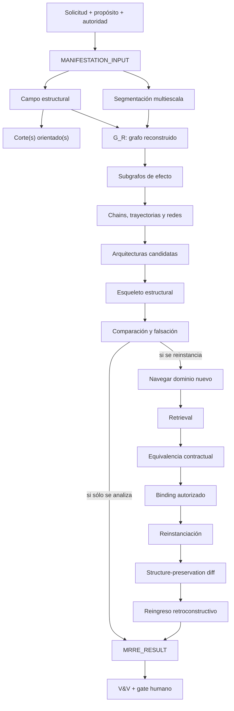
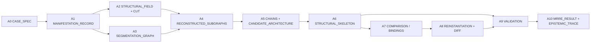
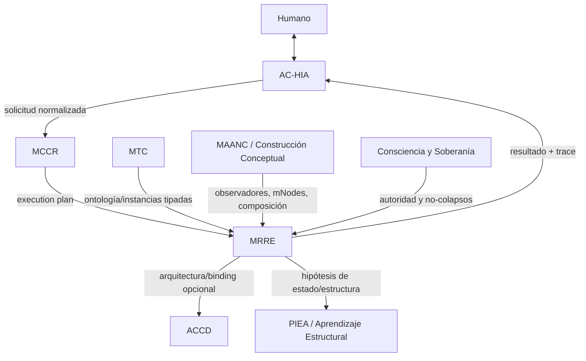

# Motor de Retroconstrucción y Reinstanciación Estructural

**ID:** `PC-MRRE`  
**Versión documental:** `0.2.0`  
**Estado:** `MATERIALIZED_CANDIDATE / OPERABLE_SPEC / NON_CANONICAL / HUMAN_REVIEW_REQUIRED`  
**Sistema anfitrión:** `COGNICIÓN_CENTRAL`  
**Bootstrap portable:** [MRRE-RUNTIME-BOOTSTRAP-001](como_leer_el_artefacto_adjunto.md)  
**Cognición local:** [COGNICION_CENTRAL_MRRE](cognicion_central_mrre.md)  
**Entrada agentiva:** [MRRE_MANIFEST](MRRE_MANIFEST.yaml)  
**Manual de ejecución:** [MRRE-AGENT-MANUAL](01_kernel_estable/09_manual_de_operacion_para_agentes.md)  
**Norma de referencias:** [MRRE-REF-NORM-01](00_gobierno/06_norma_de_referencias_y_citacion.md)

## 1. Qué es y qué permite hacer

MRRE es la capacidad de Cognición Central que convierte una manifestación observable —texto, imagen, secuencia, audio, comportamiento o composición multimodal— en una arquitectura funcional candidata que puede examinarse, compararse, falsarse y, si conserva sus invariantes, poblarse con materiales nuevos.

No busca una plantilla universal. Reconstruye estructuras particulares por manifestación y conserva la diferencia entre:

```text
lo observado
→ la organización reconstruida
→ la arquitectura candidata
→ el esqueleto abstraído
→ la nueva instancia
→ el resultado validado
```

Esta prioridad procede del antecedente dinámico [SRC-MRRE-EXAMPLE](90_historial/antecedentes/ejemplo.md) y de la deslinealización propuesta en [SRC-MRRE-SUBGRAPH](90_historial/antecedentes/MANIFESTACION_LINGUISTICA_COMO_SUBGRAFO_MRRE_v0_1.md). MRRE adapta la lógica de necesidad–requisito–función–V&V de [SRC-KI-11](../../../04_conocimiento_y_contexto/memoria_conceptual/incubacion-conceptual/ingenieria/kernel-de-ingenieria-1-1.txt) y la composición mediante mNodes de [SRC-MAANC-COMPOSITION](../../../04_conocimiento_y_contexto/memoria_conceptual/construccion_conceptual/modelo-composicion-cognitiva.md).

### Responsabilidades nucleares

1. registrar el portador y su procedencia sin confundirlos con una interpretación;
2. construir el campo estructural antes de recuperar patrones;
3. segmentar en varias resoluciones y mantener spans reversibles;
4. reconstruir nodos, relaciones, dependencias, funciones, efectos y chains;
5. proponer arquitecturas alternativas, no una intención supuestamente cierta;
6. abstraer esqueletos con roles, invariantes y dominio de variación;
7. recuperar candidatos, comprobar equivalencia y proponer bindings;
8. reinstanciar con `STRUCTURE_PRESERVATION_DIFF` y reingreso;
9. entregar trazas forward/backward, incertidumbre, fallos y falsadores;
10. detenerse ante ausencia de fuente, autoridad, evidencia o binding válido.

## 2. Modelo mental completo



La cadena no autoriza saltos. Por ejemplo, recuperar algo parecido no prueba equivalencia; equivalencia no autoriza binding; binding no prueba preservación. Estas separaciones están formalizadas en [MRRE-NON-COLLAPSE](01_kernel_estable/05_reglas_de_no_colapso.md) y se apoyan en la separación capacidad–contexto–manifestación de [SRC-MTC-MANIFESTATION](../MTC_MAQUINA_DE_TRANSDUCCION_COGNITIVA/10_mecanismo/14_capacidad_contexto_manifestacion.md).

## 3. Cómo empezar una ejecución

Una IA debe seguir este orden, incluso si ya conoce el dominio:

1. si recibiste el paquete sin contexto previo, ejecutar [MRRE-RUNTIME-BOOTSTRAP-001](como_leer_el_artefacto_adjunto.md);
2. usar este README para orientación profunda y [COGNICION_CENTRAL_MRRE](cognicion_central_mrre.md) como router local;
3. cargar [MRRE-AGENT-MANUAL](01_kernel_estable/09_manual_de_operacion_para_agentes.md);
4. resolver capacidades y schemas desde [MRRE_MANIFEST](MRRE_MANIFEST.yaml), no inferir módulos ocultos;
5. registrar la solicitud con [MRRE-SCHEMA-MANIFESTATION](02_contratos_y_schemas/manifestation_input.schema.yaml);
6. declarar operación, propósito, autoridad, fuentes, restricciones y condición de terminación;
7. construir un `CASE_SPEC` usando la plantilla de [MRRE-WORKBOOK](03_protocolos_operacionales/07_libro_de_trabajo_y_algoritmos.md#plantilla-a-case-spec);
8. ejecutar P0–P13 en [MRRE-PROTOCOL-GENERAL](01_kernel_estable/07_protocolo_general_mrre.md);
9. producir cada artefacto intermedio aunque el resultado sea parcial;
10. validar y entregar con trazas, alternativas y condición de reapertura.

### Preguntas de apertura obligatorias

| Pregunta | Si falta | Acción |
|---|---|---|
| ¿Qué operación se solicita? | no hay objetivo ejecutable | pedir aclaración o proponer una ruta marcada `HYPOTHESIS` |
| ¿Cuál es la manifestación y dónde está su portador? | no hay objeto recuperable | `WAITING_SOURCE` |
| ¿Qué debe conservarse o descubrirse? | el corte no puede orientarse | registrar `EXPECTED_RESULT_PENDING` |
| ¿Qué fuentes y transformaciones están autorizadas? | riesgo de expansión | `HG-SOURCE` |
| ¿Qué nivel de inferencia se permite? | riesgo epistémico | usar el nivel más bajo y declarar límite |
| ¿Quién acepta y quién puede promover? | capacidad sin autoridad | ejecutar sin promover |

## 4. Selector de operación

| Necesidad | Operación | Protocolo | Resultado mínimo | Detenerse cuando |
|---|---|---|---|---|
| descubrir cómo está organizada una manifestación | `RETROCONSTRUIR` | [MRRE-PROC-RETRO](03_protocolos_operacionales/02_retroconstruccion.md) | campo, segmentación, subgrafos, chains, candidata, esqueleto, traza | no hay soporte relacional suficiente |
| poblar una estructura con materiales nuevos | `REINSTANCIAR` | [MRRE-PROC-REINSTATE](03_protocolos_operacionales/04_reinstanciacion.md) | bindings, instancia, diff y reingreso | un rol crítico queda sin binding |
| examinar similitudes/diferencias sin copiar | `COMPARAR` | [MRRE-PROC-COMPARE](03_protocolos_operacionales/05_comparacion_y_transferencia.md) | mappings tipados, diff e incompatibilidades | se mezclan niveles no equivalentes |
| integrar varios portadores/modalidades | `TRIANGULAR` | [MRRE-PROC-TRIANGULATE](03_protocolos_operacionales/03_triangulacion_multimanifestacion.md) | campo federado con conflictos y procedencia | identidad común no está soportada |
| comprobar un artefacto o una ejecución | `VALIDAR` | [MRRE-VAL-PLAN](08_validacion_y_pruebas/01_plan_de_verificacion_y_validacion.md) | pruebas, falsaciones y dictamen | evidencia o validador es insuficiente |

Antes de cualquier matching se ejecuta [MRRE-PROC-NAVIGATE](03_protocolos_operacionales/01_navegacion_estructural.md). El feedback usa [MRRE-PROC-FEEDBACK](03_protocolos_operacionales/06_feedback_y_actualizacion.md) y nunca reescribe el canon automáticamente.

## 5. Índice operativo del paquete

| Parte | Pregunta que resuelve | Cómo se usa | Artefacto o decisión |
|---|---|---|---|
| [00_gobierno](00_gobierno/01_ficha_del_paquete.md) | ¿quién puede hacer qué y con qué fuentes? | leer antes de ampliar alcance, persistir o promover | gates, límites, procedencia |
| [01_kernel_estable](01_kernel_estable/01_definicion_fronteras_e_invariantes.md) | ¿qué no puede romperse entre dominios? | aplicar invariantes y no-colapsos en cada fase | criterios de validez/falsación |
| [02_contratos_y_schemas](02_contratos_y_schemas/manifestation_input.schema.yaml) | ¿qué forma exacta tienen entradas y salidas? | validar cada artefacto antes de consumirlo | objetos tipados interoperables |
| [03_protocolos_operacionales](03_protocolos_operacionales/07_libro_de_trabajo_y_algoritmos.md) | ¿qué pasos ejecutar y qué escribir? | usar el workbook como cuaderno de run | secuencia P0–P13 y plantillas |
| [04_runtime](04_runtime/01_grafo_de_ejecucion.md) | ¿qué componente se activa y cómo falla? | resolver registry, dependencias y estados | plan ejecutable y eventos |
| [05_acervo_estructural](05_acervo_estructural/01_indice_federado_de_patrones_mrre.md) | ¿qué patrones pueden ayudar después de navegar? | recuperar por contrato, no por vocabulario | candidatos, invariantes, procedencia |
| [06_especializaciones](06_especializaciones/01_retroconstruccion_textual.md) | ¿qué cambia por modalidad o objetivo? | añadir observadores sin cambiar el kernel | adapter/especialización |
| [07_integraciones](07_integraciones/01_AC_HIA_MRRE.md) | ¿cómo se conecta con Cognición Central? | aplicar contratos de frontera y handoff | intercambio con AC-HIA, MCCR, MTC, etc. |
| [08_validacion_y_pruebas](08_validacion_y_pruebas/01_plan_de_verificacion_y_validacion.md) | ¿cómo se demuestra que funciona? | ejecutar pruebas estructurales y documentales | informe PASS/PARTIAL/FAIL |
| [09_casos_y_ejemplos](09_casos_y_ejemplos/README.md) | ¿cómo se ve una ejecución completa? | recorrer fuente → artefactos → resultado | dossiers reproducibles |
| [10_artefactos_generados](10_artefactos_generados/README.md) | ¿dónde se conservan outputs no canónicos? | persistir por clase con manifest y trace | análisis, arquitecturas, instancias, diffs |
| [90_historial](90_historial/README.md) | ¿de dónde vino el diseño? | consultar genealogía; no ejecutar como especificación vigente | antecedentes y decisiones |

## 6. Artefactos que una ejecución debe dejar



Cada artefacto debe incluir `artifact_id`, `run_id`, versión de schema, entradas, fuente/localizador, operación que lo produjo, estatus epistémico, alternativas, fallos y referencias a artefactos anteriores. Si no existe un artefacto porque una fase no aplica, se registra `NOT_APPLICABLE` con razón; no se omite silenciosamente.

Los formatos completos están en [MRRE-WORKBOOK](03_protocolos_operacionales/07_libro_de_trabajo_y_algoritmos.md) y los contratos normativos en [MRRE-SCHEMAS](02_contratos_y_schemas/mrre_result.schema.yaml).

## 7. Qué significa detectar un chain

Un chain no es sólo una secuencia de frases. Es una ruta tipada en la que cada transición declara fuente, condición, dirección y función. El proceso mínimo es:

1. construir nodos desde unidades reversibles;
2. proponer edges observados o inferidos por separado;
3. buscar rutas que conecten estado inicial, mediaciones y efecto;
4. clasificar la ruta (`causal`, `habilitación`, `argumentativa`, `identidad`, `transformación`, `transducción`, `narrativa`);
5. ejecutar contrafactual de remoción de nodo/edge;
6. conservar bifurcaciones, ciclos y rutas alternativas;
7. integrar chains compatibles en red sin forzar linealidad.

El algoritmo y las pruebas están en [MRRE-WORKBOOK § Algoritmo D](03_protocolos_operacionales/07_libro_de_trabajo_y_algoritmos.md#algoritmo-d-detección-y-prueba-de-chains). El contraste histórico cadena/red se conserva en [SRC-MRRE-READING](90_historial/antecedentes/lectura.md).

## 8. Sistema de referencias y procedencia

Toda cita debe usar la sintaxis científica definida por [MRRE-REF-NORM-01](00_gobierno/06_norma_de_referencias_y_citacion.md). La bibliografía navegable [MRRE-BIB-CC](00_gobierno/07_bibliografia_cognicion_central.md) registra las fuentes externas y su función.

Una mención como “según MCCR” no es válida. La forma correcta enlaza el contrato específico, por ejemplo: el plan de ejecución se consume de [SRC-MCCR-PLAN](../MOTOR_DE_CONFIGURACION_COGNITIVA_EN_RUNTIME/01_nucleo/05_execution_plan_definicion_y_contrato.md), los grafos de capacidades se adaptan de [SRC-MCCR-GRAPHS](../MOTOR_DE_CONFIGURACION_COGNITIVA_EN_RUNTIME/01_nucleo/06_grafos_possible_available_active.md) y los eventos se entregan según [SRC-MCCR-RUNLOG](../MOTOR_DE_CONFIGURACION_COGNITIVA_EN_RUNTIME/03_contratos/06_trazabilidad_observabilidad_y_run_log.md).

## 9. Casos operativos

| Caso | Qué enseña | Fuente | Dossier |
|---|---|---|---|
| Reuters | dos textos reales, campo común hipotético, cortes, chains y reinstanciación | [CASE-SRC-REUTERS-V1](../../../03_aplicaciones/creacion_de_contenido/referencias_de_estilo/interpretacion_de_eventos/ejemplos_de_noticias/noticia-cambios_en_mandos_militares/unidad_de_analisis_1/noticiero-reuters-v1.md) y [CASE-SRC-REUTERS-V2](../../../03_aplicaciones/creacion_de_contenido/referencias_de_estilo/interpretacion_de_eventos/ejemplos_de_noticias/noticia-cambios_en_mandos_militares/unidad_de_analisis_1/noticiero-reuters-v2.md) | [CASE-MRRE-REUTERS](09_casos_y_ejemplos/reuters/DOSSIER_OPERATIVO.md) |
| Collar | cascada cognición→acción→capacidad→contexto→manifestación | [SRC-MTC-COLLAR](../MTC_MAQUINA_DE_TRANSDUCCION_COGNITIVA/30_especializaciones/30_fraude_collar.md) | [CASE-MRRE-COLLAR](09_casos_y_ejemplos/caso_del_collar/DOSSIER_OPERATIVO.md) |
| Aspiradora | mecanismo parte–función–efecto y riesgo de compresión léxica | entrada sintética reproducible | [CASE-MRRE-VACUUM](09_casos_y_ejemplos/aspiradora/DOSSIER_OPERATIVO.md) |
| Multimodal | procedencia por modalidad, invariantes y contradicción localizada | metadata sintética + fuentes locales | [CASE-MRRE-MULTIMODAL](09_casos_y_ejemplos/triangulacion_multimodal/DOSSIER_OPERATIVO.md) |
| Puente del Valle | conducta correcta ante una fuente ausente | `PATH_PENDING_CONFIRMATION` | [CASE-MRRE-BRIDGE](09_casos_y_ejemplos/puente_del_valle/DOSSIER_OPERATIVO.md) |

Un caso es aceptable sólo si muestra fuente, segmentación, campo/corte, subgrafos, chains, arquitectura, esqueleto, alternativas, validación y referencias a los procesos que lo construyeron. La convención vive en [MRRE-CASE-INDEX](09_casos_y_ejemplos/README.md).

## 10. Conexiones con Cognición Central



- AC-HIA presenta y normaliza; MRRE no sustituye su contrato ([SRC-ACHIA-CONTRACTS](../ARQUITECTURA_DE_COMUNICACION_HUMANO_IA/03_contratos/01_contratos_de_intercambio.md), `ADOPTADO`).
- MCCR configura módulos, presupuesto y ruta; MRRE ejecuta semántica estructural ([SRC-MCCR-CONFIG](../MOTOR_DE_CONFIGURACION_COGNITIVA_EN_RUNTIME/01_nucleo/03_modelo_de_configuracion_operacional.md), `ADAPTADO`).
- MTC conserva su ontología; MRRE no renombra sus tipos para apropiárselos ([SRC-MTC-ONTOLOGY](../MTC_MAQUINA_DE_TRANSDUCCION_COGNITIVA/00_core/01_ontologia_y_tipos.md), `ADOPTADO`).
- ACCD es consumidor opcional; una salida MRRE no es una realización ACCD ([SRC-ACCD-EQUATION](../../../03_aplicaciones/creacion_de_contenido/accd/base_teorica_ecuacion_de_protocolo_ACCD.md), `RELACIONADO`).
- PIEA aporta evidencia del receptor; MRRE sólo proyecta activación hasta obtenerla ([SRC-PIEA-TRANSITION](../PATRON_DE_INTEGRACION_ESTRUCTURAL_ACUMULATIVA/10_mecanismo/10_transicion_de_estado.md), `ADOPTADO`).

Los contratos completos están en [07_integraciones](07_integraciones/01_AC_HIA_MRRE.md).

## 11. Errores que invalidan una ejecución

- entregar únicamente una interpretación final sin artefactos intermedios;
- usar coincidencia léxica como prueba de equivalencia;
- llamar chain a una lista sin edges, condiciones ni contrafactuales;
- inferir intención, activación receptoral o causalidad fuerte desde la superficie;
- consultar el catálogo antes de construir el campo y sesgar la navegación;
- copiar una estructura y cambiar palabras sin validar función/topología;
- ocultar un hueco, una alternativa o una fuente ausente;
- citar un nombre o una ruta absoluta sin enlace relativo;
- guardar un resultado como patrón o canon sin gate humano.

## 12. Cierre, validación y promoción

Una ejecución termina con uno de estos estados: `COMPLETED`, `PARTIAL`, `ALTERNATIVES_PENDING`, `WAITING_HUMAN_DECISION`, `FAILED_RECOVERABLE`, `FAILED_TERMINAL` o `REVALIDATION_REQUIRED`. Debe explicar por qué y cómo reabrirla.

La validación documental y operativa se ejecuta con [MRRE-VAL-DOC](08_validacion_y_pruebas/04_validacion_de_referencias_y_operabilidad.md). Los outputs persisten en [MRRE-ARTIFACTS](10_artefactos_generados/README.md), pero persistencia no implica verdad, patrón ni canon. La secuencia es:

```text
CANDIDATE → EVIDENCE → REVIEW → HUMAN_DECISION → PROMOTED | REJECTED | REWORK
```

La autoridad humana exigida por [SRC-MCCR-AUTH](../MOTOR_DE_CONFIGURACION_COGNITIVA_EN_RUNTIME/03_contratos/07_autoridad_permisos_validadores_y_gates.md) no puede ser simulada por un componente MRRE.
