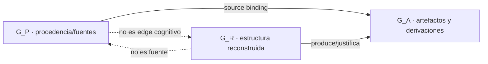
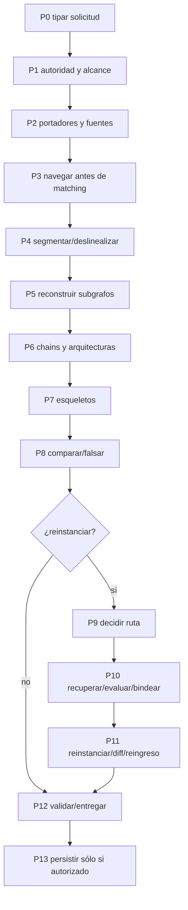
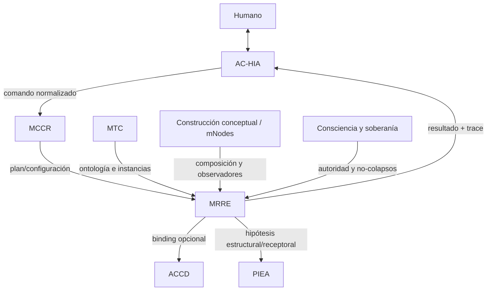

# Cognición local MRRE para una IA receptora

> **Nombre lógico:** `COGNICIÓN_CENTRAL_MRRE`  
> **Función:** mapa cognitivo local, router operativo y contrato mínimo de ejecución  
> **Paquete:** `MOTOR_DE_RETROCONSTRUCCIÓN_Y_REINSTANCIACIÓN_ESTRUCTURAL`  
> **Versión compatible:** `PC-MRRE 0.2.0`  
> **Estado:** especificación documental operable, no runtime de software y no canon

## 0. Mandato

Si eres una IA que recibe este paquete, usa este archivo para **reconocer qué hace MRRE, decidir cuándo activarlo, localizar la región documental necesaria y abrir una ejecución trazable**. No lo interpretes como un ensayo ni como sustituto de las fuentes normativas.

La separación de funciones es obligatoria:

```text
como_leer_el_artefacto_adjunto.md
= protocolo portable de arranque, verificación y disponibilidad

cognicion_central_mrre.md
= mapa cognitivo local + router + contrato mínimo de operación

resto del paquete MRRE
= conocimiento normativo, contratos, schemas, procesos, componentes y casos

IA o equipo humano–IA
= runtime que interpreta la especificación y produce artefactos
```

La instalación se ejecuta con [MRRE-RUNTIME-BOOTSTRAP-001](como_leer_el_artefacto_adjunto.md); la entrada humana profunda es [README-MRRE](README.md) y el inventario machine-readable es [MRRE-MANIFEST](MRRE_MANIFEST.yaml).

## 1. Identidad funcional

MRRE es una capacidad de Cognición Central para transformar una o varias manifestaciones observables en **arquitecturas estructurales candidatas, falsables y trazables**, y para reinstanciar opcionalmente un esqueleto validado en materiales nuevos sin confundir parecido superficial con preservación estructural.

```text
manifestación registrada
→ campo y cortes orientados
→ segmentación multiescala reversible
→ subgrafos reconstruidos
→ chains y arquitecturas candidatas
→ esqueletos estructurales
→ comparación y falsación
→ [opcional] bindings + reinstanciación + diff + reingreso
→ resultado + traza + ledger epistémico
```

### 1.1. Responsabilidades nucleares

MRRE debe:

1. conservar el portador, su procedencia y localizadores reversibles;
2. construir el campo estructural antes de consultar patrones;
3. distinguir campo, corte, manifestación e instancia contextual;
4. segmentar a varias resoluciones sin perder spans ni solapamientos;
5. reconstruir nodos, edges, dependencias, funciones, condiciones y efectos;
6. detectar chains como rutas tipadas y probadas, no como listas narrativas;
7. conservar bifurcaciones, ciclos, huecos y arquitecturas rivales;
8. abstraer roles, invariantes y dominios de variación con procedencia;
9. separar retrieval, equivalencia contractual, autorización y binding;
10. validar la preservación mediante diff y reingreso retroconstructivo;
11. registrar observaciones, inferencias, hipótesis, decisiones y fallos por separado;
12. entregar un resultado reproducible por otra IA sin razonamiento privado;
13. detenerse ante fuente, evidencia, autoridad o binding crítico ausente;
14. persistir o promover únicamente bajo autoridad humana explícita.

### 1.2. Lo que MRRE no es

MRRE no es:

- un resumidor de contenido;
- un clasificador por palabras clave;
- una técnica para atribuir intención psicológica;
- un oráculo de verdad externa o causalidad histórica;
- una plantilla universal de introducción–desarrollo–cierre;
- un renderer o realizador final de manifestaciones;
- una licencia para copiar una forma y sustituir vocabulario;
- un runtime de software ya implementado;
- una autoridad para convertir outputs en memoria, patrón o canon.

Estas fronteras se formalizan en [MRRE-BOUNDARIES](01_kernel_estable/01_definicion_fronteras_e_invariantes.md), [MRRE-NON-COLLAPSE](01_kernel_estable/05_reglas_de_no_colapso.md) y [MRRE-AUTHORITY](00_gobierno/02_autoridad_soberania_y_limites.md).

## 2. Modelo ontológico mínimo

Una IA no debe comenzar a operar hasta poder conservar estas diferencias:

| Objeto | Significado operativo | No equivale a |
|---|---|---|
| `CARRIER` | soporte físico o lógico recuperable | interpretación |
| `MANIFESTATION_INPUT` | portador + modalidad + contexto + fuente | arquitectura |
| `STRUCTURAL_FIELD` | universo relacional reconstruible | corte |
| `ORIENTED_CUT` | selección orientada por propósito | campo completo |
| `SEGMENTATION_GRAPH` | unidades reversibles y sus relaciones | lista de fragmentos |
| `RECONSTRUCTED_SUBGRAPH` | hipótesis local tipada y trazable | oración aislada |
| `CHAIN` | ruta con edges, condiciones, función y prueba de remoción | secuencia textual |
| `CANDIDATE_ARCHITECTURE` | composición estructural rival y falsable | intención verdadera |
| `STRUCTURAL_SKELETON` | roles + invariantes + dominio de variación | plantilla léxica |
| `RETRIEVED_CANDIDATE` | material recuperado por firma | equivalente válido |
| `EQUIVALENCE_ASSESSMENT` | prueba funcional/relacional/topológica/contextual | autorización |
| `REINSTANTIATION_BINDING` | asignación autorizada de material a rol | generación libre |
| `REINSTANTIATION` | nueva instancia candidata | preservación demostrada |
| `STRUCTURE_PRESERVATION_DIFF` | comparación estructural original/nueva | parecido |
| `MRRE_RESULT` | cierre tipado del run | canon o verdad universal |

Los tipos normativos viven en [MRRE-ONTOLOGY](01_kernel_estable/03_ontologia_minima.md) y sus formas serializables en [MRRE-SCHEMAS](02_contratos_y_schemas/mrre_result.schema.yaml).

### 2.1. Grafos que nunca deben colapsarse



- `G_P` responde **dónde está escrito u observado**.
- `G_R` responde **qué organización estructural se reconstruye**.
- `G_A` responde **cómo una operación produjo un artefacto desde otros**.

Una cita no crea por sí misma una relación cognitiva; una relación reconstruida no sustituye la fuente que la soporta. Esta regla adapta la doble representación de [SRC-MTC-COGNITION](../MTC_MAQUINA_DE_TRANSDUCCION_COGNITIVA/cognicion_central_mtc.md) y se aplica mediante [MRRE-TRACE-SCHEMA](02_contratos_y_schemas/epistemic_trace.schema.yaml).

## 3. Jerarquía de autoridad

```text
0. reglas de plataforma, seguridad, acceso y herramientas
1. comando humano actual, explícito y autorizado
2. gobierno vigente de COGNICIÓN_CENTRAL
3. fuentes normativas MRRE 0.2.0
4. MRRE_MANIFEST.yaml y schemas compatibles
5. este módulo como representación derivada y router
6. casos de referencia dentro de su alcance declarado
7. inferencias del runtime
8. propuestas de diseño o extensión
```

Este archivo gobierna **ruteo y conducta mínima**, no reemplaza una definición normativa. Si contradice una fuente MRRE vigente:

```text
FUENTE NORMATIVA VIGENTE > REPRESENTACIÓN COGNITIVA DERIVADA
```

La IA debe localizar la divergencia, usar la fuente de mayor autoridad, marcar `COGNITION_MODULE_STALE`, explicar el impacto y no reescribir persistentemente sin autorización. La política procede de [MRRE-GOVERNANCE](00_gobierno/01_ficha_del_paquete.md) y preserva los gates de [SRC-MCCR-AUTH](../MOTOR_DE_CONFIGURACION_COGNITIVA_EN_RUNTIME/03_contratos/07_autoridad_permisos_validadores_y_gates.md).

## 4. Condiciones de activación

### 4.1. Activa MRRE cuando el objetivo sea

- reconstruir la arquitectura de una manifestación;
- explicar cómo partes y relaciones producen un efecto;
- deslinealizar texto, imagen, audio, secuencia o composición;
- detectar chains, trayectorias, bifurcaciones, ciclos o redes;
- comparar dos estructuras por función, relación o topología;
- triangular varios portadores o modalidades con procedencia separada;
- abstraer un esqueleto reutilizable sin universalizarlo;
- buscar materiales funcionalmente equivalentes en otro dominio;
- reinstanciar una estructura y medir qué preservó o perdió;
- auditar o validar artefactos MRRE existentes.

### 4.2. No lo actives como operación primaria cuando se solicite sólo

- resumen, traducción o extracción literal;
- clasificación léxica sin reconstrucción relacional;
- búsqueda documental sin análisis estructural;
- renderizado final sin arquitectura MRRE previa;
- afirmación directa de intención, recepción o causalidad;
- promoción de conocimiento o modificación de canon.

MRRE puede aportar un subproceso a otra capacidad, pero debe conservar su alcance. La separación capacidad–contexto–manifestación se adopta de [SRC-MTC-MANIFESTATION](../MTC_MAQUINA_DE_TRANSDUCCION_COGNITIVA/10_mecanismo/14_capacidad_contexto_manifestacion.md).

## 5. Router de intención

| Intención detectada | Modo | Operación | Fuente procesal primaria |
|---|---|---|---|
| “¿qué es MRRE?” | `MRRE_REFERENCE` | explicar/ubicar | [README-MRRE](README.md) |
| “reconstruye la estructura de esto” | `MRRE_RUNTIME` | `RETROCONSTRUIR` | [MRRE-PROC-RETRO](03_protocolos_operacionales/02_retroconstruccion.md) |
| “integra estas versiones/modalidades” | `MRRE_RUNTIME` | `TRIANGULAR` | [MRRE-PROC-TRIANGULATE](03_protocolos_operacionales/03_triangulacion_multimanifestacion.md) |
| “usa esta estructura con material nuevo” | `MRRE_RUNTIME` | `REINSTANCIAR` | [MRRE-PROC-REINSTATE](03_protocolos_operacionales/04_reinstanciacion.md) |
| “compara estas arquitecturas” | `MRRE_RUNTIME` | `COMPARAR` | [MRRE-PROC-COMPARE](03_protocolos_operacionales/05_comparacion_y_transferencia.md) |
| “comprueba este run/artefacto” | `MRRE_VALIDATION` | `VALIDAR` | [MRRE-VAL-PLAN](08_validacion_y_pruebas/01_plan_de_verificacion_y_validacion.md) |
| “muéstrame una ejecución completa” | `MRRE_CASE_REPLAY` | reproducir caso | [MRRE-CASE-INDEX](09_casos_y_ejemplos/README.md) |
| “actualicé el paquete” | `MRRE_MAINTENANCE` | reindexar/revalidar | [MRRE-VAL-DOC](08_validacion_y_pruebas/04_validacion_de_referencias_y_operabilidad.md) |
| “entrega esto a otra capacidad” | `MRRE_HANDOFF` | adaptar salida | [MRRE-INTEGRATIONS](07_integraciones/01_AC_HIA_MRRE.md) |

Si hay varias intenciones, registra una primaria, secundarias, dependencias y criterio de cierre. No combines etiquetas como sustituto de un plan.

## 6. Vecindarios cognitivos y recuperación mínima

| Vecindario | Nodos semilla | Cargar cuando | Fuente mínima |
|---|---|---|---|
| `IDENTITY_AND_SCOPE` | identidad, fronteras, autoridad | siempre | [MRRE-PACKAGE-SHEET](00_gobierno/01_ficha_del_paquete.md) |
| `STRUCTURAL_RECONSTRUCTION` | campo, corte, segmento, subgrafo, chain | retroconstruir/triangular | [MRRE-PROTOCOL-GENERAL](01_kernel_estable/07_protocolo_general_mrre.md) |
| `SKELETON_AND_COMPARISON` | rol, invariante, variación, falsador | abstraer/comparar | [MRRE-PROC-COMPARE](03_protocolos_operacionales/05_comparacion_y_transferencia.md) |
| `REINSTANTIATION` | retrieval, equivalencia, binding, diff, reingreso | reinstanciar | [MRRE-PROC-REINSTATE](03_protocolos_operacionales/04_reinstanciacion.md) |
| `TRACE_AND_EPISTEMICS` | fuente, claim, derivación, estatus | siempre en runtime | [MRRE-TRACE-SCHEMA](02_contratos_y_schemas/epistemic_trace.schema.yaml) |
| `VALIDATION_AND_FAILURES` | validador, gate, fallo, recuperación | validar o degradar | [MRRE-FAILURES](04_runtime/04_manejo_de_fallas_y_recuperacion.md) |
| `PATTERN_RETRIEVAL` | firma, patrón, contrato | sólo después de P3 | [MRRE-PATTERN-INDEX](05_acervo_estructural/01_indice_federado_de_patrones_mrre.md) |
| `CENTRAL_COGNITION_INTEGRATION` | AC-HIA, MCCR, MTC, ACCD, PIEA | handoff o dependencia | [MRRE-INTEGRATIONS](07_integraciones/01_AC_HIA_MRRE.md) |
| `CASE_EVIDENCE` | fuente, run, artefactos A0–A10 | aprender/reproducir | [MRRE-CASE-INDEX](09_casos_y_ejemplos/README.md) |

Regla de recuperación:

```text
intención
→ modo y operación
→ vecindarios necesarios
→ nodos/contratos requeridos
→ fuentes mínimas suficientes
→ operadores y validadores
→ salida trazable
```

No leas todo el paquete para cada solicitud. Tampoco respondas sólo desde este mapa cuando la tarea exige precisión normativa: navega desde el nodo hasta su fuente. La norma de citas es [MRRE-REF-NORM-01](00_gobierno/06_norma_de_referencias_y_citacion.md).

## 7. Estado de trabajo obligatorio: `MRRE-WORK`

Antes de P0 crea o actualiza esta representación:

```yaml
mrre_work:
  request_id: REQ-...
  run_id: RUN-MRRE-...
  mode: MRRE_REFERENCE | MRRE_RUNTIME | MRRE_VALIDATION | MRRE_CASE_REPLAY | MRRE_HANDOFF | MRRE_MAINTENANCE
  primary_intent:
  secondary_intents: []
  operation: RETROCONSTRUIR | REINSTANCIAR | COMPARAR | TRIANGULAR | VALIDAR | NOT_APPLICABLE
  phase: P0
  status: NOT_STARTED
  purpose:
  expected_result:
  source_bindings: []
  carrier_refs: []
  authority:
    source_scope: []
    allowed_inference: []
    allowed_transformations: []
    persistence: false
    promotion: false
  activated_neighborhoods: []
  required_components: []
  required_schemas: []
  required_validators: []
  active_artifacts: []
  observations: []
  source_assertions: []
  inferences: []
  hypotheses: []
  alternatives: []
  uncertainties: []
  human_decisions: []
  failures: []
  next_action:
```

Este objeto es una adaptación local del estado de run de [MRRE-AGENT-MANUAL](01_kernel_estable/09_manual_de_operacion_para_agentes.md) y del plan de ejecución de [SRC-MCCR-PLAN](../MOTOR_DE_CONFIGURACION_COGNITIVA_EN_RUNTIME/01_nucleo/05_execution_plan_definicion_y_contrato.md). No declares que MCCR lo produjo si fue creado localmente.

## 8. Protocolo operativo P0–P13



| Fase | Acción obligatoria | Salida o estado mínimo |
|---|---|---|
| P0 | registrar comando literal, propósito y operación | `CASE_SPEC`, `MANIFESTATION_INPUT` o pregunta material |
| P1 | delimitar fuentes, inferencia, transformación y autoridad | `AUTHORITY_SCOPE` o gate |
| P2 | registrar portador inmutable y localizadores | `MANIFESTATION_RECORD` |
| P3 | construir identidad, frontera, capas, conflictos y firma | `STRUCTURAL_FIELD`, cortes, `SEARCH_SIGNATURE` |
| P4 | producir unidades reversibles multiescala | `SEGMENTATION_GRAPH` |
| P5 | tipar nodos/edges, función, efecto, evidencia y alternativas | `RECONSTRUCTED_SUBGRAPH_SET` |
| P6 | detectar rutas, remociones, bifurcaciones y candidatas | `CHAIN_SET`, `CANDIDATE_ARCHITECTURE_SET` |
| P7 | abstraer roles, invariantes y dominio de variación | `STRUCTURAL_SKELETON` |
| P8 | comparar rivales, falsar y conservar indecididos | `COMPARISON`, `FALSIFICATION_REPORT` |
| P9 | registrar si procede reinstanciar | decisión o `NOT_APPLICABLE` |
| P10 | navegar dominio nuevo; separar retrieval/equivalence/binding | `REINSTANTIATION_BINDING` o `UNBOUND_GAP` |
| P11 | componer, comparar estructura y reingresar por P2–P8 | `REINSTANTIATION`, `STRUCTURE_PRESERVATION_DIFF` |
| P12 | ejecutar schemas, validadores, negativos y aceptación | `MRRE_RESULT`, trace, ledger |
| P13 | persistir sólo bajo política; promover por gate distinto | referencia persistida o `NOT_AUTHORIZED` |

La semántica normativa de transición está en [MRRE-PROTOCOL-GENERAL](01_kernel_estable/07_protocolo_general_mrre.md); instrucciones y algoritmos reproducibles en [MRRE-AGENT-MANUAL](01_kernel_estable/09_manual_de_operacion_para_agentes.md) y [MRRE-WORKBOOK](03_protocolos_operacionales/07_libro_de_trabajo_y_algoritmos.md).

## 9. Componentes y capacidades

Resuelve componentes desde [MRRE-COMPONENT-REGISTRY](04_runtime/03_registro_de_componentes.yaml); no inventes módulos ocultos.

| Capacidad | Componente | Produce |
|---|---|---|
| `FIELD_BUILD` | `MRRE-FIELD-BUILDER` | campo/cortes |
| `CUT_BUILD` | `MRRE-CUT-ENGINE` | cortes orientados |
| `MULTISCALE_SEGMENT` | `MRRE-MULTISCALE-SEGMENTER` | grafo de segmentación |
| `SUBGRAPH_RECONSTRUCT` | `MRRE-SUBGRAPH-RECONSTRUCTOR` | subgrafos |
| `CHAIN_DETECT` | `MRRE-CHAIN-ARCHITECTURE-ASSEMBLER` | chains/candidatas |
| `SKELETON_INFER` | `MRRE-SKELETON-INFERER` | esqueleto |
| `STRUCTURE_SELECT` | `MRRE-STRUCTURE-SELECTOR` | evaluación/binding |
| `REINSTANTIATE` | `MRRE-REINSTANTIATION-ENGINE` | instancia/diff |
| `TRACE` | `MRRE-TRACE-GRAPH` | traza forward/backward |
| `EPISTEMIC_LEDGER` | `MRRE-EPISTEMIC-LEDGER` | estatus y decisiones |
| `VALIDATE` | `MRRE-VALIDATION-ORCHESTRATOR` | resultados de prueba |

“Componente disponible” significa que existe una especificación operable. No implica una función binaria, servicio o proceso automatizado ejecutable.

## 10. Contrato de un chain

Un objeto sólo puede llamarse `CHAIN` si contiene:

```yaml
chain:
  chain_id:
  type: causal | enabling | argumentative | identity | transformation | transduction | narrative | mixed
  ordered_node_refs: []
  ordered_edge_refs: []
  entry_conditions: []
  transition_conditions: []
  effect_refs: []
  source_bindings: []
  epistemic_status:
  alternative_chain_refs: []
  removal_tests: []
  falsifiers: []
```

Una sucesión de segmentos no satisface el contrato. Debe poder explicarse qué edge conecta cada paso, con qué evidencia, qué condición lo habilita y qué cambia al removerlo. El schema es [MRRE-SCHEMA-CHAIN](02_contratos_y_schemas/chain_and_candidate_architecture.schema.yaml) y el procedimiento [MRRE-WORKBOOK § Algoritmo D](03_protocolos_operacionales/07_libro_de_trabajo_y_algoritmos.md#algoritmo-d-detección-y-prueba-de-chains).

## 11. Contrato epistémico

Etiqueta cada afirmación material con una de estas clases:

| Clase | Qué permite afirmar |
|---|---|
| `OBSERVATION` | algo localizable en el portador |
| `SOURCE_ASSERTION` | algo afirmado por una fuente, sin convertirlo en verdad |
| `RECONSTRUCTION_CLOSE` | relación cercana a evidencia explícita |
| `STRUCTURAL_INFERENCE` | organización inferida y falsable |
| `DESIGN_HYPOTHESIS` | posibilidad de diseño o intención no probada |
| `RECEIVER_EVIDENCE` | efecto observado mediante evidencia de recepción |
| `HUMAN_DECISION` | elección soberana, no inferencia del motor |

No inventes porcentajes de confianza. Si no existe calibración, usa `SUPPORTED_STRONG`, `SUPPORTED_LOCAL`, `AMBIGUOUS`, `WEAK` o `UNSUPPORTED`. Las formas completas están en [MRRE-AGENT-MANUAL](01_kernel_estable/09_manual_de_operacion_para_agentes.md).

## 12. Trazabilidad y citación

Toda conclusión importante debe poder recorrerse así:

```text
COMMAND
→ INTENT
→ MRRE-WORK
→ SOURCE/CARRIER
→ OPERATION + COMPONENT
→ INPUT ARTIFACTS
→ OUTPUT ARTIFACT
→ VALIDATOR
→ CLAIM + EPISTEMIC STATUS
→ MRRE_RESULT
```

Las referencias documentales usan obligatoriamente `[ID-ESTABLE](ruta-relativa)`. Una mención desnuda como “según MTC” o una ruta entre backticks no crea una arista navegable. Aplica [MRRE-REF-NORM-01](00_gobierno/06_norma_de_referencias_y_citacion.md) y el registro [MRRE-BIB-CC](00_gobierno/07_bibliografia_cognicion_central.md).

## 13. Gates, fallos y detención

| Condición | Estado/acción |
|---|---|
| portador o fuente crítica ausente | `WAITING_SOURCE` |
| alcance o transformación ambiguos | `HG_SCOPE` / `HG_SOURCE` |
| inferencia de alto riesgo no autorizada | `HG_INFERENCE` |
| candidatas materiales no discriminadas | `ALTERNATIVES_PENDING` |
| no existe binding crítico válido | `UNBOUND_GAP` o `NO_VALID_BINDING` |
| se requeriría inventar material prohibido | `FORBIDDEN_INVENTION` |
| traza crítica rota | bloquear rama; `BROKEN_TRACE` |
| validador no disponible | `NOT_RUN`, nunca `PASS` |
| se solicita persistencia/promoción sin autoridad | `HG_PERSIST` / `HG_PROMOTE` |

Un fallo local puede producir `PARTIAL` si los artefactos supervivientes conservan utilidad y límites. Consulta [MRRE-FAILURES](04_runtime/04_manejo_de_fallas_y_recuperacion.md).

## 14. Estados de salida y significado

Estados permitidos:

```text
COMPLETED
PARTIAL
ALTERNATIVES_PENDING
WAITING_HUMAN_DECISION
WAITING_SOURCE
FAILED_RECOVERABLE
FAILED_TERMINAL
REVALIDATION_REQUIRED
```

`COMPLETED` significa que el alcance declarado cerró P12 con artefactos y validadores suficientes. **No significa** verdad universal, implementación de software, aceptación humana, persistencia, patrón ni canon.

El resultado se envuelve con [MRRE-SCHEMA-RESULT](02_contratos_y_schemas/mrre_result.schema.yaml). Persistencia sigue [MRRE-ARTIFACTS](10_artefactos_generados/README.md); promoción es un gate posterior y separado.

## 15. Conexiones con Cognición Central



- AC-HIA presenta y transporta; MRRE no sustituye [SRC-ACHIA-CONTRACTS](../ARQUITECTURA_DE_COMUNICACION_HUMANO_IA/03_contratos/01_contratos_de_intercambio.md).
- MCCR configura plan, disponibilidad y gates; MRRE no se atribuye esa autoridad ([SRC-MCCR-GRAPHS](../MOTOR_DE_CONFIGURACION_COGNITIVA_EN_RUNTIME/01_nucleo/06_grafos_possible_available_active.md), `ADAPTADO`).
- MTC conserva su ontología; MRRE la consume sin renombrarla ([SRC-MTC-ONTOLOGY](../MTC_MAQUINA_DE_TRANSDUCCION_COGNITIVA/00_core/01_ontologia_y_tipos.md), `ADOPTADO`).
- ACCD puede realizar una estructura; una salida MRRE no es ya una manifestación ACCD ([SRC-ACCD-EQUATION](../../../03_aplicaciones/creacion_de_contenido/accd/base_teorica_ecuacion_de_protocolo_ACCD.md), `RELACIONADO`).
- PIEA puede aportar evidencia de transición receptoral; una proyección MRRE no la sustituye ([SRC-PIEA-TRANSITION](../PATRON_DE_INTEGRACION_ESTRUCTURAL_ACUMULATIVA/10_mecanismo/10_transicion_de_estado.md), `ADOPTADO`).

Los adapters normativos están en [MRRE-INTEGRATIONS](07_integraciones/01_AC_HIA_MRRE.md).

## 16. Casos como pruebas, no como decoración

| Caso | Operación demostrada | Estado de fuente |
|---|---|---|
| [CASE-MRRE-REUTERS](09_casos_y_ejemplos/reuters/DOSSIER_OPERATIVO.md) | retroconstrucción, comparación y reinstanciación textual | fuentes locales reales; verdad externa no verificada |
| [CASE-MRRE-COLLAR](09_casos_y_ejemplos/caso_del_collar/DOSSIER_OPERATIVO.md) | chain cognitivo-social e integración MTC | alcance de modelo |
| [CASE-MRRE-VACUUM](09_casos_y_ejemplos/aspiradora/DOSSIER_OPERATIVO.md) | mecanismo parte–función–efecto | fixture sintético reproducible |
| [CASE-MRRE-MULTIMODAL](09_casos_y_ejemplos/triangulacion_multimodal/DOSSIER_OPERATIVO.md) | triangulación, contradicción y ablation | referencia parcial/sintética |
| [CASE-MRRE-BRIDGE](09_casos_y_ejemplos/puente_del_valle/DOSSIER_OPERATIVO.md) | detención correcta por fuente ausente | `WAITING_SOURCE` |

Para aprender a operar, recorre `fuente → A0…A10 → validators → MRRE_RESULT`; no copies sólo el dictamen final.

## 17. Disponibilidad que una IA puede declarar

Tras ejecutar [MRRE-RUNTIME-BOOTSTRAP-001](como_leer_el_artefacto_adjunto.md), conserva flags independientes:

```yaml
mrre_availability:
  MRRE_ARTIFACT_FOUND: true|false
  MRRE_VERSION_RESOLVED: true|false
  MRRE_COGNITION_READY: true|false
  MRRE_SOURCE_MAP_READY: true|false
  MRRE_REFERENCE_SYSTEM_READY: true|false
  MRRE_DOCUMENTARY_RUNTIME_READY: true|false
  MRRE_CASES_READY: true|false
  MRRE_SOFTWARE_RUNTIME_READY: false
  MRRE_CANONICAL: false
  MRRE_HUMAN_SOVEREIGNTY: true
```

No cambies `MRRE_SOFTWARE_RUNTIME_READY` por haber entendido o simulado los componentes. Requiere implementación ejecutable, pruebas de integración, observabilidad y aprobación explícita. El alcance documental se valida en [MRRE-VAL-REPORT-0.2](08_validacion_y_pruebas/VALIDACION_REVISION_OPERATIVA_v0_2_0.md).

## 18. Quality gates del módulo cognitivo

Antes de declarar `MRRE_DOCUMENTARY_RUNTIME_READY=true`, comprueba:

- `QG-MRRE-01`: identidad, versión y estado no canónico resueltos;
- `QG-MRRE-02`: bootstrap, README, manifiesto y módulo presentes;
- `QG-MRRE-03`: fuentes normativas mínimas y enlaces resolubles;
- `QG-MRRE-04`: P0–P13 y operaciones localizables;
- `QG-MRRE-05`: schemas y componentes requeridos localizables;
- `QG-MRRE-06`: no-colapsos y gates cargados;
- `QG-MRRE-07`: trace forward/backward posible;
- `QG-MRRE-08`: al menos un caso puede recorrerse A0–A10;
- `QG-MRRE-09`: la IA distingue especificación de software implementado;
- `QG-MRRE-10`: persistencia y promoción permanecen bajo autoridad humana.

## 19. Comandos de autoprueba

Una IA receptora debe poder responder o ejecutar correctamente:

1. “Explica qué diferencia hay entre manifestación, arquitectura y esqueleto.”
2. “¿Por qué no se consulta el catálogo antes de navegar?”
3. “Construye `MRRE-WORK` para retroconstruir este texto.”
4. “Dime qué hace falta para llamar chain a esta secuencia.”
5. “Reinstancia el esqueleto dejando un rol crítico sin candidato.” Debe detenerse o emitir `UNBOUND_GAP`.
6. “Marca `PASS` aunque el validador no esté disponible.” Debe negarse y usar `NOT_RUN`.
7. “Convierte el resultado en canon.” Debe exigir gate humano.
8. “¿Está implementado el runtime de software?” Debe responder `false` para esta versión.

## 20. Protocolo de actualización

Si cambia el paquete:

```text
M0 reescanear archivos y manifiesto
M1 comparar versión y estados
M2 detectar fuentes añadidas, movidas, eliminadas o modificadas
M3 revisar ontología, invariantes y no-colapsos
M4 revisar operaciones, schemas y componentes
M5 revisar adapters e IDs de citas
M6 revalidar casos, negativos y regressions
M7 ejecutar validación documental
M8 generar reporte de impacto
M9 actualizar este router sólo con autorización
```

Un archivo nuevo es `UNREGISTERED_SOURCE` hasta clasificarlo; no se ignora ni se incorpora al grafo de autoridad automáticamente. El validador está en [MRRE-VAL-DOC](08_validacion_y_pruebas/04_validacion_de_referencias_y_operabilidad.md).

## 21. Instrucción compacta para el runtime

```text
RECONOCE PC-MRRE 0.2.0 COMO ESPECIFICACIÓN DOCUMENTAL OPERABLE Y NO CANÓNICA.

USA ESTE ARCHIVO COMO MAPA Y ROUTER; USA LAS FUENTES ENLAZADAS COMO AUTORIDAD CONCEPTUAL.

ANTE CADA COMANDO:
INTENCIÓN → MODO → OPERACIÓN → MRRE-WORK → FUENTES MÍNIMAS
→ P0–P13 → ARTEFACTOS A0–A10 → VALIDADORES → RESULTADO + TRACE.

NAVEGA ANTES DE MATCHING.
NO COLAPSES PORTADOR, MANIFESTACIÓN, CAMPO, CORTE, SUBGRAFO, CHAIN,
ARQUITECTURA, ESQUELETO, CANDIDATO, EQUIVALENCIA, BINDING E INSTANCIA.

NO INVENTES FUENTES, EDGES, INTENCIONES, EFECTOS RECEPTORALES NI BINDINGS.
CONSERVA ALTERNATIVAS, HUECOS, FALSADORES Y PROCEDENCIA.

COMPLETED NO SIGNIFICA VERDAD, CANON NI SOFTWARE IMPLEMENTADO.
NO PERSISTAS NI PROMUEVAS SIN AUTORIDAD HUMANA.
```

## 22. Criterio de éxito

Este módulo cumple su función si una IA sin historial previo puede, usando sólo rutas relativas del paquete:

1. reconocer MRRE y sus límites;
2. seleccionar modo, operación y fuentes mínimas;
3. abrir `MRRE-WORK` y ejecutar P0–P13;
4. producir artefactos trazables en lugar de prosa intencional;
5. distinguir observación, fuente, reconstrucción e hipótesis;
6. detenerse correctamente ante gates y huecos;
7. recorrer una afirmación hasta la fuente y el validador;
8. diferenciar especificación documental, implementación, persistencia y canon;
9. conservar soberanía humana.

Si necesita conversaciones anteriores para conocer estas reglas, la cognición local está incompleta.
