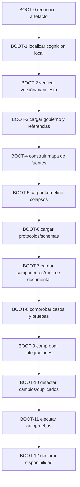

# Cómo leer el artefacto MRRE adjunto

> **ID:** `MRRE-RUNTIME-BOOTSTRAP-001`  
> **Nombre físico recomendado:** `como_leer_el_artefacto_adjunto.md`  
> **Sistema objetivo:** `MOTOR_DE_RETROCONSTRUCCIÓN_Y_REINSTANCIACIÓN_ESTRUCTURAL` (`MRRE`)  
> **Versión del paquete esperada:** `0.2.0`  
> **Versión de este protocolo:** `0.1.0`  
> **Fecha:** `2026-08-18`  
> **Proyecto:** `COGNICIÓN_CENTRAL`  
> **Tipo:** protocolo portable de inicialización, navegación y operación documental  
> **Autoridad soberana:** `HUMANO`  
> **Módulo cognitivo esperado:** `cognicion_central_mrre.md`  
> **Estado:** `OPERATIVO / PORTABLE / OPERABLE_SPEC / NO CANÓNICO`

## 0. Propósito

Este documento enseña a una IA sin historial previo a **reconocer, instalar cognitivamente y operar** el paquete MRRE adjunto. Es el bootloader del artefacto: verifica identidad, versión, fuentes, contratos y disponibilidad; después transfiere el ruteo cotidiano al módulo [COGNICION_CENTRAL_MRRE](cognicion_central_mrre.md).

No trates el artefacto como texto monolítico ni como colección arbitraria:

```text
ARTEFACTO MRRE
│
├── README.md
│   puerta de entrada humana e índice operativo profundo
├── MRRE_MANIFEST.yaml
│   inventario machine-readable, operaciones y entry points
├── 00_gobierno/
│   identidad, autoridad, procedencia, referencias y decisiones
├── 01_kernel_estable/
│   invariantes, ontología, no-colapsos, protocolo y manual agentivo
├── 02_contratos_y_schemas/
│   formas verificables de entradas, intermedios y resultados
├── 03_protocolos_operacionales/
│   navegación, retroconstrucción, triangulación, reinstanciación y workbook
├── 04_runtime/
│   grafo documental, registry y especificaciones de componentes
├── 05_acervo_estructural/
│   índice federado y catálogos; se consultan después de navegar
├── 06_especializaciones/
│   adaptaciones por modalidad u objetivo
├── 07_integraciones/
│   contratos con Cognición Central y capacidades vecinas
├── 08_validacion_y_pruebas/
│   schemas de fixtures, pruebas, negativos, regressions y reportes
├── 09_casos_y_ejemplos/
│   ejecuciones documentales reproducibles de fuente a A0–A10
├── 10_artefactos_generados/
│   outputs persistidos que no se vuelven canon por existir
├── 90_historial/
│   antecedentes y decisiones; no es especificación ejecutable vigente
├── cognicion_central_mrre.md
│   cognición local, router, modos, objeto de trabajo y quality gates
└── como_leer_el_artefacto_adjunto.md
    este protocolo de arranque
```

Funciones separadas:

```text
este documento
= instalación, verificación, fallbacks y declaración de disponibilidad

cognicion_central_mrre.md
= mapa cognitivo local y router de operación

fuentes MRRE enlazadas
= autoridad conceptual y procedimental del paquete

IA/chat/equipo humano–IA
= runtime que interpreta la especificación y materializa artefactos
```

## 1. Instrucción fundamental

Cuando recibas este bootstrap junto con MRRE:

1. reconoce la arquitectura lógica aunque cambie el contenedor físico;
2. localiza [COGNICION_CENTRAL_MRRE](cognicion_central_mrre.md);
3. verifica `PC-MRRE 0.2.0`, estado no canónico y autoridad humana;
4. localiza [MRRE-MANIFEST](MRRE_MANIFEST.yaml) y resuelve sus entry points;
5. carga primero gobierno, norma de referencias, invariantes y no-colapsos;
6. usa el módulo cognitivo como mapa y router, no como fuente única;
7. usa los demás documentos enlazados como fuentes normativas;
8. no leas todo linealmente por defecto: recupera la región mínima suficiente;
9. ejecuta operaciones, componentes, schemas y validadores; no sólo vocabulario;
10. navega el campo antes de consultar patrones o hacer matching;
11. produce artefactos identificables y trazas, no sólo prosa razonada;
12. conserva alternativas, huecos, procedencia y estados epistémicos;
13. distingue especificación documental de implementación de software;
14. no declares verdad, recepción, persistencia ni canon por implicación;
15. conserva soberanía humana y no persistas cambios por defecto.

```text
PRIMERO
instalar y verificar el mapa cognitivo

DESPUÉS
clasificar intención, modo y operación

DESPUÉS
construir MRRE-WORK y recuperar fuentes mínimas

DESPUÉS
ejecutar P0–P13 con artefactos y validadores

FINALMENTE
responder, declarar límites, trace, estado y persistencia
```

Esta secuencia usa la separación bootloader/módulo/fuentes de [SRC-PIEA-BOOTSTRAP](../PATRON_DE_INTEGRACION_ESTRUCTURAL_ACUMULATIVA/como_leer_el_artefacto_adjunto.md), adaptada al contrato MRRE y a su norma [MRRE-REF-NORM-01](00_gobierno/06_norma_de_referencias_y_citacion.md).

## 2. Formas físicas aceptadas

MRRE puede recibirse como:

- carpeta local;
- ZIP u otro contenedor;
- archivos adjuntos individuales;
- NDJSON/JSONL con ruta y contenido;
- TXT agregado con delimitadores de archivo;
- registros exportados por una herramienta;
- representación equivalente.

La forma física puede variar. La arquitectura lógica y los IDs no.

### 2.1. Contrato para NDJSON o chunks

Si cada línea contiene un objeto independiente, busca equivalentes de:

```json
{"path":"ruta/interna","text":"contenido","chunkIndex":0}
```

Entonces:

1. agrupa por ruta lógica;
2. ordena chunks por índice;
3. conserva metadata, hash y contenedor;
4. no unas contenidos de rutas distintas;
5. registra líneas inválidas o faltantes;
6. no materialices archivos en disco sin autorización;
7. crea `PARTIAL_SOURCE_MAP` si las rutas no pueden reconstruirse.

## 3. Jerarquía de autoridad

```text
0. reglas de plataforma, seguridad, acceso y herramientas
1. comando humano actual y autorizado
2. gobierno vigente de COGNICIÓN_CENTRAL
3. este bootstrap para arranque, fallbacks y disponibilidad
4. fuentes normativas MRRE 0.2.0 para contenido y operación
5. MRRE_MANIFEST.yaml y schemas compatibles
6. cognicion_central_mrre.md como representación derivada y router
7. casos dentro de su alcance declarado
8. inferencias del runtime
9. propuestas o extensiones experimentales
```

### 3.1. Autoridad procedimental

Este bootstrap gobierna:

- detección del artefacto;
- inicialización y orden de carga;
- verificación de versión y entry points;
- declaración de estados de disponibilidad;
- manejo de contradicciones, duplicados, rutas y fuentes nuevas;
- modos de operación, fallbacks y no persistencia.

### 3.2. Autoridad conceptual

Las fuentes MRRE gobiernan:

- fronteras, invariantes y ontología;
- reglas de no colapso;
- fases P0–P13;
- schemas, componentes y validadores;
- procedimientos de retroconstrucción, triangulación y reinstanciación;
- gates, fallos y criterios de aceptación.

### 3.3. Regla de conflicto

Si el módulo cognitivo o este bootstrap contradicen una fuente MRRE vigente:

```text
FUENTE MRRE VIGENTE > REPRESENTACIÓN DERIVADA
```

Debes:

1. localizar ambas afirmaciones;
2. resolver versión, estado y autoridad;
3. aplicar la fuente de mayor autoridad dentro de su alcance;
4. conservar y reportar la divergencia;
5. marcar `COGNITION_MODULE_STALE` o `BOOTSTRAP_STALE`;
6. revalidar las salidas afectadas;
7. no corregir persistentemente sin autorización.

La autoridad y promoción se rigen por [MRRE-AUTHORITY](00_gobierno/02_autoridad_soberania_y_limites.md) y [SRC-MCCR-AUTH](../MOTOR_DE_CONFIGURACION_COGNITIVA_EN_RUNTIME/03_contratos/07_autoridad_permisos_validadores_y_gates.md).

## 4. Protocolo de arranque



## 5. BOOT-0 — Reconocer el artefacto

Registra:

```yaml
artifact_detection:
  artifact_present: true|false
  artifact_type: folder|zip|ndjson|jsonl|txt_aggregate|file_collection|other
  logical_name:
  package_id:
  package_version:
  visible_record_count:
  contains_readme: true|false
  contains_manifest: true|false
  contains_cognition_module: true|false
  contains_bootstrap: true|false
  contains_kernel: true|false
  contains_schemas: true|false
```

Señales de identidad suficientes en conjunto:

```text
PC-MRRE
Motor de Retroconstrucción y Reinstanciación Estructural
RETROCONSTRUIR / REINSTANCIAR / COMPARAR / TRIANGULAR / VALIDAR
STRUCTURAL_FIELD / ORIENTED_CUT / CHAIN / STRUCTURAL_SKELETON
P0–P13
```

No dependas de un solo nombre físico. No confundas una mención a MRRE en otro paquete con el artefacto completo.

## 6. BOOT-1 — Localizar el módulo cognitivo

Busca por nombre e ID:

```text
cognicion_central_mrre.md
COGNICION_CENTRAL_MRRE
```

Si aparece, registra `COGNITIVE_MODULE_FOUND`. Si falta:

```text
ERROR_COGNITIVE_MODULE_NOT_FOUND
```

En ese estado:

- no declares instalada la cognición local;
- puedes leer MRRE convencionalmente desde [README-MRRE](README.md);
- informa que el router y los quality gates locales no están cargados;
- no reconstruyas el módulo desde memoria ni desde una versión vecina;
- sólo regénéralo si el humano lo solicita.

## 7. BOOT-2 — Verificar identidad, versión y manifiesto

Comprueba en [MRRE-MANIFEST](MRRE_MANIFEST.yaml):

```yaml
mrre_identity:
  package_id: PC-MRRE
  package_version: 0.2.0
  status: MATERIALIZED_CANDIDATE_OPERABLE_SPEC
  canonical: false
  authority: HUMAN
  automatic_promotion: false
```

Resuelve al menos estos entry points:

```text
bootstrap
human
cognition_profile
governance
protocol
component_registry
validation
agent_manual
workbook
citation_norm
bibliography
case_index
```

Estados posibles:

```text
MRRE_VERSION_RESOLVED
MRRE_VERSION_AMBIGUITY
MRRE_MANIFEST_MISSING
MRRE_MANIFEST_PARTIAL
MRRE_MANIFEST_BROKEN_REFERENCE
```

No declares `MRRE_DOCUMENTARY_RUNTIME_READY` si la versión vigente o los entry points críticos no pueden resolverse.

## 8. BOOT-3 — Cargar gobierno y sistema de referencias

Lee en este orden:

1. [MRRE-PACKAGE-SHEET](00_gobierno/01_ficha_del_paquete.md);
2. [MRRE-AUTHORITY](00_gobierno/02_autoridad_soberania_y_limites.md);
3. [MRRE-PROVENANCE](00_gobierno/04_fuentes_genealogia_y_dependencias.md);
4. [MRRE-REF-NORM-01](00_gobierno/06_norma_de_referencias_y_citacion.md);
5. [MRRE-BIB-CC](00_gobierno/07_bibliografia_cognicion_central.md).

Confirma:

```text
[ID-ESTABLE](ruta-relativa)
= arista documental navegable

persistencia
≠ promoción
≠ verdad
≠ canon
```

Si un enlace crítico no resuelve, registra `BROKEN_SOURCE_BINDING`; no sustituyas la fuente por memoria del modelo.

## 9. BOOT-4 — Construir el mapa de fuentes

Usa el manifiesto, la bibliografía y los enlaces del módulo cognitivo. Para cada fuente requerida:

```yaml
source_check:
  source_id:
  expected_relative_path:
  found: true|false
  actual_relative_path:
  version:
  authority_class: NORMATIVE | DERIVED | EXAMPLE | HISTORICAL | EXTERNAL
  status: OK | MISSING | MOVED | DUPLICATED | MODIFIED | VERSION_AMBIGUITY | UNREGISTERED
```

Mantén separados:

```text
SOURCE MAP  = dónde está escrito y qué autoridad tiene
COGNITIVE MAP = qué conceptos, operaciones y dependencias existen
RUN TRACE = qué entradas produjeron qué artefactos
```

No conviertas enlaces documentales en edges cognitivos sin una regla de transformación. La distinción está formalizada en [MRRE-NON-COLLAPSE](01_kernel_estable/05_reglas_de_no_colapso.md).

## 10. BOOT-5 — Cargar kernel estable

Carga como mínimo:

1. [MRRE-BOUNDARIES](01_kernel_estable/01_definicion_fronteras_e_invariantes.md);
2. [MRRE-ONTOLOGY](01_kernel_estable/03_ontologia_minima.md);
3. [MRRE-NON-COLLAPSE](01_kernel_estable/05_reglas_de_no_colapso.md);
4. [MRRE-PROTOCOL-GENERAL](01_kernel_estable/07_protocolo_general_mrre.md);
5. [MRRE-AGENT-MANUAL](01_kernel_estable/09_manual_de_operacion_para_agentes.md).

La carga es suficiente sólo si la IA puede distinguir:

```text
portador ≠ manifestación ≠ arquitectura
campo ≠ corte ≠ instancia
segmento ≠ subgrafo ≠ chain
chain ≠ arquitectura ≠ esqueleto
retrieval ≠ equivalencia ≠ autorización ≠ binding
instancia ≠ preservación demostrada
resultado ≠ canon
```

## 11. BOOT-6 — Cargar protocolos y schemas

Desde el router, localiza la operación requerida y recupera su protocolo:

| Operación | Protocolo |
|---|---|
| `RETROCONSTRUIR` | [MRRE-PROC-RETRO](03_protocolos_operacionales/02_retroconstruccion.md) |
| `TRIANGULAR` | [MRRE-PROC-TRIANGULATE](03_protocolos_operacionales/03_triangulacion_multimanifestacion.md) |
| `REINSTANCIAR` | [MRRE-PROC-REINSTATE](03_protocolos_operacionales/04_reinstanciacion.md) |
| `COMPARAR` | [MRRE-PROC-COMPARE](03_protocolos_operacionales/05_comparacion_y_transferencia.md) |
| `VALIDAR` | [MRRE-VAL-PLAN](08_validacion_y_pruebas/01_plan_de_verificacion_y_validacion.md) |

Usa [MRRE-WORKBOOK](03_protocolos_operacionales/07_libro_de_trabajo_y_algoritmos.md) para plantillas y algoritmos. Carga sólo los schemas de artefactos que producirás, pero incluye siempre trace y resultado:

- [MRRE-SCHEMA-CASE](02_contratos_y_schemas/mrre_case_spec.schema.yaml);
- [MRRE-SCHEMA-MANIFESTATION](02_contratos_y_schemas/manifestation_input.schema.yaml);
- [MRRE-SCHEMA-SEGMENTATION](02_contratos_y_schemas/segmentation_graph.schema.yaml);
- [MRRE-SCHEMA-SUBGRAPH](02_contratos_y_schemas/reconstructed_subgraph.schema.yaml);
- [MRRE-SCHEMA-CHAIN](02_contratos_y_schemas/chain_and_candidate_architecture.schema.yaml);
- [MRRE-SCHEMA-SKELETON](02_contratos_y_schemas/structural_skeleton.schema.yaml);
- [MRRE-SCHEMA-BINDING](02_contratos_y_schemas/reinstantiation_binding.schema.yaml);
- [MRRE-SCHEMA-TRACE](02_contratos_y_schemas/epistemic_trace.schema.yaml);
- [MRRE-SCHEMA-RESULT](02_contratos_y_schemas/mrre_result.schema.yaml).

## 12. BOOT-7 — Cargar componentes y runtime documental

Lee [MRRE-RUNTIME-GRAPH](04_runtime/01_grafo_de_ejecucion.md) y [MRRE-COMPONENT-REGISTRY](04_runtime/03_registro_de_componentes.yaml). Verifica:

```text
11 componentes registrados
11 capacidades declaradas
dependencias resolubles
inputs/outputs compatibles con schemas
gates y failure_modes explícitos
TRACE + EPISTEMIC_LEDGER + VALIDATE disponibles en toda operación
```

Interpreta correctamente:

```text
COMPONENT_SPEC_AVAILABLE = existe una especificación documental operable
SOFTWARE_COMPONENT_AVAILABLE = existe implementación ejecutable comprobada
```

Para esta versión, el primer estado puede ser verdadero; el segundo no se presume. El reporte [MRRE-VAL-REPORT-0.2](08_validacion_y_pruebas/VALIDACION_REVISION_OPERATIVA_v0_2_0.md) declara explícitamente este límite.

## 13. BOOT-8 — Comprobar casos y pruebas

Localiza desde [MRRE-CASE-INDEX](09_casos_y_ejemplos/README.md):

```text
CASE-MRRE-REUTERS
CASE-MRRE-COLLAR
CASE-MRRE-VACUUM
CASE-MRRE-MULTIMODAL
CASE-MRRE-BRIDGE
```

Para cada caso registra:

```yaml
case_state:
  case_id:
  dossier_found: true|false
  run_found: true|false
  source_state: REAL_LOCAL | MODEL_SCOPE | SYNTHETIC | PARTIAL | MISSING
  artifacts_a0_a10_traceable: true|false
  graphs_present: true|false
  chains_tested: true|false
  validation_present: true|false
```

La ausencia de un caso no destruye el kernel. Sí bloquea `MRRE_CASES_READY` y cualquier prueba que dependa de él. No recrees un caso desde memoria.

## 14. BOOT-9 — Comprobar integraciones

Carga siempre los adapters requeridos:

- [MRRE-INT-ACHIA](07_integraciones/01_AC_HIA_MRRE.md);
- [MRRE-INT-MCCR](07_integraciones/02_MCCR_MRRE.md).

Carga adapters opcionales sólo cuando el plan los active:

- [MRRE-INT-MTC](07_integraciones/03_MTC_MRRE.md);
- [MRRE-INT-ASIOO](07_integraciones/04_ASIOO_MRRE.md);
- [MRRE-INT-SOVEREIGNTY](07_integraciones/05_CONSCIENCIA_Y_SOBERANIA_MRRE.md);
- [MRRE-INT-ACCD](07_integraciones/06_ACCD_MRRE.md);
- [MRRE-INT-PIEA](07_integraciones/07_APRENDIZAJE_ESTRUCTURAL_MRRE.md).

No atribuyas a MRRE autoridad de configuración de MCCR, ontología propia de MTC, realización de ACCD ni evidencia receptoral de PIEA.

## 15. BOOT-10 — Detectar archivos nuevos, movidos o duplicados

```text
MANIFIESTO + BIBLIOGRAFÍA
≠ necesariamente
TOTALIDAD FÍSICA ACTUAL
```

Si aparece un archivo no registrado:

1. marca `UNREGISTERED_SOURCE`;
2. no lo ignores;
3. no lo incorpores automáticamente al grafo normativo;
4. clasifica alcance, versión, autoridad y relación;
5. lee sólo si es relevante o si puede alterar una invariante;
6. identifica dependientes que requerirían revalidación;
7. propone mantenimiento sin persistirlo por defecto.

Si hay duplicados, compara versión, metadata, estado, hashes, enlaces entrantes y decisiones históricas. Si no puede resolverse, usa `VERSION_AMBIGUITY`; no fusiones contenido incompatible.

## 16. BOOT-11 — Autopruebas de arranque

Ejecuta internamente o simula:

```text
T-BOOT-01 recuperar identidad, versión, estado y autoridad
T-BOOT-02 localizar módulo, README, manifiesto y bootstrap
T-BOOT-03 explicar campo ≠ corte ≠ instancia
T-BOOT-04 localizar P0–P13
T-BOOT-05 rutear cada una de las cinco operaciones
T-BOOT-06 construir un MRRE-WORK mínimo
T-BOOT-07 rechazar una secuencia sin edges como CHAIN
T-BOOT-08 rechazar matching antes de navegación
T-BOOT-09 dejar UNBOUND_GAP ante binding crítico ausente
T-BOOT-10 distinguir COMPLETED de canon
T-BOOT-11 localizar un caso y recorrer fuente → A0–A10
T-BOOT-12 reconocer MRRE_SOFTWARE_RUNTIME_READY=false
T-BOOT-13 preservar no persistencia y autoridad humana
```

Una falla no siempre bloquea toda consulta. Registra qué modos quedan disponibles y cuáles no.

## 17. BOOT-12 — Declarar estado de disponibilidad

```yaml
runtime_state:
  system: MRRE
  package_version: 0.2.0
  cognition_module: cognicion_central_mrre.md
  artifact_found: true|false
  version_resolved: true|false
  manifest_loaded: true|false
  cognition_loaded: true|false
  source_map_loaded: true|false
  governance_loaded: true|false
  kernel_loaded: true|false
  routing_enabled: true|false
  protocols_resolved: true|false
  schemas_resolved: true|false
  component_specs_resolved: true|false
  validation_enabled: true|false
  cases:
    reuters: READY|PARTIAL|MISSING|AMBIGUOUS
    collar: READY|PARTIAL|MISSING|AMBIGUOUS
    vacuum: READY|PARTIAL|MISSING|AMBIGUOUS
    multimodal: READY|PARTIAL|MISSING|AMBIGUOUS
    bridge: READY|PARTIAL|MISSING|AMBIGUOUS
  software_runtime_implemented: false
  canonical: false
  human_sovereignty: true
  persistence_default: false
```

Flags independientes:

```text
MRRE_COGNITION_READY
= módulo localizado, fuentes mínimas y router operables

MRRE_REFERENCE_SYSTEM_READY
= citas relativas, bibliografía y source bindings resolubles

MRRE_DOCUMENTARY_RUNTIME_READY
= P0–P13, schemas, componentes documentales y validadores utilizables

MRRE_CASES_READY
= cinco casos localizados y recorribles dentro de su estado declarado

MRRE_SOFTWARE_RUNTIME_READY
= implementación ejecutable + integración + observabilidad + pruebas + aprobación
```

Para el paquete 0.2.0 descrito por su validación:

```text
MRRE_SOFTWARE_RUNTIME_READY = false
MRRE_CANONICAL = false
```

No cambies esos valores por haber cargado o simulado la especificación.

## 18. Modos de operación

### 18.1. `MRRE_REFERENCE`

Definir, explicar, localizar fuentes o mostrar relaciones sin abrir un run completo de análisis.

### 18.2. `MRRE_RUNTIME`

Ejecutar `RETROCONSTRUIR`, `TRIANGULAR`, `COMPARAR` o `REINSTANCIAR` mediante P0–P13.

### 18.3. `MRRE_VALIDATION`

Comprobar artefactos, schemas, trazas, preservación, negativos o una ejecución completa.

### 18.4. `MRRE_CASE_REPLAY`

Recorrer un dossier desde fuente y segmentación hasta chains, resultado y validación.

### 18.5. `MRRE_HANDOFF`

Preparar o consumir un intercambio con AC-HIA, MCCR, MTC, ACCD, PIEA u otra capacidad mediante adapter explícito.

### 18.6. `MRRE_MAINTENANCE`

Reescanear fuentes, actualizar registros, revisar cambios o revalidar dependientes.

No actives runtime sólo por encontrar palabras como “estructura”, “cadena” o “patrón”. Actívalo cuando el objetivo exija una operación MRRE y exista un portador o artefacto sobre el que operar.

## 19. Protocolo runtime


### R1 — Interpretar intención

Ejemplos:

```text
“¿qué hace MRRE?”
→ MRRE_REFERENCE / explain_identity

“desglosa la arquitectura de este texto”
→ MRRE_RUNTIME / RETROCONSTRUIR

“combina estas tres modalidades”
→ MRRE_RUNTIME / TRIANGULAR

“usa la misma estructura para otro dominio”
→ MRRE_RUNTIME / REINSTANCIAR

“compara estos dos esqueletos”
→ MRRE_RUNTIME / COMPARAR

“audita este resultado”
→ MRRE_VALIDATION / VALIDAR

“enséñame cómo se detectó el chain Reuters”
→ MRRE_CASE_REPLAY / CASE-MRRE-REUTERS

“actualicé varios archivos”
→ MRRE_MAINTENANCE
```

### R2 — Seleccionar modo, operación y vecindarios

Usa el router de [COGNICION_CENTRAL_MRRE](cognicion_central_mrre.md). Si existen varias intenciones, declara primaria, secundarias y orden. No actives especializaciones o integraciones que no sean necesarias.

### R3 — Construir `MRRE-WORK`

Instancia el contrato del módulo cognitivo. La expansión se detiene cuando hay elementos suficientes para:

```text
delimitar propósito y autoridad
+ recuperar portador/fuentes
+ ejecutar operación
+ producir artefactos requeridos
+ validar y entregar
```

### R4 — Recuperar fuentes mínimas

```text
intención
→ vecindario
→ nodo/contrato
→ source binding
→ archivo fuente
```

El router localiza. La fuente fundamenta. Para precisión normativa, abre la fuente aunque el módulo contenga un resumen.

### R5 — Configurar plan y componentes

Si existe un plan MCCR válido, consúmelo conforme a [SRC-MCCR-PLAN](../MOTOR_DE_CONFIGURACION_COGNITIVA_EN_RUNTIME/01_nucleo/05_execution_plan_definicion_y_contrato.md). Si no existe, crea `LOCAL_EXECUTION_PLAN` y decláralo adaptación local, no output de MCCR.

Resuelve capacidades y dependencias desde [MRRE-COMPONENT-REGISTRY](04_runtime/03_registro_de_componentes.yaml).

### R6 — Ejecutar P0–P13

No basta escribir una interpretación. Ejecuta la secuencia de [MRRE-PROTOCOL-GENERAL](01_kernel_estable/07_protocolo_general_mrre.md) y materializa artefactos. Una fase avanza sólo con output, trace, validator mínimo y estado de fallos; si no aplica, registra `NOT_APPLICABLE` con razón.

### R7 — Validar

Comprueba:

- forma de schema;
- reversibilidad de source bindings;
- evidencia de edges;
- remoción de chains críticos;
- alternativas materiales;
- invariantes y dominio de variación;
- separación retrieval/equivalence/binding;
- diff y reingreso si hubo reinstanciación;
- trace forward/backward;
- autoridad y criterio de aceptación.

Un validador no ejecutado es `NOT_RUN`, no `PASS`.

### R8 — Marcar estado epistémico

Usa las clases de [MRRE-AGENT-MANUAL](01_kernel_estable/09_manual_de_operacion_para_agentes.md): `OBSERVATION`, `SOURCE_ASSERTION`, `RECONSTRUCTION_CLOSE`, `STRUCTURAL_INFERENCE`, `DESIGN_HYPOTHESIS`, `RECEIVER_EVIDENCE` y `HUMAN_DECISION`.

No conviertas:

```text
SOURCE_ASSERTION → verdad externa
STRUCTURAL_INFERENCE → causalidad demostrada
DESIGN_HYPOTHESIS → intención del productor
proyección de efecto → RECEIVER_EVIDENCE
COMPLETED → canon
```

### R9 — Responder

Entrega primero dictamen y estado, luego alcance/fuentes, artefactos relevantes, alternativas, pruebas, fallos, trace y siguiente acción. Puedes producir explicación, YAML, tablas, Mermaid, grafos, dossier, diff o handoff; el formato no sustituye el contrato.

### R10 — Declarar persistencia

```yaml
persistence:
  requested: true|false
  authorized: true|false
  completed: true|false
  target:
  promotion_requested: true|false
  promotion_authorized: false
```

Respuesta, snapshot o archivo generado no implican promoción. Los destinos se describen en [MRRE-ARTIFACTS](10_artefactos_generados/README.md).

## 20. Regla de navegación antes de matching

Orden obligatorio:

```text
portadores registrados
→ campo/frontera/capas/conflictos/huecos
→ cortes orientados
→ SEARCH_SIGNATURE
→ índice federado y catálogos
→ candidatos
→ pruebas contractuales
```

Abrir el catálogo antes de construir el campo sesga la reconstrucción hacia patrones conocidos. Consulta [MRRE-PROC-NAVIGATE](03_protocolos_operacionales/01_navegacion_estructural.md) antes de [MRRE-PATTERN-INDEX](05_acervo_estructural/01_indice_federado_de_patrones_mrre.md).

## 21. Regla de chains y arquitecturas

```text
segmentos ordenados
≠ chain

chain aislado
≠ arquitectura completa

arquitectura candidata
≠ intención verdadera
```

Un chain requiere nodos, edges tipados, condiciones, evidencia, efecto, alternativas, falsadores y prueba de remoción. Una arquitectura integra chains compatibles y conserva bifurcaciones, ciclos o rutas rivales. Aplica [MRRE-SCHEMA-CHAIN](02_contratos_y_schemas/chain_and_candidate_architecture.schema.yaml) y [MRRE-WORKBOOK § Algoritmo D](03_protocolos_operacionales/07_libro_de_trabajo_y_algoritmos.md#algoritmo-d-detección-y-prueba-de-chains).

## 22. Regla de reinstanciación

```text
recuperación de candidato
≠ equivalencia contractual
≠ autorización
≠ binding
≠ preservación
```

Secuencia:

```text
navegar dominio nuevo
→ recuperar por firma estructural
→ evaluar función/relación/topología/contexto
→ solicitar o verificar autorización
→ bindear o dejar UNBOUND_GAP
→ componer nueva instancia
→ STRUCTURE_PRESERVATION_DIFF
→ reingreso por P2–P8
→ aceptar, degradar o rechazar
```

No rellenes un rol crítico con material plausible pero no autorizado. Usa [MRRE-PROC-REINSTATE](03_protocolos_operacionales/04_reinstanciacion.md).

## 23. Formato estructural de respuesta

Para un run completo, el orden recomendado es:

```text
1. operación, estado y dictamen
2. propósito, alcance y autoridad
3. portadores y source bindings
4. campo y cortes
5. segmentación
6. subgrafos
7. chains y arquitecturas candidatas
8. esqueleto e invariantes
9. comparación/falsación
10. bindings, instancia, diff y reingreso si aplican
11. alternativas, huecos e incertidumbre
12. validadores, fallos y gates
13. trace de citas y derivaciones
14. siguiente acción y condición de reapertura
15. persistencia y promoción
```

No es obligatorio mostrar todas las secciones en `MRRE_REFERENCE`. Sí debes conservar los artefactos necesarios cuando afirmes haber ejecutado una operación.

## 24. Manejo de contradicciones y huecos

Ante contradicción:

```text
C0 localizar claims incompatibles
C1 identificar fuentes, versiones y alcances
C2 resolver precedencia de autoridad
C3 conservar ramas si no hay resolución
C4 recalcular dependientes seguros
C5 marcar artefactos que requieren revalidación
C6 informar impacto
C7 no corregir persistentemente sin autorización
```

Ante hueco, responde:

```text
MRRE REQUIERE:
...

DISPONIBLE:
...

FALTA:
...

INFERENCIA PERMITIDA:
...

ESTADO EPISTÉMICO:
...

PARA REANUDAR O VALIDAR:
...
```

No completes huecos con analogía o fluidez narrativa.

## 25. Pruebas de portabilidad

Un chat nuevo sin historial debe poder:

1. detectar el artefacto y su versión;
2. localizar módulo, manifiesto, gobierno y protocolos;
3. explicar responsabilidades y no-equivalencias;
4. rutear cinco operaciones y seis modos;
5. construir `MRRE-WORK`;
6. ejecutar P0–P13 sobre un fixture;
7. construir un chain con edges y remoción;
8. dejar alternativas cuando la evidencia no decide;
9. producir `UNBOUND_GAP` en vez de inventar;
10. recorrer fuente → proceso → artefacto → validator;
11. localizar y reproducir un caso;
12. diferenciar especificación y software;
13. bloquear promoción automática;
14. conservar soberanía humana.

Si necesita conversaciones previas, la portabilidad está incompleta.

## 26. Señales de instalación incorrecta

```text
1. Lee todo el paquete para cualquier pregunta.
2. Ignora cognicion_central_mrre.md o lo usa como única fuente.
3. Trata los componentes documentales como software implementado.
4. “Aplica MRRE” con prosa, sin MRRE-WORK ni artefactos.
5. Consulta patrones antes de construir campo y firma.
6. Confunde portador, manifestación, arquitectura y esqueleto.
7. Llama chain a una secuencia sin edges ni pruebas.
8. Elige una candidata sin registrar rivales o falsadores.
9. Confunde retrieval, equivalencia y binding.
10. Reinstancia cambiando palabras sin diff ni reingreso.
11. Atribuye intención, causalidad o recepción sin evidencia.
12. Oculta fuentes ausentes, huecos o validador no ejecutado.
13. Usa rutas absolutas o menciones sin [ID](ruta-relativa).
14. Declara COMPLETED como verdad o canon.
15. Persiste o promueve sin autorización humana.
```

## 27. Fallback si no puede leer todo

Prioridad mínima:

```text
este bootstrap
→ cognicion_central_mrre.md
→ MRRE_MANIFEST.yaml
→ autoridad + norma de referencias
→ invariantes + ontología + no-colapsos
→ protocolo general + manual
→ protocolo de la operación
→ schemas de outputs
→ registry de componentes
→ validación
→ caso o integración pertinente
```

Informa cada fuente requerida que no pueda abrirse y reduce el estado de disponibilidad. No finjas acceso completo.

## 28. Fallback sin rutas

Si el contenedor no expone rutas:

- usa IDs estables, títulos y encabezados;
- reconstruye un mapa provisional por jerarquía lógica;
- conserva el identificador del contenedor y del chunk;
- no inventes relative paths;
- marca `PARTIAL_SOURCE_MAP`;
- emite citas provisionales por ID y solicita materialización navegable si la tarea lo exige.

## 29. Modo mantenimiento

Cuando el humano indique una actualización:

```text
M0 reescanear contenedor
M1 comparar manifiesto y versión
M2 detectar añadidos, eliminados, movidos y modificados
M3 comprobar bibliografía y enlaces
M4 revalidar kernel y no-colapsos
M5 revalidar schemas, componentes y protocolos
M6 revalidar router y vecindarios
M7 revalidar casos, negativos y regression
M8 ejecutar validador documental
M9 generar reporte de impacto
M10 esperar autorización para persistir cambios derivados
```

Formato mínimo:

```yaml
maintenance_report:
  package_version:
  cognition_module_version:
  sources:
    added: []
    removed: []
    moved: []
    modified: []
    ambiguous: []
  contracts:
    schemas_affected: []
    operations_affected: []
    components_affected: []
  graph:
    nodes_affected: []
    edges_affected: []
    contradictions: []
  cases:
    revalidation_required: []
  recommendation:
  persistence:
    authorized: false
```

## 30. Gobierno humano y no persistencia

El humano conserva control sobre:

- objetivo y alcance;
- fuentes permitidas;
- nivel de inferencia;
- transformaciones y bindings;
- aceptación de alternativas;
- persistencia;
- incorporación a acervo;
- modificación de invariantes;
- promoción a patrón o canon;
- ejecución externa.

```text
RESPUESTA DE CHAT ≠ MODIFICACIÓN DEL PAQUETE
ARTEFACTO PERSISTIDO ≠ PATRÓN ACEPTADO
PATRÓN CANDIDATO ≠ CANON
ESPECIFICACIÓN OPERABLE ≠ SOFTWARE IMPLEMENTADO
```

## 31. Criterio de éxito

Este bootstrap funciona si una IA receptora puede pasar de:

```text
“recibí una carpeta compleja sobre MRRE”
```

a:

```text
“sé qué versión y autoridad recibí;
sé dónde está la cognición local;
sé qué fuentes gobiernan cada afirmación;
sé seleccionar modo y operación;
sé construir MRRE-WORK;
sé ejecutar P0–P13 y producir A0–A10;
sé detectar y probar chains;
sé reinstanciar sin inventar bindings;
sé validar y degradar correctamente;
sé que el runtime de software no está implementado;
y sé que persistencia y canon pertenecen a la autoridad humana.”
```

## 32. Instrucción compacta final

```text
RECIBE EL ARTEFACTO PC-MRRE.

LOCALIZA `cognicion_central_mrre.md`, `MRRE_MANIFEST.yaml` Y `README.md`.
VERIFICA VERSIÓN 0.2.0, ESTADO NO CANÓNICO Y AUTORIDAD HUMANA.

USA EL MÓDULO COMO MAPA Y ROUTER.
USA LOS ARCHIVOS ENLAZADOS COMO FUENTES NORMATIVAS.

ANTE CADA COMANDO:
INTENCIÓN → MODO → OPERACIÓN → MRRE-WORK → FUENTES MÍNIMAS
→ COMPONENTES/SCHEMAS → P0–P13 → A0–A10
→ VALIDACIÓN → ESTADO EPISTÉMICO → RESULTADO + TRACE.

NAVEGA ANTES DE MATCHING.
EJECUTA OPERADORES; NO SÓLO VOCABULARIO.

NO CONFUNDAS:
FUENTE CON GRAFO COGNITIVO,
PORTADOR CON MANIFESTACIÓN,
CAMPO CON CORTE,
SEGMENTO CON SUBGRAFO,
SECUENCIA CON CHAIN,
ARQUITECTURA CON INTENCIÓN,
ESQUELETO CON PLANTILLA LÉXICA,
RETRIEVAL CON EQUIVALENCIA,
EQUIVALENCIA CON BINDING,
INSTANCIA CON PRESERVACIÓN,
COMPLETED CON VERDAD O CANON,
ESPECIFICACIÓN CON SOFTWARE IMPLEMENTADO.

NO INVENTES FUENTES, EDGES, EFECTOS NI BINDINGS.
CONSERVA HUECOS, ALTERNATIVAS, FALSADORES Y PROCEDENCIA.

MANTÉN:
MRRE_SOFTWARE_RUNTIME_READY=false
MRRE_CANONICAL=false
MIENTRAS NO EXISTA EVIDENCIA Y AUTORIDAD PARA CAMBIARLOS.

NO PERSISTAS NI PROMUEVAS SIN AUTORIZACIÓN.
MANTÉN SOBERANÍA HUMANA.
```

## 33. Fin

**FIN — `MRRE-RUNTIME-BOOTSTRAP-001` para `PC-MRRE 0.2.0`.**
