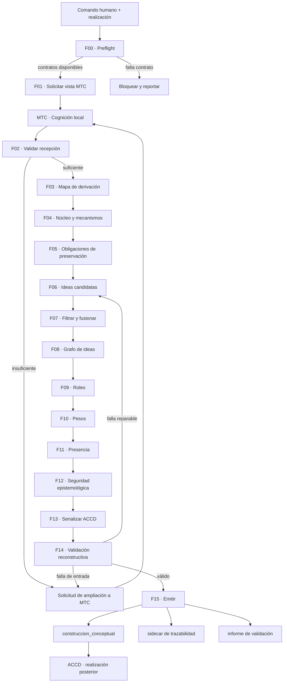

# Grafo de ejecución



## Flujo de información

```text
REALIZACIÓN
  ↓
PETICIÓN COGNITIVA
  ↓
MTC_INSTANCE + TRACE + EPISTEMIC STATUS
  ↓
MAPA_DE_DERIVACIÓN_CONCEPTUAL
  ├─ claims seleccionables
  ├─ mecanismos reconstructibles
  ├─ distinciones protegidas
  ├─ descartes candidatos
  └─ huecos
  ↓
GRAFO_DE_IDEAS_CANDIDATAS
  ↓
CLASIFICACIÓN ACCD
  ├─ formulación
  ├─ rol
  ├─ peso
  ├─ presencia
  └─ relaciones
  ↓
CONSTRUCCION_CONCEPTUAL + SIDECAR
```

## Bucles permitidos

Sólo existen dos retornos:

1. `entrada insuficiente → MTC`: solicita información que la cognición local puede producir.
2. `pérdida reconstructiva → ideas candidatas`: corrige selección o formulación.

El adaptador no retorna hacia ACCD para pedir decisiones audiovisuales y no modifica MTC para hacer coincidir la salida.

