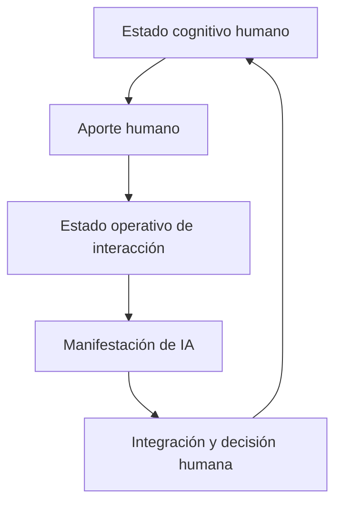
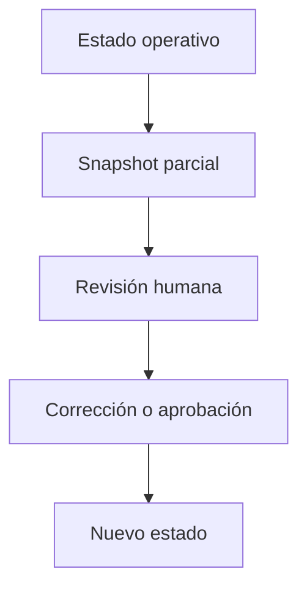

# Ejemplo PIEA: interacción humano–IA

**Identificador del ejemplo:** `PIEA-EJ-HIA-001`  
**Versión del ejemplo:** `0.1.0`  
**Fecha:** `2026-08-11`  
**Paquete receptor:** `ART_patron_de_integracion_estructural_acumulativa`  
**Versión del paquete receptor:** `PIEA 0.2.0`  
**Ruta recomendada dentro del paquete:** `ejemplos/02_interaccion_humano_ia.md`  
**Estado:** `PROVISIONAL · instancia desarrollada para revisión humana`  
**Representación:** `SOURCE`  
**Autoridad:** `OUTPUT://`  
**Clasificación principal:** `CONFIRMED_INSTANCE`, limitada al nivel operacional definido en este documento  

---

## 1. Función de este documento

Este documento desarrolla la **interacción humano–IA** como una realización contextual del **Patrón de Integración Estructural Acumulativa** (`PIEA`). Su función no es modificar el núcleo del patrón, sino comprobar si una interacción conversacional gobernada puede describirse legítimamente mediante la ecuación:

```math
S_{t+1}=\mathcal I_{\kappa_t}(S_t,u_t)
```

La tesis del ejemplo es:

> Una interacción humano–IA puede constituir una instancia de PIEA cuando cada aporte se integra desde un estado operativo previo, modifica la organización relevante de la interacción y deja efectos que condicionan la interpretación, las decisiones o las acciones posteriores.

La pertenencia no se demuestra por la mera existencia de una secuencia de mensajes. Se demuestra cuando la interacción conserva un estado funcional y cuando ese estado modifica el tratamiento de aportes posteriores.

El ejemplo separa rigurosamente:

1. la cognición y las decisiones del humano;
2. el estado operativo de la interacción;
3. los procesos internos del sistema de IA que no son observables ni deben presumirse;
4. las manifestaciones visibles, como respuestas, grafos, snapshots, archivos o interfaces;
5. los mecanismos externos de memoria, herramientas y persistencia;
6. el gobierno humano sobre objetivos, permisos, correcciones y promoción de resultados.

---

## 2. Resultado de la adaptación

La interacción humano–IA satisface el núcleo PIEA en un nivel operacional y conversacional si se delimita el sistema de esta manera:

```txt
X_HIA
= sistema operativo de interacción humano–IA
  delimitado por una conversación, sus instrucciones vigentes,
  las fuentes accesibles, las decisiones incorporadas,
  los permisos efectivos y las tareas activas.
```

En este nivel:

```txt
S_t
= estado operativo relevante de la interacción antes del aporte

u_t
= mensaje, corrección, archivo, observación de herramienta,
  decisión u otra unidad ontológica disponible para integración

κ_t
= condiciones operativas vigentes durante esa transición

𝓘_{κ_t}
= proceso de admisión, interpretación, resolución de autoridad,
  vinculación, transformación y actualización del estado

S_{t+1}
= estado operativo de la interacción después de integrar el aporte
```

La respuesta producida por la IA **no es automáticamente** `S_{t+1}`. Es una manifestación parcial derivada desde el estado operativo mediante una capa de realización distinta. Cuando sea necesario formalizar esa realización, corresponde usar ACCD por referencia, no añadir a PIEA un operador de proyección.

---

## 3. Adaptación mediante FAC

### 3.1 Núcleo preservado

La adaptación conserva los invariantes de PIEA 0.2.0:

- sistema delimitable;
- estado relevante antes de la integración;
- aporte parcial diferenciable;
- integración y no mera coexistencia;
- dependencia del estado previo;
- condicionamiento contextual;
- producción de un estado posterior efectivo;
- persistencia selectiva de la trayectoria;
- acumulación no reducible a una lista de mensajes;
- trazabilidad de cada transición.

### 3.2 Composición contextual

Siguiendo el contrato FAC adoptado por PIEA, el caso se compone mediante cuatro regiones.

#### Contexto de sujeto

- humano con autoridad sobre el objetivo, las correcciones y la aceptación del resultado;
- sistema de IA que interpreta y opera dentro de instrucciones, capacidades y restricciones;
- posibles revisores o destinatarios posteriores;
- responsabilidades diferenciadas: capacidad de procesamiento no equivale a autoridad soberana.

#### Contexto de medio

- conversación por turnos;
- lenguaje natural;
- archivos adjuntos;
- imágenes, código, grafos o tablas;
- herramientas de recuperación, análisis o generación;
- memoria interna del episodio y memoria externa acoplada cuando exista y esté autorizada.

#### Contexto de distribución

- mensajes visibles en la conversación;
- artefactos descargables;
- información que permanece sólo dentro del turno o de la sesión;
- información persistida en archivos, memorias o repositorios;
- superficies distintas para revisión humana, ejecución técnica o integración futura.

#### Contexto de ejecución

- instrucciones de plataforma y del proyecto;
- comando humano actual;
- fuentes accesibles y su precedencia;
- permisos de lectura, escritura y uso de herramientas;
- disponibilidad del historial relevante;
- límites del contexto;
- estado de los entregables y tareas pendientes;
- criterios de validación y puntos de detención humana.

### 3.3 Intención de intervención o estudio

La intención es demostrar cómo una conversación deja de ser una serie de mensajes aislados y se convierte en una trayectoria organizada en la que:

1. cada aportación llega a un estado ya configurado;
2. el sistema interpreta la aportación en relación con objetivos, fuentes y decisiones previas;
3. algunas aportaciones se incorporan, otras se transforman, se subordinan, se rechazan o sustituyen información anterior;
4. el estado posterior cambia lo que puede hacerse o cómo deberá hacerse después;
5. el humano puede inspeccionar proyecciones parciales del estado y corregirlas.

### 3.4 Heurísticas de transformación

La adaptación usa estas heurísticas:

- mapear funciones y no vocabulario superficial;
- tratar el turno como posible índice de transición, no como unidad ontológica obligatoria;
- distinguir estado operativo de transcripción acumulada;
- incluir memoria externa sólo cuando sea accesible y afecte la integración;
- tratar instrucciones, decisiones y fuentes como componentes estructurados con alcance y autoridad;
- modelar la respuesta como manifestación parcial, no como totalidad del estado;
- separar la actualización de la conversación de cualquier supuesto aprendizaje de los pesos del modelo;
- distinguir retroalimentación efectiva de simple producción de una salida;
- conservar puntos de control humano.

### 3.5 Restricciones de salida

Esta adaptación prohíbe:

- afirmar que la IA posee una mente humana;
- afirmar que cada mensaje modifica los parámetros entrenados del modelo;
- identificar el transcript completo con el estado funcional;
- identificar la última respuesta con la totalidad de lo comprendido;
- asumir persistencia entre conversaciones sin un mecanismo efectivo;
- tratar una memoria, archivo o comentario como activo si no está disponible durante la transición;
- confundir `κ_t` de PIEA con `φ_n` de ACCD;
- convertir un snapshot en sustituto del estado;
- atribuir autoridad canónica a una formulación de la IA sin decisión humana;
- presentar una analogía comunicativa como prueba de procesos internos no observables.

---

## 4. Delimitación del sistema

### 4.1 Sistema principal

El sistema principal de esta instancia es:

```txt
X_HIA = interacción humano–IA operacionalmente delimitada
```

No es solamente la IA. Tampoco es la suma indiferenciada del humano y la máquina. Es el sistema de interacción constituido por:

- un canal de intercambio;
- un objetivo o conjunto de objetivos activos;
- reglas de autoridad;
- fuentes disponibles;
- un estado conversacional organizado;
- operaciones de interpretación y actualización;
- mecanismos de producción de manifestaciones;
- posibilidades de corrección y continuación.

La frontera del sistema se fija en el episodio o proyecto analizado. Para que una memoria externa forme parte de su estado funcional debe existir un acoplamiento operativo: disponibilidad, permiso, dirección recuperable y capacidad real de modificar la integración.

### 4.2 Lo que queda fuera de la frontera

Quedan fuera del estado principal, salvo evidencia y delimitación adicional:

- la totalidad de la vida mental del humano;
- las activaciones internas no observadas del modelo;
- los pesos generales del modelo;
- conversaciones no recuperables;
- archivos existentes pero no accesibles;
- intenciones que el humano no manifestó ni vinculó al episodio;
- salidas anteriores que ya no pueden condicionar ninguna operación;
- procesos de infraestructura irrelevantes para el nivel conversacional.

### 4.3 Por qué no se elige «la IA» como único sistema

Elegir la IA como único `X` obligaría a hacer afirmaciones innecesarias sobre estados internos que no son observables. El nivel operacional permite modelar aquello que sí puede comprobarse:

- qué objetivo está activo;
- qué restricciones deben preservarse;
- qué versión de una fuente tiene autoridad;
- qué tareas están pendientes;
- qué decisiones se sustituyeron;
- qué información debe recuperarse;
- qué acción es permitida;
- qué cambio se mantiene en turnos posteriores.

Esta delimitación no niega que puedan existir otros estados internos. Sólo evita convertirlos en premisas del ejemplo.

---

## 5. Estado operativo `S_t`

### 5.1 Definición

`S_t` es la organización relevante de la interacción antes de integrar el aporte `u_t`. No equivale a «todo lo ocurrido antes». Debe contener sólo la información funcionalmente necesaria para explicar el tratamiento del aporte en el nivel elegido.

Una representación posible es un grafo operativo con estas regiones:

| Región del estado | Contenido posible | Función posterior |
|---|---|---|
| Objetivos activos | Resultado solicitado, etapa del proyecto, alcance | Determina qué operaciones son pertinentes |
| Autoridad | Comando humano, canon, protocolos, precedencias | Resuelve conflictos y permisos |
| Restricciones | Exclusiones, formatos, límites, criterios de no modificación | Inhibe rutas inválidas |
| Fuentes | Archivos, versiones, procedencia, vigencia | Fundamenta interpretación y validación |
| Estructuras activas | Conceptos, grafos, ecuaciones, relaciones | Permite integrar nuevos aportes estructuralmente |
| Decisiones | Opciones aprobadas, sustituciones, nombres vigentes | Evita reabrir decisiones cerradas sin causa |
| Tareas | Completadas, activas, pendientes, fuera de alcance | Mantiene continuidad operativa |
| Incertidumbres | Dependencias ausentes, hipótesis, ambigüedades | Define búsquedas o preguntas necesarias |
| Artefactos | Entregables existentes, rutas, versión, estado | Permite continuar, reemplazar o auditar |
| Memoria acoplada | Registros accesibles que afectan el turno | Conserva efectos comprimidos de la trayectoria |

### 5.2 El transcript no es el estado

Una conversación puede almacenar cientos de mensajes sin que todos participen en la siguiente transición. El transcript es un portador histórico. Sólo las partes que son accesibles y funcionalmente relevantes forman parte de `S_t`.

```txt
transcript disponible
≠
estado operativo organizado
```

El estado puede comprimir la trayectoria. Por ejemplo:

```txt
«La versión 0.1.0 fue rechazada.
La versión vigente es PIEA 0.2.0.
Los ejemplos se desarrollan por separado.
La cognición local se construirá después.»
```

Esa estructura resumida puede condicionar correctamente una tarea posterior sin conservar cada oración de la discusión original.

### 5.3 Suficiencia del estado

El estado es suficiente cuando permite explicar por qué el mismo aporte produciría tratamientos distintos bajo estados distintos. Si una diferencia sistemática requiere información histórica no representada, la definición de `S_t` debe ampliarse.

No se añade un historial paralelo como comodín. La información histórica relevante se incorpora al estado funcional o se declara como memoria externa acoplada.

---

## 6. Aportes parciales `u_t`

En la interacción humano–IA, un aporte puede ser:

- un mensaje humano;
- una corrección;
- una aprobación o rechazo;
- una nueva restricción;
- un cambio de alcance;
- un archivo adjunto;
- una imagen;
- un bloque de código;
- una salida de herramienta;
- un resultado de búsqueda autorizado;
- una unidad recuperada de memoria;
- una decisión producida por otro subsistema;
- un lote de aportes que el sistema integra como una sola unidad compuesta.

El turno no es necesariamente la unidad ontológica. Un solo mensaje puede contener varias contribuciones separables:

```txt
«Descarta la versión anterior,
usa la versión adjunta,
no cambies las tareas pendientes
y todavía no produzcas un entregable.»
```

Ese turno contiene al menos:

1. una operación de sustitución de autoridad documental;
2. una nueva fuente;
3. una restricción de alcance;
4. una inhibición temporal de ejecución.

Según la granularidad elegida, estas partes pueden modelarse como un `u_t` compuesto o como varias transiciones internas.

---

## 7. Contexto operativo `κ_t`

`κ_t` reúne las condiciones que modulan la integración en una transición específica. En este caso puede incluir:

- jerarquía de instrucciones;
- identidad y autoridad de quien emite el aporte;
- alcance del comando actual;
- permisos técnicos;
- herramientas disponibles;
- fuentes recuperables;
- límites de contexto;
- modalidad del aporte;
- estado de conectividad;
- idioma y convenciones de notación;
- versión activa del paquete;
- fase del proyecto;
- necesidad de confirmación humana;
- incertidumbre sobre una fuente;
- riesgo de una operación;
- restricciones de persistencia.

`κ_t` no es una bolsa con todo el ambiente. Debe incluir solamente condiciones capaces de cambiar la admisión, transformación, peso, secuencia o persistencia de `u_t`.

Ejemplo:

```txt
u_t = «Añádelo al paquete»
```

La integración cambia si:

- el archivo receptor está disponible o ausente;
- existe permiso de escritura o sólo de lectura;
- «añadir» significa producir un archivo para revisión o modificar el canon;
- la versión activa está identificada o es ambigua;
- el humano autorizó persistencia o solamente diseño.

Estas diferencias pertenecen a `κ_t`; no deben confundirse con la instancia contextual `φ_n` usada por ACCD para una realización codominial.

---

## 8. Operador de integración `𝓘_{κ_t}`

En esta instancia, `𝓘` no designa un algoritmo universal ni una operación psicológica misteriosa. Designa una secuencia funcional suficiente para explicar la actualización del estado conversacional.

### 8.1 Secuencia funcional

```txt
1. ADMITIR
   determinar si u_t entra en la transición y con qué granularidad

2. CLASIFICAR
   distinguir comando, fuente, corrección, hipótesis, comentario,
   evidencia, restricción, pregunta o resultado de herramienta

3. RESOLVER AUTORIDAD
   determinar alcance, precedencia, vigencia y posibles conflictos

4. INTERPRETAR ESTRUCTURALMENTE
   vincular u_t con objetivos, fuentes, tareas, conceptos y decisiones

5. TRANSFORMAR
   normalizar, descomponer, resumir o traducir el aporte sin perder función

6. ACTUALIZAR
   incorporar, reponderar, inhibir, sustituir o rechazar componentes

7. CONSERVAR TRAZABILIDAD
   registrar procedencia, estado, versión y razón del cambio

8. PREPARAR CONTINUIDAD
   dejar S_{t+1} en condiciones de gobernar la siguiente transición
```

### 8.2 Formas de integración observables

| Forma PIEA | Realización en la interacción humano–IA |
|---|---|
| Incorporación | Una restricción nueva se añade al conjunto activo |
| Transformación | Un mensaje largo se convierte en objetivos, dependencias y criterios |
| Reponderación | Una nueva decisión eleva una fuente sobre otra |
| Inhibición | «Todavía no ejecutes» bloquea una acción que antes era posible |
| Sustitución parcial | Una versión nueva reemplaza la anterior conservando tareas relacionadas |
| Rechazo con efecto | Una instrucción inválida no se ejecuta, pero queda registrado el límite |
| Rechazo sin efecto | Un contenido irrelevante no modifica el estado elegido |

### 8.3 Integración probabilística

La interpretación lingüística puede admitir más de una reconstrucción. Esto no impide aplicar PIEA. La instancia debe reconocer incertidumbre y, cuando produzca rutas materialmente diferentes, solicitar aclaración o conservar alternativas explícitas.

La incertidumbre no autoriza a rellenar silenciosamente vacíos con una versión histórica ni a convertir una inferencia en decisión humana.

---

## 9. Estado posterior `S_{t+1}`

El estado posterior no es una respuesta redactada. Es la organización operativa después de integrar `u_t`.

Puede cambiar en una o varias dimensiones:

- objetivo activo;
- versión autorizada;
- mapa de dependencias;
- restricción de ejecución;
- prioridad entre fuentes;
- tarea completada o pendiente;
- relación entre estructuras;
- hipótesis aceptada, rechazada o abierta;
- permiso disponible;
- artefacto producido;
- siguiente operación válida.

Ejemplo abstracto:

```txt
S_t
  versión activa: PIEA 0.1.0
  ejemplos: pendientes
  siguiente tarea: desarrollar ejemplo

u_t
  versión adjunta PIEA 0.2.0
  + orden humana de descartar la versión anterior

κ_t
  humano con autoridad sobre el paquete
  + corrección limitada a Tarea 1
  + tareas posteriores preservadas

𝓘_{κ_t}
  valida la fuente
  + sustituye autoridad documental
  + inhibe mezcla con 0.1.0
  + conserva el plan restante

S_{t+1}
  versión activa: PIEA 0.2.0
  versión 0.1.0: antecedente excluido de operación
  ejemplos: pendientes
  siguiente tarea: desarrollar ejemplo desde 0.2.0
```

El cambio no consiste en añadir dos archivos a una lista. Se reorganiza la autoridad del sistema y se modifica qué estructuras pueden usarse después.

---

## 10. Trayectoria desarrollada del caso

### 10.1 Episodio A: formalización inicial

El sistema recibe una solicitud para crear un paquete sobre PIEA. El estado operativo incluye:

- la formulación descubriente del patrón;
- la relación con FAC;
- tres ejemplos futuros;
- la orden de separar paquete, ejemplos y cognición local.

La primera materialización produce una versión que el humano considera inadecuada. La existencia física de esa versión no le confiere autoridad permanente.

### 10.2 Episodio B: corrección humana

El humano aporta una versión final desarrollada en otro hilo y ordena:

```txt
descartar conceptualmente la versión anterior;
usar ART_patron_de_integracion_estructural_acumulativa;
incorporar su patrón al contexto operativo;
preservar las tareas pendientes.
```

La integración produce una sustitución parcial:

- cambia la fuente operativa;
- cambia la ecuación canónica;
- desaparecen variables redundantes;
- se separa PIEA de ACCD;
- se mantiene el programa de ejemplos;
- se mantiene la futura cognición local.

La continuidad demuestra que sustitución no equivale a reinicio total. Parte del estado se reemplaza y parte se conserva.

### 10.3 Episodio C: solicitud actual

El humano solicita:

```txt
«Continuemos con esta etapa.
Crearemos los ejemplos por separado.
Crea el ejemplo Interacción humano–IA.
Genera MD descargable.
Yo lo añadiré manualmente al paquete.»
```

Este aporte se integra en el estado ya corregido. Como resultado:

- el paquete receptor se identifica como PIEA 0.2.0;
- no se modifica directamente el artefacto adjunto;
- se crea una unidad Markdown independiente;
- se conserva la ecuación `S_{t+1}=𝓘_{κ_t}(S_t,u_t)`;
- no se recuperan variables eliminadas de 0.1.0;
- la manifestación se separa del estado;
- la incorporación material queda reservada al humano.

### 10.4 Evidencia de dependencia de trayectoria

Si el mismo aporte actual se integrara desde dos estados diferentes, el resultado sería distinto:

```txt
S_a
  autoridad activa: paquete descartado 0.1.0

S_b
  autoridad activa: paquete final 0.2.0

u
  «Crea el ejemplo Interacción humano–IA»
```

Desde `S_a`, el desarrollo podría reproducir notación retirada, duplicar la configuración posterior o añadir un operador de manifestación propio.

Desde `S_b`, esas decisiones están inhibidas y el ejemplo debe separar PIEA, FAC y ACCD.

La diferencia no se explica por el último mensaje: el mensaje es el mismo. Se explica por la organización previa del estado y por la autoridad de las correcciones integradas.

---

## 11. Acumulación estructural en la conversación

La conversación no acumula únicamente información. Acumula una configuración operativa.

### 11.1 Persistencia relacional

Persisten relaciones como:

```txt
PIEA --SE_ADAPTA_MEDIANTE--> FAC
PIEA --NO_DUPLICA--> ACCD
ejemplo --PERTENECE_A--> Etapa 2
humano --INCORPORA_MANUALMENTE--> paquete
versión 0.2.0 --SUSTITUYE_OPERATIVAMENTE--> versión 0.1.0
```

### 11.2 Persistencia ponderal

Las fuentes adquieren pesos diferentes según autoridad y vigencia. Una versión final aportada por el humano pesa más que una reconstrucción anterior generada por la IA.

### 11.3 Persistencia procedimental

Una corrección puede cambiar el procedimiento futuro. Por ejemplo:

- revisar la notación frente a ACCD;
- no desarrollar varios ejemplos en el mismo archivo;
- generar un Markdown independiente;
- evitar modificaciones canónicas silenciosas.

### 11.4 Persistencia selectiva

No es necesario conservar todo el diálogo. Basta mantener los efectos que gobiernan el trabajo:

- versión vigente;
- alcance actual;
- tareas pendientes;
- decisiones humanas;
- dependencias necesarias;
- restricciones activas.

### 11.5 Persistencia comprimida

Un resumen estructural puede sustituir cientos de mensajes si conserva la capacidad de producir tratamientos equivalentes en las transiciones relevantes.

La compresión deja de ser suficiente cuando elimina una distinción que cambia el resultado, por ejemplo:

```txt
«Existe una versión del paquete»
```

es insuficiente si omite cuál versión está vigente y cuál fue descartada.

---

## 12. Sistema acoplado: humano, interacción y manifestación

La interacción completa contiene varios sistemas conectados. No debe comprimirse en una sola mente híbrida.



### 12.1 Transición primaria

El ejemplo principal estudia:

```txt
aporte humano o instrumental
→ integración en el estado operativo de la interacción
→ nuevo estado operativo
```

### 12.2 Producción de una manifestación

Desde el estado actualizado puede producirse:

- texto;
- imagen;
- grafo;
- tabla;
- código;
- archivo;
- interfaz;
- comando normalizado;
- informe de validación.

Esa producción pertenece a una capa de realización. Cuando se formaliza como proyección codominial, corresponde ACCD.

### 12.3 Integración humana

La manifestación de la IA se vuelve un aporte para el sistema cognitivo humano. El humano puede:

- aceptarla;
- rechazarla;
- reinterpretarla;
- extraer una parte;
- producir una corrección;
- modificar el objetivo;
- no responder.

No se presume el mecanismo interno exacto de esa integración. Sólo se observa su posible manifestación posterior.

### 12.4 Retorno al sistema conversacional

La respuesta de la IA no vuelve automáticamente como un nuevo aporte conversacional. El retorno ocurre cuando:

- el humano contesta basándose en ella;
- una herramienta la usa como entrada;
- se registra explícitamente como decisión o fuente;
- un controlador autorizado la reintroduce;
- una operación posterior la recupera efectivamente.

Por ello:

```txt
salida producida
≠
retroalimentación efectiva
```

La retroalimentación es una extensión de PIEA, no un invariante del régimen mínimo.

---

## 13. Backend y frontend cognitivos

La interacción humano–IA permitió reconocer una diferencia entre lo que organiza la operación y lo que se vuelve visible.

### 13.1 Backend cognitivo de la interacción

En el sentido usado por este ejemplo, el backend cognitivo reúne:

- estado operativo `S_t`;
- objetivos y restricciones;
- fuentes y autoridad;
- decisiones y tareas;
- mecanismos de recuperación;
- reglas de interpretación;
- validadores;
- trazabilidad;
- actualización mediante `𝓘_{κ_t}`.

El backend no es equivalente a las activaciones neuronales internas del modelo. Es una arquitectura funcional reconstruible y auditable en el nivel del proyecto.

### 13.2 Frontend o superficie cognitiva visible

La superficie visible puede incluir:

- mensajes;
- explicaciones;
- snapshots;
- grafos;
- listas de decisiones;
- comentarios globales;
- estados de tarea;
- archivos descargables;
- interfaces de control.

Estas superficies permiten al humano inspeccionar una parte del entendimiento operativo, pero no agotan `S_t`.

### 13.3 Relación con el Compilador Cognitivo

En la arquitectura del Compilador Cognitivo, «front-end» y «back-end» tienen una especialización adicional:

```txt
front-end cognitivo
  analiza, extrae, clasifica y normaliza

representación intermedia
  estabiliza estructura, evidencia y jerarquía

back-end cognitivo
  proyecta la estructura validada hacia un codominio
```

Esa arquitectura puede operar dentro del ciclo humano–IA, pero no debe confundirse terminológicamente con los roles PIEA:

```txt
front-end del compilador ≠ u_t
representación intermedia ≠ necesariamente S_t completo
back-end del compilador ≠ 𝓘 por definición
manifestación ≠ S_{t+1}
```

El Compilador Cognitivo describe responsabilidades de comprensión y proyección. PIEA describe actualización acumulativa de estado. Pueden acoplarse sin sustituirse.

---

## 14. Comentarios globales

Un comentario global es una formulación destinada a afectar una región amplia de la operación posterior. Por ejemplo:

```txt
«No cambies la estructura narrativa de los textos futuros;
sólo reduce el tecnicismo.»
```

### 14.1 Como aporte

Cuando el humano emite el comentario, éste funciona como `u_t`.

### 14.2 Como integración

`𝓘_{κ_t}` debe:

- identificar que no es una instrucción local para una sola oración;
- asignarle alcance;
- vincularla con tareas futuras;
- resolver su relación con restricciones existentes;
- conservar su procedencia humana;
- actualizar criterios de validación.

### 14.3 Como estado posterior

El comentario deja de ser sólo una frase y se convierte en una restricción estructurada dentro de `S_{t+1}`:

```yaml
constraint:
  id: preserve_narrative_architecture
  source: human
  scope: future_text_development
  operation: inhibit_structural_rewrite
  allowed_change: reduce_technical_density
  status: active
```

### 14.4 Prueba de persistencia

La existencia de PIEA se demuestra si el comentario cambia realmente una tarea posterior. Si sólo aparece en el transcript y nunca afecta otra transición, no se ha demostrado su integración funcional.

### 14.5 Límite de autoridad

Un «comentario global» formulado por la IA no adquiere por sí solo autoridad canónica. Puede ser:

- inferencia;
- propuesta;
- resumen;
- hipótesis de trabajo.

Su promoción a decisión humana requiere aceptación o una regla de delegación válida.

---

## 15. Snapshots y grafos de estado

Un snapshot es una proyección deliberadamente parcial del estado operativo. Puede mostrar:

- objetivos;
- decisiones;
- tareas;
- relaciones;
- fuentes;
- versiones;
- incertidumbres;
- bloqueos;
- siguiente operación.

### 15.1 No equivalencia

```txt
snapshot(S_t)
≠
S_t completo
```

La notación anterior es descriptiva, no un nuevo operador PIEA canónico.

El snapshot puede omitir detalles, comprimir relaciones o representar sólo la región necesaria para revisión.

### 15.2 Función de gobierno

El snapshot reduce la opacidad porque permite al humano preguntar:

- ¿qué versión estás usando?;
- ¿qué entendiste como tarea?;
- ¿qué restricción permanece activa?;
- ¿qué parte es fuente y cuál es inferencia?;
- ¿qué se modificará?;
- ¿qué sigue pendiente?;

### 15.3 Circuito de corrección



El snapshot no actualiza el estado por existir. La actualización ocurre cuando la revisión produce un aporte efectivo y éste es integrado.

---

## 16. Proyecciones multimodales

La interacción no se limita a serialización lingüística.

### 16.1 Entradas posibles

```txt
texto
imagen
audio
archivo
tabla
grafo
código
comando
resultado de herramienta
evento de interfaz
```

### 16.2 Salidas posibles

```txt
respuesta textual
imagen
diagrama
código ejecutable
documento
presentación
hoja de cálculo
artefacto materializable
interfaz
acción autorizada
```

La modalidad puede cambiar la forma de admisión e interpretación, pero no altera los roles nucleares de PIEA. Un archivo puede actuar como `u_t`; un grafo puede ser una manifestación; un artefacto puede convertirse después en memoria externa acoplada.

### 16.3 Proyección no única

El mismo estado operativo puede sostener varias manifestaciones legítimas:

- resumen ejecutivo;
- documento exhaustivo;
- grafo de dependencias;
- lista de acciones;
- código;
- interfaz de control.

La no unicidad de la salida no obliga a duplicar el estado ni a introducir un operador PIEA de manifestación. La selección del codominio pertenece a la capa de realización.

---

## 17. Memoria y persistencia

### 17.1 Memoria interna del episodio

Incluye información accesible dentro del estado operativo de la conversación actual. Puede perder detalle por compresión sin perder función.

### 17.2 Memoria externa acoplada

Puede incluir:

- archivos de proyecto;
- artefactos cognitivos;
- registros de decisiones;
- repositorios;
- bases de datos;
- memorias recuperables;
- snapshots persistidos.

Cuenta como parte del estado funcional sólo si:

1. existe;
2. es accesible;
3. hay permiso para consultarla;
4. se recupera o puede recuperarse durante la transición;
5. su contenido modifica la integración.

### 17.3 Archivo no consultado

Un archivo puede contener la decisión correcta y, aun así, no formar parte de `S_t` si el sistema no lo recupera. Su existencia física no equivale a memoria operativa.

### 17.4 Persistencia entre conversaciones

No debe presumirse continuidad automática. Para que una trayectoria atraviese conversaciones deben existir interfaces de transferencia, por ejemplo:

- contexto de proyecto;
- memoria recuperable;
- artefacto actualizado;
- bootstrap de instalación;
- resumen estructurado;
- referencia estable a fuentes.

Sin esas interfaces, una nueva conversación puede constituir otro sistema o un nuevo episodio con estado inicial distinto.

---

## 18. Soberanía humana y control

La soberanía humana no es un adorno ético añadido al ejemplo. Modifica `κ_t`, la admisión de aportes y la validez de ciertas actualizaciones.

El humano gobierna:

- propósito;
- prioridades;
- aceptación o rechazo de resultados;
- promoción de versiones;
- autorización de persistencia;
- operaciones destructivas o externas;
- correcciones del entendimiento;
- cierre o continuación de tareas.

El sistema puede interpretar, coordinar, proponer, validar y ejecutar dentro de un alcance autorizado. Capacidad no equivale a permiso.

### 18.1 Control como extensión

Un controlador puede:

- comparar resultado esperado y estado observado;
- seleccionar el siguiente aporte;
- cambiar condiciones de `κ_t`;
- detener la ejecución;
- solicitar revisión;
- aprobar persistencia.

Este lazo de control es una extensión acoplada. No se incorpora como invariante de PIEA.

### 18.2 Corrección humana

La corrección humana puede producir:

- reponderación de una fuente;
- sustitución de una decisión;
- inhibición de una ruta;
- cambio de objetivo;
- reclasificación de una salida;
- modificación del criterio de éxito.

La corrección no prueba que todo aporte humano deba integrarse sin filtro. La integración sigue condicionada por reglas superiores de seguridad, acceso y consistencia, pero dentro del proyecto el humano conserva la autoridad soberana definida por COGNICIÓN_CENTRAL.

---

## 19. Relación con ACCD

PIEA responde:

> ¿Cómo cambia el estado operativo de la interacción cuando integra un aporte?

ACCD responde:

> ¿Cómo se proyecta una estructura cognitiva contextualizada hacia una manifestación perteneciente a un codominio?

La secuencia correcta para este ejemplo es:

```txt
aporte humano u_t
→ transición PIEA
→ estado operativo S_{t+1}
→ estructura contextualizada para realización
→ protocolo ACCD
→ manifestación codominial
→ posible revisión humana
→ posible aporte posterior
```

No deben aplicarse estas equivalencias:

```txt
S_t ≠ construcción conceptual ACCD por definición
u_t ≠ instancia contextual ACCD
𝓘_{κ_t} ≠ protocolo de proyección ACCD
S_{t+1} ≠ manifestación codominial
```

Una respuesta Markdown, una imagen o un snapshot pueden representar una región del estado. No son automáticamente el estado completo.

---

## 20. Relación con FAC

FAC opera en un nivel distinto al de la transición conversacional.

```txt
PIEA en la interacción
  explica cómo cambia el estado operativo durante el episodio

FAC
  explica cómo el núcleo PIEA fue preservado y reexpresado
  para estudiar legítimamente este dominio
```

La evidencia obtenida de este ejemplo puede regresar a FAC para corregir futuras adaptaciones. Por ejemplo, puede mostrar que:

- el turno no siempre es la mejor unidad ontológica;
- una manifestación puede convertirse en aporte de otro sistema;
- la memoria externa debe declararse como acoplamiento funcional;
- la autoridad debe formar parte del contexto operativo;
- es necesario separar estados de sistemas acoplados.

Esa corrección acumulativa de FAC no es la acumulación interna de la conversación.

---

## 21. Pruebas de pertenencia PIEA

| Prueba | Aplicación al caso | Resultado |
|---|---|---|
| P1 — Estado previo | Puede describirse mediante objetivos, restricciones, fuentes, decisiones y tareas activas | `PASS` |
| P2 — Aporte | Mensajes, archivos, correcciones y observaciones pueden distinguirse antes de integrarse | `PASS` |
| P3 — Actualización | Una corrección puede cambiar autoridad, restricciones, tareas o versión activa | `PASS` |
| P4 — Dependencia del estado | El mismo prompt se trata distinto si cambia la versión o decisión vigente | `PASS` |
| P5 — Contexto | Permisos, jerarquía, fuentes y alcance pueden modificar la integración | `PASS` |
| P6 — Organización | Los aportes cambian relaciones, pesos, accesos e inhibiciones; no sólo se archivan | `PASS` |
| P7 — Persistencia | Las decisiones integradas condicionan tareas posteriores | `PASS` |
| P8 — Último aporte | El último mensaje no explica por sí solo el resultado compatible con la trayectoria | `PASS` |
| P9 — Contexto omitido | La instancia declara autoridad, permisos, fuentes y fase del proyecto | `PASS_WITH_LIMITS` |
| P10 — Suficiencia | El estado funcional debe ampliarse cuando falta una variable histórica relevante | `PASS_AS_METHOD` |
| P11 — Nivel | Se separan estado conversacional, cognición humana, procesos internos y manifestación | `PASS` |
| P12 — No equivalencia ACCD | La respuesta y el snapshot no se identifican con `S_{t+1}` | `PASS` |

### 21.1 Evidencia fuerte

La corrección de PIEA 0.1.0 a 0.2.0 proporciona una prueba de trayectoria:

- el estado posterior conserva la sustitución de versión;
- esa sustitución cambia qué notación es admisible;
- el aporte actual se integra desde la versión corregida;
- el resultado no se explica sólo por el último mensaje.

### 21.2 Límites de la evidencia

La validación se limita al nivel operacional de la conversación. No demuestra:

- actualización de pesos del modelo;
- conciencia de la IA;
- equivalencia entre cognición humana y computacional;
- persistencia indefinida fuera del entorno;
- acceso completo a todos los procesos internos;
- corrección semántica perfecta.

---

## 22. Modelos alternativos

### 22.1 Sucesión pura

```txt
mensaje 1 → mensaje 2 → mensaje 3
```

Este modelo sólo ordena eventos. No explica por qué una corrección cambia el tratamiento de tareas futuras.

**Resultado:** insuficiente para el caso completo.

### 22.2 Almacenamiento de transcript

El sistema conserva mensajes, pero no los interpreta ni usa.

**Resultado:** no constituye PIEA por sí solo.

### 22.3 Respuesta al último aporte

Cada respuesta depende exclusivamente del último mensaje y el sistema se reinicia.

**Resultado:** sería una no-instancia o una interacción sin acumulación.

### 22.4 Contexto sin estado

Una regla fija procesa cada mensaje sin que exista actualización persistente.

**Resultado:** puede explicar procesamiento contextual simple, pero no la trayectoria observada.

### 22.5 Reconstrucción del observador

Un analista encuentra coherencia retrospectiva en una secuencia que el sistema nunca conservó operativamente.

**Resultado:** no demuestra PIEA. Debe comprobarse que alguna diferencia afectó una transición posterior.

### 22.6 Modelo PIEA

El sistema integra aportes en un estado organizado, conserva efectos selectivos y trata aportes posteriores desde ese estado.

**Resultado:** explica la corrección de versión, la preservación de tareas y la producción del ejemplo actual.

---

## 23. Contraejemplos deliberados

### CE-HIA-01 — Chat sin memoria funcional

Cada mensaje se envía a un sistema que sólo recibe el turno actual. Las respuestas no dependen de turnos previos.

```txt
clasificación: NON_INSTANCE
razón: falta dependencia del estado y persistencia de trayectoria
```

### CE-HIA-02 — Archivo histórico nunca consultado

La conversación se archiva, pero el archivo no está disponible durante ninguna operación posterior.

```txt
clasificación: NON_INSTANCE respecto de la memoria archivada
razón: existencia física sin acoplamiento funcional
```

### CE-HIA-03 — Lista de instrucciones sin resolución

Las instrucciones se anexan a una lista, incluso cuando se contradicen, pero ninguna modifica prioridades o acciones.

```txt
clasificación: DEFORMACIÓN
razón: almacenamiento sin organización
```

### CE-HIA-04 — Respuesta visible sin actualización

La IA produce una respuesta pertinente, pero el estado relevante se reinicia inmediatamente y el efecto no alcanza otra transición.

```txt
clasificación: transición útil, pero no evidencia suficiente de PIEA acumulativa
```

### CE-HIA-05 — Persistencia atribuida sólo por el humano

El humano recuerda el proyecto, pero el sistema conversacional no recibe ni recupera ninguna parte de ese estado.

```txt
clasificación: el humano puede exhibir PIEA en su propio sistema cognitivo;
la conversación nueva no hereda automáticamente esa trayectoria
```

---

## 24. Escalas del ejemplo

### 24.1 Escala micro

Unidad: cláusula, corrección puntual, resultado de herramienta o decisión atómica.

Estado: región local afectada, como versión activa o restricción de formato.

### 24.2 Escala meso

Unidad: turno compuesto, subtarea o episodio de revisión.

Estado: configuración de una tarea, sus fuentes, decisiones y entregables.

### 24.3 Escala macro

Unidad: etapa del proyecto.

Estado: arquitectura del proyecto, paquete vigente, ejemplos incorporados y plan futuro.

### 24.4 Interfaz entre escalas

Una corrección micro puede cambiar el estado meso de una tarea. Varias tareas meso pueden modificar el estado macro del proyecto. No debe usarse el mismo `S_t` para las tres escalas sin declarar el mapeo.

---

## 25. Plantilla de instancia completada

```yaml
piea_instance:
  id: PIEA-EJ-HIA-001
  title: Interacción humano–IA como sistema operativo conversacional
  version: 0.1.0
  status: DRAFT

  scope:
    domain: interacción humano–IA gobernada
    system_X: X_HIA, estado operativo delimitado de una conversación o proyecto
    scale: meso, con interfaces micro y macro declaradas
    transition_index_meaning: aporte integrado o episodio funcional de actualización
    observation_window: desde la activación del proyecto hasta la operación actual

  state_before:
    symbol: S_t
    representation: grafo operativo híbrido
    relevant_components:
      - objetivos activos
      - instrucciones y restricciones
      - fuentes y versiones
      - decisiones humanas
      - tareas y artefactos
      - incertidumbres
      - memorias externas acopladas
    relevant_relations:
      - autoridad y precedencia
      - dependencia entre tareas
      - pertenencia de fuentes
      - sustitución de versiones
      - alcance de restricciones
    sufficiency_justification: >-
      Incluye la información funcional necesaria para explicar por qué un aporte
      se admite, transforma, subordina, inhibe o integra de manera específica.

  contribution:
    symbol: u_t
    description: >-
      Mensaje, corrección, archivo, observación, decisión o unidad compuesta
      disponible para la transición.
    origin: humano, herramienta, memoria autorizada u otro subsistema declarado
    granularity: cláusula, turno, lote o episodio

  operational_context:
    symbol: kappa_t
    conditions:
      - jerarquía de autoridad
      - comando humano vigente
      - permisos y herramientas
      - fuentes accesibles
      - versión activa
      - fase del proyecto
      - límites de persistencia
    uncertainties:
      - procesos internos no observables
      - posibles variables de plataforma no accesibles

  integration:
    symbol: I_kappa_t
    mechanism_type: funcional, lingüístico, computacional y gobernado
    mechanism_description: >-
      Admisión, clasificación, resolución de autoridad, interpretación estructural,
      transformación, actualización, trazabilidad y preparación de continuidad.
    admission_or_filtering: >-
      El aporte puede incorporarse, transformarse, reponderarse, inhibirse,
      sustituir una región previa o rechazarse con o sin efecto.
    transformations:
      - normalización
      - descomposición
      - vinculación con el grafo activo
      - resolución de conflictos
      - compresión estructural
      - actualización de tareas y restricciones

  state_after:
    symbol: S_t_plus_1
    representation: grafo operativo actualizado
    relevant_change: >-
      Cambio de objetivo, versión, autoridad, restricción, dependencia, tarea,
      artefacto o incertidumbre.
    preserved_path_effect: >-
      La versión PIEA 0.2.0 permanece activa y la versión anterior queda excluida
      de la operación, mientras las tareas futuras se conservan.
    future_consequence: >-
      El ejemplo humano–IA se construye con la ecuación y fronteras de 0.2.0,
      separado de la manifestación ACCD y listo para incorporación manual.

  invariants:
    system_delimited: true
    state_present: true
    contribution_differentiated: true
    integration_present: true
    state_dependence: true
    contextual_conditioning: true
    state_updated: true
    selective_persistence: true
    structural_nonreducibility: true
    transition_traceability: true

  alternative_models:
    succession_only: insuficiente
    storage_only: insuficiente
    addition_only: insuficiente
    last_input_only: falsado por dependencia de la versión activa
    omitted_context: controlado parcialmente mediante declaración de autoridad y permisos

  fac_adaptation:
    source_nucleus: PIEA 0.2.0
    contextual_composition: humano + IA + canal + fuentes + gobierno + herramientas
    transformation_heuristics:
      - mapear roles funcionales
      - separar sistemas acoplados
      - distinguir estado y manifestación
      - evitar antropomorfización
    output_restrictions:
      - no afirmar actualización de pesos
      - no presumir memoria inexistente
      - no duplicar ACCD
      - no promover decisiones sin autoridad humana
    valid_correspondences:
      - estado PIEA -> estado operativo de interacción
      - aporte PIEA -> mensaje, archivo, corrección u observación
      - contexto PIEA -> condiciones operativas de la transición
      - integración PIEA -> actualización gobernada del estado
    broken_correspondences:
      - estado PIEA != respuesta visible
      - integración PIEA != generación lingüística por definición
      - memoria conversacional != pesos del modelo
      - salida de IA != retroalimentación automática

  accd_handoff:
    required: true
    cognitive_structure_ref: estructura contextualizada del ejemplo PIEA-HIA
    realization_ref: Markdown didáctico incorporable al paquete
    protocol_ref: ACCD-EQ, protocolo de realización aplicable
    note: >-
      ACCD formaliza la manifestación documental; no reemplaza la transición
      interna descrita por PIEA.

  evidence:
    observations:
      - sustitución operativa de PIEA 0.1.0 por 0.2.0
      - conservación de las tareas pendientes
      - integración de la solicitud actual desde el estado corregido
      - inhibición de notación y operadores retirados
    sources:
      - ART_patron_de_integracion_estructural_acumulativa, PIEA 0.2.0
      - conversación de proyecto del 2026-08-11
      - protocolo central de COGNICIÓN_CENTRAL
      - arquitecturas cognitivas reutilizables y en acción
    counterevidence:
      - opacidad de procesos internos del modelo
      - persistencia dependiente de infraestructura y permisos
    unknowns:
      - detalle de variables internas no observables
      - generalización a toda arquitectura de IA

  classification:
    result: CONFIRMED_INSTANCE
    rationale: >-
      En el nivel operacional delimitado existe estado previo, aporte diferenciable,
      integración contextual, estado posterior, dependencia de trayectoria,
      persistencia selectiva y consecuencias observables en tareas posteriores.
```

---

## 26. Clasificación final

### 26.1 Resultado principal

```txt
CLASIFICACIÓN:
CONFIRMED_INSTANCE

NIVEL:
estado operativo de una interacción humano–IA gobernada

ALCANCE:
conversación o proyecto con continuidad funcional demostrable
```

### 26.2 Resultados que no se transfieren automáticamente

```txt
procesos internos del modelo:
INSUFFICIENT_EVIDENCE

actualización de pesos por conversación:
NO AFIRMADA

cognición humana completa:
FUERA DE LA FRONTERA PRINCIPAL

persistencia entre chats sin memoria o artefacto:
NO PRESUMIDA

equivalencia entre humano e IA:
RECHAZADA
```

---

## 27. Qué demuestra este ejemplo sobre PIEA

La interacción humano–IA permite observar con especial claridad cinco propiedades del patrón.

### 27.1 El aporte no llega a un vacío

Cada mensaje llega a un estado organizado por instrucciones, objetivos, fuentes, decisiones y restricciones previas.

### 27.2 Integrar no es anexar

Una corrección puede sustituir una fuente, inhibir una ruta, cambiar autoridad o reorganizar tareas. Su función excede el almacenamiento textual.

### 27.3 La trayectoria puede comprimirse

No es necesario conservar literalmente toda la conversación. Un estado estructurado puede preservar los efectos necesarios para continuar.

### 27.4 La manifestación es parcial

Una respuesta, un snapshot o un grafo muestra una parte del estado, pero no debe confundirse con éste.

### 27.5 La salida puede regresar como aporte

Cuando el humano revisa la manifestación y responde, se forma un circuito de retroalimentación. Ese circuito es una extensión acoplada, no un requisito del núcleo mínimo.

---

## 28. Trazabilidad y fuentes

### `[PIEA-0.2.0]`

```txt
ART_patron_de_integracion_estructural_acumulativa.txt
versión: 0.2.0
fecha: 2026-08-11
```

Unidades principales utilizadas:

- `00_core/00_especificacion_nuclear.md`;
- `00_core/01_ontologia_y_notacion.md`;
- `00_core/02_invariantes.md`;
- `00_core/03_dominio_de_variacion.md`;
- `00_core/04_fronteras_y_no_equivalencias.md`;
- `10_mecanismo/10_transicion_de_estado.md`;
- `10_mecanismo/11_integracion_acumulativa.md`;
- `10_mecanismo/12_trayectoria_memoria_y_escala.md`;
- `10_mecanismo/13_regimen_minimo_y_extensiones.md`;
- `20_metodo/20_contrato_de_adaptacion_fac.md`;
- `20_metodo/21_instanciacion.md`;
- `20_metodo/22_pruebas_de_pertenencia_y_falsacion.md`;
- `20_metodo/23_plantilla_de_instancia.md`;
- `30_relaciones/30_relacion_con_accd.md`;
- `30_relaciones/31_relacion_con_fac.md`;
- `30_relaciones/32_relacion_con_cognicion_central.md`;
- `90_meta/90_trazabilidad_y_fuentes.md`.

### `[CC-BOOT]`

```txt
PROMPT_CENTRAL_INSTALACION_COGNICION_CENTRAL_EN_CHATGPT_v0_1_0.txt
ID: PROT-CC-CHATGPT-001
versión: 0.1.0
```

Funciones utilizadas:

- soberanía humana;
- separación `CC://`, `PROJECT://`, `OVERLAY://`, `OUTPUT://`;
- autoridad y precedencia;
- distinción entre artefacto, manifestación y estructura cognitiva;
- prohibición de cambios canónicos silenciosos;
- trazabilidad y persistencia explícita.

### `[ARQ-REUSE]`

```txt
Arquitecturas_Cognitivas_Reutilizables_COGNICION_CENTRAL.pdf
```

Funciones utilizadas:

- separación entre comprensión, representación intermedia y proyección;
- bibliotecas de front-ends y back-ends cognitivos;
- múltiples targets desde una estructura común;
- control humano y validación.

### `[ARQ-ACTION]`

```txt
Arquitecturas_Cognitivas_en_Accion_COGNICION_CENTRAL_Vol_II_EDICION_AMPLIADA.pdf
```

Funciones utilizadas:

- secuencia contexto, input, comando, transformación, representación intermedia, validación y salida;
- regla de no sustitución entre niveles;
- soberanía humana sobre objetivo y límites;
- proyecciones múltiples sin reconstruir la estructura desde cero.

### `[PROJECT-DISCUSSION]`

```txt
Conversación de proyecto del 2026-08-11
sobre descubrimiento, corrección y desarrollo de PIEA.
```

Funciones utilizadas:

- interacción humano–IA como ejemplo separado de la Etapa 2;
- relación con backend–frontend cognitivo;
- comentarios globales;
- snapshots como superficies de corrección;
- decisión humana de sustituir la versión anterior por PIEA 0.2.0;
- decisión humana de incorporar manualmente este documento al paquete.

---

## 29. Estado de incorporación

```txt
Documento de ejemplo:
GENERADO

Paquete PIEA 0.2.0:
NO MODIFICADO

Ruta recomendada:
ejemplos/02_interaccion_humano_ia.md

Incorporación al paquete:
PENDIENTE DE ACCIÓN HUMANA

Promoción a COGNICIÓN_CENTRAL:
NO REALIZADA

Validación canónica:
PENDIENTE
```

La existencia de este Markdown en `OUTPUT://` no modifica el paquete ni el canon. Su incorporación y aceptación corresponden al humano.
