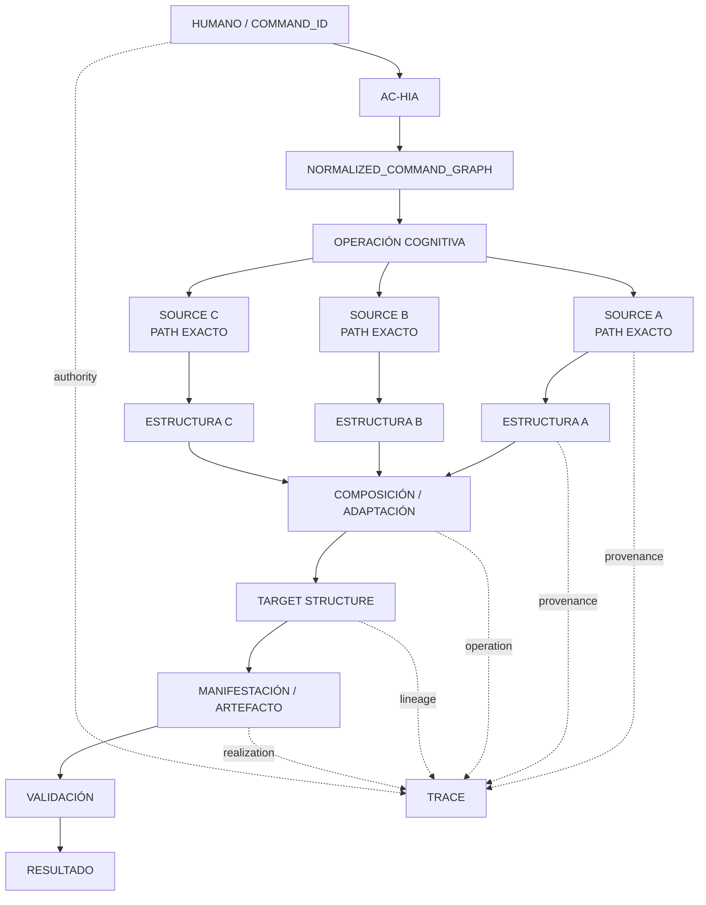

https://chatgpt.com/g/g-p-6a777363d7108191b2cafddb3fd424f0-cognicion-central/c/6a849c8a-d2b4-83e8-922d-356a75287073?tab=sources

# MÉTODO DE REFERENCIACIÓN Y PROCEDENCIA COGNITIVA ESTRUCTURAL

**ID provisional del documento:** `METH-RPCE-001`  
**ID de la intuición originaria:** `INT-PROCEDENCIA-COGNITIVA-PATH-ESTRUCTURA-001`  
**ID del comando de materialización:** `INT-PROCEDENCIA-COGNITIVA-DOCUMENTO-AUTOREFERENCIADO-001`  
**Proyecto:** `COGNICIÓN_CENTRAL`  
**Versión:** `0.1.0`  
**Fecha:** `2026-08-18`  
**Estado:** `VERY_HIGH_RELEVANCE / CROSS_CUTTING / EXPLORATORY / NON_CANONICAL / READY_FOR_INTEGRATION_REVIEW`  
**Familia dominante:** `FAM-Método`  
**Familias relacionadas:** `FAM-Diseño`, `Marco de evaluación`, `Trazabilidad`, `Gobierno cognitivo`  
**Autoridad de promoción:** `HUMANO`  
**Persistencia:** este archivo es una propuesta materializada; no modifica por sí mismo el canon ni el repositorio.

---

# 0. UBICACIÓN RECOMENDADA DENTRO DE COGNICIÓN_CENTRAL

Ubicación recomendada:

```text
02_metodos_y_herramientas/
└── trazabilidad/
    └── METODO_DE_REFERENCIACION_Y_PROCEDENCIA_COGNITIVA_ESTRUCTURAL_v0_1_0.md
```

Ruta completa desde la raíz lógica `cognicion-central/`:

```text
02_metodos_y_herramientas/trazabilidad/METODO_DE_REFERENCIACION_Y_PROCEDENCIA_COGNITIVA_ESTRUCTURAL_v0_1_0.md
```

## 0.1. Razón de esta ubicación

COGNICIÓN_CENTRAL ya contiene una identidad estructural de nivel núcleo:

```text
01_nucleo_cognitivo/registro_estructuras_cognitivas/
└── estructuras_frecuentes/
    └── 09_trazabilidad_de_fuente_a_resultado.md
```

Ese documento describe **qué es** la trazabilidad de fuente a resultado y cuáles son sus invariantes. El presente archivo no debe duplicarlo ni sustituirlo.

Este documento especializa esa estructura como un **método operativo transversal** para responder otra pregunta:

> ¿Cómo debe declarar un documento, estructura, inferencia o manifestación de COGNICIÓN_CENTRAL qué recursos internos utilizó, qué estructura tomó de cada uno, cómo la transformó y dónde la empleó?

La separación propuesta es:

```text
09_trazabilidad_de_fuente_a_resultado.md
        │
        │ define identidad estructural
        ▼
TRAZABILIDAD DE FUENTE A RESULTADO
        │
        │ se operacionaliza mediante
        ▼
METH-RPCE-001
        │
        ▼
REFERENCIACIÓN + PROCEDENCIA COGNITIVA ESTRUCTURAL
```

Por ello su lugar natural es `02_metodos_y_herramientas/trazabilidad/`.

---

# 1. PROPÓSITO

Este documento formaliza un entendimiento emergente dentro de COGNICIÓN_CENTRAL:

> **Un objeto cognitivo no debería presentarse como una ocurrencia aislada cuando en realidad es el resultado de una trayectoria interna de recuperación, selección, extracción, transformación, composición, decisión y validación.**

La finalidad del método es hacer reconstruible esa trayectoria.

No basta con escribir una bibliografía al final de un documento. Tampoco basta con declarar:

```text
"basado en MTC, MRRE y AC-HIA"
```

Una referencia cognitivamente útil debe permitir responder, al menos:

```text
1. ¿QUÉ RECURSO INTERNO SE USÓ?
2. ¿DÓNDE ESTÁ EXACTAMENTE?
3. ¿QUÉ ESTRUCTURA SE EXTRAJO DE ÉL?
4. ¿QUÉ FUNCIÓN CUMPLE ESA ESTRUCTURA AQUÍ?
```

Y, cuando la resolución de la tarea lo requiera:

```text
5. ¿QUÉ TRANSFORMACIÓN RECIBIÓ?
6. ¿QUÉ SE PRESERVÓ?
7. ¿QUÉ SE ADAPTÓ?
8. ¿QUÉ NO SE IMPORTÓ?
9. ¿CUÁL ES SU ESTADO EPISTÉMICO?
10. ¿QUÉ COMANDO, DECISIÓN U OPERACIÓN ORIGINÓ SU USO?
11. ¿QUÉ PARTE DEL RESULTADO DEPENDE DE ELLA?
12. ¿QUÉ DEBERÍA REVALIDARSE SI LA FUENTE CAMBIA?
```

---

# 2. TESIS NUCLEAR

La tesis puede condensarse así:

```text
REFERENCIA_COGNITIVA_ESTRUCTURAL
=
PATH_EXACTO
+
ESTRUCTURA_EXTRAÍDA
+
FUNCIÓN_EN_EL_OBJETO_ACTUAL
```

Éste es el **mínimo fuerte**.

Una referencia de alta resolución añade:

```text
REFERENCIA_COGNITIVA_ESTRUCTURAL_R4
=
PATH_EXACTO
+
LOCATOR / ANCLA
+
ESTRUCTURA_EXTRAÍDA
+
FUNCIÓN_LOCAL
+
TRANSFORMACIÓN
+
PRESERVADO
+
ADAPTADO
+
EXCLUIDO
+
ESTADO_EPISTÉMICO
+
COMANDO / DECISIÓN DE ORIGEN
+
TARGET
+
VALIDACIÓN
```

---

# 3. PROBLEMA QUE RESUELVE

## 3.1. Documento correcto, genealogía invisible

Un documento puede contener ideas coherentes y aun así ser opaco respecto de su construcción:

```text
DOCUMENTO A
+
DOCUMENTO B
+
DECISIÓN HUMANA
+
INFERENCIA
        ↓
    RESULTADO
```

Si la salida sólo muestra una lista de fuentes, se pierde qué aportó cada documento, qué no proviene de ellos, dónde intervino la decisión humana, dónde aparece una inferencia y qué transformación convirtió unidades fuente en una estructura nueva.

## 3.2. La falsa apariencia de ocurrencia aislada

Sin genealogía visible, dos procesos distintos pueden producir una salida superficialmente similar:

```text
CASO 1
PROMPT → GENERACIÓN PLAUSIBLE → RESULTADO
```

```text
CASO 2
COMANDO HUMANO
→ RECUPERACIÓN DE FUENTES CC
→ EXTRACCIÓN DE ESTRUCTURAS
→ OPERADORES
→ COMPOSICIÓN
→ VALIDACIÓN
→ RESULTADO
```

COGNICIÓN_CENTRAL necesita poder distinguirlos.

## 3.3. Citas decorativas

Una cita decorativa nombra una fuente, pero no tiene responsabilidad estructural comprobable.

Prueba:

> Si se elimina la fuente citada, ¿puede identificarse qué componente concreto del resultado pierde soporte, definición, restricción o procedencia?

Si la respuesta es “ninguno”, probablemente la cita no está realizando una función cognitiva real.

---

# 4. ANTECEDENTES INTERNOS E IDEAS COMPATIBLES

Esta sección aplica el propio método que propone el documento.

## RCE-SRC-001 — Trazabilidad de fuente a resultado

**PATH EXACTO**

```text
01_nucleo_cognitivo/registro_estructuras_cognitivas/estructuras_frecuentes/09_trazabilidad_de_fuente_a_resultado.md
```

**ESTRUCTURA EXTRAÍDA**

```text
FUENTE
  → unidad extraída / idea / claim
  → función local o decisión
  → transformación / ensamblaje
  → salida / manifestación
  → evidencia / validación
```

El documento establece además que la trazabilidad no es acumulación de citas; debe mostrar qué aportó cada fuente, dónde se usó, qué cambió durante el proceso y qué parte del resultado es inferencia. También exige que un tercero pueda reconstruir el recorrido.

**FUNCIÓN EN ESTE DOCUMENTO**

Aporta la **identidad estructural preexistente** sobre la que se construye el método actual.

**TRANSFORMACIÓN REALIZADA**

```text
TRAZABILIDAD DE FUENTE A RESULTADO
        ↓ especialización operacional
REFERENCIACIÓN COGNITIVA ESTRUCTURAL
```

**NO SE TOMA**

No se atribuye a este archivo el schema `RCE-*`; dicho schema es formalización nueva del presente documento.

---

## RCE-SRC-002 — Trazabilidad conceptual

**PATH EXACTO**

```text
02_metodos_y_herramientas/trazabilidad/ART_trazabilidad-conceptual.txt
```

**ESTRUCTURA EXTRAÍDA**

El registro `trazabilidad-conceptual.md` de este artefacto descompone construcciones mediante unidades como:

```text
UNIDAD DE DESTINO
+
TEXTO CONSOLIDADO
+
IDEAS FUENTE
+
ORIGEN
+
FUNCIÓN LOCAL
+
PESO
+
ESTADO DE FORMALIZACIÓN
```

**FUNCIÓN EN ESTE DOCUMENTO**

Justifica la ubicación del método en `02_metodos_y_herramientas/trazabilidad/` y muestra que la procedencia ya era un problema operacional en COGNICIÓN_CENTRAL.

**ADAPTACIÓN**

```text
ORIGEN
   ↓
PATH EXACTO RESOLUBLE
+
ESTRUCTURA EXTRAÍDA
+
USO LOCAL
```

---

## RCE-SRC-003 — MTC: fuente no equivale a estructura

**PATH EXACTO**

```text
01_nucleo_cognitivo/teoria_tmc/MTC_MAQUINA_DE_TRANSDUCCION_COGNITIVA/cognicion_central_mtc.md
```

**ESTRUCTURA EXTRAÍDA**

```text
SourceUnit
≠
CognitiveStructure
```

MTC mantiene:

```text
SOURCE GRAPH
+
COGNITIVE GRAPH
+
SOURCE BINDINGS
```

con relaciones del tipo:

```text
CognitiveStructure --DEFINED_IN/SUPPORTED_BY--> SourceUnit
```

También dispone de `MTC-TRACE://`, que debe explicar por qué se activó una estructura y qué papel tuvo.

**FUNCIÓN EN ESTE DOCUMENTO**

Aporta la distinción decisiva:

```text
DOCUMENTO REFERENCIADO
≠
ESTRUCTURA EXTRAÍDA DEL DOCUMENTO
```

**ADAPTACIÓN**

```text
MTC-SOURCE / MTC-GRAPH / MTC-TRACE
        ↓ abstracción transversal
SOURCE / COGNITIVE_STRUCTURE / PROVENANCE_TRACE
```

**NO SE TOMA**

No se exige que todo COGNICIÓN_CENTRAL use literalmente namespaces MTC.

---

## RCE-SRC-004 — MRRE: genealogía y dependencias

**PATH EXACTO**

```text
01_nucleo_cognitivo/teoria_tmc/MOTOR_DE_RETROCONSTRUCCIÓN_Y_REINSTANCIACIÓN_ESTRUCTURAL/00_gobierno/04_fuentes_genealogia_y_dependencias.md
```

**ESTRUCTURA EXTRAÍDA**

MRRE reutiliza conocimiento por **referencia y adaptación** y rechaza “inspirado por” como sustituto de trazabilidad. Su registro normativo distingue:

```text
ID
PATH EXACTO
TOMA
ADAPTACIÓN MRRE
NO TOMA
```

**FUNCIÓN EN ESTE DOCUMENTO**

Es el antecedente más cercano al contrato fuerte que aquí se generaliza.

**ADAPTACIÓN**

```text
MRRE:
PATH + TOMA + ADAPTACIÓN + NO TOMA

GENERALIZACIÓN:
PATH + ESTRUCTURA + USO + TRANSFORMACIÓN
     + PRESERVADO + ADAPTADO + EXCLUIDO
     + ESTADO EPISTÉMICO + ORIGEN + TARGET
```

---

## RCE-SRC-005 — MRRE: trace + epistemic status

**PATH EXACTO**

```text
01_nucleo_cognitivo/teoria_tmc/MOTOR_DE_RETROCONSTRUCCIÓN_Y_REINSTANCIACIÓN_ESTRUCTURAL/00_gobierno/01_ficha_del_paquete.md
```

**ESTRUCTURA EXTRAÍDA**

MRRE acopla:

```text
MANIFESTATION
→ CANDIDATE_ARCHITECTURE
→ STRUCTURAL_SKELETON
→ BINDINGS
→ REINSTANTIATION
```

con una traza lateral:

```text
TRACE + EPISTEMIC_STATUS
```

**FUNCIÓN EN ESTE DOCUMENTO**

Demuestra que la procedencia puede acompañar transformaciones estructurales, no vivir únicamente como bibliografía final.

---

## RCE-SRC-006A — AC-HIA: normalización de comandos

**PATH EXACTO**

```text
01_nucleo_cognitivo/teoria_tmc/ARQUITECTURA_DE_COMUNICACION_HUMANO_IA/02_modelo_operativo/06_normalizacion_de_comandos.md
```

**ESTRUCTURA EXTRAÍDA**

```text
COMANDO HUMANO
→ NORMALIZACIÓN
→ NORMALIZED_COMMAND_GRAPH
```

**FUNCIÓN EN ESTE DOCUMENTO**

Permite incluir el comando humano como antecedente de una construcción sin confundirlo con una fuente documental.

---

## RCE-SRC-006B — AC-HIA: backend cognitivo

**PATH EXACTO**

```text
01_nucleo_cognitivo/teoria_tmc/ARQUITECTURA_DE_COMUNICACION_HUMANO_IA/02_modelo_operativo/04_backend_cognitivo.md
```

**ESTRUCTURA EXTRAÍDA**

El backend cognitivo organiza componentes y planificación a partir de la intención normalizada, sin exigir al humano que formalice manualmente el runtime.

**FUNCIÓN EN ESTE DOCUMENTO**

Sustenta que una orden humana pueda conservar internamente bindings como:

```text
COMMAND_ID
TARGET
SOURCE_BINDING
STRUCTURE_BINDING
```

---

## RCE-SRC-006C — AC-HIA: scaffolding cognitivo

**PATH EXACTO**

```text
01_nucleo_cognitivo/teoria_tmc/ARQUITECTURA_DE_COMUNICACION_HUMANO_IA/04_funcionalidades/04_scaffolding_cognitivo_para_construccion_de_paquetes.md
```

**ESTRUCTURA EXTRAÍDA**

```text
SCAFFOLDING_COGNITIVO
=
ESTRUCTURA OBJETIVO
+
CONTEXTO DE DISEÑO
+
DECISIONES HUMANAS
+
FUENTES
+
DEPENDENCIAS
+
PROTOCOLO DE CONSTRUCCIÓN
```

**FUNCIÓN EN ESTE DOCUMENTO**

Es altamente compatible con la tesis actual: un artefacto futuro no debe obligar a otra IA a reiniciar el razonamiento desde cero.

**DIFERENCIA DE ALCANCE**

```text
SCAFFOLDING COGNITIVO
→ conserva cognición necesaria para construir un paquete

RPCE
→ conserva genealogía suficiente para reconstruir
   por qué existe una estructura o región de salida
```

---

## RCE-SRC-007A — MCCR: execution plan

**PATH EXACTO**

```text
01_nucleo_cognitivo/teoria_tmc/MOTOR_DE_CONFIGURACION_COGNITIVA_EN_RUNTIME/01_nucleo/05_execution_plan_definicion_y_contrato.md
```

**ESTRUCTURA EXTRAÍDA**

El `EXECUTION_PLAN` es una configuración operacional situada y versionable; no equivale a arquitectura, runtime, ejecución ni resultado.

**FUNCIÓN EN ESTE DOCUMENTO**

Permite distinguir:

```text
PROCEDENCIA DEL RESULTADO
≠
RESULTADO
```

---

## RCE-SRC-007B — MCCR: trazabilidad y run log

**PATH EXACTO**

```text
01_nucleo_cognitivo/teoria_tmc/MOTOR_DE_CONFIGURACION_COGNITIVA_EN_RUNTIME/03_contratos/06_trazabilidad_observabilidad_y_run_log.md
```

**ESTRUCTURA EXTRAÍDA**

MCCR conserva una trayectoria que enlaza:

```text
COMANDO
FUENTES
DECISIONES
PLAN
EJECUCIÓN
RESULTADO
EVENTO
ESTADO
```

**FUNCIÓN EN ESTE DOCUMENTO**

Aporta la idea de que la referencia cognitiva puede continuar más allá de la fuente hasta la ejecución y el resultado.

---

## RCE-SRC-007C — MCCR: estados y revalidación

**PATH EXACTO**

```text
01_nucleo_cognitivo/teoria_tmc/MOTOR_DE_CONFIGURACION_COGNITIVA_EN_RUNTIME/02_modelo_operativo/10_estados_y_maquina_de_estados_del_plan.md
```

**ESTRUCTURA EXTRAÍDA**

Un cambio de estado puede invalidar un plan y producir replanificación; las transiciones conservan identidad y traza.

**FUNCIÓN EN ESTE DOCUMENTO**

Aporta la consecuencia:

```text
FUENTE CAMBIA
→ DEPENDENCIA CAMBIA
→ OBJETOS DEPENDIENTES
→ REVALIDATION_REQUIRED
```

---

## RCE-SRC-008 — Grafo de dependencias cognitivas

**PATH EXACTO**

```text
01_nucleo_cognitivo/arquitecturas/Arquitecturas_Cognitivas_Reutilizables_COGNICION_CENTRAL.pdf
```

**ESTRUCTURA EXTRAÍDA**

La arquitectura de grafo de dependencias propone objetos como nodos y relaciones como aristas tipadas:

```text
depends_on
reads
produces
validated_by
used_by
supersedes
```

**FUNCIÓN EN ESTE DOCUMENTO**

Aporta el paso de:

```text
REFERENCIA COMO TEXTO
```

hacia:

```text
REFERENCIA COMO ARISTA TIPADA
```

permitiendo análisis de impacto y reconstrucción incremental.

---

## RCE-SRC-009 — Prompt Central de instalación

**PATH EXACTO**

```text
00_gobierno/protocolos/PROMPT_CENTRAL_INSTALACION_COGNICION_CENTRAL_EN_CHATGPT_v0_1_0.txt
```

**ESTRUCTURA EXTRAÍDA**

COGNICIÓN_CENTRAL se interpreta como un repositorio virtual serializado cuyas unidades tienen dirección estable y cuya recuperación se gobierna por autoridad, función, dirección, relaciones, pertinencia y trazabilidad.

**FUNCIÓN EN ESTE DOCUMENTO**

Aporta la necesidad de usar una dirección interna resoluble y no sólo el título humano del archivo.

**NO SE TOMA**

No se afirma que el Prompt Central ya contenga literalmente el contrato `PATH + ESTRUCTURA + USO`.

---

## RCE-SRC-010 — Registro de archivos

**PATH EXACTO**

```text
00_gobierno/registros/REGISTRO_DE_ARCHIVOS.md
```

**ESTRUCTURA EXTRAÍDA**

Los archivos integrados reciben identidad, ruta vigente, clase operacional, autoridad, ciclo, representación, dependencias, versión, decisión y hash.

**FUNCIÓN EN ESTE DOCUMENTO**

RPCE no sustituye el registro físico:

```text
REGISTRO_DE_ARCHIVOS
  └── identifica y gobierna el PORTADOR

RPCE
  └── identifica qué ESTRUCTURA del portador
      contribuye a qué construcción
```

---

# 5. PROCEDENCIA DOCUMENTAL ≠ PROCEDENCIA COGNITIVA

## 5.1. Procedencia documental

Responde:

```text
¿DE QUÉ DOCUMENTO VIENE?
```

Ejemplo:

```text
Fuente:
cognicion_central_mtc.md
```

Es útil, pero insuficiente.

## 5.2. Procedencia cognitiva

Responde:

```text
¿QUÉ ESTRUCTURA SE RECUPERÓ?
¿DE QUÉ DIRECCIÓN EXACTA?
¿PARA QUÉ SE USÓ?
¿CÓMO FUE TRANSFORMADA?
¿QUÉ PRODUJO?
```

Ejemplo:

```yaml
source:
  path: 01_nucleo_cognitivo/teoria_tmc/MTC_MAQUINA_DE_TRANSDUCCION_COGNITIVA/cognicion_central_mtc.md

extracted_structure:
  statement: "SourceUnit ≠ CognitiveStructure"

usage:
  role: separar portador documental de estructura cognitiva

transformation:
  operation: ABSTRACT
  result: principio transversal de referenciación
```

---

# 6. LA REFERENCIA COMO ARISTA TIPADA

El cambio ontológico central es:

```text
REFERENCIA
≠
NOTA AL PIE
```

Una referencia cognitiva puede modelarse como una relación entre objetos:

```text
STRUCTURE_A ──EXTRACTED_FROM──▶ SOURCE_X
STRUCTURE_B ──SUPPORTED_BY────▶ SOURCE_Y
STRUCTURE_C ──SPECIALIZES─────▶ STRUCTURE_A
STRUCTURE_D ──TRANSFORMED_FROM▶ STRUCTURE_B
OUTPUT_E    ──REALIZES────────▶ STRUCTURE_D
DECISION_F  ──SELECTS─────────▶ STRUCTURE_D
```

La cita visible para el humano es una manifestación textual de una relación interna más rica.

---

# 7. MODELO DE CUATRO GRAFOS ACOPLADOS

Este documento propone, de manera no canónica, separar cuatro espacios.

## 7.1. `G_S` — Grafo de fuentes y procedencia

Contiene:

```text
archivos
documentos
fragmentos
versiones
paths
locators
autoridad
fecha
hash si aplica
```

## 7.2. `G_C` — Grafo de estructuras cognitivas

Contiene:

```text
conceptos
patrones
métodos
diseños
reglas
invariantes
relaciones
subgrafos
```

## 7.3. `G_O` — Grafo de operaciones y decisiones

Contiene:

```text
comandos humanos
selecciones
extracciones
abstracciones
composiciones
adaptaciones
exclusiones
validaciones
gates
```

## 7.4. `G_A` — Grafo de artefactos y manifestaciones

Contiene:

```text
documentos generados
respuestas
grafos
planes
paquetes
outputs
versiones materializadas
```

## 7.5. Enlaces entre grafos

```text
G_C --EXTRACTED_FROM/SUPPORTED_BY--> G_S
G_C --TRANSFORMED_BY/SELECTED_BY--> G_O
G_A --REALIZES/PRODUCED_FROM-------> G_C
G_A --PRODUCED_BY------------------> G_O
G_O --ORIGINATES_FROM--------------> HUMAN_COMMAND
```

---

# 8. GRAFO MACRO DEL MÉTODO

```text
                         HUMANO
                           │
                           │ COMANDO con ID
                           ▼
                        AC-HIA
                           │
                    NORMALIZACIÓN
                           │
                           ▼
                  OPERACIÓN COGNITIVA
                           │
              ┌────────────┼────────────┐
              │            │            │
              ▼            ▼            ▼
          SOURCE A      SOURCE B      SOURCE C
         path exacto    path exacto   path exacto
              │            │            │
              ▼            ▼            ▼
        STRUCTURE A   STRUCTURE B   STRUCTURE C
              │            │            │
              └───────┬────┴────┬───────┘
                      │         │
                      ▼         ▼
                 TRANSFORM   EXCLUDE
                      │         │
                      └────┬────┘
                           ▼
                      COMPOSICIÓN
                           │
                           ▼
                   TARGET STRUCTURE
                           │
                           ▼
                    MANIFESTACIÓN
                           │
                           ▼
                      VALIDACIÓN
                           │
                           ▼
                         OUTPUT
                           │
                           ▼
                        FEEDBACK
                           │
             ┌─────────────┴─────────────┐
             ▼                           ▼
       conservar traza             revalidar/replan
```

## 8.1. Mermaid



---

# 9. CONTRATO MÍNIMO DE REFERENCIA

Todo uso fuerte de una fuente interna debería declarar al menos:

```yaml
cognitive_reference:
  id:
  source_path:
  extracted_structure:
  local_function:
```

Ejemplo:

```yaml
cognitive_reference:
  id: RCE-SRC-003
  source_path: 01_nucleo_cognitivo/teoria_tmc/MTC_MAQUINA_DE_TRANSDUCCION_COGNITIVA/cognicion_central_mtc.md
  extracted_structure: "SourceUnit ≠ CognitiveStructure"
  local_function: "separar documento portador de estructura cognitiva"
```

---

# 10. CONTRATO DE ALTA RESOLUCIÓN

```yaml
cognitive_reference:
  id:

  source:
    path:
    logical_uri:
    locator:
    source_id:
    version:
    authority:
    hash:

  extraction:
    structure_id:
    structure_name:
    statement:
    source_role:
    epistemic_status:

  usage:
    target_object:
    target_section:
    relation_type:
    local_function:
    necessity:

  transformation:
    operation:
    preserved: []
    adapted: []
    excluded: []
    added_by_inference: []

  origin:
    human_command_id:
    decision_id:
    operator:
    execution_plan_id:

  validation:
    path_resolves:
    extraction_verifiable:
    transformation_declared:
    inference_labeled:
    dependency_registered:
```

Este YAML es **una proyección operativa candidata**, no un schema canónico.

---

# 11. VOCABULARIO DE RELACIONES CANDIDATAS

Una implementación futura puede normalizar relaciones como:

```text
DEFINED_IN
SUPPORTED_BY
EXTRACTED_FROM
DERIVED_FROM
ABSTRACTED_FROM
SPECIALIZES
GENERALIZES
ADAPTS
COMPOSES_WITH
CONSTRAINS
VALIDATED_BY
SELECTED_BY
EXCLUDED_BY
TRANSFORMED_BY
REALIZED_AS
PRODUCES
USED_BY
DEPENDS_ON
SUPERSEDES
CONTRADICTS
QUALIFIES
ORIGINATES_FROM_COMMAND
AUTHORIZED_BY
```

Regla:

> No crear una arista genérica `RELATED_TO` cuando existe una relación cognitivamente más precisa.

---

# 12. ESTADOS EPISTÉMICOS

Estados mínimos candidatos:

```text
SOURCE_DIRECT
SOURCE_SYNTHESIS
HUMAN_DECISION
MODEL_INFERENCE
HYPOTHESIS
DESIGN_PROPOSAL
VALIDATED_DERIVATION
UNRESOLVED
```

Ejemplo:

```text
RCE-SRC-004
  source_path                        = SOURCE_DIRECT
  PATH+TOMA+ADAPTACIÓN+NO TOMA       = SOURCE_SYNTHESIS
  generalización a todo CC           = MODEL_INFERENCE / DESIGN_PROPOSAL
  aceptación como método transversal = pendiente de HUMAN_DECISION
```

---

# 13. REGLAS DE NO COLAPSO

```text
FUENTE ≠ ESTRUCTURA
ESTRUCTURA EXTRAÍDA ≠ INFERENCIA NUEVA
DOCUMENTO ≠ GRAFO COGNITIVO
PATH ≠ APORTE
TÍTULO ≠ DIRECCIÓN RESOLUBLE
CITA ≠ TRAZABILIDAD
"INSPIRADO POR" ≠ GENEALOGÍA SUFICIENTE
DUPLICADO ≠ EVIDENCIA INDEPENDIENTE
OUTPUT GENERADO ≠ FUENTE CANÓNICA
ÉXITO DE EJECUCIÓN ≠ VERDAD
REFERENCIA A PAQUETE ≠ IDENTIFICACIÓN DE LA UNIDAD QUE APORTA
RESPUESTA DE CHAT ≠ PERSISTENCIA EN COGNICIÓN_CENTRAL
```

---

# 14. ANTIPATRONES

## RPCE-ANTI-01 — Cita ornamental

```text
"Basado en MTC."
```

sin identificar archivo, estructura o función.

## RPCE-ANTI-02 — Path sin extracción

Un path exacto sin declarar qué se tomó.

## RPCE-ANTI-03 — Extracción sin procedencia

Una estructura citada sin indicar el portador del que fue extraída.

## RPCE-ANTI-04 — Fuente demasiado gruesa

```text
Fuente: COGNICIÓN_CENTRAL
```

cuando existe una unidad interna precisa.

## RPCE-ANTI-05 — Lavado de inferencia

Una inferencia del modelo se escribe en un output y después ese output se cita como si la inferencia hubiera sido evidencia independiente.

## RPCE-ANTI-06 — Falsa genealogía

```text
"Proviene de MTC, ACCD y MRRE"
```

sin poder indicar qué aporta cada uno.

## RPCE-ANTI-07 — Copia ontológica silenciosa

Tomar términos de una arquitectura y presentarlos como propios de otra sin declarar adaptación.

## RPCE-ANTI-08 — Borrado de exclusiones

Importar parte de una fuente y ocultar qué partes fueron explícitamente descartadas.

## RPCE-ANTI-09 — Ruptura por resumen

Conservar el resultado, pero perder decisiones y transformaciones intermedias.

## RPCE-ANTI-10 — Dependencia no actualizable

Una fuente cambia, pero no existe forma de determinar qué resultados dependen de ella.

---

# 15. PRUEBA DE RESPONSABILIDAD DE UNA REFERENCIA

Para cada referencia preguntar:

```text
SI ELIMINO ESTA FUENTE,
¿QUÉ PARTE CONCRETA DEL RESULTADO
PIERDE:

- DEFINICIÓN,
- SOPORTE,
- RESTRICCIÓN,
- PROCEDENCIA,
- CONTRASTE,
- VALIDACIÓN,
- O JUSTIFICACIÓN DE TRANSFORMACIÓN?
```

Si no puede responderse, la referencia probablemente es ornamental.

---

# 16. VALIDADORES PROPUESTOS

## `RCE-VAL-01 — PATH_RESOLVES`

La ruta debe resolver dentro del artefacto/repo esperado.

## `RCE-VAL-02 — STRUCTURE_IDENTIFIABLE`

Debe poder identificarse la estructura tomada. Citar un documento completo sin localizar su aporte es insuficiente para una referencia fuerte.

## `RCE-VAL-03 — LOCAL_FUNCTION_DECLARED`

Debe declararse por qué esa estructura aparece en el objeto actual.

## `RCE-VAL-04 — SOURCE_INFERENCE_SEPARATION`

La extracción documental y la inferencia posterior deben ser distinguibles.

## `RCE-VAL-05 — TRANSFORMATION_VISIBLE`

Si la estructura fue adaptada, abstraída, compuesta o especializada, la operación debe permanecer visible.

## `RCE-VAL-06 — EXCLUSION_VISIBLE`

Cuando la omisión de elementos cercanos cambia la interpretación, debe registrarse `excluded`.

## `RCE-VAL-07 — ORIGIN_EVENT_PRESERVED`

Cuando una decisión humana origina una construcción relevante, debe preservarse su `COMMAND_ID` o `DECISION_ID`.

## `RCE-VAL-08 — OUTPUT_LINEAGE`

Las regiones nucleares del output deben poder remontarse a fuentes, decisiones o inferencias etiquetadas.

## `RCE-VAL-09 — NO_SELF_CONFIRMATION`

Un output inferido no puede regresar como evidencia independiente sin una compuerta de revisión.

## `RCE-VAL-10 — UNRESOLVED_PATH_IS_EXPLICIT`

Si un recurso es conceptualmente pertinente pero su path exacto no puede resolverse:

```text
STATUS = UNRESOLVED_PATH
```

y no cuenta como referencia interna estricta hasta resolverlo.

---

# 17. EJEMPLO MÍNIMO CORRECTO

Supongamos que un documento nuevo afirma:

```text
Una fuente documental no debe confundirse
con la estructura cognitiva que transporta.
```

Referencia:

```yaml
id: RCE-EX-001

source:
  path: 01_nucleo_cognitivo/teoria_tmc/MTC_MAQUINA_DE_TRANSDUCCION_COGNITIVA/cognicion_central_mtc.md

extraction:
  statement: "SourceUnit ≠ CognitiveStructure"
  epistemic_status: SOURCE_DIRECT

usage:
  relation_type: GENERALIZES
  local_function: "fundamentar la separación portador/estructura"

transformation:
  operation: ABSTRACT
  preserved:
    - no_equivalencia_fuente_estructura
  adapted:
    - de MTC a regla transversal de COGNICIÓN_CENTRAL
  excluded:
    - namespaces específicos MTC-SOURCE:// y MTC-GRAPH://
```

---

# 18. EJEMPLO DE COMPOSICIÓN MULTIFUENTE

Objeto nuevo:

```text
REFERENCIA COGNITIVA ESTRUCTURAL
```

Genealogía:

```text
09_TRAZABILIDAD
    │ aporta
    ├─ origen → unidad → decisión → transformación → salida
    │
MTC
    │ aporta
    ├─ SourceUnit ≠ CognitiveStructure
    ├─ SOURCE GRAPH
    ├─ COGNITIVE GRAPH
    └─ SOURCE BINDINGS
    │
MRRE
    │ aporta
    ├─ PATH EXACTO
    ├─ TOMA
    ├─ ADAPTACIÓN
    └─ NO TOMA
    │
AC-HIA
    │ aporta
    ├─ COMMAND_ID
    ├─ normalización
    └─ contexto de construcción
    │
MCCR
    │ aporta
    ├─ plan
    ├─ run log
    ├─ decisiones
    └─ revalidación
    │
    ▼
COMPOSICIÓN
    │
    ▼
REFERENCIA COGNITIVA ESTRUCTURAL
```

Ninguna de las fuentes anteriores se declara autora literal de la síntesis completa.

---

# 19. EJEMPLO DE REFERENCIA FALLIDA POR PATH NO RESUELTO

Supongamos que se recupera un documento semánticamente compatible, pero sólo se resuelve su título:

```text
RED_COGNITIVA_ESPECIFICACION_GENERAL_v0_1.md
```

Si no se ha resuelto con seguridad su ubicación actual en la raíz de COGNICIÓN_CENTRAL, el método obliga a registrar:

```yaml
candidate_reference:
  title: RED_COGNITIVA_ESPECIFICACION_GENERAL_v0_1.md
  path: UNRESOLVED
  status: UNRESOLVED_PATH
  usable_as_strict_internal_reference: false
```

La disciplina distingue:

```text
"LO ENCONTRÉ"
≠
"SÉ DÓNDE ESTÁ EN EL REPOSITORIO"
```

El presente documento no usa ese recurso como dependencia normativa, precisamente para ejemplificar la regla.

---

# 20. RELACIÓN CON AC-HIA EN INTERACCIÓN NO LINEAL

Cuando AC-HIA gobierna la interacción, un mensaje humano puede convertirse en un evento con identidad:

```text
COMMAND_ID
   ↓
NORMALIZED_COMMAND
   ↓
STATE_DELTA
```

La procedencia de una nueva estructura puede incluir:

```text
HUMAN_COMMAND
+
CC_SOURCES
+
COGNITIVE_OPERATORS
+
VALIDATION
```

Ejemplo:

```text
INT-PROCEDENCIA-COGNITIVA-PATH-ESTRUCTURA-001
        │
        │ propone
        ▼
REGLA CANDIDATA DE PROCEDENCIA
        │
        ├── recupera → RCE-SRC-001
        ├── recupera → RCE-SRC-003
        ├── recupera → RCE-SRC-004
        ├── recupera → RCE-SRC-006
        └── recupera → RCE-SRC-007
        │
        ▼
SÍNTESIS
        │
        ▼
METH-RPCE-001
```

---

# 21. RELACIÓN CON MCCR

```text
COMMAND
   ↓
AC-HIA
   ↓
STRUCTURED_EXECUTION_REQUEST
   ↓
MCCR
   ↓
EXECUTION_PLAN
   ↓
EXECUTION
   ↓
RESULT
   ↓
EVENT / STATE
```

RPCE añade una pregunta transversal:

```text
¿QUÉ FUENTES Y ESTRUCTURAS
ALIMENTARON CADA REGIÓN RELEVANTE
DE ESTA TRAYECTORIA?
```

La combinación permite reconstruir por qué se seleccionó una capacidad, qué estructura la definía, qué fuente la sustentaba, qué plan la utilizó y qué output produjo.

---

# 22. RELACIÓN CON MRRE

MRRE trabaja sobre:

```text
MANIFESTATION
→ SUBGRAPH_OF_EFFECT
→ CANDIDATE_ARCHITECTURE
→ STRUCTURAL_SKELETON
```

RPCE exige que cada salto pueda distinguir:

```text
OBSERVADO
RECONSTRUIDO
INFERIDO
HIPOTÉTICO
```

y conservar:

```text
SOURCE / SPAN
↔
MATERIAL
↔
SUBGRAPH
↔
FUNCTION
↔
ARCHITECTURE
```

De esta forma MRRE no sólo retroconstruye; puede explicar **de qué materiales y operaciones surgió la reconstrucción**.

---

# 23. IMPACTO: COGNICIÓN_CENTRAL COMO SISTEMA RECONSTRUIBLE

Si este método se aplica transversalmente, COGNICIÓN_CENTRAL puede responder:

```text
¿DE DÓNDE SURGIÓ ESTA ESTRUCTURA?
¿QUÉ ARCHIVOS LA DEFINEN?
¿QUÉ COMANDO HUMANO INTRODUJO ESTA RESTRICCIÓN?
¿QUÉ PARTE ES INFERENCIA?
¿QUÉ SE ADAPTÓ DE MRRE?
¿QUÉ SE EXCLUYÓ DE MTC?
¿QUÉ OUTPUTS DEPENDEN DE ESTA FUENTE?
¿QUÉ DEBO REVALIDAR SI CAMBIA ESTE ARCHIVO?
```

Esto transforma la procedencia en una capacidad funcional.

---

# 24. IMPACTO: BUILD COGNITIVO INCREMENTAL

Con dependencias explícitas:

```text
SOURCE-X cambia
        │
        ▼
STRUCT-A     STRUCT-D
   │             │
   ▼             ▼
DOC-1          PACKAGE-2
   │             │
   └──────┬──────┘
          ▼
REVALIDATION_REQUIRED
```

No es necesario reconstruir todo COGNICIÓN_CENTRAL; puede reconstruirse sólo la región afectada.

---

# 25. IMPACTO: AUDITORÍA DE LA IA

El método permite distinguir:

```text
CONOCIMIENTO RECUPERADO DE CC
≠
INFERENCIA NUEVA DEL MODELO
≠
DECISIÓN HUMANA
≠
CONOCIMIENTO EXTERNO
≠
RESULTADO DE EJECUCIÓN
```

Esto reduce el riesgo de que una respuesta coherente sea interpretada como si estuviera sustentada directamente por el acervo.

---

# 26. IMPACTO: DOCUMENTOS AUTODESCRIPTIVOS

Un documento de alta relevancia puede terminar con una sección:

```text
PROCEDENCIA COGNITIVA DEL DOCUMENTO
```

que contenga:

```text
FUENTES INTERNAS
ESTRUCTURAS EXTRAÍDAS
DECISIONES HUMANAS
INFERENCIAS NUEVAS
TRANSFORMACIONES
EXCLUSIONES
GRAFO DE GENEALOGÍA
VALIDACIÓN
```

El presente archivo funciona intencionalmente de esa manera.

---

# 27. POLÍTICA DE GRANULARIDAD

## `R0 — CITA`

```text
PATH
```

No satisface por sí sola RPCE fuerte.

## `R1 — REFERENCIA ESTRUCTURAL MÍNIMA`

```text
PATH
+
ESTRUCTURA
+
FUNCIÓN
```

Nivel mínimo recomendado para aportes estructurales relevantes.

## `R2 — TRANSFORMACIÓN`

Añade:

```text
OPERACIÓN
PRESERVADO
ADAPTADO
EXCLUIDO
```

## `R3 — TRAZA DE CONSTRUCCIÓN`

Añade:

```text
COMMAND_ID
DECISION_ID
TARGET
EPISTEMIC_STATUS
VALIDATION
```

## `R4 — GENEALOGÍA DE DEPENDENCIAS`

Añade:

```text
VERSIONES
HASH
DEPENDIENTES
IMPACTO
REVALIDATION_POLICY
```

---

# 28. CRITERIO DE USO

Debe aumentar la resolución cuando la referencia define una arquitectura, introduce una regla, modifica un invariante, sustenta una inferencia importante, crea una dependencia entre paquetes, produce una salida reusable, interviene en una decisión relevante, puede provocar rebuild si cambia o será consumida por otra IA sin contexto del chat original.

---

# 29. INVARIANTES PROPUESTOS

```yaml
invariants:
  - EXACT_SOURCE_PATH_FOR_STRICT_INTERNAL_REFERENCE
  - SOURCE_IS_NOT_STRUCTURE
  - EXTRACTED_STRUCTURE_MUST_BE_IDENTIFIABLE
  - LOCAL_FUNCTION_MUST_BE_DECLARED
  - SOURCE_AND_INFERENCE_MUST_BE_DISTINGUISHABLE
  - RELEVANT_TRANSFORMATIONS_MUST_REMAIN_VISIBLE
  - HUMAN_DECISIONS_MUST_NOT_BE_RELABELED_AS_SOURCE_FACTS
  - OUTPUT_MUST_NOT_SELF_PROMOTE_TO_SOURCE
  - DUPLICATES_MUST_NOT_COUNT_AS_INDEPENDENT_CORROBORATION
  - UNRESOLVED_PATH_MUST_BE_EXPLICIT
  - CANONICAL_PROMOTION_REQUIRES_HUMAN_AUTHORITY
  - A_THIRD_PARTY_SHOULD_BE_ABLE_TO_RECONSTRUCT_THE_LINEAGE
```

---

# 30. DOMINIO DE VARIACIÓN

Puede variar:

- formato físico de la referencia;
- YAML, tabla, JSONL, grafo o bloque textual;
- granularidad;
- vocabulario de aristas;
- profundidad histórica;
- cantidad de fuentes;
- uso de hash;
- visualización;
- ubicación de la traza en sidecar o en el documento.

No puede variar sin romper la identidad fuerte:

```text
ORIGEN RESOLUBLE
+
ESTRUCTURA IDENTIFICABLE
+
FUNCIÓN LOCAL
+
SEPARACIÓN FUENTE/INFERENCIA
```

---

# 31. POSIBLE REPRESENTACIÓN COMO SIDECAR

Para documentos grandes, la trazabilidad no necesita saturar la prosa.

Puede existir:

```text
documento.md
documento.trace.yaml
```

u otra proyección equivalente. La separación física es válida si la relación entre el documento y su traza permanece estable y resoluble.

El método gobierna información; no obliga todavía a un formato físico.

---

# 32. POLÍTICA DE CAMBIO DE FUENTES

Cuando una fuente interna cambia:

```text
1. resolver la versión nueva;
2. comparar la estructura extraída;
3. detectar qué referencias dependían de ella;
4. clasificar impacto;
5. conservar la versión anterior;
6. revalidar regiones dependientes;
7. reconstruir sólo si es necesario;
8. no promover silenciosamente la nueva interpretación.
```

Estados candidatos:

```text
VALID
STALE_REFERENCE
REVALIDATION_REQUIRED
BROKEN_PATH
SOURCE_SUPERSEDED
STRUCTURE_CHANGED
NO_IMPACT
```

---

# 33. PROCEDIMIENTO PROPUESTO DE INTEGRACIÓN DE ESTE ARCHIVO

**No ejecutar automáticamente. Requiere decisión humana.**

## Paso 1 — Copiar el archivo

Destino:

```text
02_metodos_y_herramientas/trazabilidad/METODO_DE_REFERENCIACION_Y_PROCEDENCIA_COGNITIVA_ESTRUCTURAL_v0_1_0.md
```

## Paso 2 — Registrar archivo

En:

```text
00_gobierno/registros/REGISTRO_DE_ARCHIVOS.md
```

asignar:

```text
FILE-CC-<NEXT_AVAILABLE>
```

No reutilizar un ID anterior.

Ficha candidata:

```yaml
- id: FILE-CC-<NEXT_AVAILABLE>
  name: METODO_DE_REFERENCIACION_Y_PROCEDENCIA_COGNITIVA_ESTRUCTURAL_v0_1_0.md
  current_path: 02_metodos_y_herramientas/trazabilidad/METODO_DE_REFERENCIACION_Y_PROCEDENCIA_COGNITIVA_ESTRUCTURAL_v0_1_0.md
  previous_path: null
  operational_class: METHOD
  function: operacionalizar la trazabilidad de fuente a resultado mediante referencias que vinculen path exacto, estructura extraída, función local, transformación y estado epistemológico
  authority: A3
  lifecycle: PROVISIONAL
  representation: SOURCE
  domain: trazabilidad/procedencia_cognitiva
  version: 0.1.0
  dependencies:
    - 01_nucleo_cognitivo/registro_estructuras_cognitivas/estructuras_frecuentes/09_trazabilidad_de_fuente_a_resultado.md
    - 02_metodos_y_herramientas/trazabilidad/ART_trazabilidad-conceptual.txt
    - 01_nucleo_cognitivo/teoria_tmc/MTC_MAQUINA_DE_TRANSDUCCION_COGNITIVA/cognicion_central_mtc.md
    - 01_nucleo_cognitivo/teoria_tmc/MOTOR_DE_RETROCONSTRUCCIÓN_Y_REINSTANCIACIÓN_ESTRUCTURAL/00_gobierno/04_fuentes_genealogia_y_dependencias.md
    - 00_gobierno/registros/REGISTRO_DE_ARCHIVOS.md
  related_files:
    - 01_nucleo_cognitivo/teoria_tmc/ARQUITECTURA_DE_COMUNICACION_HUMANO_IA/04_funcionalidades/04_scaffolding_cognitivo_para_construccion_de_paquetes.md
    - 01_nucleo_cognitivo/teoria_tmc/MOTOR_DE_CONFIGURACION_COGNITIVA_EN_RUNTIME/03_contratos/06_trazabilidad_observabilidad_y_run_log.md
  duplicate_of: null
  decision: incorporar como método transversal provisional; no sustituye 09_trazabilidad_de_fuente_a_resultado.md
  last_reviewed: 2026-08-18
  sha256: <CALCULAR_DESPUÉS_DE_COPIAR_LA_VERSIÓN_FINAL>
```

> `A3` se propone por analogía con el registro actual de `09_trazabilidad_de_fuente_a_resultado.md`; debe confirmarse según la política vigente antes de integrarse.

## Paso 3 — Enlazar con la identidad estructural existente

Actualizar, mediante revisión humana, la región de relaciones/dependencias de:

```text
01_nucleo_cognitivo/registro_estructuras_cognitivas/estructuras_frecuentes/09_trazabilidad_de_fuente_a_resultado.md
```

con una relación equivalente a:

```text
09_trazabilidad_de_fuente_a_resultado.md
  ──OPERATIONALIZED_BY──▶
METODO_DE_REFERENCIACION_Y_PROCEDENCIA_COGNITIVA_ESTRUCTURAL_v0_1_0.md
```

## Paso 4 — Hacerlo descubrible

Agregarlo al inventario de métodos correspondiente en `02_metodos_y_herramientas/`. No se inventa aquí un `README.md` local de trazabilidad si el repositorio vigente no lo define explícitamente.

## Paso 5 — Integración futura con validadores

Candidatos posteriores:

```text
AC-HIA
  → validar que la respuesta estructural conserve source bindings

MCCR
  → conservar provenance dentro del EXECUTION_PLAN / run log

MRRE
  → usar RPCE en claims, reconstrucciones y reinstanciaciones

BÚSQUEDA_COGNITIVA
  → comprobar resolución de paths y procedencia

REGISTRO_DE_ESTRUCTURAS
  → enlazar estructuras con fuentes y productos derivados
```

Ninguna integración se declara implementada por este archivo.

---

# 34. DECISIONES ABIERTAS

## D-RPCE-01 — ¿Debe existir `CC://` como URI textual obligatoria?

Posibilidad:

```text
CC://02_metodos_y_herramientas/trazabilidad/...
```

Ventaja: separa dirección lógica de filesystem físico. Riesgo: duplicar una convención si no está estandarizada como URI física formal. Estado: `OPEN`.

## D-RPCE-02 — ¿Referencia inline o sidecar?

```text
INLINE | SIDECAR | HYBRID
```

Estado: `OPEN`.

## D-RPCE-03 — ¿Qué granularidad debe ser obligatoria?

Hipótesis inicial:

```text
R1 = mínimo para estructuras reutilizables importantes
```

Debe probarse con documentos pequeños, paquetes grandes y ejecución runtime.

## D-RPCE-04 — ¿Grafo de procedencia separado o aristas distribuidas?

```text
A) G_PROVENANCE separado
B) aristas de procedencia distribuidas entre SOURCE GRAPH + COGNITIVE GRAPH
```

El modelo de cuatro grafos de este archivo es una propuesta, no una decisión cerrada.

---

# 35. PRUEBAS RECOMENDADAS

```text
TEST-RPCE-01 — Documento nuevo
Tres fuentes internas; reconstruir qué aportó cada una.

TEST-RPCE-02 — Fuente actualizada
Determinar qué sección debe revalidarse.

TEST-RPCE-03 — Inferencia
Verificar que no aparezca como SOURCE_DIRECT.

TEST-RPCE-04 — Duplicado
Dos portadores con misma idea no cuentan como dos sustentos independientes.

TEST-RPCE-05 — Path roto
Mover un fixture y detectar BROKEN_PATH.

TEST-RPCE-06 — MRRE
Cada subgrafo conserva fuente/span/estado epistémico.

TEST-RPCE-07 — AC-HIA + MCCR
COMMAND_ID
→ NORMALIZED_COMMAND
→ SOURCE_BINDINGS
→ ACTIVE_COMPONENTS
→ EXECUTION_PLAN
→ RESULT
```

---

# 36. EJEMPLO AUTORREFERENCIAL: CÓMO SE CONSTRUYÓ ESTE MISMO DOCUMENTO

Este archivo debe funcionar como ejemplo de la disciplina que propone.

## 36.1. Evento humano de origen

```text
INT-PROCEDENCIA-COGNITIVA-PATH-ESTRUCTURA-001
```

Aporta la intuición:

```text
CADA DOCUMENTO / ESTRUCTURA / INTERACCIÓN
DEBE MOSTRAR QUE ES RESULTADO
DE UN PROCESO INTERNO

Y LA REFERENCIA DEBE INCLUIR:
PATH EXACTO
+
ESTRUCTURA EXTRAÍDA
```

Estado:

```text
HUMAN_DECISION / EXPLORATORY_RULE
```

No es una fuente documental.

## 36.2. Evento de materialización

```text
INT-PROCEDENCIA-COGNITIVA-DOCUMENTO-AUTOREFERENCIADO-001
```

Aporta la orden:

```text
GENERAR MD
+
MOSTRAR ANTECEDENTES
+
IDEAS COMPATIBLES
+
GRAFO
+
HACER QUE EL PROPIO DOCUMENTO SEA EJEMPLO
+
INDICAR UBICACIÓN EN COGNICIÓN_CENTRAL
```

## 36.3. Fuentes estrictas utilizadas

```text
RCE-SRC-001
01_nucleo_cognitivo/registro_estructuras_cognitivas/estructuras_frecuentes/09_trazabilidad_de_fuente_a_resultado.md
→ identidad general de trazabilidad

RCE-SRC-002
02_metodos_y_herramientas/trazabilidad/ART_trazabilidad-conceptual.txt
→ antecedente metodológico

RCE-SRC-003
01_nucleo_cognitivo/teoria_tmc/MTC_MAQUINA_DE_TRANSDUCCION_COGNITIVA/cognicion_central_mtc.md
→ SourceUnit ≠ CognitiveStructure + source bindings

RCE-SRC-004
01_nucleo_cognitivo/teoria_tmc/MOTOR_DE_RETROCONSTRUCCIÓN_Y_REINSTANCIACIÓN_ESTRUCTURAL/00_gobierno/04_fuentes_genealogia_y_dependencias.md
→ PATH + TOMA + ADAPTACIÓN + NO TOMA

RCE-SRC-005
01_nucleo_cognitivo/teoria_tmc/MOTOR_DE_RETROCONSTRUCCIÓN_Y_REINSTANCIACIÓN_ESTRUCTURAL/00_gobierno/01_ficha_del_paquete.md
→ trace + epistemic status

RCE-SRC-006A/B/C
01_nucleo_cognitivo/teoria_tmc/ARQUITECTURA_DE_COMUNICACION_HUMANO_IA/...
→ comando normalizado, backend y contexto de construcción

RCE-SRC-007A/B/C
01_nucleo_cognitivo/teoria_tmc/MOTOR_DE_CONFIGURACION_COGNITIVA_EN_RUNTIME/...
→ plan, run log, transición, revalidación

RCE-SRC-008
01_nucleo_cognitivo/arquitecturas/Arquitecturas_Cognitivas_Reutilizables_COGNICION_CENTRAL.pdf
→ grafo de dependencias cognitivas

RCE-SRC-009
00_gobierno/protocolos/PROMPT_CENTRAL_INSTALACION_COGNICION_CENTRAL_EN_CHATGPT_v0_1_0.txt
→ repositorio virtual, dirección estable, recuperación gobernada

RCE-SRC-010
00_gobierno/registros/REGISTRO_DE_ARCHIVOS.md
→ identidad física/versionada del portador
```

## 36.4. Inferencias nuevas introducidas por este documento

Las siguientes estructuras **no se atribuyen literalmente** a ninguna fuente individual:

```text
REFERENCIA_COGNITIVA_ESTRUCTURAL
=
PATH + ESTRUCTURA + FUNCIÓN
```

```text
MODELO DE CUATRO GRAFOS:
G_S + G_C + G_O + G_A
```

```text
NIVELES R0–R4 DE RESOLUCIÓN DE REFERENCIA
```

```text
VALIDADORES RCE-VAL-01..10
```

Estado:

```text
MODEL_INFERENCE
+
DESIGN_PROPOSAL
```

## 36.5. Operadores aplicados

```text
RECUPERAR
EXTRAER
COMPARAR
ABSTRAER
GENERALIZAR
COMPONER
DELIMITAR
EXCLUIR
FORMALIZAR
PROYECTAR
VALIDAR
```

## 36.6. Genealogía del documento

```text
                  HUMAN COMMAND 1
INT-PROCEDENCIA-COGNITIVA-PATH-ESTRUCTURA-001
                         │
                         ▼
                 INTUICIÓN NUCLEAR
                         │
          ┌──────────────┼──────────────┐
          ▼              ▼              ▼
  09_TRAZABILIDAD       MTC            MRRE
          │              │              │
          │        fuente≠estructura    │
          │              │        toma/adapta/excluye
          └──────────────┼──────────────┘
                         │
                         ▼
                 SÍNTESIS CANDIDATA
                         │
                         ▼
       REFERENCIA COGNITIVA ESTRUCTURAL
                         │
              ┌──────────┼──────────┐
              ▼          ▼          ▼
            AC-HIA      MCCR      GRAFO DEP.
              │          │          │
         command_id    runtime    impacto
              └──────────┼──────────┘
                         │
                         ▼
                  HUMAN COMMAND 2
INT-PROCEDENCIA-COGNITIVA-DOCUMENTO-AUTOREFERENCIADO-001
                         │
                         ▼
                    METH-RPCE-001
                         │
                         ▼
          ESTE DOCUMENTO v0.1.0
```

## 36.7. Lo que este documento NO afirma

```text
NO afirma que RPCE sea canónico.
NO afirma que exista ya un runtime de provenance graph.
NO reemplaza 09_trazabilidad_de_fuente_a_resultado.md.
NO reemplaza ART_trazabilidad-conceptual.txt.
NO modifica MTC, MRRE, AC-HIA ni MCCR.
NO declara que el modelo de cuatro grafos sea definitivo.
NO asigna por sí mismo un FILE-CC real.
NO convierte esta salida en memoria canónica.
```

---

# 37. MATRIZ DE PROCEDENCIA DE LAS SECCIONES PRINCIPALES

| Región de este documento | Fuente(s) principal(es)                                     | Estructura tomada                   | Operación local      |
| ------------------------ | ----------------------------------------------------------- | ----------------------------------- | -------------------- |
| Propósito                | `09_trazabilidad_de_fuente_a_resultado.md` + comando humano | trazabilidad ≠ acumulación de citas | especializar         |
| Path exacto              | Prompt Central + MRRE genealogía                            | dirección estable + path actual     | componer             |
| Fuente ≠ estructura      | `cognicion_central_mtc.md`                                  | `SourceUnit ≠ CognitiveStructure`   | generalizar          |
| Toma/adapta/excluye      | MRRE `04_fuentes_genealogia_y_dependencias.md`              | registro normativo de dependencias  | generalizar          |
| Comando como antecedente | AC-HIA `06_normalizacion_de_comandos.md`                    | command → normalized graph          | integrar             |
| Runtime y revalidación   | MCCR run log/state machine                                  | command→plan→execution→result→state | extender             |
| Referencia como arista   | Grafo de dependencias cognitivas                            | dependencias tipadas                | abstraer             |
| Registro físico          | `REGISTRO_DE_ARCHIVOS.md`                                   | path/version/hash/authority         | delimitar            |
| Modelo G_S/G_C/G_O/G_A   | composición de antecedentes                                 | ninguno literal                     | inferencia de diseño |
| Validadores RPCE         | invariantes de trazabilidad + fallas observadas             | ninguno literal                     | formalización local  |

---

# 38. DEFINICIÓN OPERATIVA COMPACTA

```text
METH-RPCE-001

RECIBE:
un objeto cognitivo en construcción
+
fuentes internas de COGNICIÓN_CENTRAL
+
decisiones/inferencias relevantes

HACE:
1. resuelve el path exacto;
2. identifica la estructura extraída;
3. declara su función local;
4. tipa la relación fuente→estructura→target;
5. registra transformación;
6. separa fuente de inferencia;
7. conserva origen humano cuando aplica;
8. enlaza el resultado con sus dependencias;
9. valida que la genealogía sea reconstruible.

PRODUCE:
una traza de procedencia cognitiva
que permite reconstruir
cómo el objeto actual surgió
de fuentes, estructuras, decisiones y operaciones.
```

---

# 39. SÍNTESIS FINAL

El cambio propuesto no consiste en “citar más”.

Consiste en modificar qué significa una referencia dentro de COGNICIÓN_CENTRAL.

```text
ANTES

RESULTADO
  └── bibliografía
```

```text
PROPUESTA

FUENTES
  ↓
ESTRUCTURAS EXTRAÍDAS
  ↓
OPERACIONES
  ↓
DECISIONES
  ↓
COMPOSICIÓN
  ↓
ESTRUCTURA RESULTANTE
  ↓
MANIFESTACIÓN
  ↓
VALIDACIÓN
  ↓
RESULTADO

con enlaces reversibles de procedencia
```

La consecuencia más importante es:

> **COGNICIÓN_CENTRAL puede aspirar no sólo a conservar conocimiento, sino a conservar suficiente genealogía para explicar cómo produjo ese conocimiento, qué dependencias lo sostienen, qué partes son inferencias y qué debe revisarse cuando cambia una fuente.**

En ese régimen:

```text
OBJETO COGNITIVO
≠
CONTENIDO AISLADO
```

sino:

```text
OBJETO COGNITIVO
=
ESTRUCTURA
+
PROCEDENCIA
+
TRANSFORMACIONES
+
AUTORIDAD
+
VALIDACIÓN
```

---

# 40. ESTADO FINAL DE ESTA VERSIÓN

```yaml
document:
  id: METH-RPCE-001
  version: 0.1.0

  status:
    - VERY_HIGH_RELEVANCE
    - CROSS_CUTTING
    - EXPLORATORY
    - NON_CANONICAL
    - READY_FOR_INTEGRATION_REVIEW

  recommended_path: 02_metodos_y_herramientas/trazabilidad/METODO_DE_REFERENCIACION_Y_PROCEDENCIA_COGNITIVA_ESTRUCTURAL_v0_1_0.md

  specializes:
    - 01_nucleo_cognitivo/registro_estructuras_cognitivas/estructuras_frecuentes/09_trazabilidad_de_fuente_a_resultado.md

  does_not_replace:
    - 02_metodos_y_herramientas/trazabilidad/ART_trazabilidad-conceptual.txt
    - 01_nucleo_cognitivo/teoria_tmc/MTC_MAQUINA_DE_TRANSDUCCION_COGNITIVA/cognicion_central_mtc.md
    - 01_nucleo_cognitivo/teoria_tmc/MOTOR_DE_RETROCONSTRUCCIÓN_Y_REINSTANCIACIÓN_ESTRUCTURAL/00_gobierno/04_fuentes_genealogia_y_dependencias.md

  minimum_candidate_rule:
    - EXACT_PATH
    - EXTRACTED_STRUCTURE
    - LOCAL_FUNCTION

  human_gate_required_for:
    - repository_integration
    - file_registry_assignment
    - canonical_promotion
    - mandatory_cross_project_enforcement
```

**FIN — `METODO_DE_REFERENCIACION_Y_PROCEDENCIA_COGNITIVA_ESTRUCTURAL_v0_1_0.md`**
