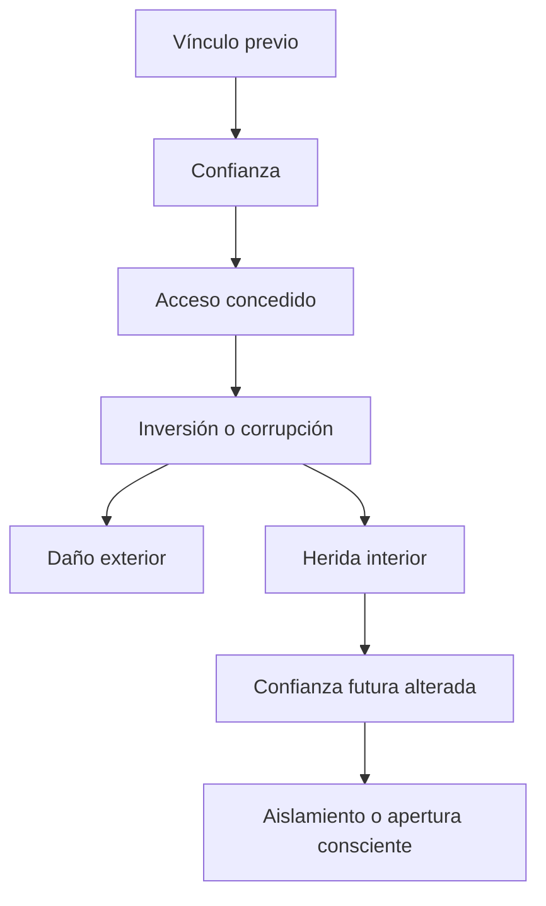
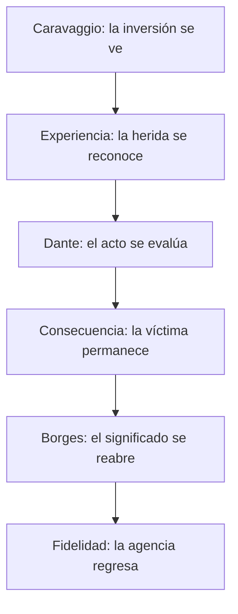

# Trazabilidad conceptual integral del guion sobre la traición

## 0. Identidad del documento

**unidad_de_destino:**  
`video_5_traicion / sistema_conceptual / inventario_integral_y_relaciones`

**tipo_de_unidad:**  
`mapa conceptual jerárquico, trazable y previo a la arquitectura narrativa`

**función:**  
Reunir, distinguir y relacionar todas las ideas disponibles para el guion sobre la traición sin organizarlas todavía como Eventos Cognitivos, subeventos o piezas de voz en off.

**estado:**  
`consolidado como inventario conceptual; abierto a nuevas fuentes y cambios de ponderación`

**regla de lectura:**  
Este documento responde **qué ideas tenemos, de dónde proceden, en qué nivel operan y cómo se relacionan**. No determina todavía en qué orden aparecerán en el guion ni cuánto tiempo ocuparán en pantalla.

---

## 1. Cambio de enfoque

Los documentos anteriores organizaron las ideas como trayectorias narrativas posibles. En esta ocasión se suspende deliberadamente esa organización. Caravaggio, Dante, Borges, la herida, el beso, la puerta y el camino no aparecen como “secciones consecutivas”, sino como nodos de una misma red conceptual.

La unidad básica de trabajo ya no es:

> Evento Cognitivo → piezas → frases.

La unidad básica es:

> fuente → idea extraída → nivel conceptual → función → relaciones → estado.

Esto permite que una idea exista antes de decidir dónde será narrada. Por ejemplo, “la confianza abre una puerta” pertenece al núcleo causal; el beso de Judas la encarna; la confidencia la manifiesta en la experiencia cotidiana; el hielo de Dante evalúa moralmente su inversión; y la apertura consciente con límites resuelve la paradoja que esa misma puerta dejó activa.

---

## 2. Jerarquía de fuentes

La trazabilidad no concede la misma autoridad a todas las fuentes. Una idea puede ser valiosa y, al mismo tiempo, permanecer subordinada, provisional o en reserva.

| Código | Fuente | Función dentro de este documento | Autoridad |
|---|---|---|---|
| `S-R01` | `notas_14_julio.md` | Fija núcleo, propósito emocional, campos principales, Dante, consecuencias, relectura de Judas y cierre | Rectora |
| `S-C01` | `transcripcion_notas_traicion(4).md` | Conserva materia prima, cadena mínima, analogías, manifestaciones, paradoja de la confianza y formulaciones tempranas | Contextual |
| `S-A01` | `3_guion_video_4_final(1).md` | Aporta antecedentes operativos: analogía estructural, símbolos recurrentes, interiorización del conflicto y recuperación de agencia | Antecedente metodológico, no fuente temática directa |
| `S-A02` | `ejemplo_3_de_video.md` | Aporta el tratamiento de Caravaggio como condensación de una contradicción humana y la reserva comparativa Pedro/Judas | Antecedente estilístico y simbólico |
| `S-D01` | `estructura_1_ruta_arquetipica_lineal.md` | Formaliza relaciones causales y pesos de una ruta arquetípica | Derivada estable |
| `S-D02` | `estructura_2_ruta_de_la_herida_al_arquetipo.md` | Formaliza la definición causal y la entrada autobiográfica | Derivada estable |
| `S-D03` | `estructura_3_ruta_del_juicio_a_la_compasion.md` | Formaliza la diferencia entre condenar al traidor y reparar a la víctima | Derivada estable |
| `S-D04` | `estructura_4_ruta_circular_del_beso_a_la_fidelidad.md` | Formaliza las transformaciones del beso, puerta, hielo, luz y camino | Derivada estable |
| `S-P01` | `arquitectura_refinada_video_5_traicion.md` | Estabiliza estados, salvaguardas, imágenes y relaciones entre daño, agencia y confianza futura | Derivada estable |
| `S-P02` | `arquitectura_piezas_guion_traicion_5_opciones.md` | Conserva contenedores micro, objetivos y conexiones posibles | Derivada operativa |
| `S-P03` | `3_opciones_guion_video_5_traicion_estilo_refinado.md` | Conserva realizaciones verbales e imágenes concretas aprobadas o próximas al estilo buscado | Derivada expresiva |
| `S-P04` | `3_versiones_guion_video_traicion.md` | Consolida tres recorridos redactados y varias frases-semilla | Derivada expresiva |
| `S-CH01` | Conversaciones del proyecto | Conserva decisiones, correcciones, comparaciones tempranas y preferencias de tratamiento | Estable o provisional según cada idea |
| `S-TC01` | `ART_trazabilidad-conceptual` | Define unidad de destino, idea fuente, origen, función, peso y estado | Metodológica |
| `S-MA01` | `ART_modelo_arquitectura_macro_narrativo_cognitiva` | Proporciona la jerarquía macro–meso–micro y el tratamiento relacional | Metodológica |

### 2.1. Regla de precedencia

Cuando existe tensión entre fuentes:

1. `S-R01` decide el núcleo y la dirección.
2. `S-C01` amplía, pero no reorganiza el núcleo.
3. Las fuentes `S-D` y `S-P` formalizan consecuencias de las dos anteriores.
4. `S-CH01` puede aportar una decisión estable, una reserva o materia prima; su estado debe declararse.
5. `S-A01` y `S-A02` aportan método, estilo o analogía, pero no pueden introducir por sí solas una nueva tesis sobre la traición.

---

## 3. Estados de formalización

| Estado | Significado |
|---|---|
| `rector_estable` | Idea fijada por el documento rector; no debe eliminarse sin una decisión explícita |
| `contextual_estable` | Idea compatible y reiterada, útil para ampliar el núcleo |
| `derivado_estable` | Inferencia desarrollada en documentos posteriores y compatible con el núcleo |
| `operativo` | Idea sobre cómo comunicar o materializar el contenido, no sobre qué es la traición |
| `condicionado` | Idea utilizable solo bajo una salvaguarda o formulación modal |
| `provisional` | Intuición disponible que todavía no debe gobernar el guion |
| `reserva` | Posible comparación, caso o símbolo que no pertenece al núcleo activo |
| `desactivado` | Idea expresamente tachada, descartada o incompatible con el enfoque actual |
| `restricción` | Idea negativa cuya función es impedir una lectura no deseada |

---

## 4. Niveles de construcción conceptual

Se conservan los tres niveles del MAANC, pero se aplican a la **materia conceptual**, no a la segmentación del guion.

| Nivel | Unidad | Pregunta |
|---|---|---|
| Macro | Tesis globales | ¿Qué debe seguir siendo verdad en cualquier versión del guion? |
| Meso | Campos conceptuales | ¿Qué familias de ideas desarrollan, explican, encarnan, evalúan o limitan las tesis? |
| Micro | Proposiciones, símbolos, casos y frases-semilla | ¿Qué piezas concretas están disponibles para materializar cada campo? |

Las relaciones entre niveles son bidireccionales:

- macro → meso: una tesis exige campos que la desarrollen;
- meso → micro: un campo se descompone en ideas específicas;
- micro → meso: una imagen o ejemplo encarna una función local;
- meso → macro: varios campos convergen en la tesis general;
- micro ↔ micro: símbolos, contrastes y casos pueden reforzarse, oponerse o restringirse entre sí.

---

# NIVEL MACRO

## 5. Texto conceptual consolidado

La traición es un ataque a una confianza previamente concedida mediante el uso, la inversión o la corrupción del acceso que esa confianza hizo posible. Se distingue del daño exterior porque el traidor no solo causa una herida: utiliza una cercanía, un conocimiento, una autoridad o un lugar que había recibido bajo una expectativa de cuidado. Por eso la traición puede dañar tanto el vínculo inmediato como la capacidad futura de confiar, la lectura del pasado y la imagen que la víctima tenía del mundo y de sí misma.

La confianza, sin embargo, no puede ser eliminada sin eliminar también formas esenciales de intimidad, pertenencia y vida compartida. El problema no se resuelve con la clausura absoluta. El beso de Judas, fijado en *El prendimiento de Cristo* de Caravaggio, hace visible la inversión del afecto; Dante da una escala moral a la corrupción del vínculo mediante el hielo del noveno círculo; Borges permite reabrir el significado de Judas y preguntar si el daño puede ser incorporado a una historia que ya no controle por completo. Esa relectura no vuelve buena ni necesaria la traición. La transformación, cuando ocurre, pertenece a la víctima. La última fidelidad consiste en impedir que el acto del traidor dicte también la renuncia a los propios valores, vínculos y camino.

## 6. Ideas macro activas y pesos

| ID | Idea macro | Función global | Peso | Fuentes principales | Estado |
|---|---|---|---:|---|---|
| `MAC-01` | La traición invierte o corrompe un acceso concedido por confianza | Tesis definitoria | 0.21 | `S-R01`, `S-C01` | `rector_estable` |
| `MAC-02` | Su singularidad moral procede de utilizar proximidad, conocimiento y responsabilidad vincular | Diferenciación respecto del daño ordinario | 0.13 | `S-R01`, `S-C01`, `S-D01` | `rector_estable` |
| `MAC-03` | Necesitamos confiar para vivir, pero confiar crea vulnerabilidad y posibilidad de traición | Paradoja humana central | 0.12 | `S-C01`, `S-P01` | `contextual_estable` |
| `MAC-04` | Judas y el beso pintado por Caravaggio condensan visualmente la inversión de la cercanía | Encarnación arquetípica | 0.11 | `S-R01`, `S-C01`, `S-D04` | `rector_estable` |
| `MAC-05` | La traición hiere la confianza futura, el pasado recordado, la inocencia y la continuidad identitaria | Consecuencia interior | 0.16 | `S-R01`, `S-D01`, `S-P01` | `rector_estable` |
| `MAC-06` | Dante proporciona una representación de la gravedad moral mediante el fondo helado | Evaluación simbólica | 0.09 | `S-R01`, `S-D03` | `rector_estable` |
| `MAC-07` | El significado futuro de la herida puede transformarse sin justificar el acto ni absolver al traidor | Giro de agencia | 0.10 | `S-R01`, `S-C01`, `S-P01` | `condicionado` |
| `MAC-08` | La última fidelidad consiste en no abandonar el propio camino a causa de la traición recibida | Resolución ética | 0.08 | `S-R01`, `S-D04`, `S-P03` | `rector_estable` |
|  | **Total** |  | **1.00** |  |  |

## 7. Grafo macro causal



## 8. Grafo macro de interpretación



Este segundo grafo no fija un orden obligatorio de secciones. Declara relaciones de función entre campos: encarnación, reconocimiento, evaluación, consecuencia, movilidad interpretativa y resolución.

---

# NIVEL MESO Y MICRO

## 9. Meso 01 — Estructura mínima de la traición

**unidad_de_destino:**  
`video_5_traicion / campo_definitorio / estructura_minima`

**texto consolidado:**  
La traición requiere una relación previa que produzca confianza. La confianza convierte a alguien en una presencia interpretada como segura y le concede alguna forma de acceso. La traición ocurre cuando ese acceso cambia de orientación: deja de servir al vínculo y se utiliza para producir daño. La herida alcanza tanto un objeto, relación o promesa como la capacidad de volver a confiar.

| ID | Idea micro | Función | Peso | Origen | Estado |
|---|---|---|---:|---|---|
| `M01-01` | Alguien ocupa primero un lugar cercano o de pertenencia | Condición de vínculo | 0.13 | `S-C01` | `contextual_estable` |
| `M01-02` | Ese lugar es interpretado como seguro | Formación de confianza | 0.16 | `S-C01` | `contextual_estable` |
| `M01-03` | La confianza abre una puerta material, informativa, afectiva o institucional | Producción de acceso | 0.19 | `S-R01`, `S-C01` | `rector_estable` |
| `M01-04` | El acceso deja de servir al vínculo y comienza a servir al daño | Inversión constitutiva | 0.22 | `S-R01`, `S-C01` | `rector_estable` |
| `M01-05` | El daño llega desde dentro de una expectativa de cuidado | Diferenciación causal | 0.14 | `S-D01`, `S-P01` | `derivado_estable` |
| `M01-06` | La herida puede alcanzar la capacidad futura de confiar | Consecuencia interna | 0.16 | `S-R01`, `S-C01` | `rector_estable` |
|  | **Total** |  | **1.00** |  |  |

### Fórmulas disponibles

- `vínculo → confianza → acceso → inversión → herida`.
- `A confía → A concede acceso → B usa el acceso para dañar`.
- “La traición ocurre cuando alguien usa el lugar que le dimos en nuestra vida para herirnos desde dentro”.
- “La traición no rompe la puerta: entra por la puerta que la confianza dejó abierta”.

---

## 10. Meso 02 — Diferencia específica y topología del daño

**unidad_de_destino:**  
`video_5_traicion / campo_definitorio / fronteras_y_topologia`

**texto consolidado:**  
No todo daño, mentira, abandono o engaño constituye traición. La traición se distingue porque necesita una entrada previa legítima. El enemigo busca, fuerza o rompe una defensa; el traidor puede usar un mapa que la víctima ayudó a construir. El refugio se convierte en infraestructura de daño y la forma externa de un gesto puede permanecer intacta mientras su propósito se sustituye.

| ID | Idea micro | Función | Peso | Origen | Estado |
|---|---|---|---:|---|---|
| `M02-01` | El enemigo intenta romper la puerta; el traidor utiliza la entrada que ya conoce | Contraste central | 0.23 | `S-C01`, `S-D02` | `contextual_estable` |
| `M02-02` | No todo daño o engaño contiene la estructura completa de una traición | Borde conceptual | 0.18 | `S-D02` | `derivado_estable` |
| `M02-03` | Un desconocido puede mentir, robar o herir sin haber recibido confianza | Caso negativo | 0.13 | `S-P01` | `derivado_estable` |
| `M02-04` | El acceso puede ser físico, informativo, afectivo, reputacional, institucional o de autoridad | Tipología de acceso | 0.16 | `S-C01`, `S-D02` | `contextual_estable` |
| `M02-05` | Quien confía habita el vínculo como refugio; quien traiciona lo usa como infraestructura de daño | Tensión topológica | 0.17 | `S-C01` | `contextual_estable` |
| `M02-06` | La forma puede conservar apariencia de afecto mientras su función se vuelve hostil | Separación forma–propósito | 0.13 | `S-D04`, `S-P01` | `derivado_estable` |
|  | **Total** |  | **1.00** |  |  |

---

## 11. Meso 03 — Paradoja de la confianza y precio de la vulnerabilidad

**unidad_de_destino:**  
`video_5_traicion / campo_antropologico / confianza_y_riesgo`

**texto consolidado:**  
La confianza no es un error que deba suprimirse. Hace posibles la intimidad, la cooperación, la amistad, el amor y la pertenencia, pero produce exposición. La posibilidad de la traición nace de esa misma apertura. Evitar todo riesgo exigiría evitar también todo vínculo significativo. Por eso vivir requiere valor: no ingenuidad, sino la capacidad de abrirse con discernimiento, reciprocidad y límites.

| ID | Idea micro | Función | Peso | Origen | Estado |
|---|---|---|---:|---|---|
| `M03-01` | Necesitamos confiar para vivir | Tesis antropológica | 0.20 | `S-C01` | `contextual_estable` |
| `M03-02` | Sin confianza no hay vínculo real | Condición de intimidad | 0.13 | `S-C01` | `contextual_estable` |
| `M03-03` | Confiar concede vulnerabilidad y conocimiento privilegiado | Mecanismo de exposición | 0.18 | `S-C01`, `S-P01` | `contextual_estable` |
| `M03-04` | Con vulnerabilidad aparece la posibilidad de traición | Consecuencia estructural | 0.13 | `S-C01` | `contextual_estable` |
| `M03-05` | “No confíes en nadie” produciría una vida inhabitable | Refutación de la clausura | 0.14 | `S-C01`, `S-D03` | `contextual_estable` |
| `M03-06` | Vivir implica riesgo y por eso necesita valor | Proyección ética | 0.11 | `S-C01` | `contextual_estable` |
| `M03-07` | La respuesta madura administra el riesgo mediante límites, atención y reciprocidad | Resolución práctica | 0.11 | `S-P01`, `S-D04` | `derivado_estable` |
|  | **Total** |  | **1.00** |  |  |

---

## 12. Meso 04 — Judas, el beso y Caravaggio

**unidad_de_destino:**  
`video_5_traicion / campo_arquetipico / judas_caravaggio_beso`

**texto consolidado:**  
*El prendimiento de Cristo* ofrece una imagen completa de la traición. Judas pertenece al círculo íntimo, puede acercarse como discípulo y utiliza un beso —gesto asociado con afecto y fraternidad— como señal operativa para identificar a Jesús. El arresto exterior depende de una acción interior al vínculo. Caravaggio no interesa aquí como tema técnico, sino como dispositivo que permite ver la inversión antes de explicarla.

| ID | Idea micro | Función | Peso | Origen | Estado |
|---|---|---|---:|---|---|
| `M04-01` | La pintura funciona como puente visual y emocional | Dispositivo de entrada | 0.10 | `S-R01` | `rector_estable` |
| `M04-02` | Judas es el arquetipo occidental del traidor íntimo | Escala cultural | 0.12 | `S-R01`, `S-C01` | `rector_estable` |
| `M04-03` | Si incluso Cristo fue traicionado, ninguna persona queda completamente fuera de esa posibilidad | Universalización | 0.08 | `S-R01` | `rector_estable` |
| `M04-04` | El beso pertenece al lenguaje del amor, saludo, fraternidad o cercanía | Valor original del signo | 0.13 | `S-R01`, `S-C01` | `rector_estable` |
| `M04-05` | Judas usa el beso como señal para identificar y entregar a Jesús | Inversión visible | 0.20 | `S-R01`, `S-D01` | `rector_estable` |
| `M04-06` | Judas no llega como extraño: es uno de los doce y conserva el rostro de un discípulo | Pertenencia previa | 0.14 | `S-C01`, `S-P03` | `contextual_estable` |
| `M04-07` | La proximidad es posible porque la relación ya retiró ciertas defensas | Acceso legítimo | 0.13 | `S-D01`, `S-P01` | `derivado_estable` |
| `M04-08` | El arresto externo comienza mediante una señal interior al vínculo | Condensación del modelo | 0.10 | `S-D03` | `derivado_estable` |
|  | **Total** |  | **1.00** |  |  |

### Control de identidad pictórica

- Obra estructural activa: *El prendimiento de Cristo* o *La captura de Cristo* de Caravaggio.
- *La negación de san Pedro* pertenece al antecedente estilístico y a una posible comparación, pero no debe confundirse con la pintura del beso de Judas.

---

## 13. Meso 05 — Dante y la evaluación moral

**unidad_de_destino:**  
`video_5_traicion / campo_evaluativo / dante_hielo`

**texto consolidado:**  
Dante coloca a los traidores en la región más profunda de su *Infierno*. El castigo no aparece como fuego, sino como hielo. Esta imagen permite representar la traición como frialdad moral, cálculo, detención del vínculo y ruptura de la circulación de confianza. Su función es dar proporción simbólica a la indignación de la víctima, no establecer una demostración objetiva ni agotar el problema mediante el castigo.

| ID | Idea micro | Función | Peso | Origen | Estado |
|---|---|---|---:|---|---|
| `M05-01` | Los traidores ocupan el noveno y último círculo | Jerarquía moral | 0.16 | `S-R01` | `rector_estable` |
| `M05-02` | La traición aparece por debajo de la violencia ordinaria | Comparación moral | 0.16 | `S-R01`, `S-P04` | `rector_estable` |
| `M05-03` | Su gravedad combina inteligencia, voluntad y ruptura de un vínculo especial | Fundamento de la condena | 0.18 | `S-R01` | `rector_estable` |
| `M05-04` | El fondo del Infierno está congelado, no ardiendo | Extrañamiento simbólico | 0.13 | `S-R01` | `rector_estable` |
| `M05-05` | El hielo representa frialdad, cálculo e indiferencia moral | Interpretación | 0.14 | `S-R01`, `S-D03` | `rector_estable` |
| `M05-06` | En el hielo, el vínculo se inmoviliza y la confianza deja de circular | Síntesis relacional | 0.13 | `S-R01`, `S-D04` | `rector_estable` |
| `M05-07` | Dante presta una escala cultural a una condena que la víctima ya siente | Legitimación emocional | 0.07 | `S-D01`, `S-P02` | `derivado_estable` |
| `M05-08` | Dante funciona como representación literaria poderosa, no como prueba objetiva | Límite epistemológico | 0.03 | `S-P01` | `restricción` |
|  | **Total** |  | **1.00** |  |  |

### Distinción decisiva

> La condena puede decir qué pensamos del culpable; no puede reconstruir por sí sola lo que perdió la víctima.

---

## 14. Meso 06 — Consecuencias, pérdida y temporalidad de la herida

**unidad_de_destino:**  
`video_5_traicion / campo_fenomenologico / consecuencias_en_la_victima`

**texto consolidado:**  
La traición no termina cuando termina el vínculo. Puede alterar la confianza futura, reescribir retrospectivamente los recuerdos y producir un duelo por la persona que se era antes de conocer ese tipo de daño. El mundo parece más duro, una forma de inocencia desaparece y la defensa puede generalizar la culpa de una persona hacia todas las relaciones posteriores.

| ID | Idea micro | Función | Peso | Origen | Estado |
|---|---|---|---:|---|---|
| `M06-01` | La capacidad futura de confiar queda herida | Consecuencia central | 0.18 | `S-R01`, `S-C01` | `rector_estable` |
| `M06-02` | Los recuerdos compartidos cambian retrospectivamente de significado | Daño temporal | 0.14 | `S-D01`, `S-P01` | `derivado_estable` |
| `M06-03` | Se pierde una forma anterior de inocencia | Duelo identitario | 0.12 | `S-R01` | `rector_estable` |
| `M06-04` | Se descubre que el mundo puede ser duro | Desengaño | 0.11 | `S-R01` | `rector_estable` |
| `M06-05` | La experiencia se asemeja a un paraíso perdido al que no puede regresarse intacto | Campo simbólico | 0.10 | `S-R01`, `S-P04` | `rector_estable` |
| `M06-06` | El mundo pierde una luz y la mirada se vuelve menos disponible | Imagen de pérdida | 0.10 | `S-R01`, `S-D04` | `rector_estable` |
| `M06-07` | La víctima descubre la profundidad de su propia vulnerabilidad | Conciencia de exposición | 0.08 | `S-R01` | `rector_estable` |
| `M06-08` | Existe una pérdida doble: se pierde a alguien y una versión anterior de uno mismo | Síntesis del duelo | 0.09 | `S-D01`, `S-P02` | `derivado_estable` |
| `M06-09` | Una traición particular puede deformarse en sospecha general hacia todos | Riesgo de propagación | 0.08 | `S-D02`, `S-P01` | `derivado_estable` |
|  | **Total** |  | **1.00** |  |  |

### Preguntas micro disponibles

- ¿Cuándo comenzó realmente la mentira?
- ¿Qué recuerdos eran seguros y cuáles ahora parecen preparación del daño?
- ¿Desconfías de la persona presente por lo que hizo, o por lo que otra persona te enseñó a temer?
- ¿Quién está tomando las decisiones futuras: tú o la herida?

---

## 15. Meso 07 — Borges, Judas y movilidad del significado

**unidad_de_destino:**  
`video_5_traicion / campo_hermeneutico / relectura_y_transformacion`

**texto consolidado:**  
*Tres versiones de Judas* permite introducir una operación de relectura sobre una figura cultural aparentemente fijada. La utilidad de Borges no consiste en absolver a Judas ni en convertir una especulación literaria en doctrina, sino en mostrar que un hecho puede permanecer irreversible mientras su función dentro de una historia posterior cambia. Aplicado a la víctima, esto significa que el origen de la herida no fue elegido, pero su significado futuro no tiene que quedar totalmente bajo la autoridad del traidor.

| ID | Idea micro | Función | Peso | Origen | Estado |
|---|---|---|---:|---|---|
| `M07-01` | Borges reabre una figura cuyo significado parecía inmóvil | Modelo de relectura | 0.12 | `S-R01`, `S-C01` | `rector_estable` |
| `M07-02` | Nils Runeberg formula versiones de Judas como figura necesaria, sacrificada o incluso divina | Contenido literario de referencia | 0.10 | `S-C01` | `contextual_estable` |
| `M07-03` | La entrega de Judas forma parte de la secuencia arresto–crucifixión–redención | Paradoja narrativa | 0.09 | `S-C01`, `S-P03` | `condicionado` |
| `M07-04` | El daño no se vuelve bueno, necesario ni justo porque algo posterior nazca de él | Salvaguarda moral | 0.18 | `S-R01`, `S-P01` | `restricción` |
| `M07-05` | La víctima puede intervenir en el significado y la función futura de la herida | Recuperación de agencia | 0.19 | `S-D03`, `S-P01` | `derivado_estable` |
| `M07-06` | La traición puede destruir o, a veces, actuar como catalizador doloroso de maduración | Bifurcación transformativa | 0.10 | `S-R01`, `S-C01` | `condicionado` |
| `M07-07` | Cualquier crecimiento posterior pertenece a la víctima, no al traidor | Restitución de autoría | 0.12 | `S-D01`, `S-P03` | `restricción` |
| `M07-08` | La cicatriz puede convertirse en conocimiento sin dejar de ser cicatriz | Imagen de integración | 0.10 | `S-P02`, `S-P04` | `derivado_estable` |
|  | **Total** |  | **1.00** |  |  |

### Nota de precisión

La formulación contextual “sin la traición de Judas no habría crucifixión y sin ella no habría trascendencia” debe conservarse como **paradoja narrativa o materia prima**, no como afirmación doctrinal cerrada. Su función es separar la intención del traidor de los significados que la historia produce después.

---

## 16. Meso 08 — Traición a uno mismo, autoría y camino

**unidad_de_destino:**  
`video_5_traicion / campo_etico / fidelidad_interior`

**texto consolidado:**  
La traición externa puede prolongarse dentro de la víctima cuando el miedo organiza toda su vida posterior. Protegerse puede ser necesario; abandonar los propios valores, la capacidad de amar, los proyectos o el camino personal concede al acto del traidor una autoridad que excede el instante del daño. La fidelidad final no es hacia quien rompió el vínculo, sino hacia aquello que todavía pertenece a la víctima.

| ID | Idea micro | Función | Peso | Origen | Estado |
|---|---|---|---:|---|---|
| `M08-01` | La traición externa puede continuar como abandono interior | Giro ético | 0.20 | `S-R01`, `S-D04` | `rector_estable` |
| `M08-02` | La víctima puede abandonar valores, amor, propósito, humanidad o identidad para evitar otro daño | Formas de autotraición | 0.17 | `S-D01`, `S-P02` | `derivado_estable` |
| `M08-03` | Cerrarse por completo prolonga el poder del traidor sobre el futuro | Consecuencia | 0.15 | `S-D02`, `S-P01` | `derivado_estable` |
| `M08-04` | Una persona ausente puede seguir organizando cada puerta, vínculo y decisión | Persistencia invisible | 0.13 | `S-P01` | `derivado_estable` |
| `M08-05` | No se controla el acto recibido, pero puede trabajarse la relación posterior con la herida | Principio de agencia limitada | 0.14 | `S-R01`, `S-P02` | `rector_estable` |
| `M08-06` | La última fidelidad consiste en conservar el camino propio | Tesis final | 0.13 | `S-R01`, `S-P03` | `rector_estable` |
| `M08-07` | La confianza futura puede ser consciente, limitada y compatible con distancia definitiva del traidor | Resolución positiva | 0.08 | `S-D03`, `S-P01` | `derivado_estable` |
|  | **Total** |  | **1.00** |  |  |

---

## 17. Meso 09 — Manifestaciones contextuales del mismo núcleo

**unidad_de_destino:**  
`video_5_traicion / campo_de_manifestaciones / adaptaciones_contextuales`

**texto consolidado:**  
El núcleo de la traición puede manifestarse en dominios distintos siempre que se preserve la secuencia vínculo–confianza–acceso–inversión–herida. Las superficies cambian; la estructura no.

| ID | Manifestación | Contraste interno | Peso | Origen | Estado |
|---|---|---|---:|---|---|
| `M09-01` | Amor | Intimidad como refugio ↔ intimidad como zona de manipulación | 0.14 | `S-C01` | `contextual_estable` |
| `M09-02` | Amistad | Confidencia como cercanía ↔ confidencia como información utilizable | 0.14 | `S-C01` | `contextual_estable` |
| `M09-03` | Familia | Sangre como protección ↔ sangre como derecho para exigir, usar o destruir | 0.14 | `S-C01` | `contextual_estable` |
| `M09-04` | Política | Lealtad a una persona ↔ fidelidad declarada a una causa superior | 0.12 | `S-C01` | `contextual_estable` |
| `M09-05` | Religión | Pertenencia al círculo sagrado ↔ utilización de esa pertenencia para entregar | 0.12 | `S-C01` | `contextual_estable` |
| `M09-06` | Patria | Pertenencia y deber ↔ entrega de aquello que debía protegerse | 0.10 | `S-C01`, `S-CH01` | `contextual_estable` |
| `M09-07` | Iago | Consejo confiable ↔ manipulación de la percepción | 0.10 | `S-C01` | `contextual_estable` |
| `M09-08` | Bruto | Amistad política ↔ fidelidad a una causa presentada como superior | 0.05 | `S-CH01` | `reserva` |
| `M09-09` | *King Lear* | Vínculo filial ↔ uso destructivo de la autoridad y la herencia | 0.04 | `S-CH01` | `reserva` |
| `M09-10` | Infidelidad amorosa | Exclusividad prometida ↔ uso o ruptura encubierta del pacto | 0.05 | `S-CH01` | `reserva` |
|  | **Total** |  | **1.00** |  |  |

### Regla de validación de una manifestación

Una manifestación solo pertenece al campo activo si pueden identificarse:

1. vínculo previo;
2. expectativa de seguridad o lealtad;
3. acceso concedido;
4. inversión de ese acceso;
5. daño vincular o daño a la capacidad de confiar.

---

## 18. Meso 10 — Analogías de caza y fronteras del concepto

**unidad_de_destino:**  
`video_5_traicion / campo_de_bordes / mecanismos_de_bajar_la_guardia`

**texto consolidado:**  
Las plantas carnívoras, el cebo, el estafador y quien finge amor comparten con la traición una estrategia: producir seguridad aparente para que la víctima baje la guardia. Sin embargo, no todos constituyen traición, porque puede faltar un vínculo previo real y una confianza legítimamente concedida. Sirven para pensar el mecanismo de acceso, no para definir el fenómeno.

| ID | Idea micro | Función | Peso | Origen | Estado |
|---|---|---|---:|---|---|
| `M10-01` | La planta carnívora imita señales del alimento para atraer | Analogía biológica | 0.13 | `S-C01` | `provisional` |
| `M10-02` | El cebo vuelve atractiva la entrada al anzuelo | Analogía instrumental | 0.12 | `S-C01` | `provisional` |
| `M10-03` | El estafador monta un espectáculo para producir confianza aparente | Analogía social | 0.13 | `S-C01` | `provisional` |
| `M10-04` | El mujeriego puede fingir amor para obtener sensualidad | Caso limítrofe afectivo | 0.14 | `S-C01` | `provisional` |
| `M10-05` | Todos comparten la operación de hacer bajar la guardia | Semejanza estructural | 0.18 | `S-C01` | `contextual_estable` |
| `M10-06` | Pueden no ser traiciones porque falta una confianza previa auténtica | Frontera definitoria | 0.22 | `S-C01`, `S-D02` | `contextual_estable` |
| `M10-07` | Deben utilizarse como analogías laterales, no como núcleo | Control de uso | 0.08 | `S-D01` | `restricción` |
|  | **Total** |  | **1.00** |  |  |

---

## 19. Meso 11 — Sistema de símbolos y transformaciones

**unidad_de_destino:**  
`video_5_traicion / campo_simbolico / motivos_recurrentes`

**texto consolidado:**  
Los símbolos no son decoraciones intercambiables. Cada uno materializa una relación conceptual y puede transformarse durante el guion. Su retorno debe cambiar de función.

| ID | Símbolo | Concepto que materializa | Peso | Fuentes | Estado |
|---|---|---|---:|---|---|
| `M11-01` | Beso | Cercanía cuya función ha sido invertida | 0.15 | `S-R01`, `S-D04` | `rector_estable` |
| `M11-02` | Puerta / umbral | Acceso concedido, entrada, clausura y reapertura consciente | 0.14 | `S-C01`, `S-D04` | `contextual_estable` |
| `M11-03` | Llave | Confianza como autorización y posibilidad de acceso | 0.07 | `S-A01`, `S-P01` | `operativo` |
| `M11-04` | Refugio / casa / habitaciones | Interioridad confiada que puede convertirse en infraestructura de daño | 0.12 | `S-C01`, `S-P01` | `contextual_estable` |
| `M11-05` | Hielo | Frialdad moral, vínculo detenido y posible congelamiento de la víctima | 0.13 | `S-R01`, `S-D03` | `rector_estable` |
| `M11-06` | Luz / sombra | Confianza, revelación, pérdida de inocencia y una luz posterior menos ingenua | 0.10 | `S-R01`, `S-A02`, `S-D04` | `derivado_estable` |
| `M11-07` | Paraíso perdido | Estado de inocencia que ya no puede recuperarse intacto | 0.07 | `S-R01`, `S-P04` | `rector_estable` |
| `M11-08` | Herida / cicatriz | Dolor activo que puede integrarse sin desaparecer | 0.09 | `S-P02`, `S-P04` | `derivado_estable` |
| `M11-09` | Invierno / deshielo / estaciones | Inmovilidad, duración y cambio sin negación | 0.07 | `S-D04`, `S-P03` | `derivado_estable` |
| `M11-10` | Camino | Autoría, dirección, continuidad y fidelidad interior | 0.06 | `S-R01`, `S-P03` | `rector_estable` |
|  | **Total** |  | **1.00** |  |  |

### Transformaciones simbólicas

| Símbolo | Estado inicial | Crisis | Estado resuelto |
|---|---|---|---|
| Beso | Afecto y fraternidad | Señal de entrega | Capacidad de cercanía que se conserva sin ingenuidad |
| Puerta | Acceso concedido | Entrada usada contra quien abrió | Apertura selectiva con límites |
| Hielo | Castigo del traidor | Frialdad interiorizada por la víctima | Deshielo del significado sin olvido |
| Luz | Inocencia y confianza | El mundo pierde una luz | Claridad más sobria y habitable |
| Herida | Dolor impuesto | Riesgo de identidad total | Cicatriz integrada, no destino absoluto |
| Camino | Trayectoria alterada por otro | Vida organizada alrededor del daño | Dirección recuperada por la víctima |

---

## 20. Meso 12 — Principios de comunicación del sistema conceptual

**unidad_de_destino:**  
`video_5_traicion / campo_operativo / comunicacion_emocional`

**texto consolidado:**  
El guion no debe comparecer como una explicación académica del concepto. Debe crear reconocimiento, acompañar la condena y el duelo, y reconstruir sentido. La alta aplicabilidad solo es válida si cada frase conserva el mecanismo de confianza, acceso e inversión; de lo contrario se vuelve genericidad emocional.

| ID | Idea operativa | Función | Peso | Origen | Estado |
|---|---|---|---:|---|---|
| `M12-01` | El objetivo principal es crear vínculo emocional, no impartir una definición académica | Orientación global | 0.20 | `S-R01`, `S-CH01` | `rector_estable` |
| `M12-02` | El efecto Barnum orienta frases de alta aplicabilidad | Identificación transversal | 0.16 | `S-R01`, `S-C01` | `rector_estable` |
| `M12-03` | Las frases deben conservar relaciones de causa y efecto | Evitar vaguedad | 0.13 | `S-R01` | `rector_estable` |
| `M12-04` | Una idea abstracta debe terminar en una imagen concreta o una encarnación | Intensificación y estilo | 0.12 | `S-CH01`, `S-P03` | `operativo` |
| `M12-05` | La biografía debe quedar abierta para que el espectador complete su propia historia | Aplicabilidad controlada | 0.10 | `S-P02`, `S-CH01` | `operativo` |
| `M12-06` | Caravaggio, Dante y Borges deben funcionar como dispositivos, no como temas académicos autónomos | Disciplina cultural | 0.10 | `S-D01`, `S-P01` | `derivado_estable` |
| `M12-07` | Dante valida la condena, pero no debe absorber todo el guion | Control de balance | 0.06 | `S-D03` | `restricción` |
| `M12-08` | El duelo debe recibir espacio antes de introducir transformación o esperanza | Secuencia emocional mínima | 0.06 | `S-D03`, `S-P04` | `derivado_estable` |
| `M12-09` | Una frase amplia debe seguir mostrando confianza → acceso → inversión, no cualquier conflicto | Control Barnum | 0.07 | `S-D02`, `S-P02` | `restricción` |
|  | **Total** |  | **1.00** |  |  |

### Fórmulas de alta aplicabilidad ya disponibles

- “Una vez que traicionan tu confianza te cuesta volver a confiar”.
- “Lo más doloroso de la traición es que proviene de alguien en quien confías”.
- “Quizá a ti no te entregaron con un beso”.
- “El enemigo busca dónde entrar; el traidor ya conoce el lugar”.
- “No tuvo que buscar a ciegas: conocía el lugar porque tú mismo se lo habías mostrado”.

Estas fórmulas son materia de construcción. No todas deben conservarse literalmente en la redacción final.

---

## 21. Meso 13 — Salvaguardas éticas y hermenéuticas

**unidad_de_destino:**  
`video_5_traicion / campo_de_control / salvaguardas`

**texto consolidado:**  
La posibilidad de transformación debe permanecer bajo controles explícitos. El guion no puede convertir la traición en un bien, una necesidad moral, un regalo del traidor o una obligación de sanación. La agencia de la víctima mira hacia el futuro; no produce responsabilidad retroactiva por el daño recibido.

| ID | Salvaguarda | Función | Peso | Origen | Estado |
|---|---|---|---:|---|---|
| `M13-01` | No toda traición produce crecimiento | Evitar automatismo | 0.13 | `S-P01` | `restricción` |
| `M13-02` | La víctima no necesitaba ser traicionada para madurar | Evitar necesidad moral | 0.12 | `S-P01` | `restricción` |
| `M13-03` | La supervivencia o fortaleza posterior no son mérito del traidor | Restituir autoría | 0.15 | `S-P01`, `S-P03` | `restricción` |
| `M13-04` | Nadie debe agradecer la herida | Evitar gratitud forzada | 0.12 | `S-D01`, `S-P03` | `restricción` |
| `M13-05` | Nadie debe ser culpado por no sanar o trascender | Evitar responsabilización secundaria | 0.11 | `S-D01` | `restricción` |
| `M13-06` | Transformar no significa perdonar, reconciliarse ni regresar | Separar operaciones | 0.09 | `S-D03` | `restricción` |
| `M13-07` | La confianza futura puede coexistir con distancia definitiva del traidor | Proteger límites | 0.08 | `S-D03` | `restricción` |
| `M13-08` | Recuperar agencia no vuelve responsable a la víctima del acto original | Límite de agencia | 0.08 | `S-D03` | `restricción` |
| `M13-09` | El sufrimiento no debe romantizarse aunque pueda ser integrado | Control de tono | 0.12 | `S-R01`, `S-P01` | `restricción` |
|  | **Total** |  | **1.00** |  |  |

---

# RELACIONES ENTRE IDEAS

## 22. Tipos de arista

| Tipo | Significado |
|---|---|
| `habilita` | Una idea crea la condición de posibilidad de otra |
| `causa` | Una idea produce o contribuye a una consecuencia |
| `constituye` | Varias ideas forman juntas una unidad superior |
| `contrasta` | Una idea se comprende por oposición a otra |
| `encarna` | Un símbolo, caso o escena vuelve visible una estructura |
| `evalúa` | Una idea asigna gravedad o valor moral a otra |
| `explica` | Una idea aporta la razón o el mecanismo de otra |
| `transfiere` | Una forma cultural se proyecta hacia la experiencia del espectador |
| `propaga` | Una consecuencia pasa del acto original a otros tiempos o vínculos |
| `prepara` | Una idea deja disponible la condición interpretativa de la siguiente |
| `reabre` | Una idea vuelve móvil un significado antes fijado |
| `resuelve` | Una idea ofrece salida a una tensión previa |
| `limita` | Una salvaguarda impide una interpretación excesiva |
| `manifiesta` | Un caso contextual realiza el mismo núcleo en otro dominio |
| `causa_potencial` | Una idea puede producir otra, pero no de manera necesaria o automática |
| `comparte_operacion` | Dos ideas distintas realizan un mecanismo parcial común sin ser equivalentes |

## 23. Registro principal de aristas

| ID | Origen | Relación | Destino | Explicación |
|---|---|---|---|---|
| `REL-001` | `M01-01` vínculo | `habilita` | `M01-02` confianza | La confianza requiere alguna forma de cercanía o pertenencia previa |
| `REL-002` | `M01-02` confianza | `causa` | `M01-03` acceso | Lo considerado seguro recibe entrada, información o autoridad |
| `REL-003` | `M01-03` acceso | `habilita` | `M01-04` inversión | La traición usa posibilidades que la apertura hizo disponibles |
| `REL-004` | `M01-04` inversión | `causa` | `M01-05` daño desde dentro | El recurso del vínculo se vuelve recurso de la herida |
| `REL-005` | `M01-04` inversión | `causa` | `M01-06` confianza futura herida | La víctima aprende que la apertura puede ser usada en su contra |
| `REL-006` | `M02-01` enemigo/traidor | `contrasta` | `MAC-01` | Hace visible la diferencia entre fuerza exterior y acceso concedido |
| `REL-007` | `M02-02` no todo daño | `limita` | `MAC-01` | Impide que el concepto se vuelva sinónimo de cualquier sufrimiento |
| `REL-008` | `M02-05` refugio/infraestructura | `encarna` | `M01-04` | Traduce la inversión a una topología emocional |
| `REL-009` | `M03-01` necesidad de confiar | `contrasta` | `M03-04` posibilidad de traición | La misma condición que hace posible el vínculo hace posible la herida |
| `REL-010` | `M03-05` vida inhabitable | `limita` | `M08-03` cierre absoluto | Evita convertir el aislamiento en solución |
| `REL-011` | `M04-04` beso afectivo | `contrasta` | `M04-05` beso-señal | El mismo gesto conserva forma y cambia de propósito |
| `REL-012` | `M04-06` Judas discípulo | `habilita` | `M04-07` proximidad | La pertenencia previa vuelve posible el acercamiento sin defensa |
| `REL-013` | `M04-05` beso-señal | `encarna` | `M01-04` inversión | Caravaggio materializa la tesis definitoria |
| `REL-014` | `M04-08` señal interior | `causa` | arresto exterior | La acción del enemigo exterior depende del acceso del traidor íntimo |
| `REL-015` | `M05-01` fondo del Infierno | `evalúa` | `MAC-02` singularidad moral | Dante asigna a la traición el punto más bajo |
| `REL-016` | `M05-03` inteligencia y voluntad | `explica` | `M05-02` gravedad mayor | La traición incorpora conocimiento del vínculo y decisión de invertirlo |
| `REL-017` | `M05-04` hielo | `encarna` | `M05-05` frialdad moral | La anomalía térmica vuelve visible el cálculo |
| `REL-018` | `M05-06` vínculo detenido | `prepara` | `M06-01` confianza futura herida | El hielo migra simbólicamente del culpable a la víctima |
| `REL-019` | Condena de Dante | `contrasta` | reparación de la víctima | Castigar no devuelve inocencia, recuerdos ni confianza |
| `REL-020` | `M06-02` pasado reescrito | `propaga` | tiempo anterior | La traición altera incluso la lectura de lo ya vivido |
| `REL-021` | `M06-01` confianza herida | `propaga` | vínculos futuros | Personas nuevas pueden ser evaluadas mediante un peligro aprendido antes |
| `REL-022` | `M06-03` inocencia perdida | `constituye` | `M06-08` pérdida doble | Se pierde una relación y una versión del yo |
| `REL-023` | `M06-09` sospecha general | `causa` | `M08-03` clausura | La excepción se transforma en regla defensiva |
| `REL-024` | `M08-03` clausura | `causa_potencial` | `M08-01` autotraición | Protegerse puede convertirse en abandono de valores y vínculos |
| `REL-025` | `M07-01` Borges | `reabre` | figura de Judas | La figura fijada admite nuevas relaciones interpretativas |
| `REL-026` | `M07-03` secuencia redentora | `contrasta` | intención de Judas | El traidor inicia un acto sin controlar todos sus significados posteriores |
| `REL-027` | `M07-04` daño no bueno | `limita` | `M07-06` catalizador | La posibilidad de maduración no justifica el origen del dolor |
| `REL-028` | `M07-07` autoría de la víctima | `resuelve` | apropiación del crecimiento por el traidor | La fuerza posterior pertenece a quien la construye |
| `REL-029` | `M08-05` agencia limitada | `resuelve` | irreversibilidad del pasado | No cambia el hecho, cambia la relación futura con él |
| `REL-030` | `M08-06` camino propio | `resuelve` | `MAC-08` | La fidelidad se desplaza del vínculo roto hacia la continuidad interior |
| `REL-031` | `M08-07` confianza consciente | `resuelve` | `MAC-03` paradoja de la confianza | La salida no es ingenuidad ni clausura total |
| `REL-032` | `M09-01` a `M09-10` | `manifiesta` | `MAC-01` | Cada dominio conserva el núcleo y cambia la superficie |
| `REL-033` | `M10-01` a `M10-04` | `comparte_operacion` | bajar la guardia | Las analogías comparten atracción o seguridad aparente |
| `REL-034` | `M10-06` falta de confianza previa | `limita` | analogías de caza | Semejanza estratégica no equivale a identidad conceptual |
| `REL-035` | `M11-01` beso | `encarna` | forma/propósito | Un signo de afecto conserva apariencia mientras opera como arma |
| `REL-036` | `M11-02` puerta | `encarna` | confianza/acceso | La apertura espacial materializa la autorización vincular |
| `REL-037` | `M11-05` hielo | `propaga` | `M11-09` invierno | La condena moral se convierte en duración emocional |
| `REL-038` | `M11-08` cicatriz | `resuelve` | herida como destino | Permite permanencia sin identidad total |
| `REL-039` | `M12-02` alta aplicabilidad | `transfiere` | experiencia del espectador | El caso arquetípico se vuelve autobiográficamente reconocible |
| `REL-040` | `M12-09` cadena causal | `limita` | efecto Barnum | Impide que la identificación se vuelva una colección de frases genéricas |
| `REL-041` | `M12-06` referencias como dispositivos | `limita` | academicismo | Caravaggio, Dante y Borges sirven a la tesis humana |
| `REL-042` | `M13-01` a `M13-09` | `limita` | `MAC-07` | Toda transformación queda subordinada a salvaguardas éticas |

---

# RESERVORIO MICRO DE MATERIALIZACIÓN

## 24. Imágenes concretas ya disponibles

Estas imágenes no son todavía frases obligatorias. Son realizaciones posibles de ideas trazadas.

| Imagen | Idea que encarna | Estado |
|---|---|---|
| Una confidencia repetida en otra habitación | Acceso informativo invertido | `operativo` |
| Una promesa que nunca se pensaba cumplir | Seguridad verbal usada como inmovilización | `operativo` |
| Una mentira pronunciada mientras la otra persona todavía confiaba | Asimetría temporal del vínculo | `operativo` |
| Palabras vacías y acciones hipócritas | Forma afectiva sin propósito afectivo | `operativo` |
| Un miedo mostrado en confianza y utilizado después para herir | Conocimiento privilegiado convertido en arma | `operativo` |
| Una puerta que no fue derribada porque la propia víctima la abrió | Acceso concedido | `operativo` |
| Habitaciones interiores a las que un enemigo nunca habría entrado | Intimidad y topología del vínculo | `operativo` |
| Una casa que mantiene cerraduras después de que el traidor se fue | Persistencia de la herida | `derivado_estable` |
| Cada cercanía convertida en interrogatorio | Generalización defensiva | `derivado_estable` |
| El fondo helado convertido en hogar | Condena interiorizada por la víctima | `operativo` |
| Una muralla frente a una cicatriz | Bifurcación entre clausura e integración | `operativo` |
| El invierno como estación y no como único clima | Cambio sin negación | `operativo` |
| Ruinas sobre las que se construye una vida | Autoría de la víctima | `operativo` |
| Pasos que nadie más puede dar en su lugar | Camino propio | `operativo` |

## 25. Contradicciones productivas

El sistema conceptual piensa por tensiones. Estas contradicciones no deben resolverse demasiado pronto.

| Polo A | Polo B | Idea producida |
|---|---|---|
| Beso como amor | Beso como arma | La traición invierte una forma sin destruir su apariencia |
| Refugio | Infraestructura de daño | El mismo vínculo es habitado de manera opuesta por víctima y traidor |
| Enemigo exterior | Traidor interior | La proximidad sustituye la fuerza |
| Fuego esperado | Hielo encontrado | La traición se asocia con cálculo y frialdad, no solo impulso |
| Justicia del castigo | Persistencia de la herida | Condenar no repara |
| Hecho irreversible | Significado futuro móvil | Releer no equivale a borrar |
| Pérdida de inocencia | Confianza madura | No se regresa al estado anterior; se construye otra apertura |
| Protección | Prisión | La defensa puede convertirse en autotraición |
| Víctima del pasado | Autora del futuro | La agencia es posterior, nunca retroactiva |
| Cicatriz permanente | Destino no absoluto | La integración no requiere olvido |

---

# IDEAS EN RESERVA, CONDICIONADAS Y DESACTIVADAS

## 26. Reservas comparativas

| ID | Idea | Utilidad posible | Estado y control |
|---|---|---|---|
| `RES-01` | Pedro niega con una frase; Judas entrega con un beso | Contrastar miedo/negación con proximidad/inversión | `reserva`; no desplazar a Judas ni confundir las dos pinturas |
| `RES-02` | Pedro actúa desde miedo; Judas desde el lugar de cercanía | Diferenciar fragilidad, negación y traición calculada | `reserva`; requiere precisión bíblica y conceptual |
| `RES-03` | Bruto y César | Amistad política frente a una causa superior | `reserva`; no activa en el documento rector |
| `RES-04` | Iago y Otelo | Consejo confiable convertido en manipulación de percepción | `contextual_estable`; útil como manifestación, no como eje |
| `RES-05` | *King Lear* | Sangre, herencia, deber y destrucción familiar | `reserva` |
| `RES-06` | Alta traición / patria | Pertenencia convertida en entrega institucional | `reserva_contextual` |
| `RES-07` | Traición colonial | Lealtades asimétricas y entrega de una comunidad | `reserva`; requiere investigación separada |
| `RES-08` | Libertad / prisión | La herida puede construir una prisión invisible defendida por la propia víctima | `reserva_metaforica`; procede del antecedente del Video 4 y solo debe usarse si sirve a la autotraición |

## 27. Ideas condicionadas

| ID | Idea | Condición de uso |
|---|---|---|
| `COND-01` | “La traición nos hace aprender” | Cambiar a una formulación modal: puede enseñar, a veces, con tiempo; nunca automáticamente |
| `COND-02` | “La traición te puede destruir o ayudar a trascender” | Presentar bifurcación, no mandato ni equivalencia moral |
| `COND-03` | “Sin Judas no habría crucifixión” | Usar como paradoja narrativa ligada a Borges, no como doctrina indiscutible |
| `COND-04` | “Gracias a Judas, Jesús trascendió” | Reformular: Judas no controló el significado final atribuido por la tradición cristiana |
| `COND-05` | Confianza como precio de vivir | Evitar naturalizar abusos; el riesgo estructural no exime responsabilidad |
| `COND-06` | El hielo como significado de Dante | Presentarlo como lectura simbólica funcional, no equivalencia filológica cerrada |

## 28. Ideas desactivadas o no centrales

| Idea | Estado | Razón |
|---|---|---|
| Lenguaje como manifestación principal de traición | `desactivado` | Aparece tachado en la transcripción |
| Arte como manifestación principal de traición | `desactivado` | Aparece tachado en la transcripción |
| Mecanismos de caza como definición de traición | `desactivado_como_nucleo` | Comparten bajar la guardia, pero pueden carecer de confianza previa |
| Explicación técnica extensa de Caravaggio | `desactivado_como_foco` | La pintura debe abrir una contradicción humana, no una clase de historia del arte |
| Biografía extensa de Judas | `desactivado_como_foco` | Judas funciona como arquetipo y dispositivo |
| Tratado completo sobre la estructura del *Infierno* | `desactivado_como_foco` | Dante debe evaluar, no monopolizar |
| Aislamiento total como respuesta | `desactivado` | Contradice la paradoja de la confianza y prolonga el poder del daño |
| Optimismo terapéutico inmediato | `desactivado` | El duelo y la pérdida no pueden saltarse |

---

# HERENCIA OPERATIVA DEL VIDEO 4

## 29. Qué se conserva y qué no

`3_guion_video_4_final(1).md` no aporta nuevas afirmaciones temáticas sobre la traición. Aporta reglas de construcción que ya han demostrado utilidad:

| Principio heredado | Aplicación al guion de la traición |
|---|---|
| Mostrar efectos o una anomalía antes de nombrar completamente el sistema | El beso puede hacer visible la inversión antes de definirla |
| Usar semejanza estructural, no identidad literal | Judas, Dante o Borges no “son” la experiencia del espectador; permiten leer su estructura |
| Mantener una red de símbolos que cambian de función | Beso, puerta, hielo, luz, cicatriz y camino deben transformarse |
| Desplazar el conflicto desde una fuerza exterior hacia una decisión interior | El problema termina en la relación de la víctima con su futuro |
| Resolver mediante conciencia y agencia, no mediante destrucción absoluta | La salida no exige borrar el pasado ni odiar toda posibilidad de vínculo |
| Contrastar prisión y libertad como estados de conciencia | Puede apoyar la diferencia entre protección consciente y vida gobernada por la herida |

No deben transferirse automáticamente al Video 5 la mitología del algoritmo, el laberinto digital ni su estética. Solo se conserva el principio operativo compatible.

---

# AUDITORÍA DE COBERTURA

## 30. Cobertura de las fuentes principales

| Fuente | Ideas recuperadas | Tratamiento |
|---|---|---|
| `notas_14_julio.md` | Definición, propósito emocional, Barnum, Caravaggio, universalización, Dante, hielo, consecuencias, pérdida, Borges, estoicismo, autotraición y camino | Integradas como ideas rectoras |
| `transcripcion_notas_traicion(4).md` | Cadena mínima, puerta, refugio/infraestructura, analogías de caza, manifestaciones, Judas íntimo, Runeberg, paradoja de confianza, valor y vulnerabilidad | Integradas como contexto, fronteras y reservas |
| `3_guion_video_4_final(1).md` | Analogía estructural, interiorización del conflicto, símbolos recurrentes, agencia y libertad como conciencia | Integradas solo como antecedentes operativos |
| Conversaciones tempranas | Pedro/Judas, Bruto, Iago, *King Lear*, patria, libertad/prisión, imágenes concretas | Clasificadas como reserva, contexto o materialización |
| Arquitecturas refinadas | Daño retrospectivo, justicia insuficiente, hielo interiorizado, confianza madura, agencia limitada, autoría de la víctima | Integradas como derivados estables |
| Opciones de piezas y guiones | Confidencia, habitación, promesa, cicatriz, muralla, invierno, ruinas, pasos y frases-semilla | Integradas como reservorio micro |

## 31. Pruebas de consistencia

El sistema es consistente si se cumplen todas estas condiciones:

- Toda manifestación contextual conserva vínculo, confianza, acceso, inversión y herida.
- Caravaggio encarna la estructura; no la sustituye.
- Dante evalúa el acto; no repara a la víctima.
- Borges reabre el significado; no borra la responsabilidad.
- La pérdida recibe espacio antes de la transformación.
- La transformación se formula como posibilidad y pertenece a la víctima.
- La confianza no se presenta como error ni la clausura como solución.
- La fidelidad final resuelve la paradoja sin exigir ingenuidad.
- Cada imagen concreta puede regresar a una idea micro identificable.
- Ninguna frase emocionalmente poderosa puede contradecir una salvaguarda.

---

# USO POSTERIOR DEL DOCUMENTO

## 32. Cómo convertir esta red en una arquitectura de guion

Cuando se decida volver a los Eventos Cognitivos, subeventos o piezas, el orden de trabajo deberá ser:

1. Elegir la tesis macro que debe dominar una unidad narrativa.
2. Seleccionar uno o más campos meso que la desarrollen.
3. Elegir ideas micro compatibles con la función de esa unidad.
4. Declarar las relaciones que la pieza realizará: encarnar, contrastar, evaluar, transferir, reabrir, resolver o limitar.
5. Elegir una imagen concreta del reservorio micro.
6. Verificar salvaguardas.
7. Redactar solo después.

La trazabilidad resultante deberá poder recorrerse en ambos sentidos:

> fuente → idea micro → campo meso → tesis macro → pieza → frase

y:

> frase → imagen → idea micro → relación → campo meso → tesis macro → fuente.

## 33. Contrato mínimo para una futura pieza

```yaml
pieza:
  id:
  tesis_macro:
  campo_meso:
  ideas_micro:
  relaciones_activadas:
  funcion_narrativa:
  operacion_cognitiva:
  imagen_concreta:
  estado_de_entrada:
  estado_de_salida:
  salvaguardas:
  fuentes:
```

---

## 34. Fórmula final del sistema conceptual

```text
TRAICIÓN
= vínculo previo
+ confianza
+ acceso concedido
+ inversión o corrupción del acceso
+ daño desde dentro
+ herida a la capacidad de confiar

PARADOJA HUMANA
= necesitamos confiar
+ confiar nos vuelve vulnerables
+ la clausura elimina riesgo, pero también vínculo

TRAYECTORIA DE SENTIDO
= Caravaggio hace visible la inversión
+ Dante representa su gravedad moral
+ la pérdida muestra su persistencia en la víctima
+ Borges reabre el significado sin absolver
+ la fidelidad interior devuelve la autoría del futuro

LÍMITE ÉTICO
= transformar no es justificar
+ crecer no es agradecer
+ sobrevivir no concede mérito al traidor
+ la agencia futura no crea responsabilidad retroactiva
```

## 35. Cierre consolidado

Todas las ideas disponibles convergen en una distinción final:

> El traidor puede utilizar la confianza para decidir un instante. La herida puede alterar la manera en que se recuerda el pasado y se teme el futuro. Pero convertir ese instante en la ley completa de una vida sería concederle una autoridad que nunca recibió legítimamente. La última fidelidad no consiste en volver a la inocencia ni en conservar el vínculo roto. Consiste en conservar la capacidad de elegir qué puertas abrir, qué límites levantar y qué camino seguir.
