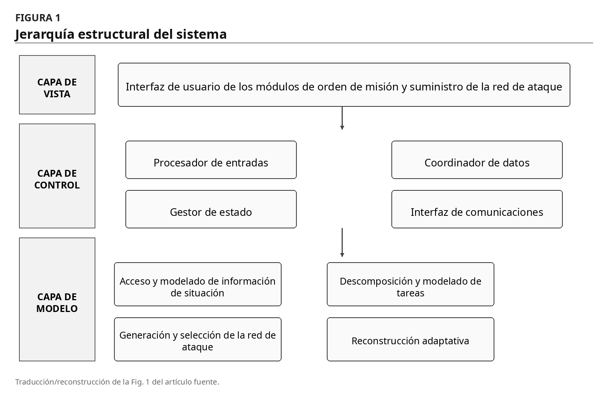
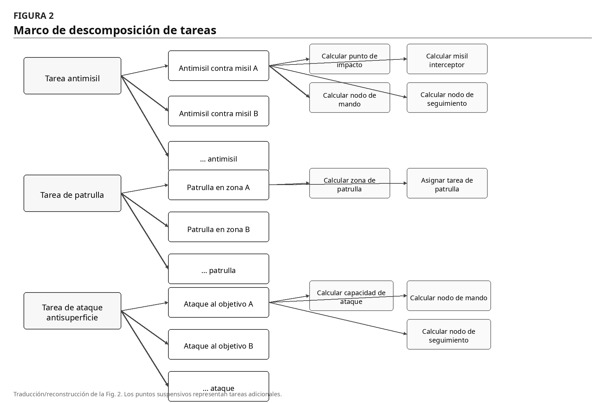
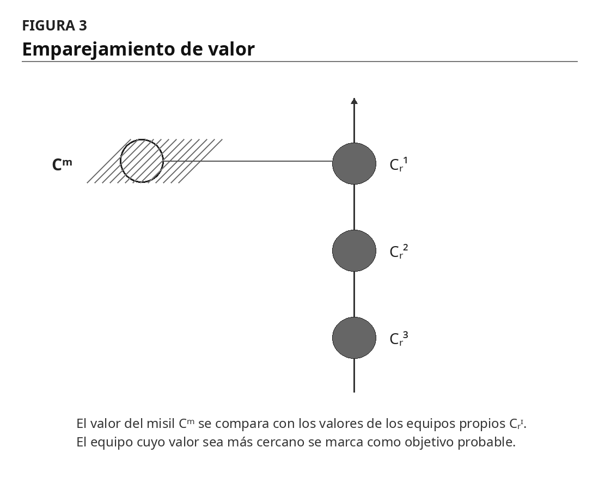
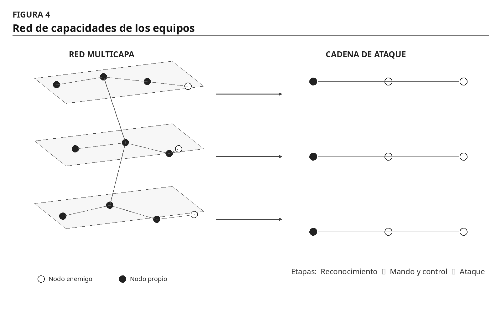
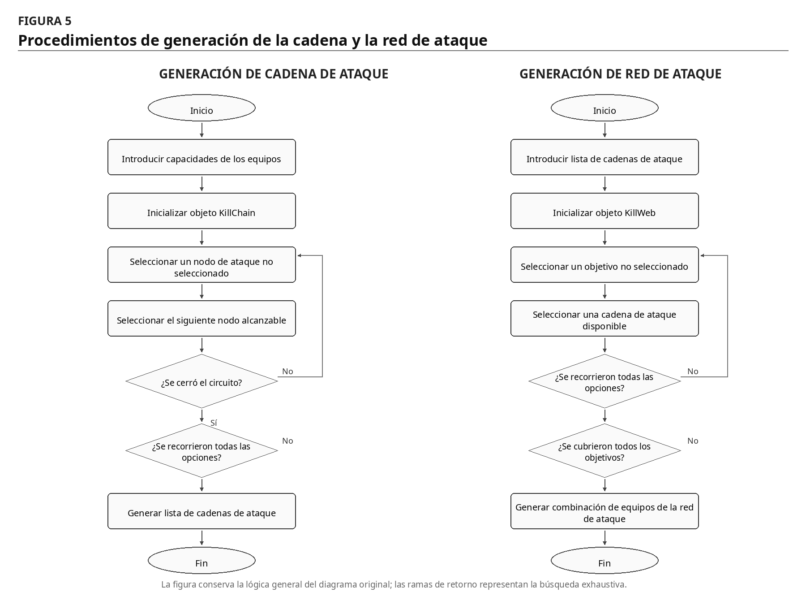
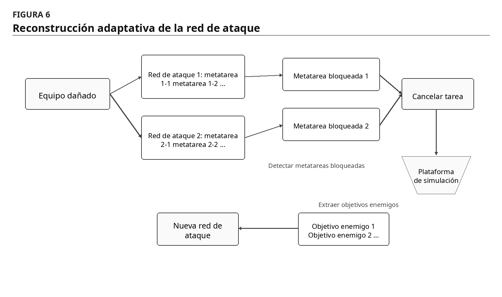
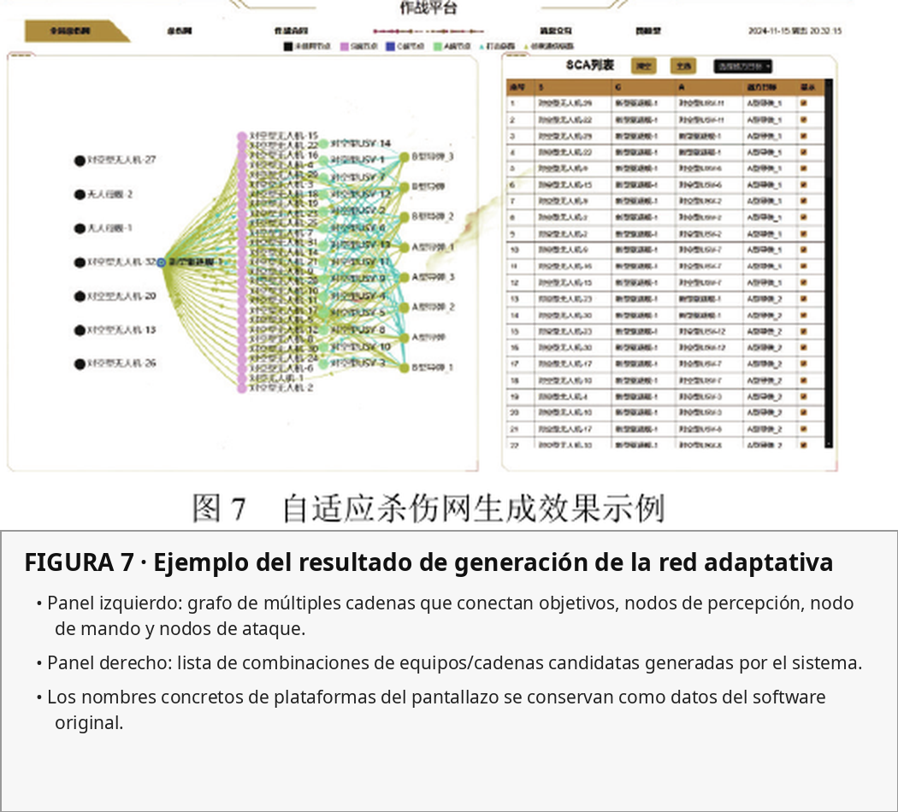

https://chatgpt.com/g/g-p-6a777363d7108191b2cafddb3fd424f0-cognicion-central/c/6a7e7bff-d81c-83e8-b363-278f76026cb1

# Generación y aplicación de una red de ataque marítima adaptativa basada en un modelo de grafos

**Título original:** 基于图模型的海上自适应杀伤网生成与应用  
**Título en inglés del artículo:** _Generation and application of maritime adaptive kill web based on graph model_  
**Autores:** Zhang Longjian¹, Li Jingjing²*, Fan Huili¹, Zhang Jiantao³, Cai Zinuo³, Ma Ruhui³  
**Revista:** *Chinese Journal of Ship Research\* / 中国舰船研究  
**Volumen:** 20  
**Número:** 5  
**Fecha:** octubre de 2025  
**Páginas:** 297-306  
**DOI:** 10.19693/j.issn.1673-3185.04147

**Afiliaciones:**

1. Centro de Investigación y Diseño Naval de China, Wuhan 430064, Hubei, China.
2. Laboratorio Nacional Hanjiang, Wuhan 430061, Hubei, China.
3. Escuela de Información Electrónica e Ingeniería Eléctrica, Universidad Jiao Tong de Shanghái, Shanghái 200240, China.

**Fecha de recepción:** 28 de agosto de 2024  
**Fecha de revisión:** 23 de octubre de 2024  
**Publicación anticipada en línea:** 6 de enero de 2025, 13:28  
**Financiación:** proyecto financiado por un fondo de un ministerio/comisión nacional.  
**Autor de correspondencia:** Li Jingjing.

> **Nota de traducción:** esta versión conserva la organización, el marco conceptual, las ecuaciones, los datos y las afirmaciones del artículo fuente. No incorpora verificaciones ni correcciones externas. Se emplean las expresiones **cadena de ataque (kill chain)** y **red de ataque (kill web)** para mantener continuidad terminológica con los documentos traducidos anteriormente.

---

## Resumen

### Objetivo

Con el propósito de aumentar la eficacia de combate y resolver el problema de la coordinación y programación conjunta de equipos de combate naval, el artículo propone un método de **generación de una red de ataque marítima adaptativa basado en un modelo de grafos**.

### Métodos

El método comprende cuatro componentes fundamentales:

1. Construcción de un **modelo dinámico del campo de batalla** mediante acceso en tiempo real e integración de información procedente de múltiples fuentes.
2. Utilización de un módulo de **descomposición de tareas complejas** para convertir las tareas operacionales en subtareas ejecutables y optimizar la asignación de recursos.
3. Generación de una **red de ataque** a partir de las relaciones entre los equipos y de indicadores de capacidad, seguida de su selección y optimización bajo múltiples restricciones de objetivo.
4. **Reconstrucción adaptativa** de la red de ataque cuando cambian los recursos de equipamiento, por ejemplo mediante la incorporación de nodos redundantes.

### Resultados

La verificación mediante un escenario naval de defensa antimisiles muestra que el método puede resolver eficazmente problemas de:

- procesamiento de información de situación del campo de batalla;
- descomposición y modelado de tareas;
- optimización de la cooperación entre equipos;
- ajuste dinámico de recursos.

El método permite generar y optimizar rápidamente una red de ataque y realizar una defensa desde múltiples cadenas y múltiples ángulos.

### Conclusiones

El método de generación de redes de ataque marítimas adaptativas basado en modelos de grafos puede mejorar de manera significativa la eficacia global y la capacidad de respuesta en las operaciones navales modernas. Los trabajos futuros continuarán optimizando el rendimiento de los algoritmos y la capacidad de respuesta del sistema con el propósito de proporcionar un apoyo más sólido a las operaciones militares.

**Palabras clave:** sistemas de mando y control; red de ataque marítima; toma de decisiones; eficacia de combate; modelo de grafos; algoritmo adaptativo; fusión de información multifuente.

---

# 0. Introducción

En el entorno internacional de seguridad actual, caracterizado por cambios rápidos, las estrategias militares y los modos de operación modernos afrontan desafíos sin precedentes. En el ámbito de las operaciones navales, la complejidad y la imprevisibilidad del entorno hacen que los planes operacionales y los procedimientos tradicionales de mando tengan dificultades para adaptarse con rapidez y responder eficazmente a las necesidades variables del campo de batalla. La guerra ha evolucionado hacia un nuevo paradigma que integra **digitalización, informatización y sistemas no tripulados** [1-2].

En este contexto, la **cadena de ataque (kill chain)** y la **red de ataque (kill web)** se han convertido en elementos fundamentales de la estrategia militar moderna [3]. Ambas representan formas de operación orientadas a conseguir una actuación eficiente, precisa y rápida, con el objetivo de destruir objetivos enemigos con la mayor rapidez y precisión posibles y, de ese modo, preservar la seguridad nacional y mantener ventajas militares.

El concepto de **cadena de ataque** fue propuesto inicialmente por Ronald Fogleman, jefe del Estado Mayor de la Fuerza Aérea de Estados Unidos, durante un simposio de la Air Force Association celebrado en 1996. El concepto describe el proceso completo de una misión de ataque contra un objetivo determinado, incluyendo las fases de:

- detección;
- identificación;
- decisión;
- ataque;
- evaluación.

Estas etapas forman una estructura de cadena con un circuito cerrado [4]. El modelo destaca la estrecha cooperación entre reconocimiento, mando y control y ataque de precisión para conseguir ataques continuos contra las fuerzas adversarias, reflejando una estrategia de **operaciones secuenciales**.

A medida que las formas de guerra evolucionaron hacia la informatización, la conexión en red y la inteligencia, el campo de batalla se volvió cada vez más complejo y la cadena de ataque tradicional comenzó a mostrar una adaptación insuficiente. Como consecuencia aparecieron nuevos conceptos operacionales.

En 2018, la **Defense Advanced Research Projects Agency (DARPA)** presentó el concepto de **kill web** durante una conferencia de C4ISRNET. La red de ataque plantea que los diferentes elementos operacionales se entrelacen y cooperen en un espacio multidimensional, integrando entre dominios las capacidades de:

- inteligencia;
- mando y control;
- ataque;
- evaluación.

El resultado buscado es una red tridimensional de ataque de cobertura integral [5]. Además, la existencia de numerosos nodos redundantes no sólo aumenta la capacidad ofensiva sino también la resistencia frente a daños.

Para reforzar la capacidad de combate de sistemas integrados, DARPA propuso en 2018 un nuevo enfoque de diseño de fuerzas denominado **Mosaic Warfare**. Este enfoque enfatiza la conexión en red de numerosos sistemas militares con funciones diferentes para generar redes de combate flexibles y adaptativas.

Como componente importante de Mosaic Warfare se inició el programa **Adapting Cross-Domain Kill-Webs (ACK)** [6]. El programa adopta una arquitectura proveedor-usuario y utiliza sistemas altamente flexibles, con respuesta dinámica y elevada integración, con la finalidad de formar una kill web capaz de cooperación inmediata entre dominios y plataformas.

En 2021 DARPA inició el programa **Mission-Integrated Network Control (MINC)**, dirigido al desarrollo de software capaz de seleccionar y ordenar de forma autónoma la información y las rutas de comunicación, con el objetivo de construir redes ágiles y autorreparables capaces de formar redes de ataque multidominio en entornos de confrontación intensa y alta dinámica [7].

La denominada **Decision-Centric Warfare** constituye otro concepto operacional adoptado por las fuerzas armadas estadounidenses en la era de la inteligencia. Se concentra especialmente en el proceso de **juicio-decisión**, emplea fuerzas tipo mosaico como núcleo de la confrontación y se apoya en tecnologías avanzadas como la inteligencia artificial. Mediante la modernización de plataformas y el despliegue distribuido busca proporcionar múltiples opciones tácticas, acumular continuamente ventajas de decisión y generar una ventaja central frente al adversario para obtener la iniciativa operacional.

## Desafíos específicos del entorno marítimo

La generación de redes de ataque en un entorno oceánico extenso y complejo presenta desafíos particulares. Debido a la gran extensión geográfica y al gran número de tipos de plataformas y equipos utilizados por ambos bandos, la información de situación presenta un elevado grado de complejidad y diversidad.

En las operaciones marítimas, los enlaces de comunicaciones son especialmente vulnerables a interferencias y ataques, por lo que pueden interrumpirse en cualquier momento [8-9]. La construcción de la situación requiere incorporar en tiempo real información procedente de diferentes fuentes y fusionarla con los datos de equipamiento contenidos en una base de datos de grafos, garantizando la coherencia y precisión de los datos [10].

Por ello, garantizar ataques cooperativos eficaces entre múltiples plataformas cuando intervienen diversas fuerzas constituye un problema importante [11]. Las operaciones multidominio requieren sistemas complejos de mando y control, así como métodos de descomposición de tareas operacionales complejas, de modo que las subtareas resultantes puedan combinarse con la situación en tiempo real y se garantice tanto la ejecución de las tareas como una asignación razonable de recursos [12-13].

Al mismo tiempo, las soluciones de kill web deben considerar la cooperación entre equipos y equilibrar múltiples objetivos, entre ellos:

- efecto de ataque;
- capacidad defensiva;
- consumo de recursos;

con el fin de maximizar la eficacia global [14-15].

Para resolver estos problemas, el trabajo desarrolla un método de generación de redes de ataque marítimas adaptativas basado en un modelo de grafos. El método contiene cuatro partes principales:

1. Construcción de un modelo dinámico del campo de batalla mediante el acceso en tiempo real a datos de simulación y su fusión con información de una base de datos de grafos.
2. Descomposición de tareas operacionales complejas en unidades de subtarea ejecutables para garantizar su posibilidad de ejecución y la cooperación entre fuerzas.
3. Uso de relaciones organizativas y de comunicación entre equipos, junto con indicadores de capacidad, para construir una red de ataque de tres capas —**detección, mando y control, ataque**— y optimizar su configuración bajo restricciones multiobjetivo como redundancia, riesgo y agilidad.
4. Reconstrucción adaptativa de la red cuando cambian los recursos disponibles, utilizando entre otros mecanismos la incorporación de nodos redundantes.

La generación de una red adaptativa permite responder con rapidez a los cambios del campo de batalla, optimizar la configuración de los recursos, realizar operaciones cooperativas y elevar la capacidad y eficacia global del sistema.

---

# 1. Diseño del sistema

El sistema de generación de una red de ataque marítima adaptativa basado en grafos se divide estructuralmente en tres niveles:

1. **capa de modelo**;
2. **capa de control**;
3. **capa de vista**.



_Figura 1. Jerarquía estructural del sistema._

## 1.1 Capa de modelo

Incluye cuatro módulos:

- acceso y modelado de información de situación del campo de batalla;
- descomposición y modelado de tareas;
- generación y selección de la red de ataque;
- reconstrucción adaptativa.

Esta capa se encarga de los datos y de la lógica de negocio del software de generación de la red.

El módulo de acceso y modelado de situación recibe información del campo de batalla en tiempo real y la combina con los datos de equipamiento de la base de datos de grafos para construir un modelo dinámico.

El módulo de descomposición y modelado de tareas toma la misión introducida por el comandante, la detalla en unidades de subtarea y la combina con la información de situación para garantizar que pueda ejecutarse.

El módulo de generación y selección utiliza las relaciones organizativas y de comunicación de los equipos para producir inicialmente combinaciones de recursos que formen redes de ataque. A continuación, optimiza esas soluciones para adaptarse a los cambios rápidos del campo de batalla.

El módulo de reconstrucción adaptativa reorganiza la red cuando cambian los recursos disponibles, por ejemplo mediante la sustitución o incorporación de nodos redundantes.

## 1.2 Capa de control

Está compuesta por:

- procesador de entradas;
- coordinador de datos;
- gestor de estado;
- interfaz de comunicaciones.

Su función es recibir las entradas del usuario desde la capa de vista, invocar los módulos correspondientes de la capa de modelo y devolver los resultados a la interfaz para su visualización.

El **procesador de entradas** recibe comandos, cargas de tareas, consultas y otras operaciones realizadas desde la interfaz.

El **coordinador de datos** transmite información entre la capa de modelo y la capa de vista y garantiza la coherencia e integridad de los datos.

El **gestor de estado** mantiene el estado del sistema, incluyendo el estado de operación del usuario y la ejecución de las tareas.

La **interfaz de comunicaciones** gestiona la interacción con programas de backend y plataformas de simulación.

## 1.3 Capa de vista

Se encarga principalmente de presentar información y recibir entradas humanas. Incluye las interfaces de usuario de los módulos de orden de misión y suministro de la kill web.

El comandante utiliza esta interfaz para:

- cargar tareas operacionales;
- observar los resultados de generación y optimización de redes de ataque;
- supervisar en tiempo real la evolución de la simulación.

## 1.4 División funcional del sistema

El sistema puede obtener información de situación en tiempo real desde software de simulación naval, combinarla con plantillas de metatareas y recursos contenidos en la base de datos de grafos, generar múltiples alternativas de kill web para un escenario determinado y seleccionar las mejores. Cuando un equipo sufre daños, puede reconstruir adaptativamente la red.

De acuerdo con sus funciones, el sistema se divide en cuatro grandes módulos:

### 1) Acceso y modelado de situación

Recopila y analiza en tiempo real diferentes tipos de inteligencia del campo de batalla naval y construye un modelo dinámico que sirve de apoyo a la toma de decisiones.

La información procedente de fuentes diferentes se combina con los datos detallados de equipos existentes en la base de datos de grafos. Después, la información se instancia en memoria. Mediante el desacoplamiento del diseño de los diferentes equipos y el empleo de tipos de referencia se modelan las relaciones organizativas entre ellos, lo que permite construir con rapidez un modelo de situación y actualizar/fusionar la información en tiempo real.

### 2) Descomposición de tareas complejas

Convierte la intención estratégica del comandante en tareas operacionales ejecutables y realiza su descomposición optimizada para que las unidades puedan cooperar.

La división clara del trabajo y la coordinación reducen malentendidos y conflictos y mejoran la eficacia global [16]. El sistema construye plantillas de tareas a partir de atributos de misión y genera un formato normalizado de contrato de tarea que proporciona soporte a diferentes clases de misión [17].

Las tareas complejas se descomponen según dimensiones lógicas y particiones de subconjuntos para generar una lista de subtareas que cubra integralmente los objetivos de la misión original.

### 3) Generación y selección de la red de ataque

Partiendo del modelo del campo de batalla y de los requisitos de misión, diseña con rapidez una red adecuada a la situación actual.

La selección bajo múltiples restricciones permite considerar simultáneamente recursos, tiempo y riesgo y elegir una solución que cumpla la misión [18]. Para ello se definen funciones de indicadores cuantificables y se transforman las restricciones definidas por el sistema y por el usuario en funciones de evaluación [19].

Se calculan, entre otros:

- redundancia;
- riesgo;
- agilidad/oportunidad temporal.

Estos indicadores se integran en una función de aptitud para seleccionar entre numerosas redes candidatas la solución más adecuada.

### 4) Reconstrucción adaptativa

Partiendo de las necesidades de misión y de las capacidades de los equipos, el módulo planifica de manera global los recursos, administra y controla los nodos de la red y ajusta dinámicamente sus componentes cuando aparecen cambios en el entorno.

El sistema sustituye o añade recursos y reconstruye la kill web para mantener el efecto de ataque esperado.

---

# 2. Modelado de la situación del campo de batalla

El módulo de modelado de situación proporciona a la generación de la kill web una base de análisis y modelado precisa y actualizada en tiempo real, con el objetivo de capturar integralmente la información, organizarla de forma eficiente y mantenerla actualizada dinámicamente.

El módulo contiene tres procesos:

1. **acceso a información de situación**, encargado de recopilar e integrar diferentes clases de datos;
2. **modelado y representación**, encargado de procesar la información y convertirla en un modelo;
3. **fusión de situación**, encargada de analizar e integrar información procedente de distintas fuentes.

## 2.1 Acceso a la información

El sistema no sólo recoge información dinámica y estática desde una plataforma de simulación. También utiliza el modelo de grafos para obtener las relaciones organizativas y de comunicación entre equipos.

El flujo en tiempo real procedente de la simulación proporciona la situación inicial y sus actualizaciones dinámicas.

En el modelo de grafos:

- los **nodos** representan equipos militares utilizados para reconocimiento, ataque y decisión;
- las **aristas** describen detalladamente comunicaciones, configuraciones de carga y estructuras organizativas.

Los datos de equipos se procesan mediante representación formal —por ejemplo, correspondencia mediante expresiones regulares y relleno de atributos— y se almacenan en una base de datos de grafos.

## 2.2 Representación y modelado

El modelado utiliza mecanismos de reflexión para extraer de información normalizada en formato JSON datos esenciales como:

- parámetros de los equipos;
- coordenadas;
- otras propiedades operacionales.

Después de eliminar ruido y corregir errores, se emplea una metodología orientada a objetos para representar la situación, generar dinámicamente clases y objetos de equipamiento y mapear relaciones organizativas mediante referencias.

Las tres fases principales de una cadena de ataque requieren tipos de equipo distintos y, por tanto, diferentes atributos de modelado:

### Nodo de detección/sensado

Representa sensores y equipos de reconocimiento, como radares o sonares. Sus atributos incluyen:

- alcance de detección;
- precisión;
- tipo de detección.

### Nodo de mando y control

Representa centros de mando, control y equipos de comunicación. Sus atributos incluyen:

- alcance de comunicación;
- autoridad/permisos de mando y control.

### Nodo de ataque

Representa medios ofensivos como:

- misiles;
- torpedos;
- proyectiles de artillería.

Sus propiedades incluyen alcance y precisión.

## 2.3 Fusión de situación

La fusión compara la información dinámica recibida en tiempo real con los datos estructurados del modelo, identifica atributos importantes dentro de las series temporales y los mapea con precisión contra los datos estáticos de la base de grafos.

Esto permite actualización y fusión precisas en tiempo real.

### Tabla 1. Ejemplo de información de situación del campo de batalla

```json
{
  "id": "1226904895",
  "name": "Plataforma de superficie 2",
  "team": "RED",
  "lon": 126.9294782048,
  "lat": 21.3133098887,
  "alt": 0,
  "heading": 90,
  "parameterList": [
    {
      "id": "1049077923",
      "name": "4x cierto tipo de motor diésel #1 (1.0.0)",
      "inputInfo": [{ "name": "max_speed", "value": "11.5" }]
    },
    {
      "id": "608447846",
      "name": "Cierto sensor de corto/medio alcance #1 (1.0.0)",
      "inputInfo": [
        { "name": "max_range", "value": "170" },
        { "name": "track_num", "value": "12" },
        { "name": "error_range", "value": "0.1" }
      ]
    }
  ]
}
```

---

# 3. Descomposición de tareas complejas

La descomposición de tareas complejas pretende proporcionar un marco estructurado y normalizado para tratar misiones militares, convirtiendo de forma eficiente una tarea compleja en **metatareas operables** mediante:

- construcción de plantillas de contrato de misión;
- descomposición de operaciones complejas;
- descripción normalizada de metatareas.

## 3.1 Plantilla de contrato de tarea

La construcción de la plantilla utiliza métodos normalizados para proporcionar un formato común a la planificación y ejecución de tareas de guerra moderna.

La plantilla se define a partir de:

- escenarios integrados en la plataforma de simulación;
- análisis de casos históricos.

Su uso puede acelerar el proceso de decisión del comandante y mejorar la eficacia. Al reducir errores humanos también aumenta la coherencia y previsibilidad de la ejecución. El diseño modular permite ajustes flexibles para adaptarse a entornos y necesidades tácticas cambiantes.

### Tabla 2. Ejemplo de plantilla de misión

```text
[Fecha]
Orden de misión: [identificador único]

1. Nombre de la misión
   - [Código de misión]

2. Objetivo
   - [Descripción breve del objetivo principal]

3. Tiempo de la misión
   - Inicio: [fecha/hora]
   - Fin: [fecha/hora]

4. Lugar
   - [Área geográfica designada]

5. Equipos enemigos
   - [Estado, velocidad, longitud, latitud, rumbo, etc.]

6. Requisitos de equipos de detección
   - [Tipo, alcance, precisión, ancho de banda de comunicaciones, etc.]

7. Requisitos de equipos de mando y control
   - [Tipo, requisitos de distancia]

8. Requisitos de equipos de ataque
   - [Tipo, tipo de misil, cantidad, radio de ataque, etc.]

9. Requisitos de la red de ataque
   - [Indicador de redundancia, indicador de riesgo, etc.]
```

## 3.2 Descripción normalizada de metatareas

La metatarea constituye la unidad operable mínima después de la descomposición. Cada metatarea contiene propiedades fundamentales como:

- identificador;
- tipo;
- objetivo;
- condiciones de ejecución.

La descripción detallada pretende garantizar la coherencia y previsibilidad de la ejecución.

La descripción normalizada de una metatarea se expresa como:

\[
T*d = \langle T*{type}, T*{time}, T*{space}, T*{subject}, T*{index} \rangle
\tag{1}
\]

Donde:

- \(T\_{type}\): tipo de tarea, incluyendo ataque, patrulla, apoyo, traslado, minado, desminado y transporte de carga;
- \(T\_{time}\): tiempo de la tarea, fundamental para representar relaciones temporales;
- \(T\_{space}\): espacio de la misión, es decir, la localización geográfica real del objetivo;
- \(T\_{subject}\): sujeto que ejecuta la tarea;
- \(T\_{index}\): indicadores/requisitos de la tarea.

## 3.3 Estrategia de descomposición

La finalidad es elevar la eficacia y asegurar la precisión de la ejecución. Las tareas complejas se dividen minuciosamente en subtareas menores y más concretas, y cada unidad se representa con la descripción normalizada anterior.

El proceso normaliza:

- tipo de tarea;
- tiempo;
- espacio;
- fuerzas operacionales;
- indicadores.

Posteriormente utiliza relaciones jerárquicas y lógicas para descomponer la misión general hasta llegar a tareas atómicas.

### Ejemplo: misión antimisil

Por relación jerárquica pueden construirse subconjuntos de objetivos. Por relación lógica pueden calcularse:

- punto previsto de impacto del misil enemigo;
- misiles interceptores disponibles;
- nodos de mando y control;
- nodos de seguimiento.

### Ejemplo: patrulla

Por jerarquía se divide el espacio en distintas regiones de patrulla. Por lógica se calculan:

- área de patrulla;
- equipos capaces de realizarla.

### Ejemplo: ataque

Por jerarquía se generan subconjuntos de objetivos. Por lógica se calculan:

- equipos capaces de atacar;
- nodos de seguimiento;
- nodos de mando y control.



_Figura 2. Marco de descomposición de tareas._

---

# 4. Generación de la red de ataque

El sistema mantiene una biblioteca de correspondencias **metatarea → indicadores de capacidad**. De esta forma, cada metatarea descompuesta se transforma en requisitos de capacidad de equipamiento y esos indicadores pueden agregarse.

Mediante búsquedas eficientes sobre los indicadores y utilizando como objetivos:

- minimizar el tiempo operacional;
- maximizar el efecto operacional;
- conseguir correspondencia de valor;

se seleccionan cadenas de ataque adecuadas para cada metatarea.

Después se recopilan todas las cadenas generadas. En el nivel de metatarea se utiliza una búsqueda exhaustiva para formar redes que satisfagan los requisitos. Finalmente, esas redes se agregan hacia el nivel de misión para producir una kill web que cumpla las necesidades de la operación completa.

Para hacer que el resultado de decisión sea más científico y fiable, el sistema considera simultáneamente información relativa al enemigo y a los recursos propios.

Entre los factores enemigos se incluyen:

- estimación de trayectoria de misiles;
- probabilidad de daño/destrucción;
- coste.

Entre los factores propios se incluyen:

- posición de despliegue;
- supervivencia;
- probabilidad de intercepción balística;
- coste del equipo;
- centralidad dentro de la kill web [20].

La racionalidad de una red candidata debe evaluarse mediante un esquema adecuado, combinando análisis cualitativo y cálculo cuantitativo.

## 4.1 Conversión de requisitos de metatarea en indicadores de capacidad

La conversión se basa en tres procesos:

1. análisis de amenaza de misiles;
2. pipeline de filtrado de equipos;
3. cálculo de capacidades.

El análisis de amenaza estudia profundamente prestaciones e intención del misil enemigo y proporciona información para:

- reconocer y clasificar objetivos;
- determinar la trayectoria;
- evaluar el nivel de amenaza;
- determinar prioridades de ataque;
- orientar reconocimiento y vigilancia;
- optimizar medios de ataque [21].

Cuando no existe suficiente información histórica se emplean métodos de simulación geométrica o redes **LSTM (long short-term memory)**. Estas predicciones se combinan con el valor del misil y el valor de los equipos propios situados a lo largo de su trayectoria para estimar el objetivo que probablemente atacará.

## 4.2 Valor de un misil enemigo

Para un misil enemigo, el artículo supone que su valor aumenta cuanto mayores sean:

- alcance;
- velocidad;
- probabilidad de destrucción;
- altura máxima de ataque;
- coste.

Se seleccionan cinco indicadores:

- \(R\_{max}\): alcance máximo;
- \(M\_{max}\): velocidad máxima de vuelo;
- \(P_r\): probabilidad de destrucción;
- \(H\_{max}\): altura máxima;
- \(V\): coste.

Con pesos \(\omega_i\), el valor del misil se define como:

\[
C^m = \omega*1R*{max} + \omega*2M*{max} + \omega*3P_r + \omega_4H*{max} + \omega_5V
\tag{2}
\]

## 4.3 Valor de un equipo propio

Para los equipos propios, el artículo considera que un equipo es más valioso —y, por tanto, potencialmente más atractivo como objetivo— cuando presenta:

- menor supervivencia;
- mayor coste;
- mayor importancia dentro de la formación;
- mayor centralidad en la kill web.

Para el equipo con índice \(i\) se utilizan:

- \(L_i\): supervivencia;
- \(V_i\): coste;
- \(G_i\): importancia en la formación;
- \(Z_i\): indicador de centralidad de kill web.

El valor se define como:

\[
C_i^r = -\omega_1L_i + \omega_2V_i + \omega_3G_i + \omega_4Z_i
\tag{3}
\]

Después de calcular el valor del misil y de los equipos propios, se realiza un **emparejamiento de valores**. El equipo cuyo valor sea más próximo al valor del misil se etiqueta como objetivo probable.



_Figura 3. Emparejamiento de valor._

## 4.4 Pipeline de selección de equipos

El pipeline filtra equipos adecuados de acuerdo con los requisitos de la metatarea y el objetivo estimado del misil enemigo.

El cálculo de capacidad considera tres dimensiones:

1. **efecto directo**;
2. **efecto indirecto**;
3. **tiempo**.

### Capacidad del nodo de ataque

- Efecto directo: tiempo de intercepción, relación entre misiles, velocidad, etc.
- Efecto indirecto: centralidad dentro de la red.
- Tiempo: desplazamiento + tiempo de ataque.

### Capacidad del nodo de mando y control

- Efecto directo: ancho de banda de comunicaciones.
- Efecto indirecto: centralidad.
- Tiempo: desplazamiento.

### Capacidad de un nodo de detección

Para una metatarea de sensado/detección, el artículo define:

**Efecto directo \(E\):** relación ponderada entre alcance y precisión del radar.

\[
E = \alpha\log(R*{radar}) + \beta A*{radar}
\tag{4}
\]

**Efecto indirecto \(z\):** centralidad/solapamiento actual del equipo dentro de la kill web.

\[
z = \frac{o_i - \langle o \rangle}{\sigma_o}
\tag{5}
\]

**Tiempo \(T\):** tiempo necesario para que el equipo de detección se desplace hasta una región donde pueda cubrir al objetivo.

\[
T = \frac{\max(d*{S\rightarrow E} - R*{radar},0)}{S}
\tag{6}
\]

Donde:

- \(\alpha\), \(\beta\): coeficientes de ponderación asociados al modelo concreto de radar;
- \(d\_{S\rightarrow E}\): distancia entre el equipo de detección y el enemigo;
- \(R\_{radar}\): cobertura del radar;
- \(A\_{radar}\): precisión de detección;
- \(S\): velocidad de desplazamiento del equipo;
- \(o_i\): grado de solapamiento del equipo en las diferentes capas de la red, numéricamente equivalente al número de relaciones con otros equipos;
- \(\langle o\rangle\): solapamiento medio de todos los nodos;
- \(\sigma_o\): desviación estándar correspondiente.

La capacidad de detección \(A\) se define como negativamente relacionada con tiempo e influencia indirecta, y positivamente con el efecto directo:

\[
A = -\omega_1T + \omega_2E - \omega_3z
\tag{7}
\]

## 4.5 Red de capacidades de equipos

Sobre la base del cálculo de capacidades, y combinando las relaciones de comunicación del modelo de grafos con los requisitos de distancia definidos en el contrato, se construye una **red de capacidades de equipos**.

El sistema construye tres capas:

1. **capa de detección/reconocimiento**;
2. **capa de mando y control**;
3. **capa de ataque**.

En la capa de reconocimiento, los enlaces representan relaciones mediante las cuales los equipos propios realizan reconocimiento y vigilancia sobre equipos objetivo enemigos.

En la capa de mando y control, los enlaces representan la transmisión de órdenes de acuerdo con reglas de mando y se determinan según los requisitos del contrato y las relaciones de comunicación existentes en el grafo.

En la capa de ataque, los enlaces representan la influencia destructiva que los medios propios pueden ejercer sobre nodos enemigos mediante fuego.

En la red multicapa, los únicos enlaces entre capas conectan un nodo determinado con su nodo correspondiente en las otras capas.

Las relaciones de comunicación se obtienen del modelo de grafos y la capa de comunicaciones se integra dentro de la capa de mando y control. Con ello se reduce el número de capas sin perder las relaciones de comunicación y se acelera la búsqueda de cadenas de ataque.

La topología resultante incluye:

- cobertura sensor-objetivo;
- relación de mando y control entre centros de mando, sensores y medios de ataque;
- alcance de ataque contra objetivos.

Sobre esta base puede analizarse:

- cobertura;
- zonas ciegas de detección;
- redundancia de red;

para apoyar la optimización de recursos.



_Figura 4. Red de capacidades de los equipos._

## 4.6 Generación de cadenas y redes

Todos los equipos de una kill web se componen de:

- equipos enemigos;
- conjuntos candidatos de equipos propios en las etapas de detección, mando y ataque.

La generación orientada a misión comienza en un nodo objetivo enemigo y realiza una búsqueda en profundidad a través de las tres capas. Se procura no omitir ninguna ruta.

Utilizando las capacidades calculadas anteriormente, un algoritmo de ordenación por idoneidad permite priorizar, dentro del límite temporal, los nodos disponibles con mayor capacidad.

Para un mismo objetivo enemigo se obtienen múltiples cadenas. Cuando diferentes cadenas utilizan equipos distintos dentro de alguna de las tres capas, esos recursos pueden combinarse para formar una kill web.



_Figura 5. Procedimientos de generación de cadenas de ataque —izquierda— y red de ataque —derecha—._

---

# 5. Selección y optimización de la red de ataque

Para realizar una toma de decisiones operacional eficiente y precisa es necesario seleccionar entre las redes candidatas.

Las restricciones del sistema y las definidas por el usuario se transforman en **funciones de indicadores cuantificables**, entre ellas:

- redundancia;
- riesgo;
- oportunidad temporal/agilidad.

El artículo describe el uso de algoritmos de optimización para integrar estos indicadores como funciones de aptitud y seleccionar las soluciones que mejor cumplen los requisitos de misión.

## 5.1 Evaluación de redundancia

Dados los nodos y las relaciones entre ellos, se calcula la cantidad media de redes que pueden generarse para cada objetivo enemigo.

Mediante teoría de redes el problema se transforma en un problema combinatorio de cadenas de ataque, y el número de redes refleja la diversidad de alternativas disponibles.

La redundancia se calcula como:

\[
R(K) = \frac{\sum_i N_i^W}{m}
\tag{8}
\]

Donde \(m\) es el número de objetivos enemigos y \(N_i^W\) es el número de redes que pueden formarse contra el objetivo \(i\).

Si \(N_i^L\) es el número de cadenas de ataque para ese objetivo, el número de combinaciones se expresa como:

\[
N*i^W = \left(C*{N*i^L}^{0}+C*{N*i^L}^{1}+\cdots+C*{N*i^L}^{N_i^L}\right)
-\left(C*{N*i^L}^{0}+C*{N_i^L}^{1}\right)
= 2^{N_i^L}-1-N_i^L
\tag{9}
\]

## 5.2 Evaluación de riesgo

La evaluación de riesgo combina un modelo multicapa con:

- coeficiente de participación de los nodos;
- centralidad/solapamiento.

Se construye un espacio de coordenadas **participación-centralidad** para determinar el riesgo de cada equipo, identificar nodos críticos y estimar la vulnerabilidad de la red completa.

El indicador de riesgo se expresa como:

\[
F(W) = \sum_L\sum_i F_i^L = \sum_L\sum_i P_i^L\,z(o_i^L)
\tag{10}
\]

El coeficiente de participación del nodo se calcula como:

\[
P*i = \frac{M}{M-1}\left[1-\sum*{\alpha=1}^{M}\left(\frac{k_i^{\alpha}}{o_i}\right)^2\right]
\tag{11}
\]

Donde:

- \(M=3\): las tres capas de la red de capacidades;
- \(k_i^{\alpha}\): número de enlaces del equipo \(i\) dentro de la capa \(\alpha\).

## 5.3 Evaluación de oportunidad temporal

La evaluación temporal mide el tiempo mínimo necesario para formar toda la red.

Se calcula el tiempo total de generación de cada cadena y se utiliza el tiempo más largo como resultado temporal de la red, con el propósito de garantizar la capacidad de respuesta rápida.

\[
T(W) = \max\{T^{L_1},\ldots,T^{L_n}\}
\tag{12}
\]

Para una cadena \(L\), el tiempo se calcula mediante:

\[
T^L = \sum\_{\alpha}[T^{\alpha}]^T STAT^{\alpha}, \qquad \alpha\in\{S,C,A\}
\tag{13}
\]

La matriz de estado de actividad \(STAT\) indica qué equipos participan en la construcción de la cadena:

- 0: no participa;
- 1: participa.

## 5.4 Funciones objetivo y restricción de coste

Los tres indicadores se transforman en tres funciones objetivo. El modelo también considera el coste de salida/despliegue.

La primera parte de cada función corresponde a la transformación del indicador para formular un problema de minimización. La segunda es una penalización por superar el límite de coste.

Sea:

- \(\gamma\): coeficiente de penalización;
- \(C\): matriz de costes de salida;
- \(SO\): matriz de combinación de equipos, que indica qué equipos participan;
- \(V\): presupuesto total.

Las funciones son:

\[
f_1=-R(W^{so})+\gamma\min\{0,C\cdot SO-V\}
\]

\[
f_2=F(W^{so})+\gamma\min\{0,C\cdot SO-V\}
\]

\[
f_3=T(W^{so})+\gamma\min\{0,C\cdot SO-V\}
\tag{14}
\]

## 5.5 NSGA-III y NSGA-SSW

El algoritmo genético de ordenación no dominada de tercera generación (**NSGA-III**) es una metaheurística para problemas de optimización multiobjetivo. El artículo resume su funcionamiento en tres pasos:

1. inicialización;
2. actualización;
3. selección.

A partir de NSGA-III se propone un algoritmo denominado **NSGA-SSW**.

La kill web se convierte primero en:

- conjunto de equipos;
- conjunto de relaciones de conectividad.

Estos conjuntos sirven para que NSGA-III genere diferentes poblaciones. Posteriormente, la salida se reconstruye en el formato de kill web predefinido haciendo coincidir los conjuntos de equipos y relaciones de cada individuo de la población.

---

# 6. Reconstrucción adaptativa

Para resolver la optimización dinámica de combinaciones cuando cambian los recursos, el sistema construye una kill web dinámica y adaptativa.

Si los recursos cambian y la combinación seleccionada deja de ser ejecutable, el sistema vuelve a generar una solución optimizada.



_Figura 6. Reconstrucción adaptativa de la red de ataque._

La reconstrucción se divide en dos tipos:

1. reconstrucción adaptativa de equipos de **designación de objetivos**;
2. reconstrucción adaptativa de **equipos bloqueados/dañados**.

## 6.1 Reconstrucción de equipos de designación de objetivos

Este mecanismo ajusta la posición de los equipos responsables de proporcionar información/designación del objetivo.

En un escenario antimisil aéreo, primero se divide el área de responsabilidad. Después se calcula localmente la trayectoria según el tipo de misil enemigo. A partir de la trayectoria prevista y del resultado previsto de interceptación, se ajusta dinámicamente la posición del equipo para mantener cobertura.

Cuando el equipo que desempeña actualmente esa función deja de poder continuar, se realiza un **relevo de designación**, produciendo una red reconstruida.

## 6.2 Reconstrucción de equipos bloqueados o dañados

Si un nodo presenta una anomalía y deja de poder participar, el sistema debe reconstruir adaptativamente la red.

El artículo distingue dos estrategias:

### Estrategia 1: sustitución mediante nodos redundantes

Un nodo redundante sustituye automáticamente al nodo dañado y asume rápidamente su tarea, permitiendo continuar el plan original.

La limitación es que esta estrategia no responde adecuadamente cuando el daño provoca un cambio local significativo de la situación.

### Estrategia 2: recálculo según la situación actualizada

El sistema vuelve a calcular, ajustar y reconstruir la red según la situación local más reciente para conseguir un plan más preciso y eficaz.

En general se prioriza la sustitución por redundancia. Si no existen nodos redundantes, el sistema:

1. identifica todas las redes en las que participaba el equipo dañado;
2. extrae las metatareas bloqueadas;
3. identifica los objetivos que aún no han sido atacados/interceptados;
4. genera una nueva kill web.

---

# 7. Generación y aplicación de la red de ataque

A nivel de aplicación, los autores construyen un sistema automatizado de generación adaptativa basado en el método propuesto.

El artículo presenta como demostración un **escenario naval antimisil**.

Cuando los equipos propios detectan un misil enemigo entrante, el sistema inicia inmediatamente el proceso defensivo y analiza rápidamente:

- velocidad;
- trayectoria;
- intención de ataque;
- otra información asociada.

A partir de ese análisis construye una red adaptativa. Después se ejecuta una simulación para representar una situación en la que algunos recursos propios son destruidos y observar el resultado de la reconstrucción.

## 7.1 Generación inicial

En la fase inicial se genera una red como la mostrada en la Figura 7.

Los tres elementos fundamentales son:

- nodo de detección **S**;
- nodo de mando **C**;
- nodo de ataque **A**.

Los tres se encuentran interconectados y cooperan para formar cadenas eficaces. Diferentes cadenas comparten equipos y cooperan tácticamente, formando una red de mayor escala.

La Figura 7 muestra las combinaciones capaces de cerrar un circuito. Cada objetivo enemigo puede corresponder a múltiples cadenas.

En el escenario descrito:

- nodo de mando: **nuevo destructor-1**;
- nodos de detección: varios UAV de defensa aérea;
- nodos de ataque: USV de defensa aérea o el nuevo destructor-1.



_Figura 7. Ejemplo del resultado de generación de la red adaptativa. La captura de la interfaz original se conserva y se acompaña de una explicación traducida._

## 7.2 Selección de soluciones

A continuación se optimiza la red.

De acuerdo con los requisitos del contrato operacional se determinan los pesos de las funciones de aptitud para:

- redundancia;
- riesgo;
- oportunidad temporal.

En el escenario, los pesos son:

\[
0.45,\quad 0.45,\quad 0.10
\]

Con esta combinación se obtiene una red con alta resiliencia y alta probabilidad de éxito, aunque con una oportunidad temporal ligeramente inferior.

El sistema selecciona las tres combinaciones de mayor puntuación como soluciones candidatas y posteriormente un operador humano puede realizar la selección final.

La Figura 8 compara dos soluciones optimizadas para un objetivo enemigo. Cuanto mayor es la puntuación de un indicador, mayor es la ventaja correspondiente.

### Red optimizada 1

- redundancia: **0,88**;
- riesgo: **0,90**;
- oportunidad temporal: **1,00**;
- puntuación global: **0,90**.

### Red optimizada 2

- redundancia: **0,00**;
- riesgo: **1,00**;
- oportunidad temporal: **1,00**;
- puntuación global: **0,55**.

La segunda solución contiene menos equipos y, por tanto, menos cadenas, lo cual corresponde a su menor redundancia.

En la primera solución, el **nuevo destructor-1** desempeña un papel central en la red. Si fuera destruido, varias cadenas se verían afectadas. Por esta razón su puntuación de riesgo es inferior a la de la segunda solución.

El comandante puede seleccionar manualmente una alternativa en función de la situación o permitir que el sistema elija automáticamente la de mayor puntuación global. En la interfaz del contrato operacional también puede modificar los pesos de los indicadores para priorizar, por ejemplo:

- mayor oportunidad temporal;
- menor riesgo.


_Figura 8. Comparación de dos redes de ataque optimizadas._

## 7.3 Reconstrucción después de cambios en la situación

Cuando un nodo enemigo es destruido, cambia la situación y se inicia automáticamente la reconstrucción.

La Figura 9 muestra la red regenerada después de que, transcurrido cierto tiempo, fueran interceptados:

- misil tipo A_2;
- misil tipo A_3;
- misil tipo B_2;
- misil tipo B_3.

El sistema actúa como una arquitectura defensiva dinámica: puede formar una red eficaz utilizando la situación en tiempo real, posee flexibilidad y adaptabilidad y puede reajustarse para realizar defensa desde múltiples cadenas y múltiples ángulos.


_Figura 9. Resultado de la reconstrucción adaptativa._

## 7.4 Rendimiento en un escenario de alta intensidad

En un escenario con **31 objetivos enemigos atacando simultáneamente**, el tiempo medio necesario para generar la red y proporcionar una solución seleccionada fue de:

**2,26 segundos**.

Según los autores, este resultado muestra que el sistema puede responder eficientemente a escenarios de alta intensidad y posee capacidad de respuesta rápida.

---

# 8. Conclusiones

El artículo propone un método para generar una **red de ataque marítima adaptativa basada en modelos de grafos**, orientado a responder a la complejidad, variabilidad y exigencia de los entornos navales modernos.

Mediante:

- modelado de situación del campo de batalla;
- descomposición de tareas complejas;
- generación y selección de kill webs;
- reconstrucción adaptativa;

el sistema permite una descomposición optimizada y una ejecución eficiente de tareas operacionales, con el objetivo de aumentar de forma significativa la eficacia de combate.

Los resultados de la demostración mediante simulación indican, según el artículo, que el método puede:

- responder rápidamente a los cambios de la situación;
- proporcionar soluciones adaptadas al entorno operacional actual;
- ajustar dinámicamente la red conforme evoluciona la situación.

Los trabajos futuros se orientarán a:

- optimizar el rendimiento de los algoritmos;
- aumentar la capacidad de respuesta en tiempo real;
- mejorar la aplicación en entornos de combate complejos;
- proporcionar un soporte técnico más avanzado y fiable para las operaciones militares modernas.

---

# Referencias

> Los datos bibliográficos se conservan conforme al artículo fuente. Los títulos originalmente en chino se traducen al español para facilitar su lectura; los títulos publicados originalmente en inglés se conservan también en inglés.

1. **Dong Shengbo, Su Qiya, Yu Muyao, et al.** “Discusión sobre el desarrollo de tecnologías cooperativas de detección y guiado”. _Modern Defence Technology_, 2023, 51(3): 75-82.  
   DONG S B, SU Q Y, YU M Y, et al. _Discussion on the development of collaborative detection and guidance technology_.

2. **Wang Zhaojie, Liu Kun, Ma Jing, et al.** “Estudio de un modelo de integración dinámica de cadenas de ataque sensibles al tiempo en el campo de batalla naval”. _Chinese Journal of Ship Research_, 2024, 19(4): 290-298.  
   WANG Z J, LIU K, MA J, et al. _Dynamic integration model of time-sensitive strike chain in naval battlefield_.

3. **Gao Baohui, Hu Hai.** “Estudio del concepto operacional de redes de ataque dinámicas aire-espacio-mar para ataque marítimo”. _Ship Electronic Engineering_, 2023, 43(1): 28-31.  
   GAO B H, HU H. _Research on operational concept of dynamic kill-webs in naval battlefield integrated of space, air and sea_.

4. **TIRPAK J A.** “Find, fix, track, target, engage, assess”. _Air & Space Forces Magazine_, 2000, 83(7): 24-29.

5. **O'DONOUGHUE N A, MCBIRNEY S, PERSONS B.** _Distributed kill chains: drawing insights for mosaic warfare from the immune system and from the navy: RR-A573-1_. Arlington: RAND Corporation, 2021.

6. **STO.** _Adapting cross-domain kill-webs_ [EB/OL], 2018-08-03. Dirección web conservada en el artículo fuente.

7. **Jin Bin, Sun Haiwen.** “Revisión de métodos de empleo del fuego en operaciones navales”. _Command Control & Simulation_, 2023, 45(2): 155-160.  
   JIN B, SUN H W. _Summary of fire application methods in naval operations_.

8. **LEE C E, BAEK J, SON J, et al.** _Deep AI military staff: cooperative battlefield situation awareness for commander's decision making_. _The Journal of Supercomputing_, 2023, 79(6): 6040-6069.

9. **Xu Liang, Pan Xuanhong, Wu Ming.** “Análisis del modo de operación cooperativa antisubmarina tripulado/no tripulado”. _Chinese Journal of Ship Research_, 2018, 13(6): 154-159.  
   XU L, PAN X H, WU M. _Analysis on manned/unmanned aerial vehicle cooperative operation in antisubmarine warfare_.

10. **Sun Shengzhi, Sheng Biqi, Ma Yundang, et al.** “Modo de combate cooperativo marítimo y tecnologías clave”. _Ship Science and Technology_, 2023, 45(16): 177-181.  
    SUN S Z, SHENG B Q, MA Y D, et al. _The mode of maritime cooperative warfare and key technologies_.

11. **Ni Shaojie, Yue Yang, Zuo Yong, et al.** “Estado actual y perspectivas de la tecnología de enrutamiento de redes satelitales”. _Journal of Electronics & Information Technology_, 2023, 45(2): 383-395.  
    NI S J, YUE Y, ZUO Y, et al. _The status quo and prospect of satellite network routing technology_.

12. **Xie Wei, Tao Hao, Gong Junbin, et al.** “Avances en el desarrollo y las tecnologías clave de enjambres de sistemas navales no tripulados”. _Chinese Journal of Ship Research_, 2021, 16(1): 7-17, 31.  
    XIE W, TAO H, GONG J B, et al. _Research advances in the development status and key technology of unmanned marine vehicle swarm operation_.

13. **Liang Xiaolong, Wang Ning, Wang Weijia, et al.** “Revisión de avances en enjambres marítimos no tripulados multidominio”. _Journal of Air Force Engineering University_, 2023, 24(5): 2-15.  
    LIANG X L, WANG N, WANG W J, et al. _Progress in maritime cross-domain manned swarms_ [título inglés reproducido tal como aparece en la referencia del artículo].

14. **JUNG Y, KIM J.** _Combat effectiveness and efficiency evaluation of firearm weapon systems in different projectile guidance simulations_. _Journal of Advances in Military Studies_, 2023, 6(1): 119-143.

15. **HOFFBERGER-PIPPAN E, DAHLMANN A.** “Digital battlefield: concept, technology and prospects”, en ROBIN G, HENNING L, _Research handbook on warfare and artificial intelligence_. Cheltenham: Edward Elgar Publishing, 2024: 76-98.

16. **Chang Qing, Liu Desheng, Yang Yang.** “Investigación sobre estrategias de descomposición de tareas operacionales y métodos de descripción normalizada”. _Command Control & Simulation_, 2023, 45(5): 84-91.  
    CHANG Q, LIU D S, YANG Y. _Research on operational mission decomposition strategy and standardized description method_.

17. **Gao Qiang.** “Investigación sobre tecnologías de organización y gestión de recursos de combate naval orientadas a tareas operacionales”. _Ship Electronic Engineering_, 2020, 40(9): 23-26.  
    GAO Q. _Research on the organization and management technology of naval battlefield combat resources oriented to combat tasks_.

18. **Li Weiguang, Chen Dong.** “Revisión de sistemas inteligentes de planificación de misiones de municiones orientados a múltiples objetivos”. _Ordnance Industry Automation_, 2024, 43(6): 42-48.  
    LI W G, CHEN D. _Review of multi-target-oriented intelligent mission planning system for ammunition_.

19. **CHANG X N, SHI J M, LUO Z H, et al.** _Adaptive large neighborhood search algorithm for multi-stage weapon target assignment problem_. _Computers & Industrial Engineering_, 2023, 181: 109303.

20. **Xia Boyuan, Yang Kewei, Yang Zhiwei, et al.** “Optimización multiobjetivo de combinaciones de equipos basada en evaluación de kill web”. _Systems Engineering and Electronics_, 2021, 43(2): 399-409.  
    XIA B Y, YANG K W, YANG Z W, et al. _Multi-objective optimization of equipment portfolio based on kill-web evaluation_.

21. **Fan Jinxiang, Liu Yiji, Li Ning, et al.** “Desarrollo de la inteligentización de sistemas de ataque de precisión”. _Air & Space Defense_, 2023, 6(4): 1-11.  
    FAN J X, LIU Y J, LI N, et al. _Development of the intelligentization of precision strike system of systems_.

---

# Traducción del abstract en inglés incluido al final del artículo

## Generación y aplicación de una red de ataque marítima adaptativa basada en un modelo de grafos

**Zhang Longjian¹, Li Jingjing²\*, Fan Huili¹, Zhang Jiantao³, Cai Zinuo³, Ma Ruhui³**

### Resumen

**Objetivo.** Para mejorar la eficacia de combate y afrontar los desafíos asociados a la programación coordinada de equipos de combate naval, se propone un método de generación de una red de ataque marítima adaptativa basado en modelos de grafos.

**Métodos.** El método comprende cuatro partes principales. Mediante el modelado de situación del campo de batalla se accede e integra en tiempo real información procedente de múltiples fuentes para construir un modelo dinámico. Un módulo de descomposición de tareas complejas divide las misiones en subtareas ejecutables y optimiza la asignación de recursos. La red de ataque se genera a partir de las relaciones entre equipos y sus indicadores de capacidad y se optimiza bajo múltiples restricciones de objetivo. Cuando cambian los recursos, la red se reconstruye adaptativamente mediante incorporación de nodos redundantes y otros mecanismos.

**Resultados.** La verificación en un escenario naval antimisil muestra que el método resuelve eficazmente problemas de procesamiento de situación del campo de batalla, descomposición y modelado de tareas, optimización cooperativa de equipos y ajuste dinámico. Puede generar y optimizar rápidamente una red de ataque para realizar defensa mediante múltiples cadenas y múltiples ángulos.

**Conclusiones.** El método propuesto puede mejorar la eficacia global y la capacidad de respuesta de las operaciones navales modernas. El trabajo futuro continuará optimizando el rendimiento de los algoritmos y la capacidad de respuesta del sistema para proporcionar un soporte más sólido a las operaciones militares.

**Palabras clave:** sistemas de mando y control; red de ataque marítima; toma de decisiones; eficacia de combate; modelo de grafos; algoritmos adaptativos; fusión de información multifuente.

---

## Archivos gráficos traducidos asociados

1. `imagenes_traducidas/figura_01_jerarquia_sistema_es.png`
2. `imagenes_traducidas/figura_02_descomposicion_tareas_es.png`
3. `imagenes_traducidas/figura_03_emparejamiento_valor_es.png`
4. `imagenes_traducidas/figura_04_red_capacidades_es.png`
5. `imagenes_traducidas/figura_05_generacion_cadena_red_es.png`
6. `imagenes_traducidas/figura_06_reconstruccion_adaptativa_es.png`
7. `imagenes_traducidas/figura_07_resultado_generacion_es.png`
8. `imagenes_traducidas/figura_08_comparacion_optimizacion_es.png`
9. `imagenes_traducidas/figura_09_reconstruccion_resultado_es.png`

Las Figuras 1-6 fueron reconstruidas en español para que sus etiquetas sean legibles independientemente del chino. Las Figuras 7-9 contienen capturas de la interfaz del prototipo del artículo; se conserva la captura original y se añade una leyenda explicativa en español, ya que la interfaz contiene numerosos nombres y registros diminutos que no pueden sustituirse de forma fiable sin reconstruir el software representado.
