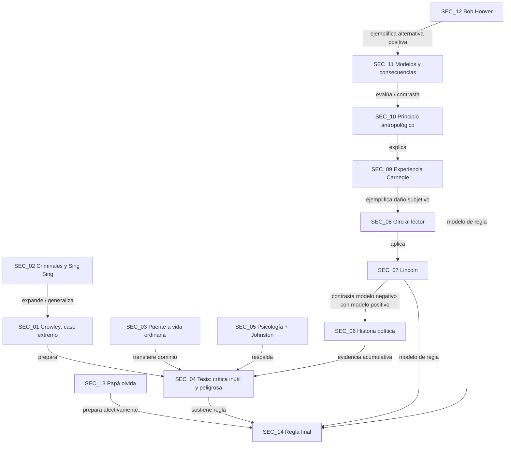

# Aplicación del `analizador_de_relaciones_retóricas` al capítulo 1 de Carnegie

**Texto analizado:** Capítulo 1 de Dale Carnegie, “Si quieres recoger miel, no des puntapiés a la colmena”  
**Archivo fuente:** `transcripcion_cap1_carnegie.md`  
**Módulo aplicado:** `analizador_de_relaciones_retóricas`  
**Objetivo:** reconstruir el capítulo como un grafo de relaciones funcionales, no como una simple secuencia de anécdotas.

---

## 0. Tesis del análisis

El capítulo no está construido como una exposición abstracta directa. Carnegie no comienza diciendo simplemente “no critique”. En lugar de eso, construye una **cadena retórica acumulativa**:

```txt
casos extremos de autojustificación
  → generalización a la naturaleza humana
    → explicación psicológica de la crítica
      → demostraciones históricas y prácticas
        → modelo positivo de autocontrol
          → internalización emocional
            → regla normativa final
```

La fuerza del capítulo depende de que los ejemplos no sean independientes. Cada caso cumple una tarea precisa dentro de la arquitectura retórica.

---

## 1. Arquitectura retórica global detectada

```txt
SEC_01. Caso extremo inicial: Crowley
  ↓ prepara y dramatiza
SEC_02. Serie criminal: Capone, Dutch Schultz, Sing Sing
  ↓ generaliza desde criminales a humanos comunes
SEC_03. Puente hacia la vida cotidiana
  ↓ formula tesis general
SEC_04. Tesis explícita sobre la crítica
  ↓ respalda psicológicamente
SEC_05. Respaldo psicológico y ejemplo laboral
  ↓ expande con casos históricos
SEC_06. Casos históricos de crítica inútil
  ↓ contrasta con modelo de autocontrol
SEC_07. Lincoln como modelo positivo
  ↓ amplía con Twain y Confucio
SEC_08. Giro hacia el lector: empiece por usted mismo
  ↓ intensifica con experiencia personal
SEC_09. Recuerdo autobiográfico de la crítica recibida
  ↓ formula principio antropológico
SEC_10. Naturaleza emocional de las personas
  ↓ ofrece modelos positivos y negativos
SEC_11. Franklin, Hardy, Chatterton, Carlyle
  ↓ ejemplifica alternativa madura
SEC_12. Bob Hoover como caso de no-crítica eficaz
  ↓ internaliza emocionalmente en relación padre-hijo
SEC_13. “Papá olvida”
  ↓ condensa en regla final
SEC_14. Regla 1: No critique, no condene ni se queje
```

Esta arquitectura no es sólo acumulativa. Tiene un movimiento de **desplazamiento del juicio externo hacia la comprensión interna**.

---

## 2. Inventario de unidades macro

```yaml
inventario_de_unidades:
  - unit_id: SEC_01
    rango_textual: paginas_31_32
    nombre_funcional: caso_extremo_de_autojustificacion
    formulacion_resumida: Crowley, a pesar de su violencia, se interpreta a sí mismo como alguien bueno y defensivo.
    responsabilidad_narrativo_cognitiva: producir choque inicial y abrir la tesis de que la gente no se culpa a sí misma.
    familia_cognitiva_probable: caso_ancla_extremo

  - unit_id: SEC_02
    rango_textual: paginas_32_33
    nombre_funcional: serie_de_generalizacion_criminal
    formulacion_resumida: Capone, Dutch Schultz y presos de Sing Sing también se justifican.
    responsabilidad_narrativo_cognitiva: mostrar que el caso Crowley no es excepción sino patrón.
    familia_cognitiva_probable: enumeracion_evidencial

  - unit_id: SEC_03
    rango_textual: pagina_33
    nombre_funcional: puente_hacia_la_vida_ordinaria
    formulacion_resumida: si los criminales no se culpan, tampoco debemos esperar que las personas comunes lo hagan.
    responsabilidad_narrativo_cognitiva: transferir la observación extrema a las relaciones cotidianas.
    familia_cognitiva_probable: transferencia_de_dominio

  - unit_id: SEC_04
    rango_textual: paginas_33_34
    nombre_funcional: formulacion_de_tesis_general
    formulacion_resumida: la crítica es inútil y peligrosa porque provoca defensa, justificación y resentimiento.
    responsabilidad_narrativo_cognitiva: convertir la serie de casos en principio explícito.
    familia_cognitiva_probable: tesis_pragmatica

  - unit_id: SEC_05
    rango_textual: pagina_34
    nombre_funcional: respaldo_psicologico_y_prueba_practica
    formulacion_resumida: Skinner, Selye y el caso del casco muestran que la crítica no corrige, mientras el trato amistoso sí.
    responsabilidad_narrativo_cognitiva: dar respaldo psicológico y práctico a la tesis.
    familia_cognitiva_probable: soporte_mixto

  - unit_id: SEC_06
    rango_textual: paginas_35_37
    nombre_funcional: evidencia_historica_de_autojustificacion
    formulacion_resumida: Taft y Albert Fall responden a la crítica justificándose.
    responsabilidad_narrativo_cognitiva: ampliar el patrón a figuras públicas e historia política.
    familia_cognitiva_probable: evidencia_historica_acumulativa

  - unit_id: SEC_07
    rango_textual: paginas_37_41
    nombre_funcional: modelo_positivo_de_autocontrol
    formulacion_resumida: Lincoln aprende a no criticar y evita enviar una carta dura a Meade.
    responsabilidad_narrativo_cognitiva: reemplazar el patrón de crítica por un modelo superior de contención.
    familia_cognitiva_probable: modelo_ejemplar

  - unit_id: SEC_08
    rango_textual: paginas_41_42
    nombre_funcional: descarga_controlada_y_giro_hacia_si_mismo
    formulacion_resumida: Twain escribe cartas agresivas que no se envían; Carnegie pregunta por qué no empezar por uno mismo.
    responsabilidad_narrativo_cognitiva: transformar la regla desde el juicio de otros hacia el autocontrol del lector.
    familia_cognitiva_probable: transicion_aplicativa

  - unit_id: SEC_09
    rango_textual: pagina_42
    nombre_funcional: autobiografia_del_resentimiento
    formulacion_resumida: Carnegie recuerda una crítica que lo hirió durante años.
    responsabilidad_narrativo_cognitiva: demostrar desde experiencia íntima la duración del resentimiento causado por la crítica.
    familia_cognitiva_probable: ejemplo_autobiografico

  - unit_id: SEC_10
    rango_textual: pagina_43
    nombre_funcional: principio_antropologico
    formulacion_resumida: al tratar con personas no tratamos con criaturas lógicas, sino emotivas y orgullosas.
    responsabilidad_narrativo_cognitiva: explicar por qué la crítica falla de manera estructural.
    familia_cognitiva_probable: principio_psicologico_moral

  - unit_id: SEC_11
    rango_textual: pagina_43
    nombre_funcional: serie_de_consecuencias_y_modelos
    formulacion_resumida: crítica puede destruir; Franklin y Carlyle ofrecen modelos de comprensión y grandeza.
    responsabilidad_narrativo_cognitiva: intensificar el costo de criticar y elevar la alternativa moral.
    familia_cognitiva_probable: contraste_normativo

  - unit_id: SEC_12
    rango_textual: paginas_43_44
    nombre_funcional: caso_positivo_de_no_critica
    formulacion_resumida: Bob Hoover responde al error grave de un mecánico sin reproche y con confianza.
    responsabilidad_narrativo_cognitiva: mostrar una alternativa práctica y poderosa a la crítica.
    familia_cognitiva_probable: ejemplo_modelo

  - unit_id: SEC_13
    rango_textual: paginas_44_47
    nombre_funcional: internalizacion_emocional_parental
    formulacion_resumida: “Papá olvida” dramatiza la culpa de un padre que critica injustamente a su hijo.
    responsabilidad_narrativo_cognitiva: hacer que la regla deje de ser técnica y se vuelva afectivamente inevitable.
    familia_cognitiva_probable: mini_historia_internalizadora

  - unit_id: SEC_14
    rango_textual: pagina_47
    nombre_funcional: regla_normativa_final
    formulacion_resumida: no critique, no condene ni se queje.
    responsabilidad_narrativo_cognitiva: condensar todo el recorrido en principio práctico.
    familia_cognitiva_probable: regla
```

---

## 3. Patrón retórico dominante

El patrón dominante es:

```txt
acumulación evidencial + transferencia de dominio + contraste entre crítica y comprensión + cierre normativo
```

En términos de familias de relación:

```txt
preparación dramática
  → evidencia acumulativa
    → generalización
      → respaldo psicológico
        → contraste pragmático
          → modelo positivo
            → internalización emocional
              → regla
```

La arquitectura retórica no sólo intenta convencer al lector de una tesis. Intenta cambiar la disposición del lector ante la crítica.

---

## 4. Relaciones retóricas macro

```yaml
relaciones_retóricas_macro:
  - relation_id: REL_01
    from: SEC_01
    to: SEC_04
    tipo_de_relacion: preparacion_evidencial
    familia_de_relacion: preparacion
    nuclearidad:
      tipo: nucleo_satelite
      nucleo: SEC_04
      satelite: SEC_01
    funcion_en_la_arquitectura_macro: Crowley prepara emocional y cognitivamente la tesis de que la crítica falla porque las personas se justifican.
    efecto_en_el_receptor: produce sorpresa y reduce la resistencia inicial a aceptar la tesis.
    confianza: alta

  - relation_id: REL_02
    from: SEC_02
    to: SEC_01
    tipo_de_relacion: expansion_por_enumeracion
    familia_de_relacion: expansion
    nuclearidad:
      tipo: multinuclear
      nucleo: [SEC_01, SEC_02]
      satelite: null
    funcion_en_la_arquitectura_macro: convierte el caso Crowley en patrón repetido.
    efecto_en_el_receptor: desplaza la lectura desde anécdota singular hacia regularidad humana.
    confianza: alta

  - relation_id: REL_03
    from: SEC_03
    to: [SEC_01, SEC_02]
    tipo_de_relacion: transferencia_de_dominio
    familia_de_relacion: aplicacion_transferencia
    nuclearidad:
      tipo: nucleo_satelite
      nucleo: SEC_03
      satelite: [SEC_01, SEC_02]
    funcion_en_la_arquitectura_macro: transfiere la autojustificación desde criminales a personas ordinarias.
    efecto_en_el_receptor: el lector queda incluido en la tesis.
    confianza: alta

  - relation_id: REL_04
    from: SEC_04
    to: SEC_03
    tipo_de_relacion: inferencia_generalizadora
    familia_de_relacion: consecuencia
    nuclearidad:
      tipo: nucleo_satelite
      nucleo: SEC_04
      satelite: SEC_03
    funcion_en_la_arquitectura_macro: formula explícitamente la tesis práctica sobre la inutilidad y peligro de la crítica.
    efecto_en_el_receptor: estabiliza el aprendizaje inicial en principio conceptual.
    confianza: alta

  - relation_id: REL_05
    from: SEC_05
    to: SEC_04
    tipo_de_relacion: respaldo_psicologico_y_practico
    familia_de_relacion: soporte
    nuclearidad:
      tipo: nucleo_satelite
      nucleo: SEC_04
      satelite: SEC_05
    funcion_en_la_arquitectura_macro: la tesis deja de depender sólo de anécdotas y obtiene respaldo psicológico/práctico.
    efecto_en_el_receptor: aumenta credibilidad y aplicabilidad.
    confianza: alta

  - relation_id: REL_06
    from: SEC_06
    to: SEC_04
    tipo_de_relacion: evidencia_historica_acumulativa
    familia_de_relacion: soporte
    nuclearidad:
      tipo: nucleo_satelite
      nucleo: SEC_04
      satelite: SEC_06
    funcion_en_la_arquitectura_macro: mostrar que incluso figuras públicas criticadas se defienden en vez de aceptar culpa.
    efecto_en_el_receptor: amplía el alcance de la tesis más allá de criminales y trabajadores.
    confianza: alta

  - relation_id: REL_07
    from: SEC_07
    to: SEC_06
    tipo_de_relacion: contraste_modelizante
    familia_de_relacion: contraste
    nuclearidad:
      tipo: nucleo_satelite
      nucleo: SEC_07
      satelite: SEC_06
    funcion_en_la_arquitectura_macro: introduce a Lincoln como alternativa al patrón de crítica inútil mostrado antes.
    efecto_en_el_receptor: abre una vía de conducta superior.
    confianza: alta

  - relation_id: REL_08
    from: SEC_08
    to: SEC_07
    tipo_de_relacion: aplicacion_del_modelo
    familia_de_relacion: aplicacion_transferencia
    nuclearidad:
      tipo: nucleo_satelite
      nucleo: SEC_08
      satelite: SEC_07
    funcion_en_la_arquitectura_macro: convierte el modelo Lincoln en pregunta práctica para el lector.
    efecto_en_el_receptor: desplaza el foco desde historia hacia autoexamen.
    confianza: alta

  - relation_id: REL_09
    from: SEC_09
    to: SEC_08
    tipo_de_relacion: ejemplificacion_autobiografica
    familia_de_relacion: expansion
    nuclearidad:
      tipo: nucleo_satelite
      nucleo: SEC_08
      satelite: SEC_09
    funcion_en_la_arquitectura_macro: mostrar en primera persona el daño duradero de la crítica.
    efecto_en_el_receptor: intensifica empatía y memoria emocional del argumento.
    confianza: alta

  - relation_id: REL_10
    from: SEC_10
    to: [SEC_04, SEC_09]
    tipo_de_relacion: explicacion_antropologica
    familia_de_relacion: justificacion
    nuclearidad:
      tipo: nucleo_satelite
      nucleo: SEC_10
      satelite: [SEC_04, SEC_09]
    funcion_en_la_arquitectura_macro: explicar por qué la crítica hiere: las personas son emotivas, orgullosas y prejuiciosas.
    efecto_en_el_receptor: convierte los ejemplos en principio psicológico-moral.
    confianza: alta

  - relation_id: REL_11
    from: SEC_11
    to: SEC_10
    tipo_de_relacion: contraste_normativo
    familia_de_relacion: evaluacion
    nuclearidad:
      tipo: multinuclear
      nucleo: [SEC_10, SEC_11]
      satelite: null
    funcion_en_la_arquitectura_macro: contraponer destrucción por crítica y grandeza por comprensión.
    efecto_en_el_receptor: eleva la regla de técnica interpersonal a virtud moral.
    confianza: alta

  - relation_id: REL_12
    from: SEC_12
    to: SEC_11
    tipo_de_relacion: ejemplificacion_de_modelo_positivo
    familia_de_relacion: evidencia
    nuclearidad:
      tipo: nucleo_satelite
      nucleo: SEC_11
      satelite: SEC_12
    funcion_en_la_arquitectura_macro: materializar la alternativa positiva en una situación extrema de error.
    efecto_en_el_receptor: demuestra que no criticar no es debilidad sino dominio práctico.
    confianza: alta

  - relation_id: REL_13
    from: SEC_13
    to: SEC_14
    tipo_de_relacion: preparacion_afectiva_de_regla
    familia_de_relacion: preparacion
    nuclearidad:
      tipo: nucleo_satelite
      nucleo: SEC_14
      satelite: SEC_13
    funcion_en_la_arquitectura_macro: preparar emocionalmente la aceptación de la regla final.
    efecto_en_el_receptor: transforma el consejo en experiencia íntima de culpa y ternura.
    confianza: alta

  - relation_id: REL_14
    from: SEC_14
    to: [SEC_01, SEC_02, SEC_03, SEC_04, SEC_05, SEC_06, SEC_07, SEC_08, SEC_09, SEC_10, SEC_11, SEC_12, SEC_13]
    tipo_de_relacion: condensacion_normativa
    familia_de_relacion: aplicacion_transferencia
    nuclearidad:
      tipo: nucleo_satelite
      nucleo: SEC_14
      satelite: [SEC_01, SEC_02, SEC_03, SEC_04, SEC_05, SEC_06, SEC_07, SEC_08, SEC_09, SEC_10, SEC_11, SEC_12, SEC_13]
    funcion_en_la_arquitectura_macro: condensar todo el capítulo en una regla práctica.
    efecto_en_el_receptor: convierte la trayectoria argumentativa y emocional en mandato recordable.
    confianza: alta
```

---

## 5. Relaciones meso dentro de las secciones

### 5.1. SEC_01 — Crowley

```yaml
relaciones_meso_SEC_01:
  - relation_id: REL_01_A
    from: escena_del_asedio
    to: autopercepcion_de_Crowley
    tipo_de_relacion: contraste
    familia_de_relacion: contraste
    nuclearidad:
      tipo: multinuclear
      nucleo: [escena_del_asedio, autopercepcion_de_Crowley]
    funcion: contrastar violencia objetiva con autoimagen moral.
    efecto_en_el_receptor: producir choque cognitivo.

  - relation_id: REL_01_B
    from: asesinato_del_policia
    to: frase_de_autoinocencia
    tipo_de_relacion: intensificacion_contrastiva
    familia_de_relacion: contraste
    funcion: aumentar la contradicción entre acto y autojustificación.

  - relation_id: REL_01_C
    from: frase_final_de_Crowley
    to: moraleja_del_relato
    tipo_de_relacion: inferencia
    familia_de_relacion: consecuencia
    funcion: extraer la primera tesis local: Crowley no se culpa.
```

**Diagnóstico:** Carnegie usa una estructura de contraste extremo. Primero maximiza la culpa objetiva de Crowley; luego muestra su autoimagen inocente. La relación central es una antítesis entre acción y autopercepción.

---

### 5.2. SEC_02 — Capone, Dutch Schultz, Sing Sing

```yaml
relaciones_meso_SEC_02:
  - relation_id: REL_02_A
    from: Capone
    to: Crowley
    tipo_de_relacion: paralelismo_evidencial
    familia_de_relacion: soporte
    funcion: mostrar repetición del patrón de autojustificación.

  - relation_id: REL_02_B
    from: Dutch_Schultz
    to: [Crowley, Capone]
    tipo_de_relacion: enumeracion_acumulativa
    familia_de_relacion: organizacion
    funcion: añadir un tercer caso para impedir que el lector trate los anteriores como excepciones.

  - relation_id: REL_02_C
    from: testimonio_de_Lawes
    to: serie_criminal
    tipo_de_relacion: generalizacion_autoritativa
    familia_de_relacion: soporte
    funcion: convertir casos individuales en regularidad penitenciaria.
```

**Diagnóstico:** la sección usa acumulación. Carnegie no salta inmediatamente a una regla; primero multiplica casos para que el lector acepte el patrón.

---

### 5.3. SEC_05 — Skinner, Selye y Johnston

```yaml
relaciones_meso_SEC_05:
  - relation_id: REL_05_A
    from: Skinner
    to: tesis_sobre_critica
    tipo_de_relacion: respaldo_experimental
    familia_de_relacion: soporte
    funcion: justificar que premiar funciona mejor que castigar.

  - relation_id: REL_05_B
    from: Selye
    to: tesis_sobre_condena
    tipo_de_relacion: respaldo_psicologico_afectivo
    familia_de_relacion: soporte
    funcion: explicar el miedo humano a la condena.

  - relation_id: REL_05_C
    from: Johnston_metodo_autoritario
    to: Johnston_metodo_amistoso
    tipo_de_relacion: contraste_pragmatico
    familia_de_relacion: contraste
    funcion: comparar crítica autoritaria con enfoque comprensivo.

  - relation_id: REL_05_D
    from: Johnston_metodo_amistoso
    to: tesis_sobre_critica
    tipo_de_relacion: evidencia_practica
    familia_de_relacion: soporte
    funcion: mostrar que el enfoque sin resentimiento produce mejor obediencia.
```

**Diagnóstico:** esta sección conecta teoría psicológica y prueba práctica. La tesis pasa de moral a funcional.

---

### 5.4. SEC_07 — Lincoln

```yaml
relaciones_meso_SEC_07:
  - relation_id: REL_07_A
    from: joven_Lincoln_critico
    to: Lincoln_maduro_no_critico
    tipo_de_relacion: transformacion_biografica
    familia_de_relacion: contraste
    funcion: mostrar aprendizaje mediante experiencia amarga.

  - relation_id: REL_07_B
    from: errores_de_generales
    to: autocontrol_de_Lincoln
    tipo_de_relacion: contraste_modelizante
    familia_de_relacion: contraste
    funcion: presentar ocasión legítima de crítica y renuncia deliberada a criticar.

  - relation_id: REL_07_C
    from: carta_a_Meade
    to: decision_de_no_enviarla
    tipo_de_relacion: autocorreccion
    familia_de_relacion: aplicacion_transferencia
    funcion: materializar el principio en acto concreto.

  - relation_id: REL_07_D
    from: decision_de_no_enviarla
    to: tesis_sobre_inutilidad_de_critica
    tipo_de_relacion: evidencia_modelo
    familia_de_relacion: soporte
    funcion: demostrar que la comprensión del otro evita resentimiento y pérdida futura.
```

**Diagnóstico:** Lincoln funciona como contrafigura positiva. No sólo prueba que la crítica falla; prueba que una alternativa superior es posible.

---

### 5.5. SEC_13 — “Papá olvida”

```yaml
relaciones_meso_SEC_13:
  - relation_id: REL_13_A
    from: enumeracion_de_reproches
    to: remordimiento_del_padre
    tipo_de_relacion: acumulacion_culpabilizante
    familia_de_relacion: organizacion
    funcion: hacer visible el peso acumulado de críticas pequeñas.

  - relation_id: REL_13_B
    from: gesto_afectivo_del_hijo
    to: culpa_del_padre
    tipo_de_relacion: contraste_afectivo
    familia_de_relacion: contraste
    funcion: contraponer amor del niño y dureza del padre.

  - relation_id: REL_13_C
    from: reconocimiento_de_exigencia_excesiva
    to: promesa_de_cambio
    tipo_de_relacion: inferencia_moral
    familia_de_relacion: consecuencia
    funcion: derivar cambio de conducta desde comprensión emocional.

  - relation_id: REL_13_D
    from: mini_historia_parental
    to: regla_final
    tipo_de_relacion: preparacion_afectiva
    familia_de_relacion: preparacion
    funcion: preparar la regla desde ternura, culpa y empatía.
```

**Diagnóstico:** esta sección no sólo ejemplifica. Internaliza emocionalmente el principio. Sin ella, la regla final sería correcta, pero menos afectivamente obligatoria.

---

## 6. Grafo retórico simplificado



---

## 7. Agrupamientos retóricos

```yaml
agrupamientos:
  - group_id: GRP_01
    nombre: autojustificacion_extrema
    unidades: [SEC_01, SEC_02]
    funcion: demostrar que incluso culpables extremos se perciben como inocentes o justificados.
    relacion_interna: enumeracion_acumulativa

  - group_id: GRP_02
    nombre: generalizacion_a_la_naturaleza_humana
    unidades: [SEC_03, SEC_04, SEC_05]
    funcion: convertir los casos en tesis psicológica y práctica.
    relacion_interna: inferencia + soporte

  - group_id: GRP_03
    nombre: pruebas_historicas_de_critica_inutil
    unidades: [SEC_06]
    funcion: ampliar la tesis al mundo público e histórico.
    relacion_interna: evidencia_acumulativa

  - group_id: GRP_04
    nombre: modelos_de_no_critica
    unidades: [SEC_07, SEC_08, SEC_11, SEC_12]
    funcion: mostrar alternativas superiores de autocontrol, comprensión y confianza.
    relacion_interna: contraste_modelizante

  - group_id: GRP_05
    nombre: internalizacion_emocional
    unidades: [SEC_09, SEC_10, SEC_13]
    funcion: mover la tesis desde razón práctica a experiencia moral-afectiva.
    relacion_interna: explicación + preparación afectiva

  - group_id: GRP_06
    nombre: condensacion_normativa
    unidades: [SEC_14]
    funcion: convertir el recorrido en regla memorizable.
    relacion_interna: cierre
```

---

## 8. Relaciones transversales

### 8.1. Crowley ↔ Papá olvida

```yaml
relacion_transversal:
  from: SEC_13
  to: SEC_01
  tipo_de_relacion: recontextualizacion_moral
  funcion: el capítulo empieza con autojustificación criminal y termina con autocrítica afectiva de un padre.
  efecto: el lector no sólo observa la falta de culpa en otros; termina obligado a examinar su propia tendencia a censurar.
```

**Interpretación:** el arco profundo va desde “ellos no se culpan” hasta “yo debo comprender antes de juzgar”.

---

### 8.2. Lincoln ↔ Bob Hoover

```yaml
relacion_transversal:
  from: SEC_12
  to: SEC_07
  tipo_de_relacion: resonancia_modelizante
  funcion: Hoover actualiza en un entorno práctico el autocontrol que Lincoln modela históricamente.
  efecto: la no-crítica aparece como virtud transferible a contextos distintos.
```

---

### 8.3. Skinner/Selye ↔ Johnston/Hoover

```yaml
relacion_transversal:
  from: [SEC_05, SEC_12]
  to: SEC_04
  tipo_de_relacion: teoria_y_practica
  funcion: los principios psicológicos se prueban con casos prácticos.
  efecto: el capítulo evita ser sólo moralizante.
```

---

## 9. Diagnóstico de nuclearidad

```yaml
nucleos_principales:
  - SEC_04
  - SEC_07
  - SEC_10
  - SEC_14

satelites_fuertes:
  - SEC_01
  - SEC_02
  - SEC_05
  - SEC_06
  - SEC_12
  - SEC_13

satelites_de_transicion:
  - SEC_03
  - SEC_08
  - SEC_09
  - SEC_11
```

### Interpretación

`SEC_04` es núcleo conceptual porque formula la tesis explícita.  
`SEC_07` es núcleo modelizante porque ofrece la figura positiva más importante: Lincoln.  
`SEC_10` es núcleo antropológico porque explica la base psicológica del argumento.  
`SEC_14` es núcleo normativo porque condensa todo en regla.

Los casos de Crowley, Capone, Taft, Fall, Johnston, Hoover y “Papá olvida” son fundamentales, pero operan como satélites poderosos: sostienen, intensifican, ejemplifican o preparan los núcleos.

---

## 10. Evolución narrativo-cognitiva producida por las relaciones

```yaml
estado_inicial_del_receptor:
  posiblemente cree que la crítica es una forma legítima de corregir errores.

transformaciones:
  - fase: choque
    unidades: [SEC_01]
    efecto: incluso un criminal extremo se justifica.

  - fase: generalizacion
    unidades: [SEC_02, SEC_03]
    efecto: la autojustificación no es anomalía criminal, sino rasgo humano.

  - fase: tesis
    unidades: [SEC_04]
    efecto: la crítica se redefine como inútil y peligrosa.

  - fase: respaldo
    unidades: [SEC_05, SEC_06]
    efecto: la tesis gana apoyo psicológico, práctico e histórico.

  - fase: alternativa
    unidades: [SEC_07, SEC_08, SEC_11, SEC_12]
    efecto: se instala un modelo positivo de comprensión y autocontrol.

  - fase: internalizacion
    unidades: [SEC_09, SEC_13]
    efecto: el lector siente el costo íntimo de criticar.

  - fase: condensacion
    unidades: [SEC_14]
    efecto: el recorrido se transforma en regla conductual.

estado_final_del_receptor:
  debe entender que criticar despierta defensa y resentimiento, mientras comprender produce mejores relaciones y mayor eficacia práctica.
```

---

## 11. Patrón profundo del capítulo

El patrón profundo no es simplemente:

```txt
introducción → desarrollo → conclusión
```

Sino:

```txt
choque moral
  → acumulación evidencial
    → generalización antropológica
      → explicación psicológica
        → demostración histórica
          → modelo positivo
            → autoaplicación
              → internalización afectiva
                → regla normativa
```

En versión compacta:

```txt
casos de no-culpa
  → crítica produce defensa
    → comprensión produce transformación
      → regla: no critique, no condene ni se queje
```

---

## 12. Validación del análisis

```yaml
validacion:
  cobertura_textual: alta
  razon: el análisis cubre desde la apertura con Crowley hasta la regla final.

  coherencia_de_trayectoria: alta
  razon: las relaciones muestran un arco continuo desde evidencia extrema hasta norma práctica.

  deteccion_de_nuclearidad: alta
  razon: distingue tesis, modelos y regla de los casos satélite.

  relaciones_transversales: presentes
  razon: identifica conexiones Crowley/Papá olvida, Lincoln/Hoover, teoría/práctica.

  riesgo_de_ambiguedad:
    - Algunos casos históricos funcionan simultáneamente como evidencia, ejemplo y acumulación.
    - “Papá olvida” puede analizarse como ejemplo, pero su función más fuerte es preparación afectiva de la regla final.

  conclusion: el capítulo está construido como una arquitectura retórica acumulativa y transformadora, no como una colección suelta de anécdotas.
```

---

## 13. Resultado final

```txt
El capítulo de Carnegie utiliza relaciones retóricas para transformar una tesis simple
—no critique— en una convicción práctica y emocionalmente cargada.

Para lograrlo, encadena casos extremos, generalizaciones, respaldo psicológico,
contrastes históricos, modelos positivos, experiencias personales y una mini-historia
final que prepara afectivamente la regla.

La arquitectura retórica dominante es una acumulación evidencial con giro moral:
primero muestra que nadie acepta la culpa bajo crítica; luego muestra que la alternativa
superior es comprender antes que condenar.
```
